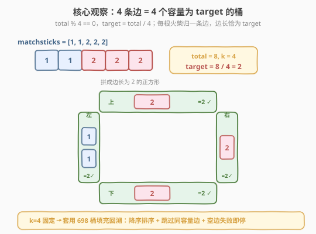
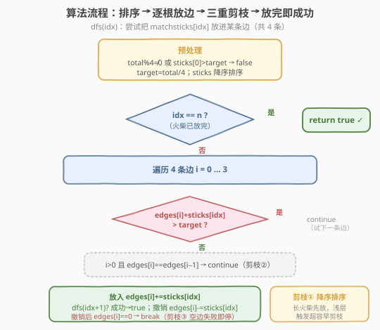
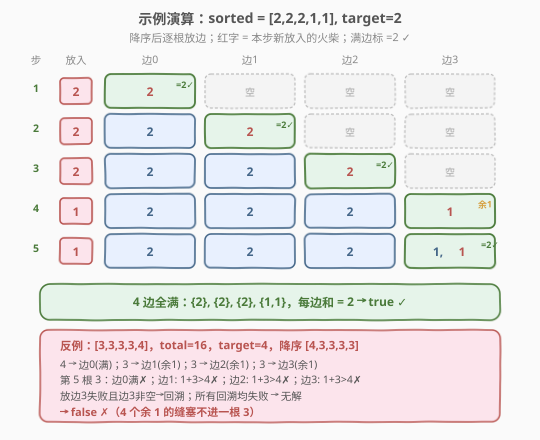

# 火柴拼正方形

- **题目名称**：火柴拼正方形
- **链接**：[473. 火柴拼正方形](https://leetcode.cn/problems/matchsticks-to-square/)
- **难度**：中等
- **标签**：数组、回溯、剪枝

## 1. 题目概述

给定一个整数数组 `matchsticks`，其中 `matchsticks[i]` 是第 $i$ 根火柴棒的长度。要用**所有**火柴拼成一个正方形，**不能折断**任何一根，每根必须**使用一次**（可首尾相连成一条边）。能拼成正方形返回 `true`，否则返回 `false`。

**示例 1**：

```text
输入：matchsticks = [1,1,2,2,2]
输出：true
解释：能拼成边长为 2 的正方形，每边两根火柴。
```

**示例 2**：

```text
输入：matchsticks = [3,3,3,3,4]
输出：false
解释：不能用所有火柴拼成正方形。
```

**约束条件**：

- $1 \leq \text{matchsticks.length} \leq 15$
- $1 \leq \text{matchsticks}[i] \leq 10^8$

> ⚠️ **关键信号**：正方形有 4 条等长的边，等价于把所有火柴分成 **4 组和相等**的子集——这正是 [698. 划分为K个相等的子集](../0601-0700/698_划分为K个相等的子集.md) 的 $k=4$ 特例。$n \leq 15$ 的规模指向**回溯 + 剪枝**或**状压 DP**。因 $k$ 固定为 4，桶填充回溯的剪枝效果极好，是面试首选。

---

## 2. 解题思路

### 2.1 暴力思路：枚举每根火柴归属

把每根火柴分配给 4 条边中的任意一条，共有 $4^n$ 种方案，逐一检查每边之和是否都等于 `target`。$n=15$ 时 $4^{15} \approx 10^9$，**严重超时**。

> ⚠️ 暴力的浪费在于：没有利用「每边容量固定为 `target`」提前剪枝——某边一旦超过 `target`，后续分配毫无意义；且 4 条边对称，相同容量的边彼此等价，重复搜索。

### 2.2 核心观察：4 条边 = 4 个容量为 target 的桶

**关键转化**：若 $\text{total} = \sum \text{matchsticks}$ 不能被 4 整除，直接返回 `false`；否则每条边的长度必须恰为 $\text{target} = \text{total} / 4$。问题变成：把 $n$ 根火柴依次放进 4 个容量为 `target` 的桶，问是否存在合法放法。



三条**剪枝**让搜索量骤降（与 698 完全一致）：

| 剪枝 | 做法 | 原因 |
|------|------|------|
| **降序排序** | 把 `matchsticks` 从大到小排序后再放 | 长火柴先放更容易触发「超容」失败，早剪枝；短火柴留到后段填缝，灵活度高 |
| **跳过同容量边** | 若 `edges[i] == edges[i-1]`，跳过 `i` | 两条边当前和相同意味着剩余容量相同，看作「同一条边」，避免对称重复 |
| **空边失败即停** | 若把当前火柴放进一条**空边**（`edges[i]==0`）后递归失败，直接 `break` | 所有空边彼此等价，换一条空边结果不变；继续试其余空边纯属浪费 |

> ⚠️ 还需两个**前置特判**：(1) `total % 4 != 0` 直接 `false`；(2) 任何 `matchsticks[i] > target` 直接 `false`（单根就超容）。这两个特判能在 $O(1)$ 内挡掉大量无解用例。

> 💡 **与 698 的关系**：698 是 $k$ 任意的通版，本题是 $k=4$ 的特例。算法、剪枝、代码结构完全相同，只是桶数固定为 4。建议先掌握 698 的桶填充模板，本题即可秒解。

### 2.3 算法流程图



**完整步骤**：

1. **预处理**：`total = sum(matchsticks)`；若 `total % 4 != 0` 返回 `false`；`target = total / 4`；降序排序；若 `matchsticks[0] > target` 返回 `false`。
2. **`edges[4]`** 全初始化为 `0`。
3. **`dfs(idx)`**：尝试把 `matchsticks[idx]` 放进某条边：
   - 若 `idx == n`，所有火柴已放完，返回 `true`。
   - 遍历 `i` 从 `0` 到 `3`：
     1. `edges[i] + matchsticks[idx] > target` → 超容，`continue`；
     2. `i > 0 且 edges[i] == edges[i-1]` → 同容量边已试过，`continue`；
     3. 放入：`edges[i] += matchsticks[idx]`；若 `dfs(idx+1)` 成功返回 `true`；撤销：`edges[i] -= matchsticks[idx]`；
     4. **若撤销后 `edges[i] == 0`**（即刚才放的是空边且失败）→ `break`。
   - 都不行则返回 `false`。

> 💡 第 4 步是「空边失败即停」：放进空边失败意味着这根火柴无论放哪条空边都无解（空边等价），直接 `break` 不再试后续边，这是最关键的一条剪枝。

### 2.4 示例演算

以 `matchsticks = [1,1,2,2,2]` 为例。`total = 8`，`target = 2`，降序排序后 `[2,2,2,1,1]`。4 条边容量均为 2：



| 步 | sticks[idx] | 尝试过程 | 边状态（容量 2） | 结果 |
|----|-------------|----------|------------------|------|
| 1 | 2 | 边0：0+2=2 ✓ 放入 | 边0={2}(满), 边1=0, 边2=0, 边3=0 | 进入下一步 |
| 2 | 2 | 边0满✗；边1：0+2=2 ✓ 放入 | 边0={2}, 边1={2}(满), 边2=0, 边3=0 | 进入下一步 |
| 3 | 2 | 边0满✗；边1满✗；边2：0+2=2 ✓ 放入 | 边0={2}, 边1={2}, 边2={2}(满), 边3=0 | 进入下一步 |
| 4 | 1 | 边0满✗；边1满✗；边2满✗；边3：0+1=1 ✓ 放入 | 边0={2}, 边1={2}, 边2={2}, 边3={1}(余1) | 进入下一步 |
| 5 | 1 | 边0满✗；边1满✗；边2满✗；边3：1+1=2 ✓ 放入 | 边0={2}, 边1={2}, 边2={2}, 边3={1,1}(满) | `idx==5==n` → true |

最终 4 条边为 `{2}, {2}, {2}, {1,1}`，每边和均为 2，返回 `true` ✓。

> 💡 **反例** `[3,3,3,3,4]`：`total=16`，`target=4`，降序 `[4,3,3,3,3]`。前 4 根各占一边后，4 条边状态为 `{4}(满), {3}(余1), {3}(余1), {3}(余1)`；第 5 根 `3` 塞不进任何一条余 1 的缝（$1+3>4$），所有回溯均失败 → `false`。这正是降序排序的威力：长火柴早早把缝卡死，浅层即判无解。

---

## 3. 参考代码

### C++

```cpp
class Solution {
  public:
    bool makesquare(vector<int>& matchsticks) {
        long long total = accumulate(matchsticks.begin(), matchsticks.end(), 0LL);
        if (total % 4 != 0) return false;
        int target = total / 4;
        sort(matchsticks.begin(), matchsticks.end(), greater<int>());  // 降序
        if (matchsticks[0] > target) return false;                    // 单根超容
        vector<int> edges(4, 0);
        return dfs(matchsticks, 0, edges, target);
    }

  private:
    bool dfs(const vector<int>& sticks, int idx, vector<int>& edges, int target) {
        if (idx == (int)sticks.size()) return true;                   // 全部放完
        for (int i = 0; i < 4; ++i) {
            if (edges[i] + sticks[idx] > target) continue;            // 超容
            if (i > 0 && edges[i] == edges[i - 1]) continue;          // 同容量边已试过
            edges[i] += sticks[idx];                                  // 放入
            if (dfs(sticks, idx + 1, edges, target)) return true;
            edges[i] -= sticks[idx];                                  // 撤销
            if (edges[i] == 0) break;                                 // 空边失败即停
        }
        return false;
    }
};
```

### Python

```python
class Solution:
    def makesquare(self, matchsticks: list[int]) -> bool:
        total = sum(matchsticks)
        if total % 4 != 0:
            return False
        target = total // 4
        matchsticks.sort(reverse=True)            # 降序
        if matchsticks[0] > target:               # 单根超容
            return False
        edges = [0] * 4

        def dfs(idx: int) -> bool:
            if idx == len(matchsticks):           # 全部放完
                return True
            for i in range(4):
                if edges[i] + matchsticks[idx] > target:
                    continue                      # 超容
                if i > 0 and edges[i] == edges[i - 1]:
                    continue                      # 同容量边已试过
                edges[i] += matchsticks[idx]      # 放入
                if dfs(idx + 1):
                    return True
                edges[i] -= matchsticks[idx]      # 撤销
                if edges[i] == 0:
                    break                         # 空边失败即停
            return False

        return dfs(0)
```

> ⚠️ **易错点**：
> 1. **`total` 用 `long long`（C++）**：$\text{matchsticks}[i] \leq 10^8$，$n \leq 15$，总和最大 $1.5 \times 10^9$，超出 `int` 上界。Python 无此问题。
> 2. **降序排序必须在剪枝前**：`matchsticks[0] > target` 的特判依赖降序后首元素即最大值。
> 3. **三重剪枝缺一不可**：去掉「降序」会慢几十倍；去掉「跳过同容量边」产生对称重复；去掉「空边失败即停」让 4 条空边被反复等价搜索。

---

## 4. 复杂度分析

| 维度 | 复杂度 | 说明 |
|------|--------|------|
| 时间复杂度 | 最坏 $O(4^n)$，剪枝后实际极快 | $n=15$ 时理论上界 $4^{15}\approx 10^9$，但三条剪枝在实际用例上近乎压到多项式级 |
| 空间复杂度 | $O(n)$ | 递归栈深 $\leq n$，`edges` 数组 $O(1)$ |

> 💡 $k=4$ 固定且较小，桶填充回溯的剪枝效果极好。最坏情况（如所有火柴等长且恰好无法等分）才会逼近理论上界，但 $n \leq 15$ 时仍可毫秒级通过。若需稳定上界，可用状压 DP $O(n \cdot 2^n) \approx 15 \cdot 32768 \approx 5\times 10^5$，见第 5 节。

---

## 5. 扩展：状压 DP 解法

$n \leq 15$ 提示可用**位掩码**枚举所有火柴选取状态。定义 `dp[mask]` 为：在选取状态 `mask` 下，当前正在填充的那条边的**已装和**对 `target` 取模后的值；`-1` 表示该状态不可达。

**转移**：`dp[0] = 0`。对每个可达 `mask`，尝试把某根未选取的火柴 `j` 放进当前边：

- 若 `dp[mask] + matchsticks[j] <= target`，则 `dp[mask | (1<<j)] = (dp[mask] + matchsticks[j]) % target`。
- 取模为 `0` 表示当前边正好装满，下一根从新边的 `0` 开始。

**答案**：`dp[(1<<n) - 1] == 0`（所有火柴取完，且最后一条边也正好装满）。

```python
class Solution:
    def makesquare(self, matchsticks: list[int]) -> bool:
        total = sum(matchsticks)
        if total % 4 != 0:
            return False
        target = total // 4
        n = len(matchsticks)
        dp = [-1] * (1 << n)
        dp[0] = 0
        for mask in range(1 << n):
            if dp[mask] == -1:
                continue
            for j in range(n):
                if mask & (1 << j):
                    continue
                if dp[mask] + matchsticks[j] <= target:
                    dp[mask | (1 << j)] = (dp[mask] + matchsticks[j]) % target
        return dp[(1 << n) - 1] == 0
```

> 💡 **与回溯的对照**：回溯是「按火柴顺序决策放进哪条边」，状压 DP 是「按选取状态记录边进度」。两者本质都在搜索「能否把火柴分成和为 `target` 的 4 组」。面试时先讲回溯（思路直观、剪枝可讲性强），再提状压 DP 作为「规模确定时的稳定解」。该状压 DP 模板与 [698](../0601-0700/698_划分为K个相等的子集.md) 完全一致，只是 `target = total // 4` 固定。

---

## 6. 面试要点

1. **本题和 698 是什么关系？**

   > 本题是 [698. 划分为K个相等的子集](../0601-0700/698_划分为K个相等的子集.md) 的 $k=4$ 特例。算法、三重剪枝、代码结构完全相同，只是桶数固定为 4。掌握 698 的桶填充模板即可秒解本题。

2. **为什么先排序降序？不排序会怎样？**

   > 降序让长火柴先放。长火柴可选边少、容易触发超容失败，能在搜索树浅层就剪枝；短火柴灵活，留到后段填缝成功率高。不排序时短火柴先放会铺出大量「看似可行」的浅层分支，到深处才发现无解，搜索量暴增几十倍。

3. **「空边失败即停」为什么正确？**

   > 所有空边彼此等价（剩余容量都是 `target`）。把当前火柴放进一条空边后递归失败，意味着「以这根火柴开启一条新边」走不通；换另一条空边结果完全相同。所以直接 `break`，不再试其余空边。这是最关键的一条剪枝。

4. **「跳过相同容量边」依据是什么？**

   > 两条边当前和相同 ⇒ 剩余容量相同 ⇒ 把当前火柴放进它们后续能展开的子树完全同构。遍历 `i` 时若 `edges[i] == edges[i-1]`，说明这种容量刚试过，跳过即可。注意它要求按 `i` 顺序遍历，不需边排序。

5. **有哪些前置特判能 $O(1)$ 挡掉无解？**

   > (1) `total % 4 != 0` 直接 `false`——总和都不能 4 等分；(2) `max(matchsticks) > target` 直接 `false`——单根就超过边长。这些特判能避免无意义的深搜。

6. **回溯和状压 DP 怎么选？**

   > $n \leq 15$ 两者都可。回溯实现短、剪枝可讲性强，面试首选；状压 DP 复杂度 $O(n \cdot 2^n)$ 是确定上界，适合「追求稳定」或要求多项式可证明复杂度时。两者状态定义不同但搜索本质相同。

> 💡 **一句话总结**：473 是 [698](../0601-0700/698_划分为K个相等的子集.md) 的 $k=4$ 特例——把正方形 4 条边看作 4 个容量为 `target = total/4` 的桶，用**降序排序 + 跳过同容量边 + 空边失败即停**三重剪枝把 $O(4^n)$ 压到实际可行；$n \leq 15$ 也可用状压 DP $O(n \cdot 2^n)$ 稳定求解。

---

## 7. 同类练习题

- [698. 划分为K个相等的子集](https://leetcode.cn/problems/partition-to-k-equal-sum-subsets/)（[题解](../0601-0700/698_划分为K个相等的子集.md)）：本题的 $k$ 任意通版，桶填充回溯 + 三重剪枝的范本，完全同构
- [2305. 公平分发饼干](https://leetcode.cn/problems/fair-distribution-of-cookies/)：把饼干分给 `k` 个孩子使「最大总和最小」，同套桶填充回溯 + 剪枝，结算从「可行性」变「最优化」
- [1723. 完成所有工作的最短时间](https://leetcode.cn/problems/find-minimum-time-to-finish-all-jobs/)：把工作分给 `k` 个工人使最大工时最小，桶填充回溯 + 二分答案的进阶组合
- [416. 分割等和子集](https://leetcode.cn/problems/partition-equal-subset-sum/)（[题解](../0301-0400/416_分割等和子集.md)）：$k=2$ 的特例，可用 0-1 背包 DP 求解，对照「2 组等分」与「4 组等分」的规模差异
- [39. 组合总和](https://leetcode.cn/problems/combination-sum/)（[题解](../0001-0100/39_组合总和.md)）：选与不选的回溯模板，对照「组合型回溯」与「桶填充回溯」的决策维度差异
