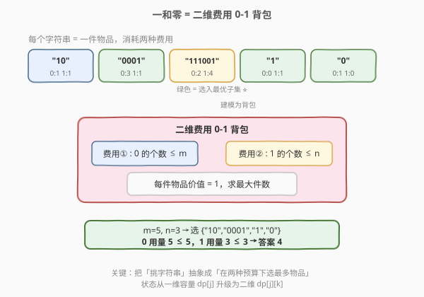
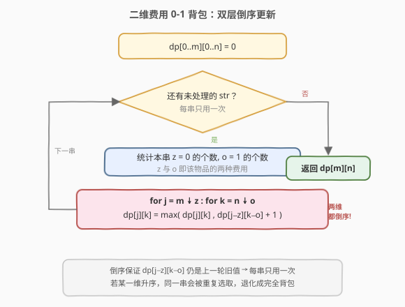
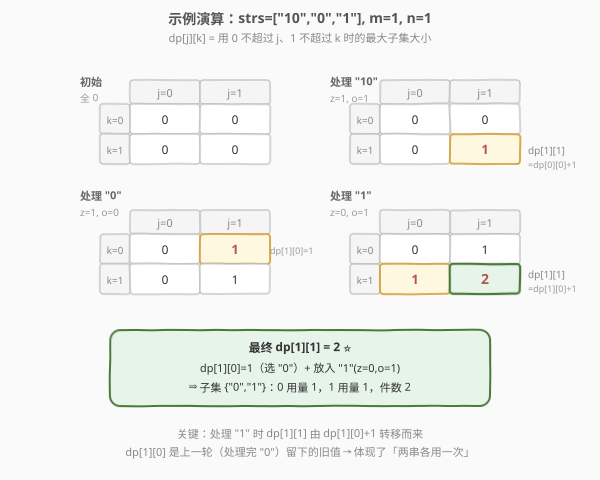

# LeetCode 一和零 题解

## 1. 题目概述

- **标题 / 题号**：一和零（#474，medium）
- **链接**：https://leetcode.cn/problems/ones-and-zeroes/
- **难度**：中等
- **标签**：数组、动态规划、背包

**题意**：给定一个**仅由 `'0'` 和 `'1'` 组成的字符串数组** `strs`，以及两个整数 `m` 和 `n`。请你找出并返回 `strs` 的**最大子集的长度**，该子集中**最多**有 `m` 个 `0` 和 `n` 个 `1`。

> 💡 「子集」指从原数组中挑出若干元素（保持原数组中的字符串本身不变），不要求连续、也不要求有序；本问题求的是**子集大小**（元素个数）的最大值。

**示例 1**：

```text
输入：strs = ["10","0001","111001","1","0"], m = 5, n = 3
输出：4
解释：最大子集是 {"10","0001","1","0"}，共有 5 个 0 和 3 个 1。
```

各串的 `0/1` 计数：

| 串     | 0 的个数 | 1 的个数 |
|--------|----------|----------|
| "10"   | 1        | 1        |
| "0001" | 3        | 1        |
| "111001"| 2       | 4        |
| "1"    | 0        | 1        |
| "0"    | 1        | 0        |

挑选 `{"10","0001","1","0"}` 时，`0` 的总数 `1+3+0+1 = 5 ≤ 5`，`1` 的总数 `1+1+1+0 = 3 ≤ 3`，共 `4` 件。注意 `"111001"` 因 `1` 的个数 `4 > n=3` 单独就会超预算，必然不能入选。

**示例 2**：

```text
输入：strs = ["10","0","1"], m = 1, n = 1
输出：2
解释：最大子集是 {"0","1"}，0 和 1 各 1 个，共 2 件。
```

**约束**：

- `1 <= strs.length <= 600`
- `1 <= strs[i].length <= 100`
- `strs[i]` 仅由 `'0'` 和 `'1'` 组成
- `1 <= m, n <= 100`

## 2. 解题思路

### 2.1 暴力思路：枚举每个子集

对每个字符串决定「选 / 不选」，共 $2^{L}$ 种子集（$L$ 为 `strs` 长度）。对每个子集统计 `0/1` 总数，若满足 `≤ m` 且 `≤ n` 则更新答案。$L \le 600$ 时 $2^{600}$ 完全不可行。

### 2.2 核心观察：二维费用 0-1 背包



关键建模：把每个字符串看作**一件物品**，它同时消耗**两种费用**——`0` 的个数与 `1` 的个数；每种费用各有上限 `m`、`n`；每件物品的「价值」恒为 `1`（因为求的是件数）。于是问题化为：

> 在 `0` 用量不超过 `m`、`1` 用量不超过 `n` 的前提下，从 `strs` 中选**最多**件物品，每件最多用一次。

这正是 **0-1 背包** 的「费用」从一维推广到**二维**的版本（对比 [416. 分割等和子集](https://leetcode.cn/problems/partition-equal-subset-sum/) 的单维费用）。

**状态定义**：

$$
dp[j][k] = \text{在「0 用量} \le j \text{、1 用量} \le k\text{」时能选的最大件数}
$$

> 💡 `dp` 的两个维度是「**至多**」语义（容量上限），故初始化全 `0` 即可；这不同于 [416](https://leetcode.cn/problems/partition-equal-subset-sum/) 那种「**恰好**装满」需要 `dp[0]=true`、其余 `-∞` 的写法。

### 2.3 算法流程图



**状态转移**（每件物品只用一次，故 `j`、`k` 两维都必须**倒序**更新）：

$$
dp[j][k] = \max\bigl(\,dp[j][k],\ \ dp[j - z][k - o] + 1\,\bigr)
$$

其中 $z$、$o$ 是当前字符串中 `0`、`1` 的个数。

- `dp[j][k]`：不选当前串，沿用旧值。
- `dp[j-z][k-o] + 1`：选当前串，腾出 $z$ 个 `0` 容量与 $o$ 个 `1` 容量后，件数 `+1`。

> ⚠️ **两维都要倒序**：一维 0-1 背包靠 `j` 倒序保证每件物品用一次；本题有**两个费用维度**，所以 `j` 从 `m` 到 `z`、`k` 从 `n` 到 `o` **两层循环都要倒序**。只要其中一维写成升序，`dp[j-z][k-o]` 就可能引用到本轮已被当前串「污染」过的值，导致同一字符串被重复选取。

### 2.4 示例演算

以示例 2 `strs = ["10","0","1"], m = 1, n = 1` 为例，`dp` 是 `2×2`（`j,k ∈ {0,1}`），初始全 `0`。



| 处理串  | z,o | 变化                                      | dp[1][1] |
|---------|-----|-------------------------------------------|----------|
| 初始    | —   | 全 0                                      | 0        |
| "10"    | 1,1 | `dp[1][1] = dp[0][0]+1 = 1`               | 1        |
| "0"     | 1,0 | `dp[1][0] = dp[0][0]+1 = 1`               | 1        |
| "1"     | 0,1 | `dp[1][1] = max(1, dp[1][0]+1) = 2` ⭐    | 2        |

最后一步最关键：处理 `"1"` 时，`dp[1][1]` 由 `dp[1][0] + 1` 转移而来，而 `dp[1][0] = 1` 正是**上一轮**（处理完 `"0"`）留下的旧值。这体现了「`"0"` 用一次 + `"1"` 用一次」共 `2` 件，对应子集 `{"0","1"}`。

> 💡 观察 `"10"` 的 `z=1,o=1` 恰好占满预算，单独可选但件数仅 `1`；而把预算拆给 `"0"`(只耗 `0`) 和 `"1"`(只耗 `1`) 反而能装 `2` 件——这就是背包「**单价/性价比**」思维的体现：花两种费用各买一件，比一件占满两种费用更划算。

## 3. 参考代码

### C++

```cpp
class Solution {
  public:
    int findMaxForm(vector<string>& strs, int m, int n) {
        vector<vector<int>> dp(m + 1, vector<int>(n + 1, 0));
        for (const string& s : strs) {
            int z = 0, o = 0;
            for (char c : s) (c == '0') ? ++z : ++o;
            for (int j = m; j >= z; --j)            // 0 容量倒序
                for (int k = n; k >= o; --k)        // 1 容量倒序
                    dp[j][k] = max(dp[j][k], dp[j - z][k - o] + 1);
        }
        return dp[m][n];
    }
};
```

### Python

```python
class Solution:
    def findMaxForm(self, strs: List[str], m: int, n: int) -> int:
        dp = [[0] * (n + 1) for _ in range(m + 1)]
        for s in strs:
            z = s.count('0')
            o = len(s) - z
            for j in range(m, z - 1, -1):           # 0 容量倒序
                for k in range(n, o - 1, -1):       # 1 容量倒序
                    dp[j][k] = max(dp[j][k], dp[j - z][k - o] + 1)
        return dp[m][n]
```

> ⚠️ **易错点**：内层两重循环的边界是 `j >= z`、`k >= o`（等价于 Python 的 `range(m, z - 1, -1)`），切勿写成 `j >= 0` 后再去访问 `dp[j-z]`——当 `j < z` 时 `j - z` 为负越界。倒序到费用值 `z/o` 即可停止，因为剩余容量不足以装下当前串时转移无意义。

## 4. 复杂度分析

| 维度 | 复杂度 | 说明 |
|------|--------|------|
| 时间复杂度 | $O(L \cdot m \cdot n + L \cdot \ell)$ | $L$ 个串，每串先统计 `0/1`（耗时 $\ell$，串长），再做 $m \times n$ 的二维转移 |
| 空间复杂度 | $O(m \cdot n)$ | 二维 `dp` 表，大小 $(m+1)\times(n+1)$ |

> 💡 本题 $L \le 600$、$m,n \le 100$、$\ell \le 100$，最坏 $600 \times 100 \times 100 = 6 \times 10^6$ 次转移，可接受。若 $m,n$ 很大但 $L$ 很小，可考虑基于「件数 + 单一费用」的滚动枚举法；但本题数据范围下二维背包是标准且最优解。

## 5. 扩展：背包费用的维度推广

0-1 背包的「费用维度」可自由推广，模板完全一致——**有几维费用，就有几重倒序循环**：

| 费用维度 | 状态 | 典型题 |
|----------|------|--------|
| 一维 | `dp[j]` | [416. 分割等和子集](https://leetcode.cn/problems/partition-equal-subset-sum/)、[494. 目标和](https://leetcode.cn/problems/target-sum/) |
| 二维 | `dp[j][k]` | **本题 474** |
| 「件数」作维度 | `dp[j][c]` | [879. 盈利计划](https://leetcode.cn/problems/profitable-schemes/)（容量 + 人数 + 最少利润三维） |

另一个易混点是「**至多**」vs「**恰好**」语义，决定初始化方式：

- **至多**（求最大件数 / 最大价值，本题）：`dp` 全 `0`，答案 `dp[m][n]`。
- **恰好**（求方案数 / 能否装满，如 494）：`dp[0][0]=1`（计数）或 `dp[0]=true`、其余 `-∞`（最值），保证「从空集起算」。

## 6. 面试要点

1. **为什么是 0-1 背包而不是完全背包？**
   - 每个字符串只能被选一次（子集里同一字符串不重复出现），物品「用一次」即 0-1 背包。若题目改为「字符串可重复使用」才需要完全背包（升序更新）。

2. **为什么两维循环都要倒序？**
   - 二维费用背包有**两个容量维度**，`dp[j][k]` 依赖 `dp[j-z][k-o]`。只要任意一维升序，该维度上较小下标处会先被当前串更新，进而把「已选当前串」的状态传给更大下标，造成当前串被选两次。两维都倒序才能保证每轮内 `dp[j-z][k-o]` 始终是上一轮旧值。

3. **`dp` 初始化为什么全 0？**
   - 「至多 `m` 个 0、`n` 个 1」是**容量上限**语义，空集件数 `0` 天然满足，所有 `dp[j][k]` 下界都是 `0`。若误用「恰好装满」的初始化（`-∞`），会把「不装满」的合法方案误判为不可达。

4. **能否优化统计 `0/1` 个数？**
   - 预处理时 `s.count('0')` 一次得到 `z`，`o = len(s) - z` 即可，无需两次遍历。串长 $\le 100$、串数 $\le 600$，预处理总量 $\le 6 \times 10^4$，相比 $6 \times 10^6$ 的 DP 转移可忽略。

5. **如果要求返回具体选了哪些串？**
   - 需保留二维「来源」信息：用 `from[j][k]` 记录最后更新该格的串下标，处理完后从 `dp[m][n]` 倒推——读出该串，把 `j,k` 减去它的 `(z,o)`，继续回溯，直至件数为 `0`。空间代价 $O(L \cdot m \cdot n)$，较大，仅按需开启。

## 同类练习题

| # | 题目 | 与本题的关联 |
|---|------|-------------|
| 416 | [分割等和子集](https://leetcode.cn/problems/partition-equal-subset-sum/)（[题解](../0401-0500/416_分割等和子集.md)） | 一维费用 0-1 背包，本题的前置模板 |
| 494 | [目标和](https://leetcode.cn/problems/target-sum/)（[题解](../0401-0500/494_目标和.md)） | 一维费用 0-1 背包求方案数，对比「至多」与「恰好」初始化 |
| 1049 | [最后一块石头的重量 II](https://leetcode.cn/problems/last-stone-weight-ii/) | 一维费用 0-1 背包求最值 |
| 879 | [盈利计划](https://leetcode.cn/problems/profitable-schemes/) | 三维费用背包（成员数 + 最低利润），本题向更多维度的推广 |
| 322 | [零钱兑换](https://leetcode.cn/problems/coin-change/)（[题解](../0301-0400/322_零钱兑换.md)） | 完全背包版（物品可重复用），对比循环顺序 |
