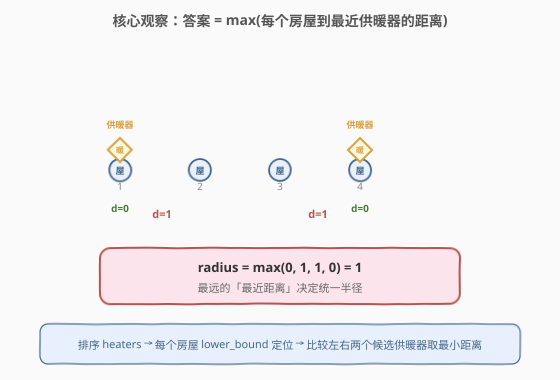
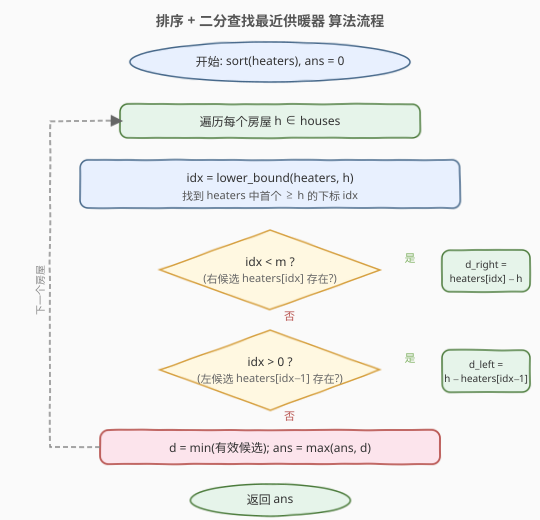
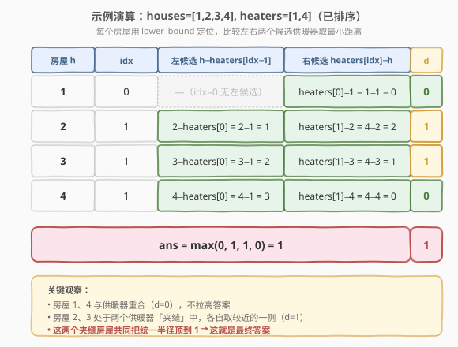

# 供暖器

- **题目名称**：供暖器
- **链接**：[475. 供暖器](https://leetcode.cn/problems/heaters/)
- **难度**：中等
- **标签**：数组、二分查找、排序

## 1. 题目概述

给定分布在**水平直线**上的若干房屋 `houses` 与供暖器 `heaters` 的位置坐标，请你为供暖器设计一个**统一的最小供暖半径** `radius`，使得每个房屋都落在**至少一个**供暖器的供暖范围内（即 $|house - heater| \le radius$）。返回这个最小的 `radius`。

> 💡 所有供暖器**共享同一半径** `radius`，目标是让 `radius` **尽可能小**同时**覆盖所有房屋**。

**示例 1**：

```text
输入：houses = [1,2,3], heaters = [2]
输出：1
解释：唯一供暖器位于 2，半径 1 即可覆盖 [1,2,3] 三个房屋。
```

**示例 2**：

```text
输入：houses = [1,2,3,4], heaters = [1,4]
输出：1
解释：供暖器 1 覆盖房屋 1、2；供暖器 4 覆盖房屋 3、4，半径 1 足够。
```

**示例 3**：

```text
输入：houses = [1,5], heaters = [2]
输出：3
解释：供暖器位于 2，距房屋 1 为 1，距房屋 5 为 3，故半径至少为 3。
```

**约束条件**：

- `1 <= houses.length, heaters.length <= 3 * 10^4`
- `1 <= houses[i], heaters[i] <= 10^9`

---

## 2. 解题思路

### 2.1 暴力思路

对每个房屋，遍历所有供暖器找出最近距离 $d_i = \min_j |house_i - heater_j|$，最终答案为 $\max_i d_i$。时间 $O(n \cdot m)$，$n,m \le 3\times 10^4$ 时达 $9\times 10^8$，超时。

### 2.2 核心观察：排序 + 二分找最近供暖器



关键观察：**答案 = 所有房屋到「最近供暖器」距离的最大值**。即：

$$
\text{radius} = \max_{h \in \text{houses}} \min_{t \in \text{heaters}} |h - t|
$$

要高效求每个房屋的最近供暖器距离，先将 `heaters` **排序**，然后对每个房屋在有序的 `heaters` 上做**二分查找**（`lower_bound`）定位插入位置 `idx`，只需比较 `heaters[idx]` 与 `heaters[idx-1]` 这**两个候选**（即房屋在供暖器序列中的左右邻居），取较小距离即可。

> 💡 **为什么只需比较左右两个邻居？** 供暖器排序后，房屋 `h` 的最近供暖器必然是其在有序序列中的「前驱」或「后继」（若存在）。比前驱更左的供暖器距离 `h` 更远，比后继更右的也同理。所以 `lower_bound` 一次定位，两个候选足够——这是**有序数组上最近邻查询**的标准套路，与 [35. 搜索插入位置](https://leetcode.cn/problems/search-insert-position/) 的 `lower_bound` 同源。

### 2.3 算法流程图



**核心步骤**：

1. **排序供暖器** `sort(heaters)`，$O(m \log m)$。
2. 对每个房屋 `h`，调用 `lower_bound(heaters, h)` 找到首个 $\ge h$ 的供暖器下标 `idx`。
3. 候选距离：
   - 若 `idx < m`：右候选 $r = heaters[idx] - h$。
   - 若 `idx > 0`：左候选 $l = h - heaters[idx-1]$。
   - 取 $d = \min(\text{有效候选})$（边界处只算存在的那一侧）。
4. 更新答案 $ans = \max(ans, d)$。
5. 返回 $ans$。

> ⚠️ **边界处理**：`idx = 0` 时房屋在最左供暖器左侧（或与之重合），只有右候选；`idx = m` 时房屋在最右供暖器右侧，只有左候选。两种情况都要正确兜底，否则会访问越界或取到无效距离。

### 2.4 示例演算

以示例 2 `houses = [1,2,3,4]`、`heaters = [1,4]` 为例（`heaters` 已有序）：



| 房屋 h | idx（lower_bound） | 左候选 $h - heaters[idx-1]$ | 右候选 $heaters[idx] - h$ | 最近距离 $d$ |
|--------|---------------------|----------------------------|--------------------------|--------------|
| 1      | 0（$heaters[0]=1 \ge 1$） | —（$idx=0$ 无左候选）  | $1 - 1 = 0$              | 0            |
| 2      | 1（$heaters[1]=4 \ge 2$） | $2 - 1 = 1$            | $4 - 2 = 2$              | 1            |
| 3      | 1（$heaters[1]=4 \ge 3$） | $3 - 1 = 2$            | $4 - 3 = 1$              | 1            |
| 4      | 1（$heaters[1]=4 \ge 4$） | $4 - 1 = 3$            | $4 - 4 = 0$              | 0            |

最终 $ans = \max(0,\ 1,\ 1,\ 0) = 1$ ✓。

> 💡 房屋 2、3 处在两个供暖器「夹缝」中：房屋 2 离左供暖器（位置 1）更近，房屋 3 离右供暖器（位置 4）更近，各自最近距离均为 1。这两个夹缝房屋共同把统一半径顶到 1——它们是「瓶颈房屋」。

---

## 3. 参考代码

### 方法一：排序 + 二分查找最近供暖器（推荐）

### C++

```cpp
class Solution {
  public:
    int findRadius(vector<int>& houses, vector<int>& heaters) {
        sort(heaters.begin(), heaters.end());
        int ans = 0;
        for (int h : houses) {
            auto it = lower_bound(heaters.begin(), heaters.end(), h);
            int d = INT_MAX;
            if (it != heaters.end()) {
                d = min(d, *it - h);             // 右候选
            }
            if (it != heaters.begin()) {
                d = min(d, h - *prev(it));       // 左候选
            }
            ans = max(ans, d);
        }
        return ans;
    }
};
```

### Python

```python
import bisect

class Solution:
    def findRadius(self, houses: List[int], heaters: List[int]) -> int:
        heaters.sort()
        ans = 0
        for h in houses:
            idx = bisect.bisect_left(heaters, h)   # 首个 >= h 的下标
            candidates = []
            if idx < len(heaters):
                candidates.append(heaters[idx] - h)        # 右候选
            if idx > 0:
                candidates.append(h - heaters[idx - 1])    # 左候选
            ans = max(ans, min(candidates))
        return ans
```

> ⚠️ **易错点**：
> 1. **必须先排序 `heaters`**——`lower_bound` 的前提是有序序列；未排序会得到错误的下标。
> 2. **边界两侧都要兜底**：`it == end()` 时无右候选，`it == begin()` 时无左候选，必须分别判空后再取距离，否则越界。
> 3. **`ans` 取 max 而非 min**——目标是「让所有房屋都被覆盖」，故取最远那个房屋的需求作为统一半径。

---

## 4. 复杂度分析

| 维度 | 复杂度 | 说明 |
|------|--------|------|
| 时间复杂度 | $O((n + m) \log m)$ | 排序 $O(m \log m)$；每个房屋二分 $O(\log m)$，共 $n$ 次 |
| 空间复杂度 | $O(\log m)$ | 排序的栈空间（C++ `sort` 为内省排序） |

> 💡 本题 $n, m \le 3\times 10^4$，$\log m \approx 15$，总量约 $4.5\times 10^5$ 次比较，远低于时限。若同时排序 `houses` 还可换用双指针法将单次查询从 $O(\log m)$ 降到均摊 $O(1)$（见扩展）。

---

## 5. 扩展：二分答案 + 贪心验证

本题也可套用「二分答案」模板（与 [410. 分割数组的最大值](../0401-0500/410_分割数组的最大值.md) 同骨架）：在半径 $r \in [0, 10^9]$ 上二分，每次验证「半径 $r$ 能否覆盖所有房屋」。

**二段性**：$r$ 越大覆盖范围越广，存在分界点 $r^*$，使 $r < r^*$ 时无法覆盖全部、$r \ge r^*$ 时可以。

**验证函数** `canCover(r)`：排序 `heaters` 后，对每个房屋用 `lower_bound` 找最近供暖器，若距离 $> r$ 则失败。

### C++

```cpp
class Solution {
  public:
    int findRadius(vector<int>& houses, vector<int>& heaters) {
        sort(heaters.begin(), heaters.end());
        long lo = 0, hi = 1e9, ans = 1e9;
        while (lo <= hi) {
            long mid = lo + (hi - lo) / 2;
            if (canCover(houses, heaters, mid)) {
                ans = mid;
                hi = mid - 1;
            } else {
                lo = mid + 1;
            }
        }
        return (int)ans;
    }
  private:
    bool canCover(vector<int>& houses, vector<int>& heaters, long r) {
        for (int h : houses) {
            auto it = lower_bound(heaters.begin(), heaters.end(), h);
            bool ok = false;
            if (it != heaters.end() && (long)*it - h <= r) ok = true;
            if (it != heaters.begin() && (long)h - *prev(it) <= r) ok = true;
            if (!ok) return false;
        }
        return true;
    }
};
```

> 💡 **两种方法对比**：方法一直接求「最近距离的最大值」，$O((n+m)\log m)$ 一次过；二分答案多套一层 $\log(10^9) \approx 30$，总 $O(n \log m \log(10^9))$，稍慢但思路更具普适性——当问题不易直接求最值、却容易判定「给定候选值是否合法」时，二分答案是首选。

### 方法三：排序 + 双指针

若同时排序 `houses` 与 `heaters`，可用双指针 $O(n + m)$ 求每个房屋的最近供暖器：维护 `j` 指向当前最优供暖器，对每个房屋 `h`，只要 `heaters[j+1]` 离 `h` 不比 `heaters[j]` 更远就推进 `j`。

```cpp
class Solution {
  public:
    int findRadius(vector<int>& houses, vector<int>& heaters) {
        sort(houses.begin(), houses.end());
        sort(heaters.begin(), heaters.end());
        int ans = 0, j = 0;
        for (int h : houses) {
            while (j + 1 < (int)heaters.size() &&
                   abs(heaters[j + 1] - h) <= abs(heaters[j] - h)) {
                ++j;
            }
            ans = max(ans, abs(heaters[j] - h));
        }
        return ans;
    }
};
```

> ⚠️ 双指针的推进条件用 `<=`（而非 `<`）保证遇等距时也推进到右侧供暖器，避免在等距点反复横跳；`j` 单调不减，总移动次数 $\le m$，整体 $O(n + m)$。

---

## 6. 面试要点

1. **为什么答案是「最近距离的最大值」？**

   - 所有供暖器共用同一半径 $r$。房屋 $h$ 被覆盖 $\iff$ 存在供暖器 $t$ 使 $|h - t| \le r$ $\iff$ $r \ge \min_t |h - t|$。所有房屋都被覆盖 $\iff$ $r \ge \max_h \min_t |h - t|$。取等号即最小半径。

2. **为什么二分查找最近供暖器只需看左右两个候选？**

   - 供暖器排序后，房屋 $h$ 在序列中的位置由 `lower_bound` 定位，其前驱 `heaters[idx-1]` 是 $\le h$ 中最大的（即离 $h$ 最近的左供暖器），后继 `heaters[idx]` 是 $\ge h$ 中最小的（即离 $h$ 最近的右供暖器）。比前驱更左的供暖器距离 $h$ 更远，比后继更右的也同理，故只需比较这两个邻居。

3. **二分答案法与方法一的本质区别？**

   - 方法一**直接构造答案**：求出每个房屋的最近距离后取 max，一次遍历得解。二分答案**把最优化转成判定**：猜一个半径，验证是否合法，靠单调性收敛。前者更直接高效，后者更通用——当「判定合法」比「直接求最值」容易时（如 [410](../0401-0500/410_分割数组的最大值.md) 的段和判定），二分答案更合适。

4. **能否不排序 `heaters`？**

   - 不能。`lower_bound` 与双指针都依赖有序性。若用 `houses`、`heaters` 各自的原始顺序，只能暴力 $O(nm)$。排序是换取 $O(\log m)$ 查询的必要预处理。

5. **双指针法中推进条件为何用 `<=` 而非 `<`？**

   - 当 `heaters[j]` 与 `heaters[j+1]` 到 `h` 等距时，若用 `<` 则 `j` 不推进，下一个房屋 `h'`（更靠右）时 `heaters[j+1]` 反而更近，但 `j` 仍卡在旧位置，导致漏掉更优供暖器。用 `<=` 确保等距时也向右推进，保持 `j` 始终跟随房屋右移。

---

## 7. 同类练习题

- [410. 分割数组的最大值](https://leetcode.cn/problems/split-array-largest-sum/)（[题解](../0401-0500/410_分割数组的最大值.md)）：二分答案 + 贪心验证，本题二分答案扩展的对照模板
- [875. 爱吃香蕉的珂珂](https://leetcode.cn/problems/koko-eating-bananas/)：二分答案找最小速度，`check` 用求和验证
- [719. 找出第 K 小的数对距离](https://leetcode.cn/problems/find-k-th-smallest-pair-distance/)：排序 + 二分 + 双指针统计，有序数组上距离查询的进阶
- [35. 搜索插入位置](https://leetcode.cn/problems/search-insert-position/)：`lower_bound` 母题，本题二分查找的基础
- [392. 判断子序列](https://leetcode.cn/problems/is-subsequence/)：双指针在有序/序列上的推进，与方法三双指针同源
