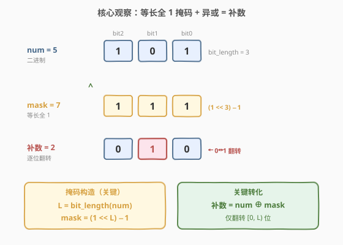
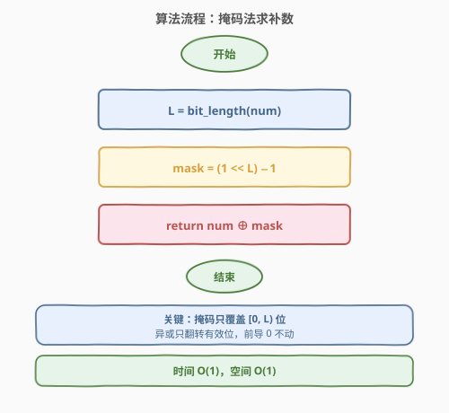
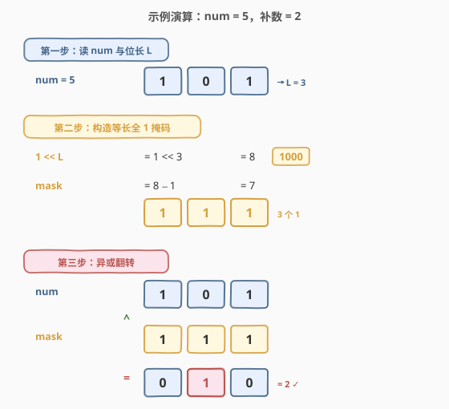

# LeetCode 数字的补数 题解

## 1. 题目概述

- **标题 / 题号**：数字的补数（#476，easy）
- **链接**：https://leetcode.cn/problems/number-complement/
- **难度**：简单
- **标签**：位运算

**题意**：给定一个正整数 `num`，输出它的**补数**。补数的定义是：将 `num` 的二进制表示**逐位翻转**（`0` ↔ `1`），且**只翻转从最高有效位到最低位**的范围，前导零不参与翻转。

> 💡 **「补数」的精确定义**：设 `num` 的二进制有效位数为 $L$（即最高设置位在第 $L-1$ 位），其补数为 `num` 在低 $L$ 位上逐位取反后得到的数。注意这与「按位取反 `~num`」不同——后者会翻转所有 32 位（含前导零），结果通常是一个负数或巨大的数。

**示例 1**：

```text
输入：num = 5
输出：2
解释：5 的二进制为 101，有效位数 L = 3。
逐位翻转得 010，即十进制 2。
```

**示例 2**：

```text
输入：num = 1
输出：0
解释：1 的二进制为 1，有效位数 L = 1。
逐位翻转得 0，即十进制 0。
```

**约束**：

- $1 \leq \text{num} < 2^{31}$

> ⚠️ **注意取值范围**：输入恒为正整数（`num ≥ 1`），故其二进制至少有一个 `1`，有效位数 $L \geq 1$，无需处理 `num = 0` 的边界。同时输入不超过 31 位，Python 下直接用位运算不会触发负数补码的「无限前导 1」问题（详见 [191. 位 1 的个数](https://leetcode.cn/problems/number-of-1-bits/)）。

## 2. 解题思路

### 2.1 暴力思路：字符串翻转

最直观的做法是先把 `num` 转成二进制字符串，逐字符翻转 `0`/`1`，再转回十进制：

```python
s = bin(num)[2:]            # '5' -> '101'
t = ''.join('1' if c == '0' else '0' for c in s)   # '010'
return int(t, 2)            # 2
```

时间 $O(L)$，空间 $O(L)$（字符串长度）。能 AC，但**绕了一圈**——既然翻转二进制位本质是位运算，却借道字符串转换，既多了一次 `int→str` 和一次 `str→int` 的往返，也引入了 $O(L)$ 的额外空间。更糟的是另一种「朴素位运算」写法：直接 `~num`（按位取反），这在 32 位下会把所有前导 `0` 也翻成 `1`，得到一个负数或巨大数——完全错误。

> 💡 转机在于：翻转「有效位」需要先知道**有效位的范围**。只要构造一个**与有效位等长的全 `1` 掩码**，再用异或一次性翻转——掩码为 `1` 的位被翻转，掩码为 `0` 的位（前导零）保持不变。

### 2.2 核心观察：等长全 1 掩码 + 异或



关键性质有两点：

1. **异或翻转**：`a ^ 1 = ~a`（`0→1`，`1→0`），`a ^ 0 = a`（保持）。故 `num ^ mask` 中，`mask` 为 `1` 的位翻转 `num` 对应位，`mask` 为 `0` 的位不变。
2. **等长全 1 掩码**：设 `num` 的有效位数为 $L$（即 `bit_length(num)`），则掩码 `mask = (1 << L) - 1` 恰好是低 $L$ 位全 `1`、更高位全 `0`。

| `num` 的位 | `mask` 的位 | `num ^ mask` 的位 |
|-----------|-------------|-------------------|
| 0 | 1 | 1（翻转） |
| 1 | 1 | 0（翻转） |

掩码之外的高位（前导零）对应 `mask = 0`，异或后保持 `0`，天然不被翻转——这正是「只翻转有效位」的语义。

> 💡 **关键转化**：补数 = $\text{num} \oplus ((1 \ll L) - 1)$，其中 $L = \text{bit\_length}(\text{num})$。这一步把「逐位翻转有效位」归约为一次异或运算，关键在于如何构造等长掩码。

### 2.3 算法流程图



算法只需三步：

1. **求位长**：`L = bit_length(num)`，即最高设置位的位置 + 1。
2. **构造掩码**：`mask = (1 << L) - 1`，得到低 $L$ 位全 `1`。
3. **异或翻转**：`return num ^ mask`。

> ⚠️ **正确性**：`mask` 的低 $L$ 位全 `1`、更高位全 `0`，故 `num ^ mask` 仅翻转 `num` 的低 $L$ 位（即有效位），前导零不变。由于 `num ≥ 1` 保证 $L \geq 1$，`mask` 至少为 `1`，异或结果恰为 `num` 的有效位补数。

### 2.4 示例演算

以示例 1 的 `num = 5` 为例：



**第一步：读 num 与位长 L**

| 数 | 十进制 | 二进制（3 位） |
|----|--------|----------------|
| `num` | 5 | `1 0 1` |

`5 = 101₂`，最高设置位在第 2 位，故 $L = \text{bit\_length}(5) = 3$。

**第二步：构造等长全 1 掩码**

| 表达式 | 计算 | 结果（二进制） |
|--------|------|----------------|
| `1 << L` | `1 << 3` | `1000` (= 8) |
| `mask = (1 << L) - 1` | `8 - 1` | `0111` (= 7) |

`mask = 7`（二进制 `111`），低 3 位全 `1`，更高位全 `0`。

**第三步：异或翻转**

| 数 | 二进制 |
|----|--------|
| `num` | `1 0 1` |
| `mask` | `1 1 1` |
| `num ^ mask` | `0 1 0` = 2 |

`101 ^ 111 = 010`，结果 `2` 即为补数 ✓。注意第 2 位（最高位）`1^1=0`、第 1 位 `0^1=1`、第 0 位 `1^1=0`——三位都被翻转，且没有触及第 3 位及以上的前导零。

## 3. 参考代码

### C++

```cpp
class Solution {
  public:
    int findComplement(int num) {
        int L = 0;
        int temp = num;
        while (temp) {           // 求 bit_length
            L++;
            temp >>= 1;
        }
        unsigned mask = (1u << L) - 1;
        return num ^ mask;
    }
};
```

也可用 `bit_length` 的一行写法或位扩散法（见第 5 节）：

```cpp
class Solution {
  public:
    int findComplement(int num) {
        unsigned mask = num;
        mask |= mask >> 1;       // 位扩散：把最高设置位以下全填 1
        mask |= mask >> 2;
        mask |= mask >> 4;
        mask |= mask >> 8;
        mask |= mask >> 16;
        return num ^ mask;
    }
};
```

> ⚠️ **C++ 类型陷阱**：`1 << 31` 在 `int` 下是未定义行为（符号位溢出）。本题 `num < 2^{31}`，故 $L \leq 31$，`1u << L` 用 `unsigned` 安全。位扩散法天然规避此问题。

### Python

```python
class Solution:
    def findComplement(self, num: int) -> int:
        L = num.bit_length()
        mask = (1 << L) - 1
        return num ^ mask
```

也可一行：

```python
class Solution:
    def findComplement(self, num: int) -> int:
        return num ^ ((1 << num.bit_length()) - 1)
```

> 💡 Python 整数无限精度，`(1 << L) - 1` 不会溢出，无需类型考量。`int.bit_length()` 直接给出有效位数（不含符号位与前导零），与本题语义完全契合。

## 4. 复杂度分析

| 维度 | 复杂度 | 说明 |
|------|--------|------|
| 时间复杂度 | $O(1)$ | `bit_length` 为常数次移位（最坏 31 次）；位扩散法固定 5 次移位；异或与减法各 $O(1)$ |
| 空间复杂度 | $O(1)$ | 仅用 `L` 与 `mask` 两个变量 |

> 💡 与字符串翻转法（$O(L)$ 时间 + $O(L)$ 空间）相比，位运算法无额外空间、常数级操作。由于 $L \leq 31$，两种写法在最坏情况下都是常数级，但位运算法避免了一次 `int→str` 和 `str→int` 的往返，常数更优，且更贴合「位运算」题的考察意图。

## 5. 扩展：构造等长掩码的多种方法

「求 `num` 的等长全 1 掩码」是位运算题的高频子问题，有多种实现，各有适用场景：

| 方法 | 写法 | 说明 |
|------|------|------|
| **位长 + 移位** | `L = bit_length(num); mask = (1 << L) - 1` | 最直观，依赖 `bit_length` |
| **位扩散（smear）** | `mask = num; mask \|= mask>>1; ...>>2; ...>>4; ...>>8; ...>>16` | 5 次移位把最高设置位以下全填 1，不依赖 `bit_length` |
| **最高位提取** | `h = num & -num`（错）；`h = 1 << (bit_length-1)`（对）；`mask = (h << 1) - 1` | 先取最高设置位，再翻倍减 1 |
| **库函数** | C++: `mask = (1u << (32 - __builtin_clz(num))) - 1` | 用前导零计数反推位长 |

**位扩散法**的原理：从最高设置位开始，每次右移并按位或，把 `1` 向低位「传染」：

```text
num        = 0010 1000  (最高设置位在第 5 位)
num | >>1  = 0011 0100  → 0011 1100  (第 5 位 1 传染到第 4 位)
num | >>2  = 0011 1111  (再传染到第 3、2 位)
num | >>4  = 0011 1111  (已全 1，后续无变化)
...
最终 mask  = 0011 1111  (第 0..5 位全 1)
```

5 次移位（`>>1, >>2, >>4, >>8, >>16`）保证覆盖 32 位整数。该法不用 `bit_length`，在无该内置函数的语言中是标准技巧，也常见于「求不大于 `num` 的最大 2 的幂」等场景。

> 💡 **位扩散法的另一经典应用**——`num & -num` 提取最低设置位（[191. 位 1 的个数](https://leetcode.cn/problems/number-of-1-bits/) 的反向操作），而位扩散法处理的是**最高设置位**。两者一低一高，是位运算题的两块基石。

## 6. 面试要点

1. **为什么不能直接用 `~num`？**

   - `~` 是对**所有位**取反。在 32 位下，`~5 = ~...00000101 = ...11111010`，前导 `0` 全被翻成 `1`，结果是一个负数（C++/Java 的有符号 `int`）或巨大数（Python 无限精度）。补数的定义只翻转**有效位**（最高设置位及以下），故必须先用掩码限定范围，再异或翻转。

2. **掩码 `(1 << L) - 1` 为什么是低 L 位全 1？**

   - `1 << L` 是第 $L$ 位为 `1`、低 $L$ 位全 `0` 的数（即 $2^L$）。减 1 后，第 $L$ 位借位变 `0`，低 $L$ 位全变 `1`，更高位仍为 `0`。这正是「低 $L$ 位全 `1`」的掩码。例如 $L = 3$：`1 << 3 = 1000`，`1000 - 1 = 0111`。

3. **位扩散法和位长法各有什么优劣？**

   - 位长法 `mask = (1 << bit_length) - 1` 直观易读，一行搞定，但依赖语言提供 `bit_length` / `__builtin_clz`。位扩散法 `mask |= mask >> 1; ...` 不依赖内置函数，5 次固定移位即可，在嵌入式或无库函数场景更通用。面试中两者都可，位长法更易讲清思路，位扩散法更显位运算功底。

4. **C++ 中 `1 << 31` 为什么有坑？**

   - `1` 是 `int` 类型，`1 << 31` 把符号位置 1，在 C++ 中是**未定义行为**（有符号溢出）。本题 `num < 2^{31}`，$L \leq 31$，最坏 `1 << 31` 会触发 UB。解法是用 `unsigned`：`1u << L`，或改用位扩散法（只对 `num` 自身移位，不构造 `1 << L`）。Python 无此问题（整数无限精度）。

5. **如果 `num = 0` 怎么办？**

   - 本题约束 `num ≥ 1`，无需处理。但若扩展到 `num = 0`：`bit_length(0) = 0`，`mask = (1 << 0) - 1 = 0`，`0 ^ 0 = 0`——补数仍为 `0`，语义合理（`0` 的二进制无有效位，翻转后仍为 `0`）。但需小心 `1 << 0 - 1` 的运算符优先级，写成 `(1 << L) - 1` 才对。

## 同类练习题

| # | 题目 | 与本题的关联 |
|---|------|-------------|
| 191 | [位 1 的个数](https://leetcode.cn/problems/number-of-1-bits/)（[题解](../0001-0100/191_位1的个数.md)） | 位运算入门母题，`n & (n-1)` 技巧的源头，本题位运算的基础 |
| 461 | [汉明距离](https://leetcode.cn/problems/hamming-distance/)（[题解](../0401-0500/461_汉明距离.md)） | 异或把差异编码为 1，与本题「异或翻转有效位」共用异或语义 |
| 231 | [2 的幂](https://leetcode.cn/problems/power-of-two/) | `n & (n-1) == 0` 判定，位运算基础练习，承接掩码构造中的最高位提取 |
| 190 | [颠倒二进制位](https://leetcode.cn/problems/reverse-bits/) | 32 位逐位处理，与本题「有效位处理」对照（190 是全 32 位，476 是仅有效位） |
| 1009 | [十进制整数的补码](https://leetcode.cn/problems/complement-of-base-10-integer/) | 与本题几乎同题（题面略异，解法完全一致），可交叉验证 |
