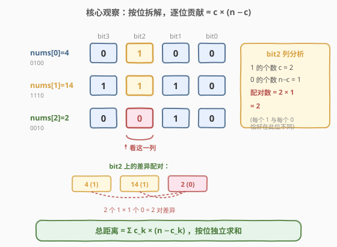
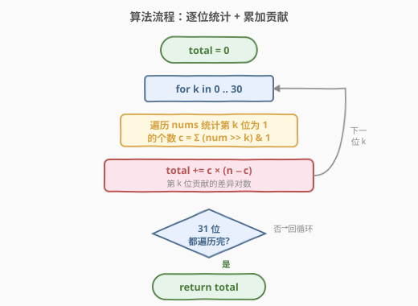

# LeetCode 总汉明距离 题解

## 1. 题目概述

- **标题 / 题号**：总汉明距离（#477，medium）
- **链接**：https://leetcode.cn/problems/total-hamming-distance/
- **难度**：中等
- **标签**：位运算、数学

**题意**：给定一个整数数组 `nums`，返回数组中**所有两两数对的汉明距离之和**。两数 `a`、`b` 的汉明距离即它们二进制表示中**对应位不同的位数**，等价于 $\text{popcount}(a \oplus b)$（见 [461. 汉明距离](../0401-0500/461_汉明距离.md)）。本题要求把 $\binom{n}{2}$ 个数对的距离全部相加。

> 💡 **承接关系**：[461](../0401-0500/461_汉明距离.md) 解决「两数之间」的汉明距离，本题是它的「数组批量版」——从单对差异升级到全局差异总和。朴素地套用 461 的 $O(n^2)$ 两两异或会超时，必须换视角：**按位独立统计**，把「整体配对差异」拆成「逐位贡献求和」，降到 $O(n)$。

**示例 1**：

```text
输入：nums = [4, 14, 2]
输出：6
解释：为清晰起见用 4 位二进制表示
4  = 0 1 0 0
14 = 1 1 1 0
2  = 0 0 1 0
HD(4, 14) + HD(4, 2) + HD(14, 2) = 2 + 2 + 2 = 6
```

**示例 2**：

```text
输入：nums = [4, 14, 4]
输出：4
```

**约束**：

- $1 \leq \text{nums.length} \leq 10^4$
- $0 \leq \text{nums}[i] \leq 10^9$

> ⚠️ **数据规模暗示**：$n$ 可达 $10^4$，$\binom{n}{2} \approx 5 \times 10^7$，朴素 $O(n^2)$ 两两异或在常数小时或许能卡过，但并非出题意图。而 $\text{nums}[i] \leq 10^9 < 2^{30}$，故只需考察 $0 \sim 29$ 共 30 个二进制位（保险起见遍历 31 位），$30 \times 10^4 = 3 \times 10^6$ 次操作，按位拆解 $O(n)$ 稳稳通过。

## 2. 解题思路

### 2.1 暴力思路：两两异或数 1

最直接的做法是双重循环枚举所有数对，套用 [461](../0401-0500/461_汉明距离.md) 的 `popcount(x ^ y)` 求每对距离再累加：

```python
total = 0
for i in range(n):
    for j in range(i + 1, n):
        z = nums[i] ^ nums[j]
        while z:
            z &= z - 1
            total += 1
return total
```

时间 $O(n^2 \cdot \text{popcount})$，空间 $O(1)$。$n = 10^4$ 时数对约 $5 \times 10^7$，每组还要做异或和 popcount，常数偏大，**会超时**。

> 💡 转机在于换个统计单位：不要「按数对」算距离，而要「按二进制位」算贡献。每一位上 0/1 的分布独立决定了有多少对在该位不同，把所有位的贡献求和即得总距离。

### 2.2 核心观察：按位拆解，逐位贡献 $c \times (n - c)$



关键观察是**位与位之间相互独立**。对任意第 `k` 位，把数组中每个数在该位的值（0 或 1）排成一列，设该列有 `c` 个 `1`、`n - c` 个 `0`。一个数对在该位「不同」当且仅当其中一个数该位是 `1`、另一个是 `0`——这样的数对恰有 $c \times (n - c)$ 个（每个 `1` 与每个 `0` 配一次）。

而「两数在第 `k` 位不同」对该数对的汉明距离**恰好贡献 1**（异或后该位为 1）。因此：

$$\text{总汉明距离} = \sum_{k=0}^{30} c_k \times (n - c_k)$$

其中 $c_k$ 是数组中第 `k` 位为 1 的元素个数。

> 💡 **关键转化**：把「$\binom{n}{2}$ 个数对、每对算 30 位差异」的 $O(n^2 \cdot 30)$ 计算，重新组织成「30 个位、每位扫一遍数组」的 $O(30 \cdot n)$ 计算。总工作量不变，但**去掉了 $n^2$ 那一项**——这正是降维的收益：从「数对驱动」换成「位驱动」，每位只产生一个 $O(n)$ 的扫描而非 $O(n^2)$ 的配对。

### 2.3 算法流程图



算法步骤：

1. `total = 0`，`n = len(nums)`。
2. 对每个二进制位 `k`（`0` 到 `30`，覆盖 $\text{nums}[i] < 2^{30}$）：
   - 扫一遍 `nums`，统计第 `k` 位为 1 的个数 `c`（即 `c += (num >> k) & 1`）。
   - 累加该位贡献：`total += c * (n - c)`。
3. 返回 `total`。

> ⚠️ **正确性**：每位贡献 $c_k \times (n - c_k)$ 计的是「该位上 0/1 不同的数对数」，而每个这样的数对在该位的异或为 1、对距离贡献 1。汉明距离的可加性来自异或的按位独立性——总距离 = 各位距离之和。故对 31 位求和即得全部数对距离总和，无遗漏无重复。

### 2.4 示例演算

以示例 1 的 `nums = [4, 14, 2]`（`n = 3`）为例：

![示例演算：nums = [4, 14, 2]，总距离 = 6](../images/total_hamming_example_walkthrough.svg)

各数的 4 位二进制为 `4=0100`、`14=1110`、`2=0010`，逐位列出 0/1：

| 位 `k` | 4 | 14 | 2 | `c`（1 的个数） | `n−c`（0 的个数） | 贡献 $c \times (n-c)$ |
|--------|---|----|---|-----------------|-------------------|----------------------|
| bit3   | 0 | 1  | 0 | 1               | 2                 | 2                    |
| bit2   | 1 | 1  | 0 | 2               | 1                 | 2                    |
| bit1   | 0 | 1  | 1 | 2               | 1                 | 2                    |
| bit0   | 0 | 0  | 0 | 0               | 3                 | 0                    |

总和 $= 2 + 2 + 2 + 0 = 6$ ✓。与朴素两两异或对照：`HD(4,14)=2`、`HD(4,2)=2`、`HD(14,2)=2`，合计 `6`，两种方法结果一致。注意 bit0 全为 0，`c=0` 导致贡献为 0——**全相同或全不同的位贡献都为 0**（乘积一项为 0），只有 0/1 混合的位才有非零贡献，且 $c = n/2$ 时贡献最大。

## 3. 参考代码

### C++

```cpp
class Solution {
  public:
    int totalHammingDistance(vector<int>& nums) {
        int n = nums.size();
        int total = 0;
        for (int k = 0; k < 31; ++k) {          // nums[i] < 2^30，遍历 31 位即可
            int c = 0;
            for (int num : nums) {
                c += (num >> k) & 1;            // 统计第 k 位为 1 的个数
            }
            total += c * (n - c);               // 该位贡献的差异对数
        }
        return total;
    }
};
```

### Python

```python
class Solution:
    def totalHammingDistance(self, nums: List[int]) -> int:
        n = len(nums)
        total = 0
        for k in range(31):                     # nums[i] < 2^30，遍历 31 位即可
            c = sum((num >> k) & 1 for num in nums)
            total += c * (n - c)
        return total
```

> 💡 **位遍历上界**：约束 $\text{nums}[i] \leq 10^9 < 2^{30}$，故 `k` 取 `0..30`（31 位）足够。若上界放宽到 $2^{31}-1$，则遍历 32 位。用 `31` 而非 `32` 是基于本题约束的微优化；面试中写 `32` 也完全正确，多余的位 `c=0` 贡献为 0 不影响结果。
>
> ⚠️ **Python 性能**：`sum((num >> k) & 1 for num in nums)` 用生成器表达式，对 $n=10^4$、31 位共 $3 \times 10^5$ 次操作，足够快。若追求极致常数，可改为先转字符串或用 `zip(*[bin(x)[2:].zfill(31) for x in nums])` 按列数 `1`，但可读性下降，不推荐。

## 4. 复杂度分析

| 维度 | 复杂度 | 说明 |
|------|--------|------|
| 时间复杂度 | $O(31 \cdot n) = O(n)$ | 外层固定 31 位，内层扫一遍 `nums`；$n=10^4$ 时约 $3.1 \times 10^5$ 次位运算 |
| 空间复杂度 | $O(1)$ | 仅用 `total`、`c` 等常数个变量 |

> 💡 与朴素 $O(n^2)$ 相比，去掉了数对枚举的 $\binom{n}{2}$ 项，用「位 × 数组」的两次线性扫描替代。本质是利用了**汉明距离的按位可加性**——把配对维度的二次复杂度降到位维度的线性复杂度。

## 5. 扩展：贡献计数思想与变体

### 5.1 「按位/按元素拆解贡献」的通用范式

本题是**贡献计数**（contribution counting）的典型范例：当要求的总量可分解为「每个独立单元贡献之和」时，不必枚举所有组合，而是逐单元算贡献。这里「单元」是二进制位，每位贡献 $c \times (n-c)$。同类思想在以下问题中反复出现：

- **按位拆解**：任何「数对按位差异/相等」的总量都可按位独立统计，把 $O(n^2)$ 配对降到 $O(n \cdot B)$（$B$ 为位数）。
- **按元素拆解**：如 [611. 有效三角形的个数](https://leetcode.cn/problems/valid-triangle-number/) 固定最大边后双指针计数，本质是「每条边作为最大边时的贡献」。

判断能否用贡献计数的关键：**总量是否等于各独立单元贡献之和**（即是否具有可加性）。汉明距离天然按位可加，故适用。

### 5.2 与 [461. 汉明距离](../0401-0500/461_汉明距离.md) 的对照

| 维度 | 461 汉明距离 | 477 总汉明距离 |
|------|--------------|----------------|
| 输入 | 两个整数 `x, y` | 整数数组 `nums` |
| 目标 | 单对距离 $\text{popcount}(x \oplus y)$ | 全部数对距离之和 |
| 核心转化 | 异或把差异编码为 1 → 数 1 | 按位拆解 → $c \times (n-c)$ 求和 |
| 复杂度 | $O(\text{popcount})$ | $O(n)$ |

461 是「单对版」用异或归约到 popcount；477 是「批量版」用按位拆解避开 $O(n^2)$。两者共享「**位与位独立**」这一底层信念，只是 461 在两数层面用异或一次性收集差异，477 在数组层面用乘法一次性算出配对数。

### 5.3 进阶：更高位宽或动态数组

若位宽增大（如 64 位整数），外层循环次数线性增长，但复杂度仍为 $O(B \cdot n)$，$B$ 为位数，仍是线性扫数组。若数组**动态变化**（频繁插入/删除并查询总距离），可为每一位维护一个 `c_k` 计数器：插入/删除时更新对应位的 `c_k`，查询时按 $c_k \times (n - c_k)$ 求和——单次更新 $O(B)$、查询 $O(B)$，本题思想直接迁移到在线场景。

## 6. 面试要点

1. **为什么总距离等于 $\sum_k c_k \times (n - c_k)$？**

   - 汉明距离按位可加：每个数对的距离等于其在各二进制位上差异（0 或 1）之和。对第 `k` 位，设数组中 `c` 个数该位为 1、`n-c` 个为 0；一个数对在该位不同当且仅当一个取 1、另一个取 0，这样的数对恰有 $c \times (n-c)$ 个，每个贡献 1。故该位对总距离的贡献是 $c \times (n-c)$，对所有位求和即得总距离。

2. **为什么不能直接两两异或数 1？复杂度差在哪？**

   - 两两异或枚举 $\binom{n}{2}$ 个数对，每组做异或 + popcount，时间 $O(n^2)$。$n=10^4$ 时约 $5 \times 10^7$ 个数对，常数偏大易超时。按位拆解把「数对驱动」换成「位驱动」：每位只扫一遍数组 $O(n)$，31 位共 $O(31n)$，去掉了 $n^2$ 项。本质是利用位独立性，把配对维度的二次复杂度降到位维度的线性。

3. **位遍历为什么是 31 位？多遍历几位会怎样？**

   - 约束 $\text{nums}[i] \leq 10^9 < 2^{30}$，故 0..30 共 31 位即可覆盖所有可能为 1 的位。多遍历几位（如写 32 或 64）不影响正确性——超出最高有效位的位 `c=0`，贡献 $0 \times n = 0$。写 31 是基于约束的微优化，面试中写 32 同样正确且更稳妥。

4. **$c \times (n-c)$ 何时最大？有什么含义？**

   - 由均值不等式，$c(n-c)$ 在 $c = n/2$ 时取最大 $n^2/4$。含义是：某位上 0/1 各半时，差异配对最多、该位贡献最大；全 0 或全 1（$c=0$ 或 $c=n$）时贡献为 0——大家都一样就没有差异。这解释了为什么「分布越均匀的位」对总距离贡献越大。

5. **本题与 [461](../0401-0500/461_汉明距离.md) 的关系是什么？**

   - 461 求**单对**汉明距离，用异或把两数差异归约为 popcount；477 求**全部数对**距离之和，用按位拆解避开 $O(n^2)$ 配对。两者共享「位独立」信念：461 在两数层面用异或一次性收集差异位，477 在数组层面用 $c \times (n-c)$ 一次性算出配对数。477 是 461 的批量版，但最优解法不再套用 461 的单对公式，而是换统计视角。

## 同类练习题

| # | 题目 | 与本题的关联 |
|---|------|-------------|
| 461 | [汉明距离](https://leetcode.cn/problems/hamming-distance/)（[题解](../0401-0500/461_汉明距离.md)） | 本题的单对母题，异或归约到 popcount，理解 477 的前置 |
| 191 | [位 1 的个数](https://leetcode.cn/problems/number-of-1-bits/)（[题解](../0001-0100/191_位1的个数.md)) | popcount 母题，`(num >> k) & 1` 取位的源头 |
| 338 | [比特位计数](https://leetcode.cn/problems/counting-bits/) | 对 `0..n` 每个数求 popcount，位运算批量计数的另一形态 |
| 611 | [有效三角形的个数](https://leetcode.cn/problems/valid-triangle-number/) | 同为贡献计数思想——固定最大边后双指针统计，把 $O(n^3)$ 降到 $O(n^2)$ |
| 190 | [颠倒二进制位](https://leetcode.cn/problems/reverse-bits/) | 逐位处理 32 位无符号数，位运算基础练习 |
