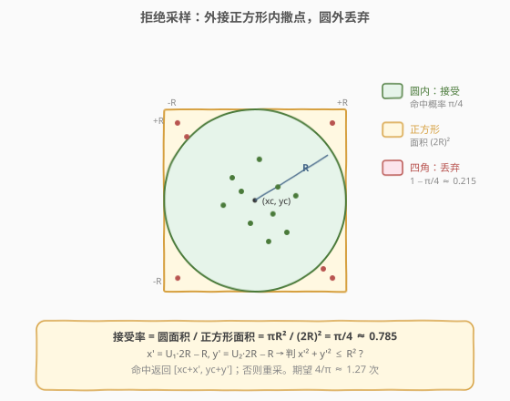
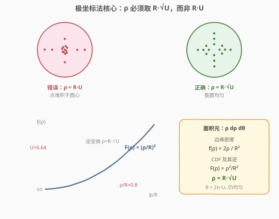
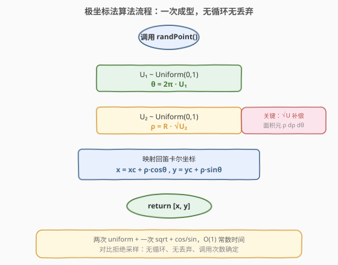
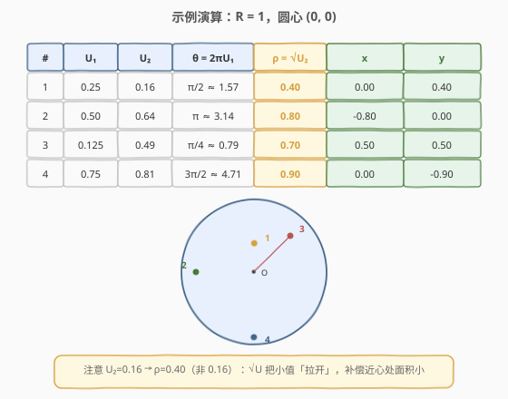

# 在圆内随机生成点

- **题目名称**：在圆内随机生成点
- **链接**：[478. 在圆内随机生成点](https://leetcode.cn/problems/generate-random-point-in-a-circle/)
- **难度**：中等
- **标签**：数学、概率与随机、拒绝采样、逆变换采样

## 1. 题目概述

给定圆的半径 `radius` 与圆心坐标 `(x_center, y_center)`，实现 `randPoint()`，在**圆内**（含边界）均匀生成一个随机点，返回 `[x, y]`。所谓「均匀」是指：点落入圆内任一子区域的概率正比于该子区域的**面积**，而非「角度均匀」或「半径均匀」。

**示例 1**：

```text
输入：
["Solution","randPoint","randPoint","randPoint"]
[[1,0,0],[],[],[]]
输出：[null,[-0.02493,-0.38077],[0.81115,-0.47477],[0.90394,0.11885]]
解释：半径 1、圆心 (0,0)，每次返回圆内一个均匀随机点。
```

**约束条件**：

- `0 < radius <= 10^8`
- `-10^7 <= x_center, y_center <= 10^7`
- `randPoint` 调用次数至多 `3 * 10^4`
- 浮点误差在 `10^-5` 内视为正确

> 💡 本题与 [470. 用 Rand7() 实现 Rand10()](https://leetcode.cn/problems/implement-rand10-using-rand7/)（[题解](../0401-0500/470_用Rand7实现Rand10.md)）同属「概率采样」家族：470 是**离散**拒绝采样，478 既可以拒绝采样、也可以用**极坐标 + 逆变换采样**做到一次成型、零丢弃——后者是本题最优雅的解法。

---

## 2. 解题思路

### 2.1 暴力思路：外接正方形拒绝采样

最直觉的做法：在圆的**外接正方形** $[-R, R] \times [-R, R]$ 内均匀撒点，落进圆内就接受，否则丢弃重来。



- 采样 $x' = U_1 \cdot 2R - R$，$y' = U_2 \cdot 2R - R$（$U_1, U_2$ 独立均匀于 $[0,1]$），得到正方形内均匀点。
- 判 $x'^2 + y'^2 \le R^2$：命中则返回 $[x_{\text{center}} + x',\, y_{\text{center}} + y']$；否则丢弃重采。

> ⚠️ **接受率仅 $\pi/4 \approx 0.785$**：正方形面积 $(2R)^2 = 4R^2$，圆面积 $\pi R^2$，命中概率 $\pi R^2 / 4R^2 = \pi/4$。约 $21.5\%$ 的采样被浪费，期望每点需 $4/\pi \approx 1.27$ 次。实现简单、完全正确，但能否**一次命中、零丢弃**？

### 2.2 核心观察：极坐标 + 逆变换采样（ρ = R·√U）



圆内点用极坐标 $(\rho, \theta)$ 表示（以圆心为原点）：

$$x' = \rho \cos\theta, \qquad y' = \rho \sin\theta, \qquad \rho \in [0, R],\ \theta \in [0, 2\pi)$$

**关键 1：角度 $\theta$ 直接均匀。** 由旋转对称性，$\theta$ 在 $[0, 2\pi)$ 上均匀，取 $\theta = U_1 \cdot 2\pi$ 即可。

**关键 2：半径 $\rho$ 不能均匀，必须取 $\rho = R\sqrt{U_2}$。** 这是本题最大的坑。极坐标下面积元为 $\rho\, d\rho\, d\theta$（**不是** $d\rho\, d\theta$）——靠近圆心处同样 $d\rho$ 对应的环带面积更小。若令 $\rho = R \cdot U$（均匀），点会**堆积在圆心附近**；正确做法是按面积反推 $\rho$ 的分布。

> 💡 **为什么是 $\sqrt{U}$？** 圆内均匀分布的密度为 $1/(\pi R^2)$。半径 $\rho$ 的边缘密度（对 $\theta$ 积分）为
>
> $$f_\rho(\rho) = \int_0^{2\pi} \frac{1}{\pi R^2}\,\rho\, d\theta = \frac{2\rho}{R^2}, \qquad \rho \in [0, R]$$
>
> 对应 CDF 为 $F_\rho(\rho) = \rho^2 / R^2$。用**逆变换采样**：令 $U_2 = F_\rho(\rho)$，解得 $\rho = R\sqrt{U_2}$（$U_2$ 均匀于 $[0,1]$）。这样 $\rho$ 的分布恰好抵消面积元中的 $\rho$ 因子，整圆均匀。

**第三步：映射回笛卡尔坐标。**

$$x = x_{\text{center}} + \rho \cos\theta, \qquad y = y_{\text{center}} + \rho \sin\theta$$

### 2.3 算法流程图



整个过程**纯计算、无循环、无丢弃**：抽两个独立 uniform，算 $\theta$ 和 $\rho$，映射回 $(x, y)$ 即返回。

### 2.4 示例演算



以 $R = 1$、圆心 $(0, 0)$ 为例演算 4 次采样：

| 次数 | $U_1$ | $U_2$ | $\theta = 2\pi U_1$ | $\rho = \sqrt{U_2}$ | $x = \rho\cos\theta$ | $y = \rho\sin\theta$ |
|------|-------|-------|----------------------|----------------------|----------------------|----------------------|
| 1 | 0.25 | 0.16 | $\pi/2 \approx 1.571$ | 0.40 | 0.00 | 0.40 |
| 2 | 0.50 | 0.64 | $\pi \approx 3.142$ | 0.80 | -0.80 | 0.00 |
| 3 | 0.125 | 0.49 | $\pi/4 \approx 0.785$ | 0.70 | 0.50 | 0.50 |
| 4 | 0.75 | 0.81 | $3\pi/2 \approx 4.712$ | 0.90 | 0.00 | -0.90 |

> 💡 留意 $\rho$ 的取值：$U_2 = 0.16$ 映射到 $\rho = 0.40$ 而非 $0.16$——$\sqrt{U}$ 把小值「拉开」，让靠近圆心处点变稀疏，恰好补偿该处环带面积小。这正是「均匀按面积」的精髓。

---

## 3. 参考代码

### C++

```cpp
class Solution {
    double r, xc, yc;
    mt19937 gen{random_device{}()};
    uniform_real_distribution<double> dis{0.0, 1.0};
public:
    Solution(double radius, double x_center, double y_center)
        : r(radius), xc(x_center), yc(y_center) {}

    vector<double> randPoint() {
        double theta = dis(gen) * 2 * M_PI;
        double rho = r * sqrt(dis(gen));
        return {xc + rho * cos(theta), yc + rho * sin(theta)};
    }
};
```

### Python

```python
import random
import math

class Solution:

    def __init__(self, radius: float, x_center: float, y_center: float):
        self.r = radius
        self.xc = x_center
        self.yc = y_center

    def randPoint(self) -> List[float]:
        theta = random.uniform(0, 2 * math.pi)
        rho = self.r * math.sqrt(random.random())
        return [self.xc + rho * math.cos(theta),
                self.yc + rho * math.sin(theta)]
```

> ⚠️ **最常见的错误**：写成 `rho = self.r * random.random()`（漏掉 `sqrt`）。此时点的密度在圆心处约为边缘处的 2 倍，大样本下均匀性检验会显著失败——「看起来能跑，其实偏得离谱」。

---

## 4. 复杂度分析

| 维度 | 复杂度 | 说明 |
|------|--------|------|
| 时间复杂度 | O(1) | 两次 `uniform` + 一次 `sqrt` + `cos`/`sin`，常数时间 |
| 空间复杂度 | O(1) | 仅存 `r, xc, yc`（C++ 另存 RNG 状态） |
| 调用 `random` 次数 | 恰好 2 次 | 无丢弃、一次成型（对比拒绝采样期望 2.55 次） |

> 几何分布的无记忆性使拒绝采样「几乎总在 1~2 轮返回」，但极坐标法连这一丝不确定性都消除了——调用次数严格确定。

---

## 5. 扩展：拒绝采样写法与方法对比

极坐标法虽优雅，拒绝采样实现更短、同样完全正确，面试中两者皆可：

```python
class Solution:
    def __init__(self, radius: float, x_center: float, y_center: float):
        self.r = radius
        self.xc = x_center
        self.yc = y_center

    def randPoint(self) -> List[float]:
        while True:
            dx = random.uniform(-self.r, self.r)
            dy = random.uniform(-self.r, self.r)
            if dx * dx + dy * dy <= self.r * self.r:
                return [self.xc + dx, self.yc + dy]
```

**两种方法对比**：

| 维度 | 极坐标 + 逆 CDF | 拒绝采样 |
|------|----------------|----------|
| 调用 `random` 次数 | 2 次（确定） | 期望 $\approx 2.55$ 次（几何分布） |
| 是否有循环 | 无 | 有（极小概率多轮） |
| 实现难度 | 需懂 $\sqrt{U}$ 推导 | 直觉即可 |
| 数值稳定性 | `cos`/`sin` 有微小浮点误差 | 仅加减乘除与比较 |
| 可读性 | 需注释说明 $\sqrt{U}$ | 一目了然 |

> 💡 **更广义的逆变换采样**：凡是要在「按某测度均匀」的区域采样，先写出该测度下的边缘 CDF 再求逆，是通用套路。本题测度是面积元 $\rho\, d\rho\, d\theta$，故 $\rho$ 的 CDF 是 $\rho^2/R^2$；若在**球面**上均匀采样（测度 $\sin\varphi\, d\varphi\, d\theta$），则 $\varphi = \arccos(1 - 2U)$，思路完全一致。

---

## 6. 面试要点

1. **为什么 $\rho = R \cdot U$ 会偏密于圆心？**

   - 极坐标面积元是 $\rho\, d\rho\, d\theta$，越靠近圆心（$\rho$ 小）同样 $d\rho$ 的环带面积越小。若 $\rho$ 均匀，单位面积上的点数与 $1/\rho$ 成正比，圆心处密度最高。必须用 $\rho = R\sqrt{U}$ 补偿：让 $\rho$ 在小值处稀疏、大值处密集，恰好抵消面积元里的 $\rho$ 因子。

2. **$\rho = R\sqrt{U}$ 的数学推导？**

   - 圆内均匀密度 $1/(\pi R^2)$，$\rho$ 的边缘密度 $f(\rho) = 2\rho/R^2$，CDF $F(\rho) = (\rho/R)^2$。逆变换令 $U = F(\rho)$ 解得 $\rho = R\sqrt{U}$。本质是「按面积反推半径分布」。

3. **拒绝采样和极坐标法哪个更好？**

   - 极坐标法一次成型、无丢弃、调用次数确定（2 次 uniform），但需懂 $\sqrt{U}$ 推导且用到 `cos`/`sin`。拒绝采样直觉简单、只用加减乘除与比较，但期望 1.27 轮、有最坏情况尾巴。面试中能讲清两者取舍即可；极坐标法更能展示概率功底。

4. **能否在圆环（内半径 $r_0$、外半径 $R$）内均匀采样？**

   - 可以。$\rho$ 的 CDF 变为 $(\rho^2 - r_0^2)/(R^2 - r_0^2)$，逆变换 $\rho = \sqrt{r_0^2 + U \cdot (R^2 - r_0^2)}$。$\theta$ 仍均匀。这是 478 的直接推广。

5. **如何验证实现确实均匀？**

   - 蒙特卡洛：撒 $N = 10^6$ 个点，把圆按半径分 10 个等宽环带，统计各环带点数。均匀分布下各环带点数应正比于环带面积 $\pi((k/10)^2 - ((k-1)/10)^2)R^2$，即外环多、内环少。若用错误的 $\rho = R \cdot U$，各环带点数会接近相等（明显不均）。

---

## 7. 同类练习题

- [470. 用 Rand7() 实现 Rand10()](https://leetcode.cn/problems/implement-rand10-using-rand7/)（[题解](../0401-0500/470_用Rand7实现Rand10.md)）：离散拒绝采样的母题，478 是其连续版 + 逆变换采样延伸。
- [497. 非重叠矩形中的随机点](https://leetcode.cn/problems/random-point-in-non-overlapping-rectangles/)：按面积加权前缀和 + 二分定位矩形 + 矩形内均匀采样，478 的「区域加权」推广。
- [528. 按权重随机选择](https://leetcode.cn/problems/random-pick-with-weight/)（[题解](../0501-0600/528_按权重随机选择.md)）：前缀和 + 二分实现离散加权采样，与 478 的逆变换思想同源。
- [398. 随机数索引](https://leetcode.cn/problems/random-pick-index/)（[题解](../0301-0400/398_随机数索引.md)）：蓄水池抽样 R 算法，另一种「未知总量下的均匀采样」套路。
- [382. 链表随机节点](https://leetcode.cn/problems/linked-list-random-node/)（[题解](../0301-0400/382_链表随机节点.md)）：蓄水池抽样 k=1，与 478 互为补充的概率采样经典。
