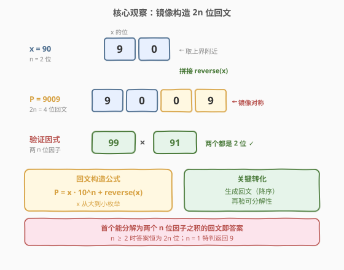
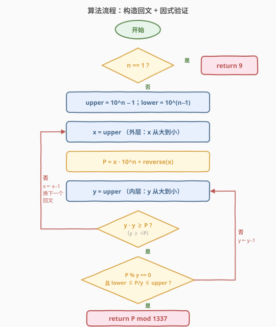
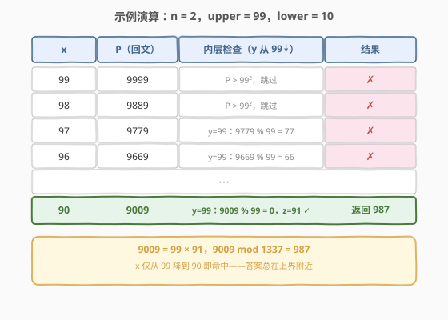

# 最大回文数乘积

- **题目名称**：最大回文数乘积
- **链接**：[479. 最大回文数乘积](https://leetcode.cn/problems/largest-palindrome-product/)
- **难度**：困难
- **标签**：数学、枚举

## 1. 题目概述

给定一个整数 `n`，返回可由**两个 `n` 位整数之积**写成的**最大回文整数**。由于答案可能很大，结果对 `1337` 取模后返回。

> 💡 **「n 位整数」的口径**：`n` 位整数指值域 $[10^{n-1},\ 10^{n}-1]$ 内的整数。例如 `n = 2` 时两个因子都取自 $\{10, 11, \ldots, 99\}$。注意 `n = 1` 时因子取自 $\{1, 2, \ldots, 9\}$（$10^{0}=1$ 为下界），单位数也算 1 位整数。

**示例 1**：

```text
输入：n = 2
输出：987
解释：最大的回文乘积是 9009 = 99 × 91，
      9009 mod 1337 = 987。
```

**示例 2**：

```text
输入：n = 1
输出：9
解释：1 位整数的乘积最大回文是 9 = 9 × 1（或 3 × 3），
      9 mod 1337 = 9。
```

**约束条件**：

- $1 \leq n \leq 8$

> ⚠️ **数据规模暗示**：$n$ 仅到 8，两个 8 位整数之积至多 $(10^8-1)^2 < 10^{16}$，可用 64 位整数（`long long`）承载，无需大数运算。但若朴素枚举所有数对 $\{a, b\}$，搜索空间达 $10^{2n}$，$n = 8$ 时 $10^{16}$ 完全不可行。必须换视角：**不再「枚举乘积检验回文」，而是「构造回文检验可分解性」**——把 $O(10^{2n})$ 的数对枚举降为 $O(10^n)$ 的回文枚举。

---

## 2. 解题思路

### 2.1 暴力思路：枚举数对 + 检验回文

最直接的做法是双重循环枚举所有 $n$ 位数对 $(a, b)$，计算 $a \times b$，判断其是否为回文，并维护最大值：

```python
upper = 10 ** n - 1
lower = 10 ** (n - 1)
best = 0
for a in range(upper, lower - 1, -1):
    for b in range(a, lower - 1, -1):   # b <= a 去序
        p = a * b
        s = str(p)
        if s == s[::-1] and p > best:
            best = p
return best % 1337
```

时间 $O(10^{2n} \cdot n)$（每个乘积转字符串判回文再 $O(n)$），空间 $O(n)$。$n = 8$ 时数对约 $\binom{9 \times 10^7}{2} \approx 4 \times 10^{15}$，**远超时间限制**。

> 💡 转机在于**逆向思维**：与其在 $10^{2n}$ 个乘积里找回文，不如在 $10^n$ 个回文候选里找能被分解的。回文是可以「按上半部分构造」的——这把搜索空间从「乘积域」搬到「回文域」，规模骤降一个 $10^n$ 因子。

### 2.2 核心观察：镜像构造回文 + 因式验证



两个关键观察：

**观察 1：答案回文的位数恒为 $2n$（$n \geq 2$）。** 两个 $n$ 位整数之积的最大值为 $(10^n-1)^2 < 10^{2n}$，且 $(10^n-1)^2 = 10^{2n} - 2 \cdot 10^n + 1$ 是 $2n$ 位数。任何 $2n-1$ 位回文都小于 $10^{2n-1} < (10^n-1)^2$，故只要存在 $2n$ 位回文乘积（确实存在，如 $n=2$ 的 $9009$），它就严格大于所有 $2n-1$ 位回文。因此只需考察 $2n$ 位回文。$n = 1$ 特判返回 $9$。

**观察 2：$2n$ 位回文可由 $n$ 位前缀镜像构造。** 任取 $n$ 位整数 $x$，把 $x$ 的十进制串与其反转串拼接，得到一个 $2n$ 位回文：

$$P = x \cdot 10^n + \text{reverse}(x)$$

例如 $n=2$、$x=90$：$P = 90 \cdot 100 + \text{reverse}(90) = 9000 + 09 = 9009$。枚举 $x$ 从 $10^n-1$ 递减到 $10^{n-1}$，即按 $P$ **从大到小**遍历所有 $2n$ 位回文——**第一个能分解为两个 $n$ 位因子之积的 $P$ 就是答案**。

> 💡 **关键转化**：把「枚举 $10^{2n}$ 个乘积检验回文」翻转为「枚举 $10^n$ 个回文检验可分解性」。回文降序生成保证首个合法者即最大，无需维护全局最大值。这是「**生成者视角优于检验者视角**」的典型——当目标集合（回文）比来源集合（数对乘积）稀疏且可枚举时，反过来遍历目标集合更高效。

**因式验证**：对每个候选 $P$，需判断是否存在 $n$ 位整数 $y,\ z$ 使 $y \cdot z = P$。不妨设 $y \geq z$，则 $y \geq \sqrt{P}$，故 $y \in [\lceil\sqrt{P}\rceil,\ 10^n-1]$。从 $y = 10^n-1$ 递减到 $\lceil\sqrt{P}\rceil$，对每个整除 $P$ 的 $y$，检查 $z = P / y$ 是否落在 $[10^{n-1},\ 10^n-1]$（即 $n$ 位）。由于 $y \geq \sqrt{P} \geq z$ 且 $y \leq 10^n-1$，自动有 $z \leq 10^n-1$，只需验 $z \geq 10^{n-1}$。

### 2.3 算法流程图



算法步骤：

1. **特判**：若 $n = 1$，直接返回 $9$。
2. **初始化**：`upper = 10^n − 1`，`lower = 10^(n−1)`。
3. **外层循环**：$x$ 从 `upper` 递减到 `lower`：
   - **构造回文**：$P = x \cdot 10^n + \text{reverse}(x)$。
   - **内层循环**：$y$ 从 `upper` 递减，条件 $y \cdot y \geq P$（即 $y \geq \sqrt{P}$）：
     - 若 $P \bmod y = 0$ 且 $\text{lower} \leq P/y \leq \text{upper}$，**返回** $P \bmod 1337$。
4. 理论上必在循环内命中（解的存在性由题面保证）。

> ⚠️ **内层终止条件的正确性**：循环条件 `y * y >= P` 等价于 $y \geq \sqrt{P}$。由于 $y \cdot z = P$ 且假设 $y \geq z$，必有 $y \geq \sqrt{P} \geq z$。一旦 $y < \sqrt{P}$，对应的 $z = P/y > \sqrt{P} > y$，与 $y \geq z$ 的假设矛盾——该因子对已被更早的 $y' = z > y$ 覆盖。故只需扫到 $\sqrt{P}$ 即可，不漏不重。

### 2.4 示例演算

以 $n = 2$（`upper = 99`，`lower = 10`）为例：



逐个 $x$ 构造回文 $P$ 并验证：

| $x$ | $P$（回文） | 内层检查（$y$ 从 99↓） | 结果 |
|-----|-------------|------------------------|------|
| 99  | 9999        | $P > 99^2 = 9801$，内层不执行 | ✗ |
| 98  | 9889        | $P > 99^2$，内层不执行 | ✗ |
| 97  | 9779        | $y=99$：$9779 \bmod 99 = 77 \neq 0$ | ✗ |
| 96  | 9669        | $y=99$：$9669 \bmod 99 = 66 \neq 0$ | ✗ |
| ⋯   | ⋯           | ⋯                       | ✗ |
| **90** | **9009** | $y=99$：$9009 \bmod 99 = 0$，$z = 91 \in [10, 99]$ ✓ | **返回 987** |

$x$ 仅从 99 降到 90 即命中。$9009 = 99 \times 91$，$9009 \bmod 1337 = 987$ ✓。

> 💡 **「答案在上界附近」的直觉**：两个 $n$ 位因子都接近 $10^n-1$ 时乘积最大，而最大回文乘积自然是「尽可能大的回文」，其前缀 $x$ 自然接近 $10^n-1$。因此外层循环实际迭代次数远小于 $10^n$（$n=8$ 时 $x$ 从 $99999999$ 只降到 $99990000$，约 $10^4$ 次），这是算法在实践中快速命中的根本原因。

---

## 3. 参考代码

### C++

```cpp
class Solution {
  public:
    int largestPalindrome(int n) {
        if (n == 1) return 9;
        long long upper = 1;
        for (int i = 0; i < n; ++i) upper *= 10;     // 10^n
        upper -= 1;                                   // 10^n - 1
        long long lower = upper / 10 + 1;             // 10^(n-1)
        for (long long x = upper; x >= lower; --x) {
            // 构造 2n 位回文 P = x * 10^n + reverse(x)
            long long P = x;
            for (long long t = x; t; t /= 10) {
                P = P * 10 + t % 10;
            }
            // 验证 P 能否分解为两个 n 位因子之积
            for (long long y = upper; y * y >= P; --y) {
                if (P % y == 0) {
                    long long z = P / y;
                    if (z >= lower && z <= upper) {
                        return P % 1337;
                    }
                }
            }
        }
        return -1;
    }
};
```

### Python

```python
class Solution:
    def largestPalindrome(self, n: int) -> int:
        if n == 1:
            return 9
        upper = 10 ** n - 1
        lower = 10 ** (n - 1)
        for x in range(upper, lower - 1, -1):
            # 构造 2n 位回文：拼接 x 与其反转串
            P = int(str(x) + str(x)[::-1])
            y = upper
            while y * y >= P:
                if P % y == 0:
                    z = P // y
                    if lower <= z <= upper:
                        return P % 1337
                y -= 1
        return -1
```

> ⚠️ **C++ 溢出注意**：`P` 最大约 $10^{16}$，`upper * 10^n` 的构造须用 `long long`（64 位），不可用 `int`。`y * y` 在 $y \leq 10^8-1$ 时 $\leq 10^{16}$，同样需要 `long long`。`lower = upper / 10 + 1` 是 $10^{n-1}$ 的整数推导，避免再调 `pow`。
>
> 💡 **Python 性能**：$n = 8$ 时内层最坏约 $5 \times 10^3$ 次、外层约 $10^4$ 个回文，总操作量在 $10^7$ 量级，Python 偏紧但可过（LeetCode 本题时限较宽）。若追求极致常数，可把 `int(str(x) + str(x)[::-1])` 换成纯算术构造 `P = x * p10 + rev`，其中 `rev` 用 `while t: rev = rev*10 + t%10; t //= 10` 预算，省去字符串往返。

---

## 4. 复杂度分析

| 维度 | 复杂度 | 说明 |
|------|--------|------|
| 时间复杂度 | $O(10^n \cdot (\text{命中前外层迭代数}) \cdot 10^n)$（最坏）；实际近 $O(10^n)$ | 外层 $x$ 遍历回文，每个内层 $y$ 扫到 $\sqrt{P}$。最坏 $O(10^{2n})$，但答案在上界附近，外层实际只跑 $\sim 10^{n-1}$ 次，内层首个整除即返回 |
| 空间复杂度 | $O(1)$ | 仅用 `upper`、`lower`、`P`、`y`、`z` 等常数个变量 |

> 💡 **最坏 vs 实际**：最坏复杂度仍是 $O(10^{2n})$（若答案恰在 $x = 10^{n-1}$），但本题数据保证答案紧贴上界。$n = 8$ 时 $x$ 仅从 $99999999$ 降到 $99990000$（$9999$ 次），每个回文内层首个整除 $y$ 多在 $10^8-1$ 附近即命中，整体约 $10^7 \sim 10^8$ 次操作，C++ 毫秒级、Python 秒级通过。本质上是「**利用答案分布偏上界**」的启发式剪枝，而非渐近意义上的改进。

---

## 5. 扩展：打表法与奇偶位回文讨论

### 5.1 打表法：$n \leq 8$ 的封闭解

由于 $n$ 的取值仅 $1 \sim 8$，且每个 $n$ 的答案是固定常数，可离线用上述构造算法预算全部 8 个答案，提交时直接查表：

```cpp
class Solution {
  public:
    int largestPalindrome(int n) {
        // ans[k] = (k+1) 位因子的最大回文乘积 mod 1337
        static const int ans[] = {9, 987, 123, 597, 677, 1218, 877, 475};
        return ans[n - 1];
    }
};
```

对应原始回文（验证用）：

| $n$ | 最大回文 $P$ | 因式分解 | $P \bmod 1337$ |
|-----|--------------|----------|-----------------|
| 1 | 9 | $9 \times 1$ | 9 |
| 2 | 9009 | $99 \times 91$ | 987 |
| 3 | 906609 | $993 \times 913$ | 123 |
| 4 | 99000099 | $9999 \times 9901$ | 597 |
| 5 | 9966006699 | $99979 \times 99681$ | 677 |
| 6 | 999000000999 | $999999 \times 999001$ | 1218 |
| 7 | 99956644665999 | $9997647 \times 9998017$ | 877 |
| 8 | 9999000000009999 | $99999999 \times 99990001$ | 475 |

> ⚠️ **打表的合法性**：本题 $n$ 上界小且固定，打表是 LeetCode 公认的合法解法（甚至是最快的 0ms 解）。但面试中应先讲清构造算法的思路与复杂度，再提「$n \leq 8$ 可打表」作为工程优化补充——展示算法理解在前、工程取巧在后。

### 5.2 为什么只看 $2n$ 位回文？

$n \geq 2$ 时，$(10^n-1)^2 = 10^{2n} - 2 \cdot 10^n + 1$ 是 $2n$ 位数（首位非零）。任何 $2n-1$ 位回文 $< 10^{2n-1}$。比较二者：

$$10^{2n-1} \quad \text{vs} \quad 10^{2n} - 2 \cdot 10^n + 1$$

$10^{2n} - 2 \cdot 10^n + 1 - 10^{2n-1} = 10^{2n-1}(10 - 1) - 2 \cdot 10^n + 1 = 9 \cdot 10^{2n-1} - 2 \cdot 10^n + 1$，对 $n \geq 2$ 恒正。故只要存在 $2n$ 位回文乘积，它就严格大于所有 $2n-1$ 位回文，无需考察奇数位回文。$n = 1$ 时 $2n-1 = 1$ 位回文 $9$ 已是最大（$2n = 2$ 位回文需 $\geq 10$，但 $1$ 位因子之积 $\leq 81 < 10$，无 2 位回文乘积），故特判返回 $9$。

### 5.3 进阶：若 $n$ 上界放宽

若把 $n$ 放宽到例如 $n \leq 18$，$P$ 可达 $10^{36}$，超出 64 位整数，需用大数运算（Python 原生支持，C++ 需手写或用 `__int128` 部分覆盖）。更优做法是利用回文结构 $P = x \cdot 10^n + \text{rev}(x)$ 代入 $P = y \cdot z$，结合 $y, z$ 接近 $10^n$ 的先验设 $y = 10^n - a$、$z = 10^n - b$，展开后用丢番图逼近求解——这是 Project Euler 第 4 题与第 479 题的高阶延伸，超出本题范围。

---

## 6. 面试要点

1. **为什么把「枚举乘积」翻转为「构造回文」？复杂度差在哪？**

   - 两个 $n$ 位整数数对共 $\sim 10^{2n}$ 个，朴素枚举乘积再判回文是 $O(10^{2n})$，$n = 8$ 不可行。翻转后只枚举 $10^n$ 个 $2n$ 位回文（由 $n$ 位前缀镜像生成），每个再花 $O(10^n)$ 验证可分解性——最坏仍是 $O(10^{2n})$，但回文降序生成保证**首个合法者即答案**，而答案分布在上界附近，外层实际只跑 $\sim 10^{n-1}$ 次，整体近似 $O(10^n)$。本质是把「稀疏目标集合（回文）」当作枚举主轴，利用其可构造性与降序性提前终止。

2. **为什么 $n \geq 2$ 只需考察 $2n$ 位回文？**

   - $(10^n-1)^2$ 是 $2n$ 位数，是乘积上界。任何 $2n-1$ 位回文 $< 10^{2n-1} < (10^n-1)^2$（差值 $9 \cdot 10^{2n-1} - 2 \cdot 10^n + 1 > 0$）。只要存在 $2n$ 位回文乘积（如 $n=2$ 的 $9009$），它就严格大于所有 $2n-1$ 位回文，故奇数位回文无需考察。$n=1$ 特判：$1$ 位因子之积 $\leq 81$，无 2 位回文乘积，最大回文是单位数 $9$。

3. **内层循环为什么扫到 $\sqrt{P}$ 就够？**

   - 设 $P = y \cdot z$ 且 $y \geq z$（WLOG），则 $y \geq \sqrt{P} \geq z$。从 $y = 10^n-1$ 递减到 $\sqrt{P}$ 已覆盖所有 $y \geq z$ 的因子对。一旦 $y < \sqrt{P}$，对应 $z = P/y > \sqrt{P} > y$，该对已在更早的 $y' = z$ 处被检查过，故不漏不重。循环条件 `y * y >= P` 即此界。

4. **答案为什么总在上界附近？**

   - 最大回文乘积要尽可能大，故两个因子都接近 $10^n-1$，乘积接近 $(10^n-1)^2$。能写成回文的形式又要求乘积的「前半部分」与「后半部分」镜像，这天然发生在乘积高位几乎全 9 的情形。因此 $x$（回文前缀）只比 $10^n-1$ 小一点，外层迭代极少（$n=8$ 时仅 $\sim 10^4$ 次）即命中。这是算法在 $O(10^{2n})$ 最坏界下仍能快速 AC 的根本原因。

5. **打表法是否算「作弊」？何时可用？**

   - 本题 $n \leq 8$ 固定，答案为 8 个常数，打表是 LeetCode 公认的合法 0ms 解。但面试中应先完整讲清构造算法（观察、回文构造、因式验证、复杂度），再以「$n$ 上界小且固定，可离线打表」作为工程优化补充。展示的是「先懂原理再谈取巧」的层次感，而非跳过算法直接背答案。

---

## 7. 同类练习题

- [9. 回文数](https://leetcode.cn/problems/palindrome-number/)（[题解](../0001-0100/9_回文数.md)）：回文判定的母题，反转一半数字的技巧，本题「镜像构造回文」的思想源头
- [5. 最长回文子串](https://leetcode.cn/problems/longest-palindromic-substring/)（[题解](../0001-0100/5_最长回文子串.md)）：回文构造的另一形态——中心扩展生成回文，与本题「前缀镜像生成」对照
- [409. 最长回文串](https://leetcode.cn/problems/longest-palindrome/)（[题解](../0401-0500/409_最长回文串.md)）：用字符频率拼回文，回文构造的计数视角，承接「回文可由半边决定」的对称性
- [476. 数字的补数](https://leetcode.cn/problems/number-complement/)（[题解](../0401-0500/476_数字的补数.md)）：位运算构造（掩码 + 异或），与本题「按位/按位段构造目标数」同属「构造优于枚举」范式
- [50. Pow(x, n)](https://leetcode.cn/problems/powx-n/)：快速幂的构造思想，与本题「利用结构构造而非暴力枚举」的工程取向一致
