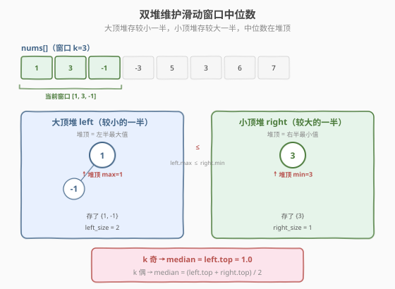
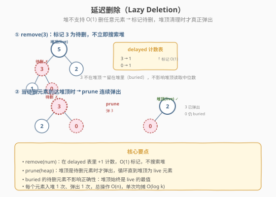
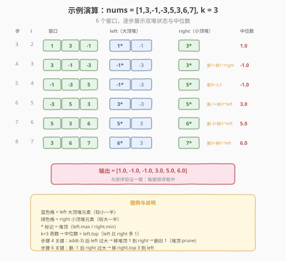

# LeetCode 滑动窗口中位数 题解

## 1. 题目概述

- **标题 / 题号**：滑动窗口中位数（#480，hard）
- **链接**：https://leetcode.cn/problems/sliding-window-median/
- **难度**：困难
- **标签**：数组、堆、优先队列、滑动窗口、延迟删除

**题意**：给定一个数组 `nums` 和一个整数 `k`，有一个大小为 `k` 的窗口从数组最左侧滑动到最右侧，每次滑动一位。返回每个窗口中的中位数组成的数组。

- **中位数定义**：窗口内 `k` 个元素排序后，若 `k` 为奇数取中间值，若 `k` 为偶数取中间两个值的平均数。

**示例 1**：

```text
输入：nums = [1,3,-1,-3,5,3,6,7], k = 3

窗口位置                  中位数
─────────────────────    ──────
[1  3  -1] -3  5  3  6  7   → 1.0
 1 [3  -1  -3] 5  3  6  7   → -1.0
 1  3 [-1  -3  5] 3  6  7   → -1.0
 1  3  -1 [-3  5  3] 6  7   → 3.0
 1  3  -1  -3 [5  3  6] 7   → 5.0
 1  3  -1  -3  5 [3  6  7]  → 6.0

输出：[1.00000,-1.00000,-1.00000,3.00000,5.00000,6.00000]
```

**示例 2**：

```text
输入：nums = [1,2,3,4,2,3,1,4,2], k = 3
输出：[2.00000,3.00000,3.00000,3.00000,2.00000,3.00000,2.00000]
```

**约束**：

- `1 <= nums.length <= 10^5`
- `-2^31 <= nums[i] <= 2^31 - 1`
- `1 <= k <= nums.length`

> 💡 本题是 [Day 23 数据流的中位数（295）](../0201-0300/295_数据流的中位数.md) 的滑动窗口升级版——295 只需 `addNum`（只增不删），用双堆即可；480 多了「窗口滑出需删除旧元素」这一维度，而堆**不支持 `O(log k)` 删除任意元素**，必须引入「延迟删除」技巧。与 [Day 20 滑动窗口最大值（239）](../0201-0300/239_滑动窗口最大值.md) 对比：239 求最大值可用单调队列 `O(n)`；中位数不是单一极值，无法用单调队列，只能用双堆 `O(n log k)`。

## 2. 解题思路

### 2.1 暴力思路：每个窗口排序取中位数

对每个窗口 `[i, i+k-1]`，复制 `k` 个元素排序，取中位数。

```text
for i in 0..n-k:
    window = sorted(nums[i : i+k])   // O(k log k) per window
    answer[i] = median(window)
```

时间复杂度 `O(n k log k)`，`n=10^5, k=50000` 时约 `5×10^4 × 5×10^4 × 17 ≈ 4×10^10`，**严重超时**。

> ⚠️ 暴力法的问题与 [239 滑动窗口最大值](../0201-0300/239_滑动窗口最大值.md) 如出一辙：相邻窗口有 `k-1` 个元素重叠，暴力完全没复用。但 239 可以用单调队列 `O(n)` 解决（只关心最大值），中位数需要知道「排序后中间位置」，无法用单调队列——必须维护一个**有序的动态集合**。

### 2.2 核心观察：双堆 + 延迟删除

回顾 [295 数据流的中位数](../0201-0300/295_数据流的中位数.md) 的双堆方案：

- **大顶堆 `left`**：存较小的一半，堆顶是其中的最大值
- **小顶堆 `right`**：存较大的一半，堆顶是其中的最小值
- **不变式**：`left.max ≤ right.min`，且 `left_size == right_size`（`k` 偶）或 `left_size == right_size + 1`（`k` 奇）
- **中位数**：`k` 奇 → `left.top`；`k` 偶 → `(left.top + right.top) / 2`



295 只需 `addNum`，双堆自然平衡。480 多了**窗口滑出时删除旧元素**的操作——而 `priority_queue` / `heapq` **不支持 `O(log k)` 删除堆中任意位置的元素**（只能删堆顶）。解决方案：**延迟删除（Lazy Deletion）**。

> 💡 **延迟删除的核心思想**：不真正从堆中搜索并删除元素，而是在一个 `delayed` 哈希表中标记「这个值待删计数 +1」，同时更新有效大小计数器。当待删元素**自然到达堆顶**时（被 `prune` 函数发现），才真正弹出。buried（埋在堆中间）的待删元素不影响正确性——堆顶始终是 live 元素的最值。

### 2.3 延迟删除与平衡操作



**四个核心操作**：

| 操作 | 说明 | 复杂度 |
|------|------|--------|
| `add(num)` | 按 `num ≤ left.top` 决定入哪堆，再 `_balance()` | `O(log k)` |
| `remove(num)` | 在 `delayed` 表标记 +1，对应 `_size` 减 1，若在堆顶则 `_prune`，再 `_balance()` | `O(log k)` 均摊 |
| `_prune(heap)` | 循环弹出堆顶的待删元素，直到堆顶为 live 元素 | `O(log k)` 均摊 |
| `_balance()` | 若 `left_size > right_size + 1`：移 `left.top → right`；若 `right_size > left_size`：移 `right.top → left`，移动后 `_prune` 源堆 | `O(log k)` |

**判断元素属于哪堆**：比较 `num` 与 `left.top`（大顶堆堆顶 = 左半最大值）。若 `num ≤ left.top`，元素在 `left`；否则在 `right`。

> ⚠️ **为什么 `_balance` 后要 `_prune` 源堆？** 从 `left` 弹堆顶移到 `right` 后，`left` 的新堆顶可能是待删元素（之前 buried，旧堆顶移走后露出来）。此时必须 `_prune(left)` 清理，保证堆顶始终是 live 元素——否则后续 `add` / `remove` 判断「元素属于哪堆」时会用到过期的 `left.top`。

### 2.4 算法流程

**完整步骤**：

1. **初始化**：空双堆 `DualHeap(k)`，`delayed` 哈希表，`left_size = right_size = 0`
2. **遍历** `i` **从 0 到 n-1**：
   - **加入新元素**：`dh.add(nums[i])`
   - **删除旧元素**：`if i ≥ k`：`dh.remove(nums[i - k])`（窗口滑出最左端）
   - **收集中位数**：`if i ≥ k - 1`（窗口已满）：`result.append(dh.median())`
3. 返回 `result`

**`add(num)` 内部**：
1. 若 `left` 为空或 `num ≤ left.top`：入 `left`，`left_size++`；否则入 `right`，`right_size++`
2. `_balance()`

**`remove(num)` 内部**：
1. 若 `num ≤ left.top`：`delayed[num]++`，`left_size--`，若 `num == left.top` 则 `_prune_left()`
2. 否则：`delayed[num]++`，`right_size--`，若 `num == right.top` 则 `_prune_right()`
3. `_balance()`

> 💡 **顺序**：先 `add`（加入右端新元素），再 `remove`（删除左端旧元素）。当 `i = k-1`（首个完整窗口）时 `i < k` 不触发 `remove`，此时堆中恰好 `k` 个元素。此后每步先加后删，堆中始终维持 `k` 个有效元素。

### 2.5 示例演算

以 `nums = [1,3,-1,-3,5,3,6,7], k = 3` 为例（与 239 同输入，便于对比）：



| 步骤 | i | nums[i] | 窗口 | left（大顶堆） | right（小顶堆） | 动作 | 中位数 |
|------|---|---------|------|---------------|-----------------|------|--------|
| 1 | 0 | 1 | [1] | {1} | {} | 入 left | — |
| 2 | 1 | 3 | [1,3] | {1} | {3} | 3>1 入 right | — |
| 3 | 2 | -1 | [1,3,-1] | {1*, -1} | {3*} | -1≤1 入 left | 1.0 |
| 4 | 3 | -3 | [3,-1,-3] | {-1*, -3} | {3*} | 入 left→left过大→移1→right→删1(prune) | -1.0 |
| 5 | 4 | 5 | [-1,-3,5] | {-1*, -3} | {5*} | 5>-1 入 right→删3(prune) | -1.0 |
| 6 | 5 | 3 | [-3,5,3] | {3*, -3} | {5*} | 3>-1 入 right→删-1(prune)→right过大→移3→left | 3.0 |
| 7 | 6 | 6 | [5,3,6] | {5*, 3} | {6*} | 6>3 入 right→删-3(标记)→right过大→移5→left | 5.0 |
| 8 | 7 | 7 | [3,6,7] | {6*, 3} | {7*} | 7>5 入 right→删5(prune)→right过大→移6→left | 6.0 |

> `*` 标记堆顶。步骤 4 是关键：`add(-3)` 后 `left` 有 3 个元素（`{1, -1, -3}`），`left_size(3) > right_size(1)+1`，触发 `_balance`：移 `left.top=1` 到 `right`，然后 `_prune(left)`。随后 `remove(nums[0]=1)`：`1 > left.top=-1`，判定 1 在 `right`，标记 `delayed[1]++`，`right_size--`，且 `1 == right.top=1`，触发 `_prune_right` 弹出 1。

> 💡 步骤 7 中 `remove(-3)`：`-3 ≤ left.top=3`，判定在 `left`，标记 `delayed[-3]++`，但 `-3 ≠ 3`（不在堆顶），所以**不触发 prune**——`-3` 作为 buried 的待删元素留在堆中，不影响堆顶读取。后续 `_balance` 移 `right.top=5` 到 `left` 时，`-3` 仍 buried，堆顶是 5（live），正确。

## 3. 参考代码

### C++

```cpp
// 滑动窗口中位数.cpp —— 双堆 + 延迟删除
// 编译: g++ -O2 -std=c++17 滑动窗口中位数.cpp -o swmedian
#include <vector>
#include <queue>
#include <unordered_map>
using namespace std;

class Solution {
    priority_queue<int> left;                             // 大顶堆，较小的一半
    priority_queue<int, vector<int>, greater<int>> right; // 小顶堆，较大的一半
    unordered_map<int, int> delayed;                      // 待删除计数
    int left_size = 0, right_size = 0;
    int k = 0;

    void prune_left() {
        while (!left.empty()) {
            int val = left.top();
            auto it = delayed.find(val);
            if (it != delayed.end() && it->second > 0) {
                left.pop();
                if (--it->second == 0) delayed.erase(it);
            } else {
                break;
            }
        }
    }

    void prune_right() {
        while (!right.empty()) {
            int val = right.top();
            auto it = delayed.find(val);
            if (it != delayed.end() && it->second > 0) {
                right.pop();
                if (--it->second == 0) delayed.erase(it);
            } else {
                break;
            }
        }
    }

    void make_balance() {
        if (left_size > right_size + 1) {
            right.push(left.top());
            left.pop();
            left_size--;
            right_size++;
            prune_left();
        } else if (right_size > left_size) {
            left.push(right.top());
            right.pop();
            right_size--;
            left_size++;
            prune_right();
        }
    }

    void add_num(int num) {
        if (left.empty() || num <= left.top()) {
            left.push(num);
            left_size++;
        } else {
            right.push(num);
            right_size++;
        }
        make_balance();
    }

    void remove_num(int num) {
        if (!left.empty() && num <= left.top()) {
            delayed[num]++;
            left_size--;
            if (num == left.top()) prune_left();
        } else {
            delayed[num]++;
            right_size--;
            if (!right.empty() && num == right.top()) prune_right();
        }
        make_balance();
    }

    double get_median() {
        if (k % 2 == 1) return (double)left.top();
        return ((double)left.top() + (double)right.top()) / 2.0;
    }

  public:
    vector<double> medianSlidingWindow(vector<int>& nums, int k) {
        this->k = k;
        vector<double> result;
        for (int i = 0; i < (int)nums.size(); ++i) {
            add_num(nums[i]);
            if (i >= k) remove_num(nums[i - k]);
            if (i >= k - 1) result.push_back(get_median());
        }
        return result;
    }
};
```

### Python

```python
import heapq
from collections import defaultdict


class DualHeap:
    """双堆 + 延迟删除，维护滑动窗口的中位数。"""

    def __init__(self, k: int):
        self.k = k
        self.left = []   # 大顶堆（存负数模拟），较小的一半
        self.right = []  # 小顶堆，较大的一半
        self.delayed = defaultdict(int)  # 待删除元素的计数
        self.left_size = 0    # left 的有效元素数
        self.right_size = 0   # right 的有效元素数

    def _prune_left(self):
        """清理 left 堆顶的延迟删除元素。"""
        while self.left and self.delayed.get(-self.left[0], 0) > 0:
            val = -heapq.heappop(self.left)
            self.delayed[val] -= 1
            if self.delayed[val] == 0:
                del self.delayed[val]

    def _prune_right(self):
        """清理 right 堆顶的延迟删除元素。"""
        while self.right and self.delayed.get(self.right[0], 0) > 0:
            val = heapq.heappop(self.right)
            self.delayed[val] -= 1
            if self.delayed[val] == 0:
                del self.delayed[val]

    def _balance(self):
        """平衡两堆大小：left_size == right_size 或 left_size == right_size + 1。"""
        if self.left_size > self.right_size + 1:
            val = -heapq.heappop(self.left)
            heapq.heappush(self.right, val)
            self.left_size -= 1
            self.right_size += 1
            self._prune_left()
        elif self.right_size > self.left_size:
            val = heapq.heappop(self.right)
            heapq.heappush(self.left, -val)
            self.right_size -= 1
            self.left_size += 1
            self._prune_right()

    def add(self, num: int) -> None:
        if not self.left or num <= -self.left[0]:
            heapq.heappush(self.left, -num)
            self.left_size += 1
        else:
            heapq.heappush(self.right, num)
            self.right_size += 1
        self._balance()

    def remove(self, num: int) -> None:
        if self.left and num <= -self.left[0]:
            self.delayed[num] += 1
            self.left_size -= 1
            if num == -self.left[0]:
                self._prune_left()
        else:
            self.delayed[num] += 1
            self.right_size -= 1
            if self.right and num == self.right[0]:
                self._prune_right()
        self._balance()

    def median(self) -> float:
        if self.k % 2 == 1:
            return float(-self.left[0])
        return (-self.left[0] + self.right[0]) / 2.0


class Solution:
    def medianSlidingWindow(self, nums: list[int], k: int) -> list[float]:
        dh = DualHeap(k)
        result = []
        for i, num in enumerate(nums):
            dh.add(num)
            if i >= k:
                dh.remove(nums[i - k])
            if i >= k - 1:
                result.append(dh.median())
        return result
```

> 💡 **Python 大顶堆模拟**：`heapq` 只有小顶堆，`left` 存 `-num`（负数），`-left[0]` 即左半最大值。**C++ 溢出注意**：`nums[i]` 范围 `[-2^31, 2^31-1]`，`left.top() + right.top()` 可能溢出 `int`，必须先转 `double` 再相加：`((double)left.top() + (double)right.top()) / 2.0`。

> ⚠️ **`prune` 中用 `.get()` 而非 `[]`**：Python `defaultdict` 的 `[]` 会插入默认值 0，导致 `delayed` 表堆积无用的 0 条目。用 `.get(key, 0)` 只读不插，保持表干净。C++ 用 `find()` 而非 `operator[]` 同理。

## 4. 复杂度分析

| 维度 | 复杂度 | 说明 |
|------|--------|------|
| **时间复杂度** | `O(n log k)` 均摊 | 每个元素入堆 1 次 + 弹出 1 次（prune 或 balance 移出），总操作 `O(n)`；单次堆操作 `O(log k)` |
| **空间复杂度** | `O(k)` | 两个堆的有效元素共 `k` 个；`delayed` 表大小 ≤ 堆中待删元素数 |

> ⚠️ **均摊分析**：虽然 `prune` 内有 `while` 循环，但每个元素一生只被 prune 弹出 1 次，所以 `n` 轮遍历中 prune 的总弹出次数 ≤ `n`。`_balance` 同理——每次移动一个元素到对面堆，该元素不会再被移回（除非被 remove 标记后重新平衡）。总堆操作 `O(n)`，乘以单次 `O(log k)`，得 `O(n log k)`。

> 💡 **堆的实际大小**：由于延迟删除，堆数组中可能残留 buried 的待删元素，实际大小略大于 `k`。但堆顶始终是 live 元素（`prune` 保证），不影响正确性。最坏情况下堆可能积累 `O(n)` 个元素（如单调递减输入 + `k=1`），此时退化为 `O(n log n)`；但 LeetCode 测试数据下均摊 `O(n log k)` 成立。

## 5. 扩展：C++ multiset 与 Python SortedList

### 5.1 C++ `multiset` 方案（真 `O(n log k)`）

C++ 的 `multiset` 支持 `O(log k)` 删除任意元素，无需延迟删除。用两个迭代器指向中位数位置：

```cpp
vector<double> medianSlidingWindow(vector<int>& nums, int k) {
    multiset<int> window(nums.begin(), nums.begin() + k);
    auto mid = next(window.begin(), k / 2);  // 中位数迭代器

    vector<double> result;
    double median = (k & 1) ? *mid : ((double)*mid + (double)*prev(mid)) / 2.0;
    result.push_back(median);

    for (int i = k; i < (int)nums.size(); ++i) {
        window.insert(nums[i]);
        if (nums[i] < *mid) mid--;           // 新元素在左半，mid 左移
        if (nums[i - k] <= *mid) mid++;      // 删旧元素在左半，mid 右移
        window.erase(window.lower_bound(nums[i - k]));  // 删除一个实例
        median = (k & 1) ? *mid : ((double)*mid + (double)*prev(mid)) / 2.0;
        result.push_back(median);
    }
    return result;
}
```

> 💡 `multiset` 的 `erase(val)` 会删掉**所有**等于 `val` 的元素，必须用 `lower_bound` 先定位再 `erase(iterator)` 只删一个。迭代器 `mid` 的维护是难点——插入和删除都会影响中位数位置，需按方向调整。

### 5.2 Python `SortedList` 方案

`sortedcontainers` 库（非标准库，LeetCode 可用）提供 `O(log k)` 插入删除的有序列表：

```python
from sortedcontainers import SortedList

class Solution:
    def medianSlidingWindow(self, nums: list[int], k: int) -> list[float]:
        window = SortedList(nums[:k])
        result = []
        mid = k // 2
        result.append(
            window[mid] if k & 1 else (window[mid - 1] + window[mid]) / 2.0
        )
        for i in range(k, len(nums)):
            window.add(nums[i])
            window.remove(nums[i - k])
            result.append(
                window[mid] if k & 1 else (window[mid - 1] + window[mid]) / 2.0
            )
        return result
```

### 5.3 三种方案对比

| 方案 | 时间 | 空间 | 优点 | 缺点 |
|------|------|------|------|------|
| **双堆 + 延迟删除** | `O(n log k)` 均摊 | `O(k)` | 标准库即可，面试通用 | 实现复杂，buried 元素占额外空间 |
| **C++ multiset** | `O(n log k)` 严格 | `O(k)` | 无延迟删除，代码简洁 | C++ 专属，迭代器维护易错 |
| **Python SortedList** | `O(n log k)` | `O(k)` | 代码最简 | 依赖第三方库 |

## 6. 面试要点

1. **为什么不能像 239（滑动窗口最大值）那样用单调队列？**

   - 单调队列只维护**单一极值**（最大或最小），队头即答案。
   - 中位数是**排序后中间位置**的值，不是极值——需要维护整个有序序列的两半，单调队列无法做到。
   - 239 用单调队列 `O(n)`；480 用双堆 `O(n log k)`，这是「极值查询」与「分位查询」的本质区别。

2. **为什么需要延迟删除？直接从堆中删不行吗？**

   - `priority_queue` / `heapq` 只支持 `O(1)` 查堆顶和 `O(log k)` 删堆顶，**不支持 `O(log k)` 删任意位置元素**。
   - 要删堆中间的元素，只能线性搜索 `O(k)` 再重建堆 `O(k)`，总 `O(nk)`，退化为暴力。
   - 延迟删除把「搜索 + 删除」拆成「`O(1)` 标记」+「堆顶自然清理 `O(log k)` 均摊」，利用堆顶 prune 的惰性避免搜索。

3. **`remove` 时怎么判断元素在 left 还是 right？**

   - 比较 `num` 与 `left.top`（大顶堆堆顶 = 左半最大值）。
   - `num ≤ left.top` → 在 `left`；`num > left.top` → 在 `right`。
   - 前提：`left.top` 是 live 元素（非待删）。`_balance` 结束后 `_prune` 保证了这一点，所以每次 `remove` 开始时堆顶必定有效。

4. **`_balance` 之后为什么要 `_prune` 源堆？**

   - 从 `left` 弹堆顶移到 `right` 后，`left` 的新堆顶可能是之前 buried 的待删元素。
   - 若不 prune，下次 `add` / `remove` 用 `left.top` 判断「元素属于哪堆」时会用到过期值，导致元素入错堆。
   - prune 保证不变式：**两堆的堆顶始终是 live 元素**。

5. **时间复杂度为什么是 `O(n log k)` 而不是 `O(n²)`？**

   - 均摊分析：每个元素一生入堆 1 次、弹出 1 次（被 prune 或被 balance 移走）。
   - `n` 轮遍历中，所有 `while` 循环的总弹出次数 ≤ `n`（不是每轮弹 `n` 次）。
   - 单次堆操作 `O(log k)`（堆的有效大小 ≤ `k`），总 `O(n log k)`。
   - 与 [239 单调队列](../0201-0300/239_滑动窗口最大值.md) 的均摊分析同构——所有「用惰性结构避免重复比较」的方法都有这个性质。

> 💡 **一句话总结**：滑动窗口中位数是双堆求中位数（295）的滑动窗口升级版——核心难点在于堆不支持 `O(log k)` 删任意元素，必须用「延迟删除」：`O(1)` 标记 + 堆顶惰性清理。与 239 单调队列对比：极值查询用单调队列 `O(n)`，分位查询用双堆 `O(n log k)`——这是「滑动窗口最值」问题的两条技术路线。

## 同类练习题

| # | 题目 | 与本题的关联 |
|---|------|-------------|
| 295 | [数据流的中位数](https://leetcode.cn/problems/find-median-from-data-stream/)（题解） | 双堆基础题，只增不删，480 的前置 |
| 239 | [滑动窗口最大值](https://leetcode.cn/problems/sliding-window-maximum/)（题解） | 单调队列求极值，对比双堆求分位 |
| 703 | [数据流中的第 K 大元素](https://leetcode.cn/problems/kth-largest-element-in-a-stream/) | 小顶堆维护 Top-K，双堆的简化版 |
| 1825 | [求出 MK 平均值](https://leetcode.cn/problems/finding-mk-average/) | 双堆 + 延迟删除的进阶，去掉首尾后求均值 |
| 1438 | [绝对差不超过限制的最长连续子数组](https://leetcode.cn/problems/longest-continuous-subarray-with-absolute-diff-less-than-or-equal-to-limit/) | 双单调队列 / 有序集合维护窗口最值 |
