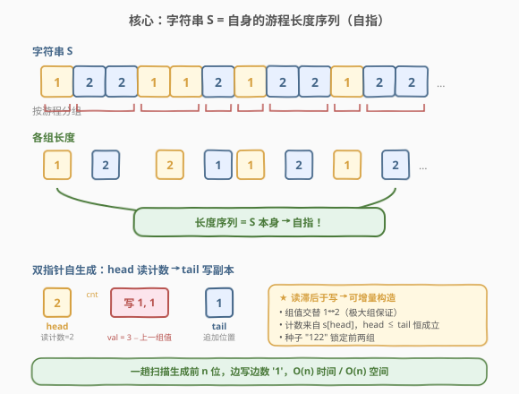
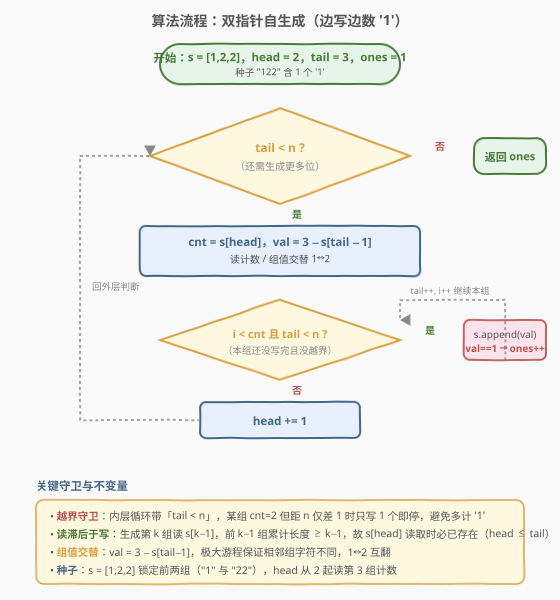
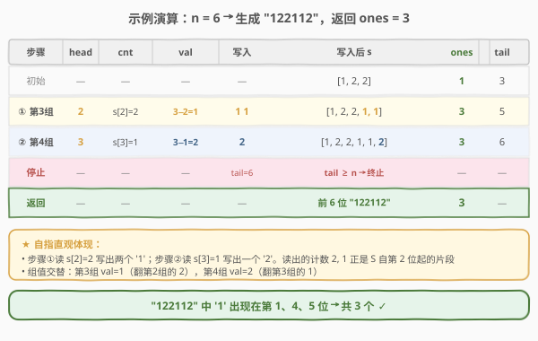

# LeetCode 神奇字符串 题解

## 1. 题目概述

- **标题 / 题号**：神奇字符串（#481，medium）
- **链接**：https://leetcode.cn/problems/magical-string/
- **难度**：中等
- **标签**：双指针、模拟、构造

**题意**：有一个仅由 `'1'` 和 `'2'` 组成的无限长字符串 $S$，它具有**自指**性质：把 $S$ 按「连续相同字符」分组（即游程编码），把每组的长度按顺序拼接起来，得到的序列**恰好等于 $S$ 本身**。

$S$ 的前几项为：

$$S = 1\ 2\ 2\ 1\ 1\ 2\ 1\ 2\ 2\ 1\ 2\ 2\ \cdots$$

按连续相同字符分组：

$$\underbrace{1}_{1}\ \underbrace{22}_{2}\ \underbrace{11}_{2}\ \underbrace{2}_{1}\ \underbrace{1}_{1}\ \underbrace{22}_{2}\ \underbrace{1}_{1}\ \underbrace{22}_{2}\ \underbrace{11}_{2}\ \underbrace{2}_{1}\ \underbrace{11}_{2}\ \underbrace{22}_{2}\ \cdots$$

每组下标注明的是**该组的长度**，把这些长度拼起来：

$$1,\ 2,\ 2,\ 1,\ 1,\ 2,\ 1,\ 2,\ 2,\ 1,\ 2,\ 2,\ \cdots$$

可以看到，这个长度序列正是 $S$ 自身——这就是「神奇」之处。

> 💡 **自指的来源**：$S$ 既是「字符序列」又是「自身游程长度序列」。这与 [38. 外观数列](../0001-0100/38_外观数列.md)的「look-and-say」不同：外观数列是「描述上一项」逐项生长，而 $S$ 是**单一无限串**，其游程长度序列与自身逐位相同。

**任务**：给定整数 $n$，返回 $S$ 前 $n$ 个字符中 `'1'` 的个数。

**示例 1**：

```text
输入：n = 6
输出：3
解释：S 的前 6 个字符为 "122112"，其中包含 3 个 '1'，返回 3。
```

**示例 2**：

```text
输入：n = 1
输出：1
解释：S 的前 1 个字符为 "1"，其中包含 1 个 '1'。
```

**约束**：

- $1 \le n \le 10^5$

> ⚠️ **规模暗示**：$n$ 可达 $10^5$，朴素地「反复对整个串做游程编码再拼接」会因每次重建 $O(n^2)$ 而超时。突破口是利用自指性**边读边写**：读指针扫描已生成部分获取「下一组该写几个」，写指针追加副本——单趟 $O(n)$ 即可生成前 $n$ 位。

## 2. 解题思路

### 2.1 暴力思路：反复游程编码扩展

最直观但低效的尝试是「**反复重建**」：从某个种子出发，每轮对当前串做一遍游程编码得到长度序列，再据此拼出更长的串。但这里存在两个坑：

1. **方向错了**：$S$ 的游程长度序列等于 $S$ 自身，并非「上一项的游程编码 = 下一项」（那是外观数列）。对 $S$ 的前缀做游程编码得到的长度序列，恰好就是 $S$ 的对应前缀——所以「重建」并不产生新信息，反而陷入**鸡生蛋困境**：要写第 $k$ 组就得知道 $S[k]$，而 $S[k]$ 还没生成。
2. **重复扫描**：即便强行逐轮扩展，每轮都要对已生成部分重新分组，累计 $O(n^2)$。

> 💡 转机在于一个关键事实：**读指针永远落后于写指针**。生成第 $k$ 组时需要读取 $S[k]$ 作为该组长度，而此时 $S[0..k-1]$ 早已写好（因为前 $k-1$ 组累计写出的字符数 $\ge k$）。于是只需一趟扫描：读 $S[\text{head}]$ → 写若干个字符到尾部 → 推进 head。这正是「自指」得以增量构造的根本原因。

### 2.2 核心观察：双指针自生成（head 读计数 / tail 写副本）



把自指结构拆成三个事实，算法便自然浮现：

1. **种子确定**：$S$ 的前 3 位唯一确定为 `"122"`（第 1 组 `"1"`、第 2 组 `"22"`）。后续所有位都可由自指规则推出，故以 $s=[1,2,2]$ 为种子。
2. **组值交替**：相邻组字符必然不同（否则会合并成一组），故组值在 `1`、`2` 间严格交替。下一组的值 = 上一组值的取反，即 $\text{val} = 3 - s[\text{tail}-1]$（`1↔2` 互翻）。
3. **计数来自自身**：第 $k$ 组（$k \ge 3$）要写几个字符，由 $S[k-1]$ 决定——也就是当前串里 `head` 指向的那个数。读完即推进 `head`。

于是用**双指针**：

- **`head`（读指针）**：指向「下一组该写几个」的计数位置，初始为 `2`（第 3 组的计数存放在 $s[2]=2$）。
- **`tail`（写指针）**：指向下一个待写位置，初始为 `3`（种子已占 3 位）。
- 每轮：`cnt = s[head]`，`val = 3 - s[tail-1]`，向尾部追加 `cnt` 个 `val`，并数其中 `'1'` 的个数；随后 `head += 1`。当 `tail` 达到 $n$ 时停止。

> 💡 **为什么 head 一定追得上需求且不越界**：生成第 $k$ 组需读 $s[k-1]$，而此时串长 $\ge$ 前 $k-1$ 组的总字符数。由于每组的计数 $\ge 1$，前 $k-1$ 组累计写出 $\ge k-1$ 个字符，加上种子实际更多，故 $s[k-1]$ 在读取时**已存在**。这是自指能增量生成的数学保证——读指针天然滞后于写指针。

### 2.3 算法流程图



```
初始化：s = [1, 2, 2]，head = 2，tail = 3，ones = 1   // 种子含一个 '1'
while tail < n：
    cnt = s[head]                  // 下一组要写几个
    val = 3 - s[tail - 1]          // 组值交替：1↔2 取反
    for i in 0..cnt-1 且 tail < n： // 严格控制在 n 以内
        s.append(val)
        if val == 1：ones += 1
        tail += 1
    head += 1                      // 读完一个计数，推进
返回 ones
```

> ⚠️ **越界保护**：内层循环必须带 `tail < n` 守卫——某组计数为 2 而 `tail` 距 $n$ 仅差 1 时，只能再写 1 个就停止，多写的会超出前 $n$ 位导致 `ones` 多计。守卫确保只统计严格落在前 $n$ 位中的 `'1'`。

### 2.4 示例演算

以 $n = 6$ 为例（种子 $s=[1,2,2]$，`ones=1`，`head=2`，`tail=3`）：



| 步骤 | head | cnt = s[head] | val = 3−s[tail−1] | 写入 | 写入后 $s$ | ones | tail |
|------|------|---------------|-------------------|------|------------|------|------|
| 初始 | — | — | — | — | `[1,2,2]` | 1 | 3 |
| ① 第3组 | 2 | s[2]=2 | 3−s[2]=3−2=**1** | `1 1` | `[1,2,2,1,1]` | 3 | 5 |
| ② 第4组 | 3 | s[3]=1 | 3−s[4]=3−1=**2** | `2` | `[1,2,2,1,1,2]` | 3 | 6 |
| 停止 | | | | tail=6 ≥ n=6 | | | |

返回 `ones = 3`。$S$ 前 6 位 `"122112"` 含 3 个 `'1'` ✓。

> 💡 **对照自指**：步骤①读 $s[2]=2$ 写出两个 `1`（第 3 组 `"11"`），步骤②读 $s[3]=1$ 写出一个 `2`（第 4 组 `"2"`）。读出来的计数序列 `2, 1` 正是 $S$ 自第 2 位起的片段——这就是「字符串描述自身」的直观体现。

## 3. 参考代码

### C++

```cpp
class Solution {
  public:
    int magicalString(int n) {
        if (n == 0) return 0;
        if (n <= 3) return 1;                 // 前 3 位 "122" 仅含 1 个 '1'
        vector<int> s = {1, 2, 2};
        int head = 2, tail = 3, ones = 1;
        while (tail < n) {
            int cnt = s[head];                // 下一组写几个
            int val = 3 - s[tail - 1];        // 组值交替：1↔2
            for (int i = 0; i < cnt && tail < n; ++i) {
                s.push_back(val);
                if (val == 1) ++ones;
                ++tail;
            }
            ++head;                           // 读完一个计数，推进
        }
        return ones;
    }
};
```

### Python

```python
class Solution:
    def magicalString(self, n: int) -> int:
        if n <= 3:
            return 1 if n >= 1 else 0          # 前 3 位 "122" 仅含 1 个 '1'
        s = [1, 2, 2]
        head = 2
        tail = 3
        ones = 1
        while tail < n:
            cnt = s[head]                       # 下一组写几个
            val = 3 - s[tail - 1]               # 组值交替：1↔2
            for _ in range(cnt):
                if tail >= n:                   # 越界保护
                    break
                s.append(val)
                if val == 1:
                    ones += 1
                tail += 1
            head += 1
        return ones
```

> 💡 **组值交替的等价写法**：`val = 3 - s[tail - 1]` 利用「相邻组字符不同」这一性质，1 翻成 2、2 翻成 1，无需单独维护 `cur` 变量。也可显式维护 `cur = 1` 并每轮 `cur = 3 - cur`，但 `s[tail-1]` 的写法让「交替」直接来自数据本身，更不易错。
>
> ⚠️ **空间下界**：`head` 最终可达约 $0.67n$（组值交替使平均计数约 $1.5$），即读指针要回访的位置分布在前 $2/3$ 区间，故 $s$ 必须完整保留到 $O(n)$——**无 $O(1)$ 空间解法**。$n \le 10^5$ 时 $O(n)$ 空间完全可接受。

## 4. 复杂度分析

| 维度 | 复杂度 | 说明 |
|------|--------|------|
| 时间复杂度 | $O(n)$ | `tail` 从 3 单调推进到 $n$，总共追加 $n-3$ 个字符；`head` 同步推进，每步 $O(1)$ 摊还 |
| 空间复杂度 | $O(n)$ | 需完整保存 $s$（读指针要回访早期位置），约 $0.67n$ 个计数无法丢弃 |

> 💡 这是该题的最优解：时间已达下界 $O(n)$（必须至少生成前 $n$ 位才能数 `'1'`），空间受自指读取需求制约无法降到 $O(1)$。与「反复游程编码」的 $O(n^2)$ 相比，去掉了每轮重建的重复扫描，靠「读滞后于写」一趟完成。

## 5. 扩展：自指序列与游程编码家族

### 5.1 「自指 / 自描述」序列的共通构造法

$S$ 是**自描述序列**（self-describing / self-referential sequence）的典型代表：序列的内容由其自身的某种统计量决定。这类问题的通用破解套路是**双指针增量构造**——读指针取自身已生成部分作为指令，写指针执行指令追加新内容。关键可行性条件是：**读指针所需的指令位置在写入时已存在**（即读滞后于写）。本题中前 $k-1$ 组累计长度 $\ge k-1$ 保证了这一点。

同属「自指 / 自描述」家族的还有：

- **外观数列（look-and-say）** [38](../0001-0100/38_外观数列.md)：每一项是「描述上一项」的计数+字符，跨项生长而非单串自指。
- **Golomb 序列**：$G(n)$ 表示 $n$ 在序列中出现的次数，满足 $G(1)=1$ 且 $G(n)$ 由前缀和递推——同样是「读自身定自身」的双指针构造。

> 💡 判断能否套用此范式的判据：序列定义里是否出现「第 $i$ 项的值取决于序列自身的某个前缀统计」。若是，大概率可用读/写双指针一趟生成。

### 5.2 游程编码（RLE）三方向

$S$ 的「分组」就是游程编码（Run-Length Encoding）。围绕 RLE 的题目分三个方向：

| 方向 | 操作 | 代表题 |
|------|------|--------|
| **压缩** | 字符串 → `(计数, 字符)` 序列 | [443. 压缩字符串](../0401-0500/443_压缩字符串.md) |
| **解码** | `(计数, 字符)` 序列 → 字符串 | [394. 字符串解码](../0301-0400/394_字符串解码.md) |
| **自指** | 压缩结果 = 原串本身 | **481 本题** |

本题是「解码」的奇异变体：解码指令不在外部，而是**编码结果本身**。一旦识破这点，把「解码」的双指针（读计数、写副本）直接搬来即可——只是计数来源从外部指令变成了串自身。

### 5.3 多次查询的优化

若题目改为「多次查询前 $n_i$ 位的 `'1'` 个数」，不必每次重新生成：可一次性生成到 $\max n_i$，同时预计算**前缀 `'1'` 计数数组** `pref[i]`（前 $i$ 位含多少 `'1'`）。每次查询 $O(1)$：`return pref[n]`。预处理 $O(N)$（$N = \max n_i \le 10^5$），查询 $O(1)$，总计 $O(N + q)$。

## 6. 面试要点

1. **为什么 $S$ 的前 3 位确定为 `"122"`？后续为什么唯一？**

   - 第 1 组只能是 `"1"`（若以 `'2'` 开头，第 1 组长度序列首项将是 2，与串首字符矛盾；题目也约定 $S$ 以 `'1'` 开头）。第 1 组 `"1"` 的长度是 1，故长度序列第 2 项 $S[1]=1$？——这里要小心：实际上第 2 组字符与第 1 组不同，必为 `'2'`；而第 2 组长度由 $S[1]$ 给出，$S[1]$ 恰是第 2 组的字符 `'2'`，所以第 2 组长度为 2，即 `"22"`。于是 $S[0..2]=[1,2,2]$ 确定。此后每组长度都由已生成位读出，组值由交替确定，**递推唯一**。

2. **`val = 3 - s[tail-1]` 为什么成立？会不会出现相邻两组同字符？**

   - 游程编码按「连续相同字符」做**极大组**划分，相邻组字符必然不同——否则二者合并为一组。因此组值在 `1`、`2` 间严格交替。`s[tail-1]` 是上一组最后一个字符即上一组组值，`3 - 它` 即取反，得下一组组值。不会出现相邻同字符，否则该划分就不是极大游程。

3. **内层循环为什么必须有 `tail < n` 守卫？去掉会怎样？**

   - 若某组 `cnt=2` 而 `tail` 距 $n$ 仅差 1，没有守卫会写出 2 个字符使 `tail` 越过 $n$，多写的那一位若为 `'1'` 会被错误计入 `ones`。例如 $n=5$：到第 3 组应写 `"11"`，但前 5 位只需其中第 1 个 `'1'`，多写的第 2 个 `'1'` 会让 `ones` 从 2 错算成 3。守卫确保只统计严格落在前 $n$ 位中的 `'1'`。

4. **`head` 会不会超前于 `tail`，导致读到未生成的位置？**

   - 不会。生成第 $k$ 组（$k \ge 3$）读 $s[k-1]$，而前 $k-1$ 组累计写出 $\ge k-1$ 个字符（每组计数 $\ge 1$），加上种子 `"122"` 实际更多，故 $s[k-1]$ 在读取时已存在。数学上 `head ≤ tail` 始终成立——这是自指能增量生成的根本保证。若种子取得太短（如 $s=[1,2]$），`head=1` 时 $s[1]$ 虽存在但第 2 组信息残缺，会生成错误序列，故种子必须含完整前两组 `"122"`。

5. **本题与 [38. 外观数列](../0001-0100/38_外观数列.md) 有何异同？**

   - 都涉及「计数+字符」的自指式生成，都用双指针/逐项构造。但 38 是**跨项生长**：第 $i+1$ 项由「描述第 $i$ 项」得到（如 `1211` → `111221`），每次描述的是上一项整体；481 是**单串自指**：$S$ 的游程长度序列与 $S$ 逐位相同，描述的是自身。技术上都靠「读滞后于写」保证可构造，但 38 的读对象是上一项、481 的读对象是自身前缀。

## 同类练习题

| # | 题目 | 与本题的关联 |
|---|------|-------------|
| 38 | [外观数列](https://leetcode.cn/problems/count-and-say/)（[题解](../0001-0100/38_外观数列.md)） | 自指式序列生成，跨项「描述上一项」逐项生长，与 481 的单串自指对照理解 |
| 443 | [压缩字符串](https://leetcode.cn/problems/string-compression/)（[题解](../0401-0500/443_压缩字符串.md)） | 游程编码的「压缩」方向，原地双指针读写，与 481 的「解码」方向互补 |
| 394 | [字符串解码](https://leetcode.cn/problems/decode-string/)（[题解](../0301-0400/394_字符串解码.md)） | 读计数写副本的栈/双指针解码，481 把解码指令换成「串自身」即得本题 |
| 228 | [汇总区间](https://leetcode.cn/problems/summary-ranges/)（[题解](../0201-0300/228_汇总区间.md)） | 提取连续相同/递增区间的游程切分，理解「极大组」划分的基础 |
| 271 | [字符串的编码与解码](https://leetcode.cn/problems/encode-and-decode-strings/)（[题解](../0201-0300/271_字符串的编码与解码.md)） | 编解码双方向的通用设计，长度前缀 + 载荷的 RLE 思想延伸 |
