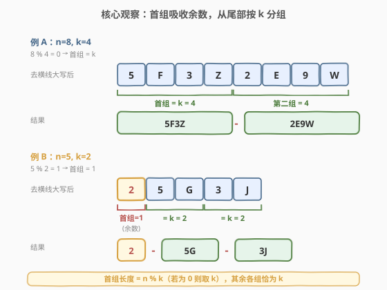
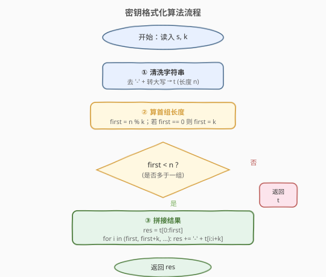
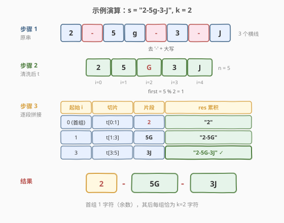

# LeetCode 密钥格式化 题解

## 1. 题目概述

- **标题 / 题号**：密钥格式化（#482，easy）
- **链接**：https://leetcode.cn/problems/license-key-formatting/
- **难度**：简单
- **标签**：字符串

**题意**：给定一个许可密钥字符串 `s`，仅由字母、数字字符和破折号 `'-'` 组成，字符串被若干破折号分成多组。再给定一个整数 `k`。要求重新格式化字符串 `s`，使**每一组包含恰好 `k` 个字符**，**除了第一组**——它可以比 `k` 短，但必须**至少包含一个字符**。此外，两组之间必须插入一个破折号，并且所有小写字母应转换为大写字母。返回重新格式化后的许可密钥。

**示例 1**：

```text
输入：s = "5F3Z-2e-9-w", k = 4
输出："5F3Z-2E9W"
解释：去除破折号并大写后为 "5F3Z2E9W"（共 8 字符），8 % 4 == 0，
     分成两组各 4 字符："5F3Z-2E9W"。
```

**示例 2**：

```text
输入：s = "2-5g-3-J", k = 2
输出："2-5G-3J"
解释：去除破折号并大写后为 "25G3J"（共 5 字符），5 % 2 == 1，
     首组 1 字符、其后每组 2 字符："2-5G-3J"。
```

**约束**：

- $1 \leq \text{s.length} \leq 10^5$
- `s` 只包含字母、数字字符和破折号 `'-'`
- $1 \leq k \leq 10^4$

> ⚠️ **注意首组的特殊性**：题目要求「**除了第一组**，每组恰好 `k` 个字符」。这意味着短组**只能出现在最前面**，而非最后面。这是本题最容易踩的坑——若从左到右每 `k` 个插一个破折号，短组会落在末尾，恰好与题意相反。

## 2. 解题思路

### 2.1 暴力思路：从左到右按 k 截断（错误示范）

最直觉的做法是扫描原串，跳过破折号，每凑够 `k` 个字符就插入一个 `'-'`：

```python
res, cnt = [], 0
for ch in s:
    if ch == '-': continue
    res.append(ch.upper())
    cnt += 1
    if cnt == k:
        res.append('-')
        cnt = 0
return ''.join(res).rstrip('-')
```

对示例 2（`"2-5g-3-J"`, `k=2`），这会得到 `"25-G3-J"`——短组 `J` 落在了**末尾**，与期望 `"2-5G-3J"` 相反。问题根源在于：**短组应当排在最前**，而上述扫描把余数推到了末尾。修正它要么先反转、要么先算出首组长度——这就引出了核心观察。

### 2.2 核心观察：首组吸收余数



把清洗后的串 `t`（长度 `n`，已去破折号且大写）按 `k` 分组时，**从尾部向前**每 `k` 个切一组，剩下不足 `k` 的部分自然落在最前——这正是「第一组可以更短」的语义。

形式化地，设首组长度为 $\text{first}$：

- $\text{first} = n \bmod k$
- 若 $\text{first} = 0$（即 $k \mid n$），首组也恰为 $k$ 个，全部等分
- 否则首组为 $\text{first} < k$ 个，其后各组恰为 $k$ 个

| 情形 | $n$ | $k$ | $n \bmod k$ | 首组长度 | 组成 |
|------|-----|-----|-------------|----------|------|
| 等分 | 8 | 4 | 0 | 4 | `[4][4]` |
| 有余数 | 5 | 2 | 1 | 1 | `[1][2][2]` |

> 💡 **关键转化**：把「每 `k` 个一组、首组可短」归约为**一次取余**——首组长度 $\text{first} = n \bmod k$（为 0 时取 $k$）。此后从下标 $\text{first}$ 起，按步长 $k$ 切片即可，无需任何边界特判。

> ⚠️ **等价写法**：`first = (n - 1) % k + 1`。当 $n \bmod k = 0$ 时它给出 $k$，否则给出 $n \bmod k$，一行覆盖两种情形，避免 `if` 分支（见第 5 节）。

### 2.3 算法流程图



三步走：

1. **清洗**：遍历 `s`，跳过 `'-'`，字母转大写，得到串 `t`（长度 `n`）。
2. **算首组**：`first = n % k`；若 `first == 0`，令 `first = k`。
3. **拼接**：`res = t[:first]`；从 `i = first` 起按步长 `k` 取 `t[i:i+k]`，每段前加 `'-'` 拼入 `res`。

> ⚠️ **正确性**：从 `first` 起每隔 `k` 取一段，由于 $\text{first} = n \bmod k$（或 $k$），剩余长度 $n - \text{first}$ 恰为 $k$ 的整数倍，每段都恰好 `k` 个字符、不会出现末尾短段。首组至少 1 个字符（$n \geq 1$ 保证）。

### 2.4 示例演算

以示例 2 `s = "2-5g-3-J"`, `k = 2` 为例：



**步骤 1：清洗原串**

跳过 3 个 `'-'`，小写 `g` 转大写 `G`，得 `t = "25G3J"`，长度 $n = 5$。

**步骤 2：算首组长度**

$\text{first} = 5 \bmod 2 = 1$（非 0，直接用）。

**步骤 3：逐段拼接**

| 起始下标 $i$ | 切片 | 片段 | `res` 累积 |
|--------------|------|------|-----------|
| 0（首组） | `t[0:1]` | `2` | `"2"` |
| 1 | `t[1:3]` | `5G` | `"2-5G"` |
| 3 | `t[3:5]` | `3J` | `"2-5G-3J"` ✓ |

最终返回 `"2-5G-3J"`。注意首组恰为余数 1 个字符，其后每组恰为 $k=2$ 字符。

## 3. 参考代码

### C++

```cpp
class Solution {
  public:
    string licenseKeyFormatting(string s, int k) {
        string t;
        for (char c : s) {
            if (c != '-') t.push_back(toupper(c));
        }
        int n = t.size();
        if (n == 0) return "";
        int first = n % k;
        if (first == 0) first = k;
        string res = t.substr(0, first);
        for (int i = first; i < n; i += k) {
            res.push_back('-');
            res += t.substr(i, k);
        }
        return res;
    }
};
```

### Python

```python
class Solution:
    def licenseKeyFormatting(self, s: str, k: int) -> str:
        t = s.replace('-', '').upper()
        n = len(t)
        if n == 0:
            return ""
        first = n % k or k
        res = t[:first]
        for i in range(first, n, k):
            res += '-' + t[i:i + k]
        return res
```

> 💡 `n % k or k` 是 Python 惯用写法：`n % k` 为 0 时取 `k`，否则取 `n % k`，等价于 `first = n % k; if first == 0: first = k`。

## 4. 复杂度分析

| 维度 | 复杂度 | 说明 |
|------|--------|------|
| 时间复杂度 | $O(n)$ | 清洗遍历一次 $O(n)$；拼接遍历一次 $O(n)$；`toupper`/切片均为字符级常数操作 |
| 空间复杂度 | $O(n)$ | 存清洗后的串 `t` 与结果 `res`，各 $O(n)$（结果长度 $\leq 2n$，因至多插入 $n/k$ 个破折号） |

> 💡 与「从左到右每 `k` 截断再反转修正」的写法相比，本解法一次遍历定首组、二次遍历拼结果，常数更小且无反转开销。若极端追求空间，可原地复用 `s` 的缓冲（C++ 中 `s` 按值传入，可直接改写），但可读性下降，本题 $n \leq 10^5$ 下 $O(n)$ 空间完全可接受。

## 5. 扩展：一行写法与「从尾部累加」实现

### 5.1 一行 Python

利用 `first = (n - 1) % k + 1` 把首组长度统一成一个表达式，再用步长切片：

```python
class Solution:
    def licenseKeyFormatting(self, s: str, k: int) -> str:
        t = s.replace('-', '').upper()
        first = (len(t) - 1) % k + 1 if t else 0
        return t[:first] + ''.join('-' + t[i:i + k]
                                   for i in range(first, len(t), k))
```

> ⚠️ 当 `t` 为空串时 `(len(t) - 1) % k + 1` 会给出 $k$（因 `(-1) % k = k-1`），需特判 `if t else 0`，否则会错误返回 `'-'` 前缀。

### 5.2 从尾部按 k 累加（无取余）

另一种等价思路：**从右向左**每凑够 `k` 个字符就插一个 `'-'`，剩余不足 `k` 的自然落在左侧（即首组）。无需显式计算 `n % k`：

```python
class Solution:
    def licenseKeyFormatting(self, s: str, k: int) -> str:
        t = s.replace('-', '').upper()
        res, cnt = [], 0
        for ch in reversed(t):
            res.append(ch)
            cnt += 1
            if cnt == k:
                res.append('-')
                cnt = 0
        if res and res[-1] == '-':
            res.pop()
        return ''.join(reversed(res))
```

> 💡 这种写法把「首组吸收余数」的语义**直接编码进扫描方向**——从尾部起算，余数天然留在头部。与第 2.2 节的「取余算首组」是同一思想的两种实现：一个先算长度再切片，一个边扫边分组。面试中前者更易口述，后者更贴近「流式处理」直觉。

## 6. 面试要点

1. **为什么不能从左到右每 k 个插一个破折号？**

   - 题目要求「**除第一组外**，每组恰好 `k` 个」，即短组必须排在**最前**。从左到右每凑 `k` 个就断开，会把不足 `k$ 的余数推到**末尾**，与题意正好相反。正确做法是先算首组长度 `first = n % k`（为 0 取 `k`），让余数留在开头；或从右向左扫描，让余数自然落左。

2. **首组长度公式 `first = n % k`，为 0 时为何取 `k` 而非 0？**

   - 题目要求每组「**至少一个字符**」，首组长度为 0 意味着结果以 `'-'` 开头，非法。当 $k \mid n$ 时，所有组都应恰好 $k$ 个，首组也不例外，故取 `k`。等价写法 `(n - 1) % k + 1` 用一次取余统一两种情形。

3. **输入全为破折号（如 `s = "---"`）时返回什么？**

   - 清洗后 `t` 为空串，`n = 0`。此时 `n % k = 0`，若直接取 `first = k` 会从空串切出 `t[:k] = ""`，再循环不进入，返回 `""`——结果正确但逻辑绕。建议显式判 `if n == 0: return ""`，语义清晰且避免边界误判。本题约束 `s.length >= 1` 但未保证含非破折号字符，必须处理此边界。

4. **能否原地修改 `s` 以省空间？**

   - C++ 中 `s` 按值传入，可用双指针原地清洗（写指针 `w`、读指针 `r`，遇 `'-'` 跳过、小写转大写），再原地分段插入 `'-'`。但 `string::insert` 在中间插入是 $O(n)$，整体仍 $O(n)$ 时间、$O(1)$ 额外空间。Python 字符串不可变，无法原地。本题 $n \leq 10^5$，$O(n)$ 空间足够，原地优化收益有限、可读性下降，面试中提及即可。

5. **大写转换的边界？**

   - `toupper` 对非字母字符（数字）返回原值，安全。手动实现需注意只对 `[a, z]` 范围转换（`c - 'a' + 'A'`），避免误改数字或已是大写字母。Python `str.upper()` 对数字无影响，直接用即可。

## 同类练习题

| # | 题目 | 与本题的关联 |
|---|------|-------------|
| 14 | [最长公共前缀](https://leetcode.cn/problems/longest-common-prefix/)（[题解](../0001-0100/14_最长公共前缀.md)） | 字符串扫描与切片基础，本题清洗与切片的同源练习 |
| 415 | [字符串相加](https://leetcode.cn/problems/add-strings/)（[题解](../0401-0500/415_字符串相加.md)） | 字符串逐字符处理与累加，与本题清洗遍历思路相近 |
| 165 | [比较版本号](https://leetcode.cn/problems/compare-version-numbers/)（[题解](../0101-0200/165_比较版本号.md)） | 字符串按分隔符切分 + 逐段处理，与本题「去分隔符再重组」对照 |
| 468 | [验证 IP 地址](https://leetcode.cn/problems/validate-ip-address/)（[题解](../0401-0500/468_验证IP地址.md)） | 字符串分段与格式校验，承接「按规则切分字符串」的套路 |
| 71 | [简化路径](https://leetcode.cn/problems/simplify-path/)（[题解](../0001-0100/71_简化路径.md)） | 栈模拟路径层级切分重组，与本题「清洗 + 重新分组」思路同源 |
