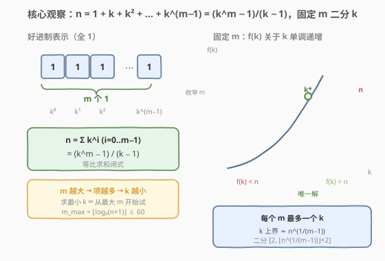
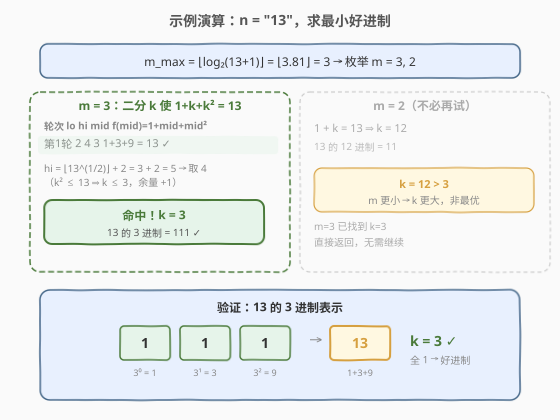

# LeetCode 最小好进制 题解

## 1. 题目概述

- **标题 / 题号**：最小好进制（#483，hard）
- **链接**：https://leetcode.cn/problems/smallest-good-base/
- **难度**：困难
- **标签**：数学、二分查找、枚举

**题意**：以字符串形式给出整数 `n`，返回 `n` 的**最小好进制**。若 `n` 在 `k`（$k \ge 2$）进制下的所有数位全为 `1`，则称 `k` 是 `n` 的一个好进制。

**示例 1**：

```text
输入：n = "13"
输出："3"
解释：13 的 3 进制是 111。
```

**示例 2**：

```text
输入：n = "4681"
输出："8"
解释：4681 的 8 进制是 11111。
```

**示例 3**：

```text
输入：n = "1000000000000000000"
输出："999999999999999999"
解释：10^18 的 (10^18 − 1) 进制是 11。
```

**约束**：

- `n` 的取值范围是 $[3, 10^{18}]$
- `n` 没有前导 0

> 💡 这道题表面是进制转换，实则是**数学 + 二分**。核心是把「全 1」条件转化为等比求和公式，再利用「项数 $m$ 越大则 $k$ 越小」这一单调关系，枚举 $m$ 二分 $k$。

## 2. 解题思路

### 2.1 暴力思路

最直觉的做法：枚举 $k$ 从 $2$ 到 $n - 1$，对每个 $k$ 把 $n$ 转成 $k$ 进制看是否全 $1$。但 $n$ 可达 $10^{18}$，枚举量天文数字，完全不可行。

退一步：$k$ 的取值范围虽大，但**全 1 表示的长度 $m$（项数）有上界**。当 $k = 2$ 时 $n = 2^m - 1$，故 $m \le \lfloor \log_2(n+1) \rfloor \le 60$。能否反过来**枚举 $m$、二分 $k$**？

### 2.2 核心观察：等比求和 + 枚举 $m$ 二分 $k$



若 $n$ 在 $k$ 进制下是 $m$ 个 $1$，则按位展开得**等比数列求和**：

$$
n = 1 + k + k^2 + \dots + k^{m-1} = \frac{k^m - 1}{k - 1}
$$

**三个关键观察**：

1. **固定 $m$ 后，$f(k) = \frac{k^m - 1}{k - 1}$ 关于 $k$ 单调递增**（$k \ge 2$）。因此每个 $m$ 最多对应一个 $k$，可用二分在 $[2,\ \lfloor n^{1/(m-1)} \rfloor + 2]$ 中查找。

2. **$m$ 越大 $\Rightarrow$ 项越多 $\Rightarrow$ $k$ 越小**。例如 $n = 13$：$m = 3$ 时 $k = 3$，$m = 2$ 时 $k = 12$。因此**求最小 $k$ ⇔ 从最大 $m$ 开始试**，第一个命中的 $k$ 即为答案。

3. **$m = 2$ 是万能兜底**：$n = 1 + k \Rightarrow k = n - 1$，对任意 $n \ge 3$ 都成立（$k \ge 2$）。所以若所有 $m \ge 3$ 都无解，答案必为 $n - 1$（示例 3 正是此情况）。

> 💡 **$m$ 的上界**：$k \ge 2$ 时 $n \ge 2^m - 1$，故 $m \le \lfloor \log_2(n+1) \rfloor \le 60$。只需从 $m_{\max}$ 枚举到 $3$，每个 $m$ 做一次 $O(\log n)$ 的二分，总复杂度 $O(\log^2 n)$。

> ⚠️ **$k$ 的上界估计**：由 $n \ge k^{m-1}$ 得 $k \le n^{1/(m-1)}$。用浮点 `pow(n, 1.0/(m-1))` 取整后加 $2$ 余量，规避浮点误差导致上界偏小。$m = 2$ 时 $n^{1/1} = n$，$k = n - 1 \le n$，余量充足。

> ⚠️ **溢出**：$n$ 可达 $10^{18} < 2^{63}$，`unsigned long long`（64 位）可容纳。但 $k^m$ 可能远超 $10^{18}$，计算时需**逐步累加并提前终止**：一旦部分和 $> n$ 立即返回「过大」，避免乘法溢出。具体做法是先判 `cur > n / k` 再乘。

### 2.3 算法流程图


整体是**双层循环**：

- **外层**：$m$ 从 $m_{\max} = \lfloor \log_2(n+1) \rfloor$ 递减到 $3$。
- **内层**：对每个 $m$，在 $[\,2,\ \lfloor n^{1/(m-1)} \rfloor + 2\,]$ 上二分 $k$，验证 $f(k) \stackrel{?}{=} n$。
- **命中即返回**：因 $m$ 从大到小，第一个命中的 $k$ 就是最小好进制。
- **兜底**：所有 $m \ge 3$ 无解时返回 $n - 1$（$m = 2$）。

### 2.4 示例演算



以 $n = 13$ 为例：

**第 0 步**：$m_{\max} = \lfloor \log_2 14 \rfloor = 3$，枚举 $m = 3, 2$。

**$m = 3$**：求 $k$ 使 $1 + k + k^2 = 13$。

- $k$ 上界：$\lfloor 13^{1/2} \rfloor + 2 = 3 + 2 = 5$（实际取 $4$ 已足够）。
- 二分 $[2, 4]$：$mid = 3 \Rightarrow f(3) = 1 + 3 + 9 = 13 = n$ ✓ **命中！**
- 返回 $k = 3$。

**验证**：$13 = 1 + 3 + 9$，3 进制表示为 $111$，全 $1$ ✓。

$m = 3$ 已命中，无需再试 $m = 2$（$m = 2$ 给 $k = 12 > 3$，非最优）。

> 💡 对比示例 3：$n = 10^{18}$，$m_{\max} = 60$。对所有 $m \in [3, 60]$ 二分均无解，最终兜底返回 $n - 1 = 10^{18} - 1$。

## 3. 参考代码

### C++

```cpp
class Solution {
  public:
    // 验证 f(k) = 1 + k + ... + k^(m-1) 与 n 的关系
    // 返回: 0 表示相等, -1 表示偏小, 1 表示偏大
    int check(unsigned long long k, int m, unsigned long long n) {
        unsigned long long sum = 1, cur = 1;
        for (int i = 1; i < m; i++) {
            if (cur > n / k) return 1;   // cur * k 会溢出或超过 n
            cur *= k;
            sum += cur;
            if (sum > n) return 1;       // 部分和已超 n
        }
        if (sum == n) return 0;
        return -1;
    }

    string smallestGoodBase(string n_str) {
        unsigned long long n = stoull(n_str);

        // m 从最大可能值递减到 3
        for (int m = 63; m >= 3; m--) {
            // k 的上界: k^(m-1) <= n  =>  k <= n^(1/(m-1))
            unsigned long long hi = (unsigned long long)pow((double)n, 1.0 / (m - 1)) + 2;
            unsigned long long lo = 2;
            while (lo <= hi) {
                unsigned long long mid = lo + (hi - lo) / 2;
                int r = check(mid, m, n);
                if (r == 0) return to_string(mid);  // 命中即最小 k
                if (r < 0) lo = mid + 1;             // f(k) < n, k 太小
                else       hi = mid - 1;             // f(k) > n, k 太大
            }
        }
        // 兜底: m = 2, n = 1 + k  =>  k = n - 1
        return to_string(n - 1);
    }
};
```

### Python

```python
class Solution:
    def smallestGoodBase(self, n: str) -> str:
        n_val = int(n)

        # m 从最大可能值递减到 3
        for m in range(63, 2, -1):
            lo, hi = 2, int(n_val ** (1.0 / (m - 1))) + 2
            while lo <= hi:
                mid = (lo + hi) // 2
                # Python 大整数无溢出，直接算等比求和闭式
                total = (mid ** m - 1) // (mid - 1)
                if total == n_val:
                    return str(mid)
                elif total < n_val:
                    lo = mid + 1
                else:
                    hi = mid - 1

        # 兜底: m = 2, n = 1 + k  =>  k = n - 1
        return str(n_val - 1)
```

> ⚠️ **C++ 溢出防护**：`check` 函数中 `cur > n / k` 是**乘前预判**——若 `cur * k` 会超过 $n$（从而部分和超过 $n$），直接返回「偏大」，避免 `cur *= k` 溢出 64 位。Python 天然支持大整数，可直接用闭式 $(k^m - 1)/(k - 1)$ 计算，无需溢出防护。

> 💡 **$m$ 上界取 63**：$n \le 10^{18} < 2^{60}$，故 $m_{\max} \le 60$。取 $63$ 留余量，`pow` 对大 $m$ 会给出偏小的 `hi`，二分自然收缩，不影响正确性。

## 4. 复杂度分析

| 维度 | 复杂度 | 说明 |
|------|--------|------|
| 时间复杂度 | $O(\log^2 n)$ | 外层枚举 $m$ 共 $O(\log n)$ 个值（$m \le 60$）；每个 $m$ 二分 $O(\log n)$ 次，每次验证 $O(m) = O(\log n)$ |
| 空间复杂度 | $O(1)$ | 仅常数变量 |

> 💡 对于 $n = 10^{18}$，$m_{\max} = 60$，外层最多 58 轮，每轮二分约 60 次、验证约 60 步，总计约 $2 \times 10^5$ 次基本运算，远在时限内。

## 5. 扩展：为何 $m \ge 3$ 的解最多一个？

对固定 $n$，可能存在多个 $(m, k)$ 对使 $n = \frac{k^m - 1}{k - 1}$。但我们要找的是**最小 $k$**，而 $m$ 越大 $k$ 越小，因此只需从最大 $m$ 往下试，**第一个命中即为答案**，无需验证后续更小的 $m$。

实际上，对大多数 $n$，$m \ge 3$ 无解，答案就是 $n - 1$。能写成 $m \ge 3$ 全 1 表示的 $n$ 是特殊的——它们是某个整数的**几何级数和**。例如：

- $n = 7 = 1 + 2 + 4$（$m = 3, k = 2$）
- $n = 13 = 1 + 3 + 9$（$m = 3, k = 3$）
- $n = 15 = 1 + 2 + 4 + 8$（$m = 4, k = 2$）
- $n = 4681 = 1 + 8 + 64 + 512 + 4096$（$m = 5, k = 8$）

> 💡 **数学冷知识**：$m = 3$ 时 $n = k^2 + k + 1$，判别式 $\Delta = 4n - 3$ 必须是完全平方数才有整数 $k$。可据此 $O(1)$ 判定 $m = 3$ 是否有解，但通用二分已足够高效，不必特殊化。

## 6. 面试要点

1. **为什么枚举 $m$ 而不是枚举 $k$？**

   - $k$ 的范围可达 $10^{18}$，无法枚举。而 $m$（全 1 的位数）上界为 $\lfloor \log_2(n+1) \rfloor \le 60$，枚举量极小。**把不可枚举的变量转化为可枚举的变量**是本题的核心转化。

2. **为什么从大 $m$ 往小试，而不是从小往大？**

   - $m$ 越大，项数越多，每项可以更小，故 $k$ 更小。求**最小** $k$ 等价于求**最大** $m$。从大到小试，第一个命中即答案；从小往大则需全部试完取最小，效率与正确性都更差。

3. **$m = 2$ 为什么是兜底解？**

   - $m = 2$ 时 $n = 1 + k$，即 $k = n - 1$。因 $n \ge 3$，$k \ge 2$ 恒成立，所以 $n - 1$ 总是一个合法好进制。若所有 $m \ge 3$ 无解（如 $n = 10^{18}$），答案就是 $n - 1$。

4. **C++ 如何防止 $k^m$ 溢出 64 位？**

   - `check` 中不直接算 $k^m$，而是**逐项累加** $1, k, k^2, \dots$，每步检查 `cur > n / k`（乘前预判）：若成立则 `cur * k > n`，部分和必然超过 $n$，直接返回「偏大」。这样 `cur` 始终 $\le n < 2^{63}$，不溢出。Python 用大整数无此问题。

5. **$k$ 的二分上界为什么用 $\lfloor n^{1/(m-1)} \rfloor + 2$？**

   - 由 $n \ge k^{m-1}$ 得 $k \le n^{1/(m-1)}$。浮点 `pow` 可能有微小误差导致取整偏小，加 $2$ 余量确保上界不遗漏。下界取 $2$（$k \ge 2$）。二分会自动收缩到精确值，余量只增加常数次迭代。

## 同类练习题

| # | 题目 | 与本题的关联 |
|---|------|-------------|
| 69 | [x 的平方根](https://leetcode.cn/problems/sqrtx/) | 同属「数学 + 二分答案」，求最大的 $r$ 使 $r^2 \le x$，验证函数从等比求和换成平方，模板一致。 |
| 441 | [排列硬币](https://leetcode.cn/problems/arranging-coins/) | 二分答案，等差求和 $k(k+1)/2$ 的单调性驱动二分，与本题等比求和二分形成对照。 |
| 367 | [有效的完全平方数](https://leetcode.cn/problems/valid-perfect-square/) | 二分判定 $num$ 是否能写成 $r^2$，与本题「判定 $n$ 是否能写成等比和」同构。 |
| 400 | [第 N 位数字](https://leetcode.cn/problems/nth-digit/) | 数学分层定位 + 逐层缩减，与本题「枚举 $m$ 缩小搜索空间」思路相通。 |
| 875 | [爱吃香蕉的珂珂](https://leetcode.cn/problems/koko-eating-bananas/) | 二分答案 + $O(n)$ 验证函数，经典「二分答案」模板题，对照练习验证函数的设计。 |
