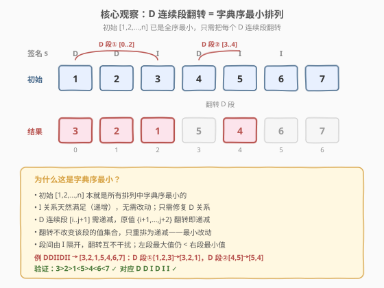
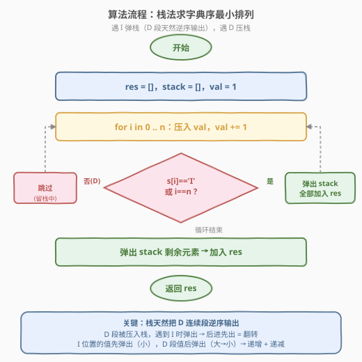

# 寻找排列

- **题目名称**：寻找排列
- **链接**：[484. 寻找排列](https://leetcode.cn/problems/find-permutation/)
- **难度**：中等
- **标签**：栈、贪心、数组

## 1. 题目概述

给定一个由字符 `'I'` 和 `'D'` 组成的**秘密签名**字符串 `s`，其中：

- `'I'` 表示相邻两个数之间是**递增**关系（Increasing）
- `'D'` 表示相邻两个数之间是**递减**关系（Decreasing）

签名由一个**特殊的整数数组**构造而成，该数组包含 $1$ 到 $n$ 的所有不同整数（$n = \text{len}(s) + 1$），且每个数恰好出现一次。`s[i]` 描述的是数组第 $i$ 个元素与第 $i+1$ 个元素之间的大小关系。

要求：返回能产生该签名的 $[1, 2, \dots, n]$ 的**字典序最小排列**。

> ⚠️ **本题是 LeetCode Plus 会员专享题**，在力扣中国站需 Plus 会员才能查看完整题面与提交。本题在面试中出现频率不低，思路经典，值得练习。

**示例 1**：

```text
输入：s = "I"
输出：[1, 2]
解释：n = 2，s[0] = 'I' 表示 nums[0] < nums[1]。
[1, 2] 满足 1 < 2，且是字典序最小的排列。
```

**示例 2**：

```text
输入：s = "DI"
输出：[2, 1, 3]
解释：n = 3，s[0] = 'D' 表示 nums[0] > nums[1]，s[1] = 'I' 表示 nums[1] < nums[2]。
[2, 1, 3] 满足 2 > 1 且 1 < 3，字典序最小。
（对比 [3, 1, 2] 也满足签名，但 [2, 1, 3] 字典序更小。）
```

**示例 3**：

```text
输入：s = "DDIIDI"
输出：[3, 2, 1, 5, 4, 6, 7]
解释：n = 7
3 > 2 > 1 < 5 > 4 < 6 < 7
D    D    I    D    I    I  ✓
```

**约束条件**：

- $1 \leq \text{len}(s) \leq 1000$
- `s` 只包含字符 `'I'` 和 `'D'`

> 💡 **关键约束**：$n = \text{len}(s) + 1 \leq 1001$，排列元素恰好是 $1$ 到 $n$ 的整数。这保证了「初始递增序列 $[1, 2, \dots, n]$ 天然满足所有 `I` 关系」——只需修复 `D` 段即可。

---

## 2. 解题思路

### 2.1 暴力思路：枚举全排列验证

最直接的做法是枚举 $[1, 2, \dots, n]$ 的所有排列，逐个验证是否满足签名 `s`，取字典序最小的一个：

```text
for perm in permutations([1, 2, ..., n]):
    if all_valid(perm, s):   # 检查每个 s[i] 对应的关系
        return perm           # 字典序升序枚举，首个合法即最小
```

时间复杂度 $O(n! \cdot n)$——$n = 1000$ 时完全不可行（$1000!$ 是天文数字）。

**优化思路**：与其枚举排列再验证，不如**直接构造**。注意到 $[1, 2, \dots, n]$ 已经是所有排列中字典序最小的，且天然满足所有 `I` 关系——只需把不满足的 `D` 段「翻转」过来即可。

### 2.2 核心观察：D 连续段翻转



关键观察有三步：

1. **初始最小**：$[1, 2, \dots, n]$ 是所有排列中字典序最小的。它天然满足所有 `I` 关系（严格递增），但不满足任何 `D` 关系。

2. **D 段需递减**：对一段连续的 `D`（如 `s[i..j]` 全为 `'D'`），需要 $\text{nums}[i] > \text{nums}[i+1] > \cdots > \text{nums}[j+1]$，即这 $j-i+2$ 个数必须**递减排列**。在初始序列中，这些位置的值是 $\{i+1, i+2, \dots, j+2\}$（递增），翻转即变递减。

3. **翻转不改值集**：翻转 $[i, j+1]$ 这段子数组后，该段的值集合不变（仍是 $\{i+1, \dots, j+2\}$），只是排列顺序从递增变为递减。因此**段间的 `I` 关系不受影响**——左段的最大值仍小于右段的最小值。

> 💡 **关键转化**：字典序最小排列 = 初始 $[1, 2, \dots, n]$ + 每个 `D` 连续段对应子数组翻转。由于 `D` 段之间被 `I` 隔开，各段翻转互不干扰。

**为什么翻转后字典序仍最小？** 因为翻转是「最小改动」——我们只动了必须动的位置（`D` 段），且只做了最小限度的重排（翻转而非任意排列）。每个 `D` 段翻转后，该段的值集合与初始相同，只是从递增变为递减。更前面的位置（`I` 段）完全没动，保持初始的最小值。

> ⚠️ **段间 `I` 不受影响的证明**：设 `D` 段覆盖位置 $[i, j+1]$，翻转后 $\text{nums}[i] = j+2$（段内最大），$\text{nums}[j+1] = i+1$（段内最小）。若段前有 `I`（位置 $i-1$ 到 $i$），则 $\text{nums}[i-1] < \text{nums}[i] = j+2$，而 $\text{nums}[i-1]$ 来自更小的值段（$\leq i$），天然成立。若段后有 `I`（位置 $j+1$ 到 $j+2$），则 $\text{nums}[j+1] = i+1 < \text{nums}[j+2]$，而 $\text{nums}[j+2]$ 来自更大的值段（$\geq j+3$），同样天然成立。

### 2.3 算法流程图



用**栈**可以优雅地实现「D 段翻转」——栈的 LIFO（后进先出）特性天然把 `D` 连续段逆序输出：

1. **初始化**：空结果数组 `res`，空栈 `stack`，计数器 `val = 1`。
2. **遍历** `i` 从 $0$ 到 $n$（$n = \text{len}(s) + 1$，多走一步处理末尾）：
   - **压栈**：将 `val` 压入 `stack`，`val += 1`。
   - **判弹栈**：若 `i == n`（到达末尾）或 `s[i] == 'I'`，则弹出 `stack` 中**所有**元素依次加入 `res`。
   - 若 `s[i] == 'D'`，不弹栈（`D` 段的值留在栈中等 `I` 时统一逆序弹出）。
3. **返回** `res`。

> 💡 **栈为什么能实现 D 段翻转？** `D` 段的值被依次压入栈（如 $1, 2, 3$），遇到 `I` 时全部弹出——后进先出，弹出顺序是 $3, 2, 1$，恰好是翻转！而 `I` 位置的值压入后立即弹出（栈中只有它自己），保持原序。栈把「找 D 段 + 翻转」两步合并成了一次遍历。

### 2.4 示例演算

以 `s = "DDIIDI"`（示例 3）为例，$n = 7$：

![示例演算：s = DDIIDI → [3,2,1,5,4,6,7]](../images/findperm_example_walkthrough.svg)

| 步骤 | $i$ | $s[i]$ | 压入 val | 动作 | stack（底→顶） | res |
|------|-----|--------|----------|------|-----------------|-----|
| 0 | — | — | — | 初始化 | `[]` | `[]` |
| 1 | 0 | D | 1 | 压栈，不弹 | `[1]` | `[]` |
| 2 | 1 | D | 2 | 压栈，不弹 | `[1, 2]` | `[]` |
| 3 | 2 | I | 3 | 压 3，弹全部 | `[]` | `[3, 2, 1]` |
| 4 | 3 | D | 4 | 压栈，不弹 | `[4]` | `[3, 2, 1]` |
| 5 | 4 | I | 5 | 压 5，弹全部 | `[]` | `[3, 2, 1, 5, 4]` |
| 6 | 5 | I | 6 | 压 6，弹全部 | `[]` | `[3, 2, 1, 5, 4, 6]` |
| 7 | 6 | 末 | 7 | 压 7，弹全部 | `[]` | `[3, 2, 1, 5, 4, 6, 7]` |

**验证**：$3 > 2 > 1 < 5 > 4 < 6 < 7$，对应 `D D I D I I` ✓

> 💡 **观察步骤 3**：`D` 段 `[1, 2]` 连同当前位置的 `3` 被压入栈后，遇到 `I` 一次性弹出——弹出顺序 `3, 2, 1` 恰好是 `D` 段翻转加上 `I` 位置的值。这就是栈法的精髓：**`D` 段自动逆序，`I` 位置原序输出，一气呵成**。

---

## 3. 参考代码

### C++

```cpp
// 寻找排列.cpp —— 栈法：D 段压栈，遇 I 弹栈逆序输出
// 编译: g++ -O2 -std=c++17 寻找排列.cpp -o findperm
#include <vector>
#include <stack>
#include <string>
using namespace std;

class Solution {
  public:
    vector<int> findPermutation(string s) {
        int n = s.size() + 1;
        vector<int> res;
        res.reserve(n);
        stack<int> stk;
        int val = 1;

        for (int i = 0; i <= n; ++i) {     // 多走一步到 n，处理末尾
            stk.push(val++);
            if (i == n || s[i] == 'I') {   // 末尾或 I：弹全部
                while (!stk.empty()) {
                    res.push_back(stk.top());
                    stk.pop();
                }
            }
        }
        return res;
    }
};
```

### Python

```python
class Solution:
    def findPermutation(self, s: str) -> list[int]:
        n = len(s) + 1
        res = []
        stack = []
        val = 1

        for i in range(n + 1):             # 多走一步到 n，处理末尾
            stack.append(val)
            val += 1
            if i == n or s[i] == 'I':      # 末尾或 I：弹全部
                while stack:
                    res.append(stack.pop())
        return res
```

> 💡 也可不用显式栈，直接在数组上**双指针翻转 D 段**——先填入 $[1, 2, \dots, n]$，再用 `while` 找每段连续 `D` 并 `reverse`。两种写法等价，栈法更简洁、无需额外反转调用。

---

## 4. 复杂度分析

| 维度 | 复杂度 | 说明 |
|------|--------|------|
| **时间复杂度** | $O(n)$ | 每个元素至多压栈 1 次、弹栈 1 次，`for` 跑 $n+1$ 轮，`while` 累计弹出 $\leq n$，总操作 $O(n)$ |
| **空间复杂度** | $O(n)$ | 栈最坏存 $n$ 个元素（如 `s = "DDD…D"`，全压入末尾才弹）；结果数组 $O(n)$ |

> ⚠️ `while` 嵌套在 `for` 里看似 $O(n^2)$，但**均摊分析**：每个元素一生只压栈 1 次、弹栈 1 次，`while` 累计弹出 $\leq n$。总时间是 $O(n)$——与 [232 用栈实现队列](../0001-0100/232_用栈实现队列.md) 的双栈摊还分析同理。

---

## 5. 扩展：双指针翻转法

除了栈法，还可以用**双指针直接在数组上翻转 D 段**，避免显式栈：

```python
class Solution:
    def findPermutation(self, s: str) -> list[int]:
        n = len(s) + 1
        res = list(range(1, n + 1))       # [1, 2, ..., n]
        i = 0
        while i < len(s):
            if s[i] == 'D':
                j = i
                while j < len(s) and s[j] == 'D':   # 找连续 D 段终点
                    j += 1
                res[i:j + 1] = res[i:j + 1][::-1]   # 翻转 [i, j+1]
                i = j
            else:
                i += 1
        return res
```

**两种写法对照**：

| 维度 | 栈法 | 双指针翻转法 |
|------|------|-------------|
| **核心操作** | 压栈 + 遇 I 弹栈 | 先填递增 + 翻转 D 段 |
| **实现** | 一趟遍历，栈自动逆序 | 一趟遍历找段 + 切片翻转 |
| **空间** | $O(n)$ 栈 | $O(1)$ 额外（原地翻转，结果即数组） |
| **直观性** | 栈 LIFO = 翻转，巧妙 | 先构造再修复，直白 |

> 💡 双指针法的空间更优（原地翻转无需栈），但栈法更优雅——把「找 D 段 + 翻转」融为一次遍历中的压栈/弹栈动作。面试中两种写法都应能讲清，栈法更显对数据结构的灵活运用。

---

## 6. 面试要点

1. **为什么初始 $[1, 2, \dots, n]$ 翻转 D 段后就是字典序最小？**

   - $[1, 2, \dots, n]$ 是所有排列中字典序最小的。它满足所有 `I` 关系（递增），不满足任何 `D` 关系。翻转 `D` 段只改变段内排列顺序（递增→递减），不改变值集合，因此段间 `I` 关系不受影响。由于翻转是满足 `D` 约束的**最小改动**（只动必须动的位置，且只做翻转而非任意重排），结果仍是字典序最小的合法排列。

2. **栈法为什么遇 `I` 才弹栈？**

   - `D` 段的值需要**逆序输出**才能满足递减关系。栈的 LIFO 特性天然实现逆序——把 `D` 段的值压入栈，等遇到 `I`（或末尾）时一次性弹出，弹出顺序恰是压入顺序的逆序。`I` 位置的值压入后立即弹出（栈中只有它），保持原序。若遇 `D` 就弹，逆序关系会被打断。

3. **遍历为什么多走一步到 `i == n`？**

   - 字符串 `s` 长度为 $n-1$，描述的是位置 $0$ 到 $n-1$ 的关系。但排列有 $n$ 个元素，最后一个元素（位置 $n-1$）也需要被压入并弹出。多走一步到 `i == n` 确保栈中剩余元素（末尾 `D` 段）被全部弹出加入结果。

4. **时间复杂度为什么是 $O(n)$ 而不是 $O(n^2)$？**

   - `while` 嵌套在 `for` 里，但每个元素至多压栈 1 次、弹栈 1 次。`while` 的累计弹出次数 $\leq n$，均摊到每轮 `for` 是 $O(1)$。总操作 $O(n)$——与双栈实现队列、单调栈题的均摊分析同理。

5. **如果 `s` 全是 `D` 会怎样？**

   - `s = "DDD…D"`（$n-1$ 个 `D`），需要整个排列递减。栈法：所有值 $1$ 到 $n$ 依次压入，直到 `i == n` 才一次性弹出——弹出顺序 $n, n-1, \dots, 1$，恰是递减排列 ✓。栈最坏存 $n$ 个元素，空间 $O(n)$。

> 💡 **一句话总结**：484 题的核心是「$[1, 2, \dots, n]$ 已是字典序最小，翻转每个 `D` 连续段即得答案」。栈法用 LIFO 天然实现翻转——`D` 段压栈、遇 `I` 弹栈，一趟遍历 $O(n)$ 搞定。与 [31 下一个排列](../0001-0100/31_下一个排列.md) 的「排列操作」和 [60 第k个排列](../0001-0100/60_第k个排列.md) 的「排列构造」同属排列家族，但切入点各异。

---

## 7. 同类练习题

- [31. 下一个排列](https://leetcode.cn/problems/next-permutation/)（[题解](../0001-0100/31_下一个排列.md)）：排列操作题，找字典序下一个排列，与本题「构造字典序最小排列」对照
- [60. 第 k 个排列](https://leetcode.cn/problems/permutation-sequence/)（[题解](../0001-0100/60_第k个排列.md)）：康托尔展开解码构造第 k 个排列，与本题同为「直接构造排列」而非枚举
- [46. 全排列](https://leetcode.cn/problems/permutations/)（[题解](../0001-0100/46_全排列.md)）：回溯枚举全排列，本题的暴力退化版（无签名约束）
- [232. 用栈实现队列](https://leetcode.cn/problems/implement-queue-using-stacks/)（[题解](../0001-0100/232_用栈实现队列.md)）：双栈摊还 $O(1)$，与本题栈法的均摊 $O(n)$ 分析同理
- [946. 验证栈序列](https://leetcode.cn/problems/validate-stack-sequences/)：给定压栈/弹栈序列判定合法性，与本题「用栈控制输出顺序」互为正反问题
