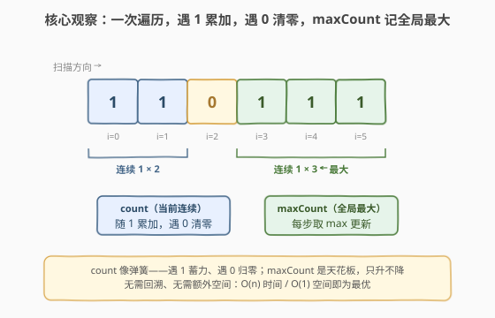
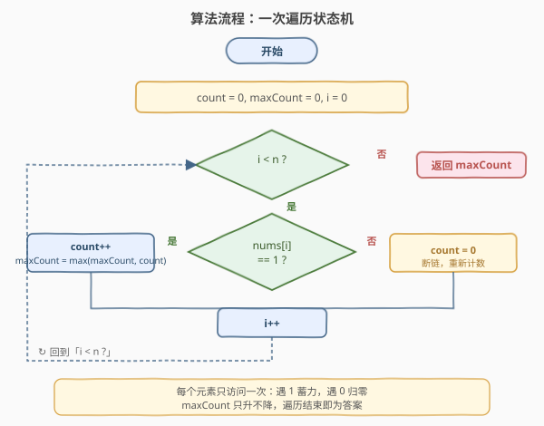
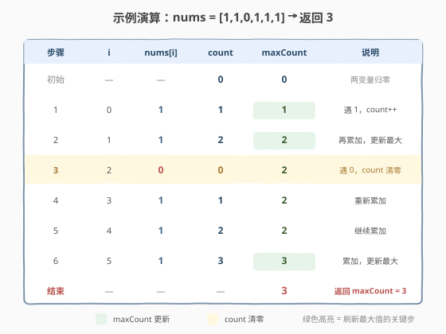

# LeetCode 最大连续 1 的个数 题解

## 1. 题目概述

- **标题 / 题号**：最大连续 1 的个数（#485，easy）
- **链接**：https://leetcode.cn/problems/max-consecutive-ones/
- **难度**：简单
- **标签**：数组、一次遍历

**题意**：给定一个二进制数组 `nums`，计算其中**最大连续 `1` 的个数**。

**示例 1**：

```text
输入：nums = [1,1,0,1,1,1]
输出：3
解释：开头的两位和最后的三位都是连续 1，所以最大连续 1 的个数是 3。
```

**示例 2**：

```text
输入：nums = [1,0,1,1,0,1]
输出：2
```

**约束**：

- $1 \le \text{nums.length} \le 10^5$
- $\text{nums}[i] \in \{0, 1\}$

> 💡 **题目本质**：在由 0、1 组成的序列中找最长的「全 1 连续段」。0 是天然的分隔符——它把数组切成若干个 1 段，答案就是其中最长一段的长度。

## 2. 解题思路

### 2.1 暴力思路

- **枚举所有子数组**：对每个起点 $i$ 向右延伸，只要一直是 1 就记录长度。时间 $O(n^2)$，远超数据规模允许范围。
- **按 0 切分**：用 `split` 把数组按 0 分段，取最长段的长度。逻辑直观，但要产生中间字符串/列表，空间 $O(n)$，且语义上把简单问题绕了一圈。

> ⚠️ 两种朴素做法要么超时、要么浪费空间。突破口在于——**我们只关心当前连续 1 段的长度和全局最大值**，这两个量可以在一次遍历中边走边维护，无需存储任何中间段。

### 2.2 核心观察：一次遍历 + 双变量状态机



关键观察有两点：

1. **count 随 1 累加，遇 0 归零**：遍历数组时维护一个计数器 `count`，遇到 1 就 `+1`，遇到 0 就重置为 0。`count` 在任意时刻的值，恰好等于「以当前位置结尾的连续 1 段长度」。
2. **maxCount 只升不降**：再维护一个全局最大值 `maxCount`，每步用 `max(maxCount, count)` 更新。遍历结束后 `maxCount` 即为答案。

> 💡 **为什么不需要回溯**：连续 1 段一旦被 0 打断，就不可能再延续——后面的 1 属于一个全新的段。因此「遇 0 清零」是安全的，不会丢失任何信息。这正是该题能 $O(1)$ 空间求解的根本原因。

### 2.3 算法流程图



算法只需一趟遍历：

1. 初始化 `count = 0`、`maxCount = 0`、`i = 0`。
2. 当 $i < n$ 时循环：
   - 若 `nums[i] == 1`：`count++`，并更新 `maxCount = max(maxCount, count)`。
   - 否则（`nums[i] == 0`）：`count = 0`（断链重新计数）。
   - `i++`，回到步骤 2。
3. 循环结束，返回 `maxCount`。

> ⚠️ **边界细节**：数组全 0 时，`count` 始终被清零，`maxCount` 保持 0，答案正确；数组全 1 时，`count` 一路累加到 $n$，`maxCount` 同步到 $n$，同样正确。无需任何特殊判断。

### 2.4 示例演算

以 `nums = [1,1,0,1,1,1]`，$n = 6$ 为例：



| 步骤 | i | nums[i] | count | maxCount | 说明 |
|------|---|---------|-------|----------|------|
| 初始 | — | — | 0 | 0 | 两变量归零 |
| 1 | 0 | 1 | 1 | 1 | 遇 1，count++ |
| 2 | 1 | 1 | 2 | 2 | 再累加，更新最大 |
| 3 | 2 | 0 | 0 | 2 | 遇 0，count 清零 |
| 4 | 3 | 1 | 1 | 2 | 重新累加 |
| 5 | 4 | 1 | 2 | 2 | 继续累加 |
| 6 | 5 | 1 | 3 | 3 | 累加，更新最大 |
| 结束 | — | — | — | **3** | 返回 maxCount = 3 |

最终结果为 **3** ✓。第 3 步的 0 把 `count` 清零，但 `maxCount` 保留了之前的峰值 2；最后三个 1 把 `count` 推到 3，刷新 `maxCount` 为 3。

## 3. 参考代码

### C++

```cpp
class Solution {
  public:
    int findMaxConsecutiveOnes(vector<int>& nums) {
        int count = 0, maxCount = 0;
        for (int x : nums) {
            if (x == 1) {
                ++count;
                maxCount = max(maxCount, count);
            } else {
                count = 0;
            }
        }
        return maxCount;
    }
};
```

### Python

```python
class Solution:
    def findMaxConsecutiveOnes(self, nums: List[int]) -> int:
        count = max_count = 0
        for x in nums:
            if x == 1:
                count += 1
                max_count = max(max_count, count)
            else:
                count = 0
        return max_count
```

> 💡 **简洁写法**：利用 `count = count * x + x` 可把分支合并——遇 1 时 `count` 自增，遇 0 时乘以 0 归零。但可读性下降，面试中推荐显式 `if/else` 写法，讲清状态语义。

## 4. 复杂度分析

| 维度 | 复杂度 | 说明 |
|------|--------|------|
| 时间复杂度 | $O(n)$ | 一趟遍历，每个元素 $O(1)$ 处理，共 $n$ 次 |
| 空间复杂度 | $O(1)$ | 仅用 `count`、`maxCount` 两个常数变量 |

> 💡 这是该题的最优解：时间已达下界 $O(n)$（必须至少看一遍所有元素才能确定最长段），空间为常数。无需排序、无需哈希、无需额外数组。

## 5. 扩展：允许翻转 0 的变体系列

本题是「最大连续 1」系列的入门题。系列后续引入「允许翻转若干个 0」的设定，把一次遍历状态机升级为**滑动窗口**：

| 题号 | 题目 | 难度 | 设定 | 核心套路 |
|------|------|------|------|----------|
| 485 | 最大连续 1 的个数 | 简单 | 不翻转 | 一次遍历 + 双变量（本题） |
| 487 | 最大连续 1 的个数 II | 中等 | 最多翻转 1 个 0 | 滑动窗口 / 状态机含一个翻转槽 |
| 1004 | 最大连续 1 的个数 III | 困难 | 最多翻转 $K$ 个 0 | 滑动窗口，窗口内 0 的个数 $\leq K$ |

**从 485 到 1004 的递进逻辑**：

- 485 中 0 是「硬分隔符」，遇 0 必须清零。
- 487/1004 中 0 变成「软分隔符」——允许把有限个 0 当作 1 纳入窗口，窗口扩张时累计 0 的个数，超过配额就收缩左端。
- 套路完全一致：维护窗口右端扩张、左端按需收缩，记录窗口最大长度。

> 💡 掌握 485 的双变量思路后，再学 1004 的滑动窗口会非常自然——本质都是「维护一段连续区间的长度并取最大」，只是 1004 多了一维「0 的配额」约束。

## 6. 面试要点

1. **为什么一次遍历就够？会不会漏掉某个更长的 1 段？**
   - 不会。`count` 在每一步都等于「以当前位置结尾的连续 1 段长度」，因此每个 1 段的长度都会在其最后一个 1 处被 `count` 完整记录，并在同一步参与 `maxCount` 更新。遍历一遍覆盖所有段，不会遗漏。

2. **数组全 0 或全 1 时算法是否正确？**
   - 全 0：`count` 每步被清零，`maxCount` 始终为 0，正确返回 0。全 1：`count` 从 0 累加到 $n$，`maxCount` 同步到 $n$，正确返回 $n$。两种极端都无需特判。

3. **为什么不用滑动窗口？**
   - 滑动窗口适用于「窗口内满足某约束」的场景（如 1004 允许翻转 $K$ 个 0）。本题 0 是绝对分隔符，没有「约束」需要维护，双变量状态机更轻量。用滑动窗口虽然也能做，但属于杀鸡用牛刀。

4. **如果把 1 换成任意目标值（如最长连续递增段）思路还成立吗？**
   - 只要「段」的延续条件是局部可判定的（当前位置与前一个位置满足某关系），双变量模板就成立：满足条件则 `count++`，否则 `count = 1`（重新从当前元素起段）。如 [674. 最长连续递增序列](https://leetcode.cn/problems/longest-continuous-increasing-subsequence/) 即为此模板的直接推广。

5. **`count = count * x + x` 这种无分支写法有何利弊？**
   - 利：代码极简，无分支预测开销。弊：可读性差，面试中不易讲清意图。在线判题平台差异微小，工程中推荐显式 `if/else`。了解此技巧可展示对位运算的敏感度，但不应作为首选。

## 同类练习题

| # | 题目 | 与本题的关联 |
|---|------|-------------|
| 487 | [最大连续 1 的个数 II](https://leetcode.cn/problems/max-consecutive-ones-ii/) | 允许翻转 1 个 0，把双变量状态机升级为带翻转槽的状态机，本题的直接进阶 |
| 1004 | [最大连续 1 的个数 III](https://leetcode.cn/problems/max-consecutive-ones-iii/) | 允许翻转 $K$ 个 0，滑动窗口招牌题，窗口内 0 的个数 $\leq K$ 即扩张、超限即收缩 |
| 674 | [最长连续递增序列](https://leetcode.cn/problems/longest-continuous-increasing-subsequence/) | 把「值等于 1」换成「比前一个大」，同一双变量模板直接套用 |
| 228 | [汇总区间](https://leetcode.cn/problems/summary-ranges/)（[题解](../0201-0300/228_汇总区间.md)） | 同样按连续性切分数组，把连续段压缩为区间表示，对照本题的「找最长段」与那题的「列举所有段」 |
| 1453 | [圆形靶内的最大飞镖数](https://leetcode.cn/problems/maximum-number-of-darts-inside-of-a-circular-dartboard/) | 虽不直接同套路，但同样涉及「在序列/点集中找最大连续满足条件子集」的思想，可作为综合拓展 |
