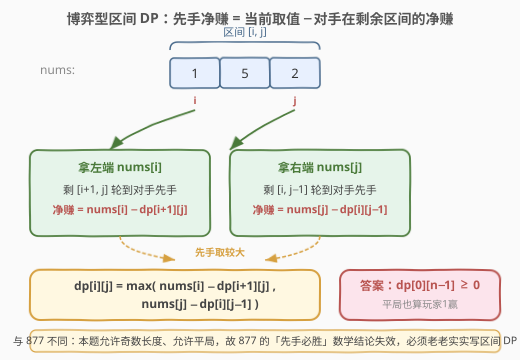
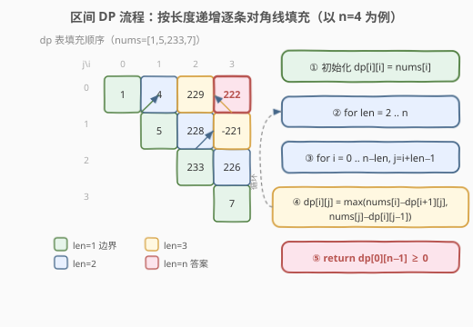
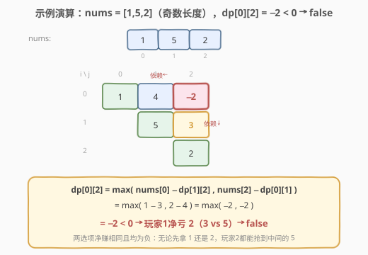

# LeetCode 预测赢家 题解

## 1. 题目概述

- **标题 / 题号**：预测赢家（#486，medium）
- **链接**：https://leetcode.cn/problems/predict-the-winner/
- **难度**：中等
- **标签**：数组、动态规划、博弈型区间 DP、递归、Minimax

**题意**：给定一个整数数组 `nums`。玩家 1 和玩家 2 轮流从数组的**任意一端**取一个数（玩家 1 先手）。每次只能取**最左**或**最右**那个数，取走后该数从数组中移除。当数组没有数字时游戏结束，得分高者获胜。

> 💡 **平局判定**：若两人得分**相等**，仍判定**玩家 1 获胜**（返回 `true`）。这是本题与 [877. 石子游戏](https://leetcode.cn/problems/stone-game/) 的关键差别之一。两人都采取**最优策略**。

返回 `true` 表示玩家 1 能成为赢家。

**示例 1**：

```text
输入：nums = [1,5,2]
输出：false
解释：玩家 1 可选 1 或 2。
  - 若玩家 1 选 1，剩 [5,2]，玩家 2 选 5，玩家 1 选 2 → 1:1 得 3，1:2 得 5，玩家 2 胜。
  - 若玩家 1 选 2，剩 [1,5]，玩家 2 选 5，玩家 1 选 1 → 1:1 得 3，1:2 得 5，玩家 2 胜。
两种情况玩家 2 都能拿到中间的 5，玩家 1 必败，返回 false。
```

**示例 2**：

```text
输入：nums = [1,5,233,7]
输出：true
解释：玩家 1 选 1，剩 [5,233,7]。
  - 若玩家 2 选 5，剩 [233,7]，玩家 1 选 233，玩家 2 选 7 → 1:1 得 234，1:2 得 12，玩家 1 胜。
  - 若玩家 2 选 7，剩 [5,233]，玩家 1 选 233，玩家 2 选 5 → 1:1 得 234，1:2 得 12，玩家 1 胜。
玩家 1 净赢 222，必胜。
```

**约束**：

- `1 <= nums.length <= 20`
- `0 <= nums[i] <= 10^7`
- `0 <= sum(nums[i]) <= 2^31 - 1`

> ⚠️ 本题是 [877. 石子游戏](https://leetcode.cn/problems/stone-game/) 的**无特殊约束母模板**：877 限定「偶数长度 + 奇数总和」，可被一行数学结论秒杀；而 486 **允许奇数长度、允许平局、元素可为 0**，数学结论失效，**必须老老实实写区间 DP**。面试中本题更能考察博弈型 DP 的真实掌握程度。

## 2. 解题思路

### 2.1 暴力思路：递归枚举博弈树

每一步先手有「拿左」或「拿右」两种选择，选定后剩余区间交给对手继续先手。两人都最优，需用递归枚举所有分支：先手在两选项中取最大、对手（成为新的先手）会让先手收益最小。复杂度 $O(2^n)$，`n = 20` 时 $2^{20} \approx 10^6$ 勉强可过，但存在大量重叠子问题（同一区间会被反复求解），天然适合记忆化或 DP。

### 2.2 核心观察：博弈型区间 DP（记录「净赚」）



关键在于**状态定义的巧妙转换**——不要分别记两人的得分，而是记：

> `dp[i][j]` = 当前玩家在区间 `nums[i..j]` 上**先手**时，能比对手**多拿**的分数（净赚）。

为什么这样定义有效？因为博弈是**零和**的：区间内的总分固定，先手多拿多少，后手就少拿多少。只需关心「差值」即可判断输赢。

对区间 `[i, j]`，先手只有两种拿法：

- **拿左端 `nums[i]`**：剩下 `[i+1, j]` 轮到对手先手。对手在 `[i+1, j]` 上的净赚是 `dp[i+1][j]`，于是先手的净赚为 `nums[i] − dp[i+1][j]`。
- **拿右端 `nums[j]`**：剩下 `[i, j-1]` 对手先手，净赚 `dp[i][j-1]`，先手净赚 `nums[j] − dp[i][j-1]`。

先手会选择两者中较大的：

$$
\text{dp}[i][j] = \max\bigl(\text{nums}[i] - \text{dp}[i+1][j],\ \ \text{nums}[j] - \text{dp}[i][j-1]\bigr)
$$

> 💡 **减号的含义**：先手这一手拿了 `nums[i]`，但随后对手在剩余区间里会成为「先手」并拿到净赚 `dp[i+1][j]`；从先手视角看，这部分净赚是**对手的**，要减去。这正是 Minimax「我选最大、对手选最小对我」的紧凑表达——一个 `max` 配一个减号，就同时编码了「我的最优」与「对手的最优（即对我最差）」。

**边界**：`dp[i][i] = nums[i]`（只剩一个数，先手直接拿走，对手 0，净赚即该数）。

**答案**：由于**平局也算玩家 1 赢**，判定条件是 `dp[0][n-1] >= 0`（而非 `> 0`）。这是与 877 的另一处关键差别。

### 2.3 算法流程图



按**区间长度**从短到长递推：长度 1 填主对角线，长度 2 填紧邻对角线，……，长度 `n` 填右上角 `dp[0][n-1]`。每个 `dp[i][j]` 只依赖其**下方** `dp[i+1][j]` 和**左方** `dp[i][j-1]`（二者长度均 `len−1`），因此按长度递增即可保证依赖已就绪。

### 2.4 示例演算

以示例 1 `nums = [1,5,2]` 为例（**奇数长度**，玩家 1 反而必败），填 `3×3` 的 dp 表：



| 长度 | 区间 `[i,j]` | 计算 | dp 值 |
|------|--------------|------|-------|
| 1 | `[0,0]` `[1,1]` `[2,2]` | 边界 = nums[i] | 1, 5, 2 |
| 2 | `[0,1]` | max(1−5, 5−1) = max(−4, 4) | 4 |
| 2 | `[1,2]` | max(5−2, 2−5) = max(3, −3) | 3 |
| 3 | `[0,2]` | max(1−dp[1][2], 2−dp[0][1]) = max(1−3, 2−4) = max(−2, −2) | −2 |

`dp[0][2] = −2 < 0`，玩家 1 净亏 2（玩家 1 得 3、玩家 2 得 5），返回 `false`。

> 💡 **为什么奇数长度会让先手吃亏？** `[1,5,2]` 中最大的 `5` 位于中间。无论先手拿左端 `1` 还是右端 `2`，都会把 `5` 暴露在某一端给后手。这正是 877 限定「偶数长度」的原因——偶数堆时先手可按下标奇偶分组全程控制，奇数长度则无此保证。本题正是剥离了这一保护，让 DP 的价值凸显。

## 3. 参考代码

### C++

```cpp
class Solution {
  public:
    bool predictTheWinner(vector<int>& nums) {
        int n = nums.size();
        vector<vector<int>> dp(n, vector<int>(n, 0));
        for (int i = 0; i < n; i++) dp[i][i] = nums[i];
        for (int len = 2; len <= n; len++) {        // 按区间长度递增
            for (int i = 0; i + len - 1 < n; i++) { // 枚举左端点
                int j = i + len - 1;                // 右端点
                dp[i][j] = max(nums[i] - dp[i + 1][j],
                               nums[j] - dp[i][j - 1]);
            }
        }
        return dp[0][n - 1] >= 0;                   // 平局也算赢
    }
};
```

### Python

```python
class Solution:
    def predictTheWinner(self, nums: List[int]) -> bool:
        n = len(nums)
        dp = [[0] * n for _ in range(n)]
        for i in range(n):
            dp[i][i] = nums[i]
        for length in range(2, n + 1):          # 按区间长度递增
            for i in range(n - length + 1):     # 枚举左端点
                j = i + length - 1              # 右端点
                dp[i][j] = max(nums[i] - dp[i + 1][j],
                               nums[j] - dp[i][j - 1])
        return dp[0][n - 1] >= 0               # 平局也算赢
```

> 💡 **空间优化**：`dp[i][j]` 只依赖「下一行」`dp[i+1][j]` 和「同行左侧」`dp[i][j-1]`。若固定 `i` 从右向左扫 `j`，可用**一维数组** `dp[j]` 滚动，空间降到 $O(n)$：
>
> ```python
> dp = nums[:]
> for i in range(n - 2, -1, -1):       # 从倒数第二行往上
>     for j in range(i + 1, n):        # 同行从左往右扫右端点
>         dp[j] = max(nums[i] - dp[j], nums[j] - dp[j - 1])
> return dp[n - 1] >= 0
> ```
>
> 面试时可主动提出以加分。

## 4. 复杂度分析

| 维度 | 复杂度 | 说明 |
|------|--------|------|
| 时间复杂度 | $O(n^2)$ | 两重循环按区间长度与左端点枚举，共约 $n^2/2$ 个状态，每个 $O(1)$ 转移 |
| 空间复杂度 | $O(n^2)$ | 二维 dp 表；一维滚动可优化至 $O(n)$ |

> 💡 本题 $n \le 20$，$O(n^2)$ 绰绰有余。即便用 $O(2^n)$ 的纯递归也可过（$2^{20} \approx 10^6$），但面试中应给出 DP 解以体现对重叠子问题的识别能力。

## 5. 扩展：记忆化递归与 Minimax 视角

### 5.1 记忆化递归（自顶向下）

区间 DP 也可写成自顶向下的记忆化搜索，状态定义与转移完全一致，只是把「按长度递推」换成「递归 + memo 缓存」：

```python
from functools import lru_cache

class Solution:
    def predictTheWinner(self, nums: List[int]) -> bool:
        @lru_cache(None)
        def dfs(i: int, j: int) -> int:
            if i == j:
                return nums[i]
            return max(nums[i] - dfs(i + 1, j), nums[j] - dfs(i, j - 1))
        return dfs(0, len(nums) - 1) >= 0
```

> 💡 **自顶向下 vs 自底向上**：记忆化递归更贴近「博弈树」的直觉（直接表达「我先手在 `[i,j]` 上的最优净赚」），代码也更短；迭代 DP 则无递归栈开销、便于空间优化。两者状态同构，面试任选其一即可，可主动提及另一种以展示全面性。

### 5.2 Minimax 与「净赚」的等价性

`dfs(i, j)` 返回「当前先手在 `[i,j]` 的净赚」，其递推 `max(nums[i] − dfs(i+1,j), nums[j] − dfs(i,j−1))` 中的**减号**等价于 Minimax 中的 `min`：

$$
\text{净赚}(i,j) = \max\bigl(\text{nums}[i] - \text{净赚}(i+1,j),\ \text{nums}[j] - \text{净赚}(i,j-1)\bigr)
$$

若改写成「先手得分」的显式 Minimax 形式，需同时维护「当前轮到谁」并交替 `max`/`min`，状态多一个维度。**净赚定义把对手的最优（对我最差）吸收进了减号**，于是无论轮到谁，转移都只需一个 `max`——这是博弈型零和 DP 的通用化简技巧。

### 5.3 与 877 的对照

| 维度 | 486 预测赢家 | 877 石子游戏 |
|------|--------------|--------------|
| 数组长度 | 奇偶皆可 | **必须偶数** |
| 元素值 | 可为 0 | 正整数 |
| 总和 | 任意 | **奇数**（无平局） |
| 平局判定 | **平局算玩家 1 赢**（`≥ 0`） | 无平局（`> 0`） |
| 数学结论 | 无，必须 DP | 先手必胜（`return True`） |
| DP 框架 | 完全一致 | 完全一致 |

> ⚠️ 877 的「先手必胜」trick 依赖「偶数长度 + 奇数总和」两个约束同时成立。本题放松了这两个约束，故 trick 失效——这正是 486 作为**母模板**的意义：掌握 486 的区间 DP，877 只是它的一个特例。

## 6. 面试要点

1. **为什么用「净赚」而不是分别记两人得分？**
   - 博弈是零和的：区间总分固定，先手多拿的即后手少拿的。用「差值」一维量即可刻画状态，转移只需一个 `max`，比维护 `(我的分, 对手分)` 二元组更简洁，也天然消除「当前轮到谁」的额外维度。

2. **状态转移里为什么是减号 `nums[i] − dp[i+1][j]`？**
   - 先手拿 `nums[i]` 后，**身份互换**：对手成为剩余区间 `[i+1,j]` 的先手，会拿到净赚 `dp[i+1][j]`。从原先手视角，这部分是对手的收益，要从自己的净赚里扣除。一个 `max` 配一个减号，同时编码了「我选最优」与「对手选最优（即对我最差）」。

3. **答案为什么是 `>= 0` 而不是 `> 0`？**
   - 题目规定两人得分**相等时玩家 1 仍获胜**。`dp[0][n-1] = 0` 表示净赚为 0（平局），此时应返回 `true`，故用 `>= 0`。这是与 877 的关键差别（877 总和为奇数不可能平局，用 `> 0` 即可）。

4. **区间 DP 为什么要按长度递增枚举？**
   - `dp[i][j]` 依赖更短的区间 `[i+1,j]`（长 `len−1`）和 `[i,j-1]`（长 `len−1`）。按长度从小到大填充，可保证计算当前状态时其依赖已全部就绪，避免递归栈开销。

5. **`nums = [1,5,2]` 为什么先手必败？**
   - 最大的 `5` 在中间，先手无论拿左 `1` 还是右 `2`，都会把 `5` 暴露给后手。这揭示了「奇数长度 + 最大值居中」时先手的劣势——也解释了 877 为何要限定偶数长度（先手可按下标奇偶分组全程控制）。

## 同类练习题

| # | 题目 | 与本题的关联 |
|---|------|-------------|
| 877 | [石子游戏](https://leetcode.cn/problems/stone-game/)（[题解](../0801-0900/877_石子游戏.md)） | 本题的「偶数长度 + 奇数总和」特例，DP 模板完全一致，另有一行数学结论可秒杀 |
| 1690 | [石子游戏 VII](https://leetcode.cn/problems/stone-game-vii/) | 拿走一堆后得分由「区间剩余和」决定，转移改为 `min` 而非 `max`（对手会让你拿得少），仍是博弈型区间 DP |
| 1140 | [石子游戏 II](https://leetcode.cn/problems/stone-game-ii/) | 从「两端取」改为「左端取 M 堆」，博弈 DP + 前缀和，体会状态定义随取法变化 |
| 312 | [戳气球](https://leetcode.cn/problems/burst-balloons/) | 区间 DP 经典，按「最后戳的位置」而非「两端」划分区间，对比两种切分方式 |
| 1039 | [多边形三角剖分的最低得分](https://leetcode.cn/problems/minimum-score-triangulation-of-polygon/) | 区间 DP 在环形结构上的变体，转移枚举中间分割点 |
