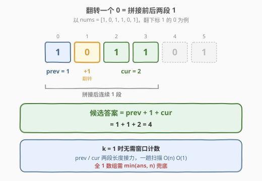
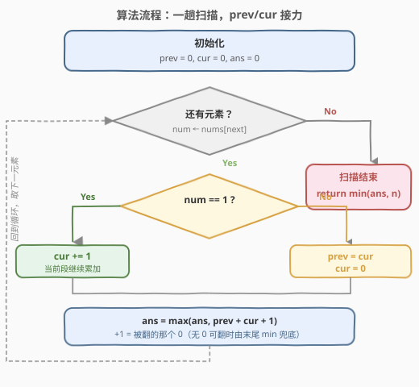
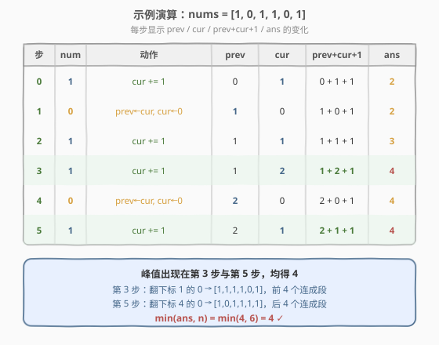

# LeetCode 最大连续1的个数 II 题解

## 1. 题目概述

- **标题 / 题号**：最大连续1的个数 II（#487，medium）
- **链接**：https://leetcode.cn/problems/max-consecutive-ones-ii/
- **难度**：中等
- **标签**：数组、滑动窗口、双指针、状态机

**题意**：给定一个二进制数组 `nums`，**最多可以把一个 `0` 翻转为 `1`**，求翻转后数组中**连续 `1` 的最大长度**。

> ⚠️ 必须至多翻转**一个** `0`；若数组全为 `1`（没有 `0` 可翻），答案就是数组长度本身。

**示例 1**：

```text
输入：nums = [1,0,1,1,0]
输出：4
解释：翻转下标 1 的 0（或下标 4 的 0），得到 [1,1,1,1,0]，连续 1 长度为 4。
```

**示例 2**：

```text
输入：nums = [1,0,1,1,0,1]
输出：4
解释：翻转下标 4 的 0，得到 [1,0,1,1,1,1]，末尾连续 1 长度为 4。
```

**约束**：

- $1 \leq \text{nums.length} \leq 10^5$
- `nums[i]` 为 `0` 或 `1`

> 💡 关键转化：翻转一个 `0` 等价于**把左右两段连续 `1` 用这一个 `0` 拼起来**。所以答案 = 「某段前缀 `1` 的长度」+ 「中间一个被翻的 `0`」+ 「紧随其后的另一段 `1` 的长度」。这天然引出**双段拼接**的视角——只需维护「上一段 `1` 的长度」和「当前段 `1` 的长度」即可 $O(n)$ 一趟扫描搞定，无需显式维护窗口与计数。

## 2. 解题思路

### 2.1 暴力思路

枚举每一个 `0` 作为「被翻转的那个」，向左右两侧扩展统计连续 `1` 的长度，三者相加取最大；再单独考虑「不翻转任何 `0`」（即原数组最长连续 `1`）的情况。每个 `0` 两侧扩展最坏 $O(n)$，共 $O(n)$ 个 `0`，总复杂度 $O(n^2)$，$n=10^5$ 时不可行。

> 💡 暴力的浪费在于：相邻 `0` 之间的那段 `1` 被反复扫描。其实**每段连续 `1` 的长度只需算一次**，扫描时把「刚结束的那段 `1`」记下来，遇到下一个 `0` 就能直接拼出候选答案——这就是 $O(n)$ 一趟扫描的由来。

### 2.2 核心观察：prev + cur 双段拼接



把数组看成「若干段连续 `1` 被 `0` 分隔」的序列。翻转某一个 `0` 时，答案就是它**左侧那段 `1` 的长度 `prev`** 加上**这个被翻的 `0`（贡献 1）**再加上**右侧那段 `1` 的长度 `cur`**：

$$
\text{候选答案} = \text{prev} + 1 + \text{cur}
$$

于是只需在扫描过程中维护两个变量：

- **`prev`**：最近一个被翻 `0` **左边那段 `1` 的长度**（即「上一段 `1` 的长度」）；
- **`cur`**：当前正在累加的这段 `1` 的长度。

扫描规则：

- 遇到 `1`：`cur += 1`；
- 遇到 `0`：当前段 `cur` 结束，它成为下一段的「上一段」，于是 `prev = cur; cur = 0`；
- 每一步都更新 $\text{ans} = \max(\text{ans},\ \text{prev} + \text{cur} + 1)$，其中 `+1` 预留给「被翻的那个 `0`」。

> ⚠️ **关于 `+1` 与全 `1` 数组**：当数组中没有 `0` 时，`prev` 始终为 `0`，公式给出 `cur + 1`，会比真实答案多算 1（因为没有 `0` 可翻）。所以最终返回 $\min(\text{ans},\ n)$ 即可。这个 `min` 是唯一需要兜底的边界，逻辑其余部分都成立。

> 💡 **为什么不用维护「窗口里 0 的个数」？** 因为 $k=1$ 是常数，窗口里至多一个 `0`——这把「滑动窗口 + 计数」退化成「两段 `1` 拼一个 `0`」的极简状态机。维护 `prev/cur` 两个整数即可，无需 `cnt` 数组或双指针。一旦 $k$ 变大（见第 5 节的 1004），就要回到完整的滑动窗口模板。

### 2.3 算法流程图



维护状态：

- `prev = 0`：上一段 `1` 的长度；
- `cur = 0`：当前段 `1` 的长度；
- `ans = 0`：答案。

对每个 `num ∈ nums`：

1. 若 `num == 1`：`cur += 1`；
2. 若 `num == 0`：`prev = cur; cur = 0`（当前段交付给 prev，开启新段）；
3. 更新 `ans = max(ans, prev + cur + 1)`。

扫描结束后返回 `min(ans, n)`。

> 💡 第 3 步的 `+1` 始终代表「当前可翻的那个 `0`」——若刚遇到 `0`，它就是被翻的这个；若还在累加 `cur`，它指向 `prev` 与 `cur` 之间那个 `0`（若 `prev>0`）或仅作占位（若 `prev=0`，由末尾 `min` 兜底）。

### 2.4 示例演算

以 `nums = [1,0,1,1,0,1]`（$n=6$，预期答案 4）为例：



| 步 | num | 动作 | prev | cur | prev+cur+1 | ans |
|----|-----|------|------|-----|------------|-----|
| 0 | 1 | cur++ | 0 | 1 | 2 | 2 |
| 1 | 0 | prev←cur, cur←0 | 1 | 0 | 2 | 2 |
| 2 | 1 | cur++ | 1 | 1 | 3 | 3 |
| 3 | 1 | cur++ | 1 | 2 | 4 | 4 |
| 4 | 0 | prev←cur, cur←0 | 2 | 0 | 3 | 4 |
| 5 | 1 | cur++ | 2 | 1 | 4 | 4 |

扫描结束 `ans = 4`，`min(4, 6) = 4` ✓。对应翻转下标 4 的 `0`，把前段 `1,1`（下标 2–3）与后段 `1`（下标 5）拼成 `1,1,1,1`。

> 💡 第 3 步是关键拐点：`prev=1`（下标 0 那段 `1`）、`cur=2`（下标 2–3 那段 `1`），中间翻下标 1 的 `0`，得到 `1+1+2=4`。第 5 步再次出现 `prev+cur+1=2+1+1=4`，对应翻下标 4 的 `0`——两种翻法都达到最大值 4。

## 3. 参考代码

### C++

```cpp
class Solution {
  public:
    int findMaxConsecutiveOnes(vector<int>& nums) {
        int prev = 0, cur = 0, ans = 0;
        for (int num : nums) {
            if (num == 1) {
                ++cur;
            } else {
                prev = cur;
                cur = 0;
            }
            ans = max(ans, prev + cur + 1);
        }
        return min(ans, (int)nums.size());
    }
};
```

### Python

```python
class Solution:
    def findMaxConsecutiveOnes(self, nums: List[int]) -> int:
        prev = cur = ans = 0
        for num in nums:
            if num == 1:
                cur += 1
            else:
                prev, cur = cur, 0
            ans = max(ans, prev + cur + 1)
        return min(ans, len(nums))
```

> ⚠️ 末尾的 `min(ans, n)` 不可省：它兜底「数组中没有 `0`」时公式多算的 1。若面试官保证数组至少含一个 `0`，则可直接返回 `ans`。

## 4. 复杂度分析

| 维度 | 复杂度 | 说明 |
|------|--------|------|
| 时间复杂度 | $O(n)$ | 单趟扫描，每个元素 $O(1)$ 状态更新与答案更新 |
| 空间复杂度 | $O(1)$ | 仅 `prev/cur/ans` 三个整数变量，无额外数据结构 |

> 💡 这是该题的最优解：$k=1$ 的特殊性把通用滑动窗口压缩成两段长度接力，常数极小。即便推广到任意 $k$（1004 题），滑动窗口仍是 $O(n)$，但常数会回升。

## 5. 扩展：推广到任意 $k$ —— 滑动窗口与 1004 题

当可翻转的 `0` 数量从 1 推广到任意 $k$ 时，「双段拼接」的状态机不再适用（需要同时记住 $k$ 段 `1` 的长度），应回到**通用滑动窗口**：

维护窗口 $[l, r]$ 与窗口内 `0` 的计数 `zero`：

- `right` 右移扩张，遇 `0` 则 `zero += 1`；
- 一旦 `zero > k`（非法），`left` 右移收缩，遇 `0` 则 `zero -= 1`，直到 `zero <= k`；
- 答案 = 窗口最大长度。

```python
def longestOnes(nums, k):                 # 1004 题通用版
    zero = left = ans = 0
    for right, x in enumerate(nums):
        if x == 0:
            zero += 1
        while zero > k:                   # 非法时收缩到合法
            if nums[left] == 0:
                zero -= 1
            left += 1
        ans = max(ans, right - left + 1)
    return ans
```

$k=1$ 时这段代码同样正确，是 487 的另一可写法。但在 $k=1$ 这一特例下，本题主解的 `prev/cur` 写法**无需 `while` 收缩、无需计数器**，更短更快，是面试中能拿满分的优雅解。

> 💡 **「不收缩」技巧**（详见 [424. 替换后的最长重复字符](../0401-0500/424_替换后的最长重复字符.md)）同样适用于 1004：把 `while` 改为 `if`，让窗口大小只增不减，可把内层收缩均摊为 $O(n)$。对 487 而言，由于 $k=1$，`prev/cur` 已是更简洁的等价写法，不必再套「不收缩」模板。

## 6. 面试要点

1. **为什么翻转一个 `0` 等价于「拼两段 `1`」？**
   - 翻转的 `0` 恰好位于两段连续 `1` 之间，翻转后它们连成一段，长度 = 左段 + 1 + 右段。没有第三段参与，所以只需 `prev/cur` 两段即可覆盖所有候选。

2. **遇到 `0` 时为什么是 `prev = cur; cur = 0` 而不是别的？**
   - 遇到 `0` 表示当前段 `cur` 刚结束。这个 `0` 就是「下一个候选要翻的位置」，它的左侧段正是刚结束的 `cur`，所以 `cur` 接力成 `prev`；而右侧新段从 0 开始重新累加。

3. **`ans = max(ans, prev + cur + 1)` 里的 `+1` 何时有效、何时多算？**
   - 当 `prev > 0`（说明前面已有一个可翻的 `0` 把 `prev` 段与 `cur` 段隔开）时，`+1` 精确代表那个被翻的 `0`。当 `prev = 0`（数组开头还没遇到 `0`，或刚翻过一个 `0` 后右侧新段还没遇到下一个 `0`）时，`+1` 是占位的多算，由末尾 `min(ans, n)` 兜底。

4. **为什么最后要 `min(ans, n)`？**
   - 全 `1` 数组没有 `0` 可翻，公式始终多算 1（`prev=0` 时的占位 `+1`）。`min(ans, n)` 把这种情况夹回正确值，其余情况 `ans ≤ n` 自然不变。

5. **如果 $k$ 不是 1 怎么办？**
   - 「双段拼接」依赖「窗口里至多一个 `0`」的常数前提；$k>1$ 时需要同时记多段长度，状态会膨胀。应改用通用滑动窗口（窗口内 `0` 计数 $\leq k$），即 [1004. 最大连续1的个数 III](https://leetcode.cn/problems/max-consecutive-ones-iii/)。这是 487 的直接泛化版。

## 同类练习题

| # | 题目 | 与本题的关联 |
|---|------|-------------|
| 485 | [最大连续1的个数](https://leetcode.cn/problems/max-consecutive-ones/) | 本题的 $k=0$ 版（不翻转），一趟扫描数最长 `1` 段，是 487 的退化基础。 |
| 1004 | [最大连续1的个数 III](https://leetcode.cn/problems/max-consecutive-ones-iii/) | 本题的 $k$ 任意版，通用滑动窗口解法，强烈推荐对照练习以理解「$k=1$ 特例为何能压缩成 `prev/cur`」。 |
| 424 | [替换后的最长重复字符](../0401-0500/424_替换后的最长重复字符.md) | 同为「至多改 $k$ 个」的滑动窗口，判定式「窗口长度 − 最大频次 $\leq k$」与 1004 的「窗口内 `0` 数 $\leq k$」同构，可对照「不收缩」技巧。 |
| 209 | [长度最小的子数组](../0201-0300/209_长度最小的子数组.md) | 滑动窗口求「最短合法」，对比本题求「最长合法」的收缩方向差异。 |
| 3 | [无重复字符的最长子串](../0001-0100/3_无重复字符的最长子串.md) | 滑动窗口祖师题，对照「窗口内至多一个某物」的通用收缩模板。 |
