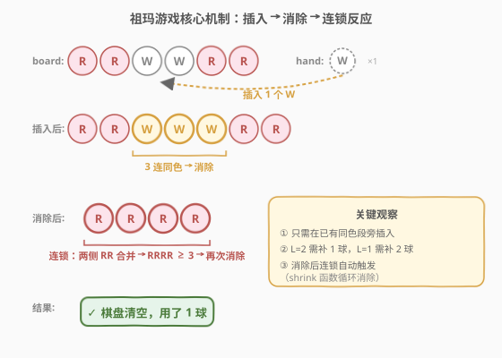
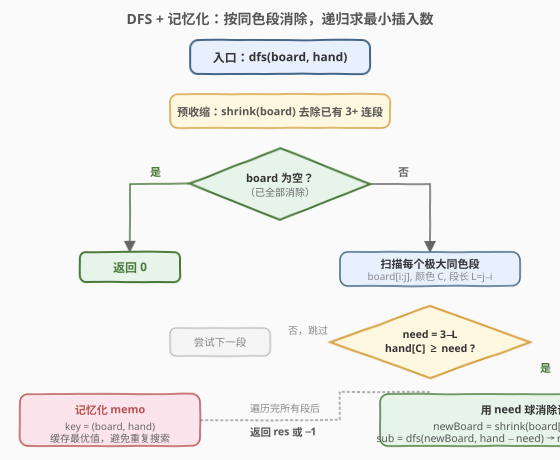
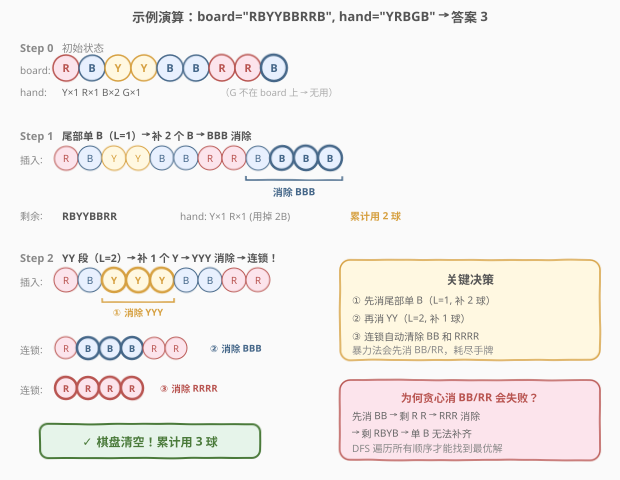

# LeetCode 祖玛游戏 题解

## 1. 题目概述

- **标题 / 题号**：祖玛游戏（#488，hard）
- **链接**：https://leetcode.cn/problems/zuma-game/
- **难度**：困难
- **标签**：深度优先搜索、记忆化搜索、字符串、回溯

**题意**：你在玩祖玛游戏的一个变体。棋盘上有一排球，手里也持有若干球。每次操作可以**从手中取一个球插入棋盘任意位置**；若插入后棋盘上出现 **3 个或以上连续同色球**，该组立即被消除；消除后两侧若因合并再次形成 3+ 连续同色，则**连锁消除**，直到没有可消段为止。

目标：用**最少**的球清空整个棋盘。若无法清空返回 $-1$。

> 💡 一句话理解：每次插入一个球，触发「消除 → 连锁」机制；问最少插入几次能把棋盘变空。本质是一个**最优化搜索问题**——状态 = (棋盘, 手牌)，操作 = 在同色段旁插入球。

**球的颜色**：`R`（红）、`Y`（黄）、`B`（蓝）、`G`（绿）、`W`（白）。

**示例 1**：

```text
输入：board = "WRRBBW", hand = "RB"
输出：-1
解释：无论先消 RR 还是 BB，最后都会剩 WW（手中无 W），无法清空。
```

**示例 2**：

```text
输入：board = "WWRRBBWW", hand = "WRBRW"
输出：2
解释：插入 R 消除 RR → WWBBWW；插入 B 消除 BB → WWWW → 连锁消除 → 清空。
```

**示例 3**：

```text
输入：board = "G", hand = "GGGGG"
输出：2
解释：单球 G（L=1），需补 2 个 G → GGG → 消除 → 清空。
```

**示例 4**：

```text
输入：board = "RBYYBBRRB", hand = "YRBGB"
输出：3
解释：先补 2B 消尾部单 B → RBYYBBRR；再补 1Y 消 YY → 连锁消除 BB → 连锁消除 RRRR → 清空。
```

**约束**：

- $1 \le \text{board.length} \le 16$
- $1 \le \text{hand.length} \le 5$
- `board` 和 `hand` 仅由 `'R'`、`'Y'`、`'B'`、`'G'`、`'W'` 组成

> ⚠️ **三个易错点**：① **消除后要循环检查连锁**——一次插入可能触发多轮消除（如示例 4 中 YYY → BBB → RRRR 三连锁）；② **不能贪心**——先消哪段直接影响后续连锁链路，示例 4 中先消 BB/RR 会耗尽手牌导致失败；③ **单球段（L=1）需补 2 球**——容易误认为只需 1 球。

## 2. 解题思路

### 2.1 暴力思路

每次从手中取一个球，尝试插入棋盘的**每个位置**（$n$ 个位置），触发消除与连锁后得到新棋盘，递归搜索。用 BFS 求最少步数——每层代表一次插入。

但这样分支因子太大：$n$ 个位置 × $5$ 种颜色 = 每步 $5n$ 个分支，$n \le 16$、手牌 $\le 5$，最坏搜索空间极庞大。

> 💡 暴力法的核心浪费：**绝大多数插入位置无意义**——把球插到异色球之间不会形成 3 连，白白浪费一个球。我们只需考虑「能让某个同色段凑到 3」的插入。

### 2.2 核心观察：按同色段消除 + 记忆化



**观察①：只需在已有同色段旁插入**

一次插入有价值，当且仅当它使某个同色段从 $<3$ 凑到 $\ge 3$。插入异色球到两段之间不形成任何 3 连，纯属浪费。因此：

- 将棋盘划分为**极大同色段**，每段颜色 $C$、长度 $L$。
- 预收缩后所有段 $L \in \{1, 2\}$（$L \ge 3$ 的段已被消除）。
- 对段长 $L$，恰好需要 $\text{need} = 3 - L$ 个同色球即可消除（$L=2 \to 1$ 球，$L=1 \to 2$ 球）。

**观察②：消除一段后，连锁自动处理**

消除段 $[i, j)$ 后，棋盘变为 $\text{board}[:i] + \text{board}[j:]$，再执行 `shrink`（循环消除 3+ 连段）。两侧同色段可能合并并触发连锁——这部分由 `shrink` 函数统一处理，无需手动枚举。

**观察③：记忆化避免重复搜索**

状态 = `(board, hand)`。不同消除顺序可能到达同一状态。用 `memo` 缓存 `(board, hand) → 最少步数`，避免重复搜索。`board` 是字符串、`hand` 编码为排序元组，均可哈希。

**剪枝**：若棋盘上某颜色的总数（棋盘 + 手牌）$< 3$，则该颜色永远无法凑出 3 连，直接返回 $-1$。

> 💡 **识别信号**：$n \le 16$、$m \le 5$ → 状态空间有限 → DFS + 记忆化；「最优化」+「操作改变状态」→ 递归取最小值；「同色段」是天然的搜索单元。

### 2.3 算法流程图



DFS 自顶向下，对每个状态 `(board, hand)`：

1. **预收缩**：`board = shrink(board)`，去除已有 3+ 连段。
2. **终止**：若 `board` 为空，返回 $0$（无需再插入）。
3. **查 memo**：若已计算过，直接返回缓存值。
4. **枚举段**：扫描 `board` 的每个极大同色段 $[i, j)$，颜色 $C$，段长 $L = j - i$。
5. **尝试消除**：若 `hand[C] >= need`（$\text{need} = 3 - L$），消耗 `need` 个球，计算新棋盘 `shrink(board[:i] + board[j:])`，递归 `dfs(newBoard, newHand)`。
6. **取最小**：`res = min(res, need + sub)`。若所有段都不可行，返回 $-1$。
7. **写 memo**：缓存结果。

> ⚠️ **为何只需考虑整段消除**：插入球的目的就是让某段达到 3。插入 $\text{need}$ 个同色球后该段恰为 3，被 `shrink` 消除。插入位置不影响结果（段内任意位置插入，消除后棋盘相同）。因此无需枚举插入位置，只需枚举「消除哪一段」。

### 2.4 示例演算



以 `board = "RBYYBBRRB"`、`hand = "YRBGB"`（即 $Y \times 1, R \times 1, B \times 2, G \times 1$）为例。

**预分析**：`G` 不在棋盘上 → 插入 G 无意义，实际可用手牌为 $\{Y:1, R:1, B:2\}$。各颜色总数均 $\ge 3$，剪枝通过。预收缩后棋盘不变（无 3+ 连段）。

**段划分**：`R | B | YY | BB | RR | B`，段长依次为 $1,1,2,2,2,1$。

**DFS 搜索**（展示最优路径）：

| 步骤 | 操作 | 消耗 | 棋盘变化 | 手牌剩余 |
|------|------|------|----------|----------|
| 1 | 消尾部单 `B`（L=1, 补 2B） | 2B | `RBYYBBRRB` → `RBYYBBRR` | Y×1, R×1 |
| 2 | 消 `YY`（L=2, 补 1Y） | 1Y | `RBYYBBRR` → 插Y → `RBYYYBBRR` → 消YYY → `RBBBRR` → 消BBB → `RRR` → 消RRR → `` | R×1 |
| — | 连锁清空 | 0 | 棋盘为空 | — |

**连锁详解**（Step 2 的 `shrink` 过程）：

1. 插入 Y → `RB` **`YYY`** `BBRR` → 消除 `YYY` → `R` **`BBB`** `RR`
2. 消除 `BBB` → **`RRR`** → 消除 `RRR` → 空

三轮连锁，全部清空。**累计消耗 $2 + 1 = 3$ 球**。

> ⚠️ **为何贪心先消 BB/RR 会失败**：若先消 BB（补 1B）→ `RBYY` `RRB` → 消 BB → `RBYYRRB`；再消 RR（补 1R）→ `RBYYB`；再消 YY（补 1Y）→ `RBB` → 消 BB（补 1B，但 B 已用完）→ 失败。DFS 会尝试所有顺序，找到先消尾部 B 的最优解。

## 3. 参考代码

### C++

```cpp
class Solution {
  public:
    int findMinStep(string board, string hand) {
        // 手牌编码为 5 字符计数串 "RYBGW" -> '0'+count
        string handKey(5, '0');
        for (char c : hand) handKey[idx(c)]++;

        // 剪枝：棋盘上每个颜色总数(棋盘+手牌) >= 3
        int total[5] = {0};
        for (char c : board) total[idx(c)]++;
        for (char c : hand) total[idx(c)]++;
        for (char c : board)
            if (total[idx(c)] < 3) return -1;

        board = shrink(board);
        map<pair<string, string>, int> memo;
        return dfs(board, handKey, memo);
    }

  private:
    int idx(char c) {
        switch (c) {
            case 'R': return 0;
            case 'Y': return 1;
            case 'B': return 2;
            case 'G': return 3;
            case 'W': return 4;
        }
        return -1;
    }

    // 循环消除所有 3+ 连续同色段
    string shrink(string s) {
        bool changed = true;
        while (changed) {
            changed = false;
            int i = 0, n = s.size();
            while (i < n) {
                int j = i;
                while (j < n && s[j] == s[i]) j++;
                if (j - i >= 3) {
                    s.erase(i, j - i);
                    changed = true;
                    break;
                }
                i = j;
            }
        }
        return s;
    }

    int dfs(string board, string handKey,
            map<pair<string, string>, int>& memo) {
        if (board.empty()) return 0;

        auto key = make_pair(board, handKey);
        auto it = memo.find(key);
        if (it != memo.end()) return it->second;

        int res = INT_MAX;
        int i = 0, n = board.size();
        while (i < n) {
            int j = i;
            while (j < n && board[j] == board[i]) j++;
            int ci = idx(board[i]);
            int need = 3 - (j - i);          // L=2 -> 1, L=1 -> 2
            if (handKey[ci] - '0' >= need) {
                handKey[ci] -= need;          // 消耗
                string newBoard = shrink(board.substr(0, i) + board.substr(j));
                int sub = dfs(newBoard, handKey, memo);
                if (sub != -1) res = min(res, need + sub);
                handKey[ci] += need;          // 回溯
            }
            i = j;
        }

        int ans = (res == INT_MAX) ? -1 : res;
        memo[key] = ans;
        return ans;
    }
};
```

### Python

```python
import re
from functools import lru_cache
from collections import Counter


class Solution:
    def findMinStep(self, board: str, hand: str) -> int:
        def shrink(s: str) -> str:
            """循环消除所有 3+ 连续同色段"""
            prev = None
            while prev != s:
                prev = s
                s = re.sub(r'(.)\1{2,}', '', s)
            return s

        # 剪枝：棋盘上每个颜色总数(棋盘+手牌) >= 3
        total = Counter(board) + Counter(hand)
        for c in set(board):
            if total[c] < 3:
                return -1

        hand_cnt = Counter(hand)

        @lru_cache(None)
        def dfs(board: str, hand_key: tuple) -> int:
            if not board:
                return 0

            hand = dict(hand_key)
            res = float('inf')
            i = 0
            n = len(board)
            while i < n:
                j = i
                while j < n and board[j] == board[i]:
                    j += 1
                color = board[i]
                need = 3 - (j - i)               # L=2 -> 1, L=1 -> 2
                if hand.get(color, 0) >= need:
                    new_hand = dict(hand)
                    new_hand[color] -= need
                    if new_hand[color] == 0:
                        del new_hand[color]
                    new_board = shrink(board[:i] + board[j:])
                    sub = dfs(new_board, tuple(sorted(new_hand.items())))
                    if sub != -1:
                        res = min(res, need + sub)
                i = j

            return res if res != float('inf') else -1

        board = shrink(board)
        return dfs(board, tuple(sorted(hand_cnt.items())))
```

> ⚠️ **两个易错点**：
> 1. **`shrink` 必须循环到不变**——单次扫描只能消除一轮 3+ 连段，消除后两侧合并可能产生新的 3+ 连段（连锁），必须 `while` 循环直到棋盘不再变化。Python 版用 `re.sub(r'(.)\1{2,}', '', s)` 配合 `while` 循环；C++ 版手动扫描 + `erase` + `break` 重启。
> 2. **手牌编码需可哈希**——Python 用 `tuple(sorted(Counter.items()))` 作为 `lru_cache` 的 key；C++ 用 5 字符计数串 `"01200"`（`'0' + count`）作为 `map` key，修改后需回溯恢复。

## 4. 复杂度分析

| 维度 | 复杂度 | 说明 |
|------|--------|------|
| **时间** | $O(S \cdot n)$ | $S$ 为不同 `(board, hand)` 状态数；每个状态扫描 $O(n)$ 段 + `shrink` $O(n)$。状态数上界约 $O(\binom{n+m}{m} \cdot 2^m)$，实际远小于上界 |
| **空间** | $O(S \cdot n)$ | `memo` 存储所有状态；递归栈深 $O(m)$（最多 $m$ 次插入） |
| **实际** | 极快 | $n \le 16, m \le 5$，记忆化大幅去重；剪枝（总数 $< 3$）提前排除无解情况 |

> 💡 **状态数为何可控**：每次操作消耗 1–2 个手牌，递归深度 $\le 5$；每层至多 $\le 8$ 个段（$n = 16$，段交替颜色）。`shrink` 后棋盘往往大幅缩短，状态空间迅速收敛。最坏情况已被约束条件 $n \le 16, m \le 5$ 牢牢限制。

## 5. 扩展：BFS 与 DFS 的对比

**BFS 解法**：将 `(board, hand)` 作为节点，每次插入一个球为一条边，BFS 求最短路。天然得到最少步数（首层到达空棋盘的步数）。但 BFS 的状态去重需要 `visited` 集合，且每层分支因子大（$n \times 5$），实际常数比 DFS + 记忆化大。

**DFS + 记忆化的优势**：
- **剪枝更灵活**：可利用 `res` 上界剪枝（当前步数 $\ge$ 已知最优则跳过）。
- **记忆化粒度更细**：BFS 的 `visited` 是「是否访问过」，DFS 的 `memo` 是「该状态的最优值」，信息量更大。
- **按段消除减少分支**：DFS 只枚举「消哪段」，BFS 若按位置枚举则分支更多。

**手牌计数 vs 手牌字符串**：两种手牌表示等价。计数法（`Counter` / 计数串）更紧凑、比较更快；字符串法（排序后的手牌）更直观。本题手牌 $\le 5$，两者差异可忽略。

> 💡 本题与 [652. 寻找重复子树](https://leetcode.cn/problems/find-duplicate-subtrees/)、[291. 单词规律 II](https://leetcode.cn/problems/word-pattern-ii/) 同属「状态空间搜索 + 记忆化」范式：状态编码 + 哈希去重是核心加速手段。

## 6. 面试要点

1. **为什么只需考虑在已有同色段旁插入球？**

   - 插入异色球到两段之间不形成 3 连，浪费一个球且棋盘只增不减。只有让某同色段从 $< 3$ 凑到 $\ge 3$ 才有消除效果。因此枚举「消除哪个段」而非「插入哪个位置」。

2. **`shrink` 为什么要循环？**

   - 一次消除后，被消段两侧的同色段可能合并。例如 `RRWWWRR` 消除 `WWW` 后 `RR` + `RR` = `RRRR` $\ge 3$，需再次消除。必须循环直到棋盘不再变化，才能正确处理连锁。

3. **记忆化的 key 为什么是 `(board, hand)` 而非仅 `board`？**

   - 同一个 `board` 配不同 `hand` 时，能消除的段不同、后续搜索空间不同，最优解也不同。必须把手牌纳入状态。手牌用排序元组（Python）或计数串（C++）编码以保证可哈希。

4. **剪枝「总数 < 3 返回 -1」为什么正确？**

   - 若某颜色在棋盘上出现但总数（棋盘 + 手牌）$< 3$，则该颜色永远无法凑出 3 连段，棋盘上至少剩一个该色球 → 必然无法清空 → 返回 $-1$。这是必要条件（非充分），不会误杀有解情况。

5. **示例 4 中为什么不能贪心先消 BB 或 RR？**

   - 先消 BB 消耗 1B，再消 RR 消耗 1R，再消 YY 消耗 1Y 后剩 `RBB`，需再消 BB 但 B 已用完。而先消尾部单 B（补 2B）虽消耗更多，但为后续 YY 消除后的连锁（BBB → RRRR）创造了条件。DFS 遍历所有顺序才能找到这种「先付出后收益」的最优解。

## 同类练习题

| # | 题目 | 与本题的关联 |
|---|------|-------------|
| 773 | [滑动谜题](https://leetcode.cn/problems/sliding-puzzle/) | 状态空间 BFS 求最少步数，同样用 `(board)` 编码状态 + `visited` 去重，8-puzzle 经典 |
| 652 | [寻找重复子树](https://leetcode.cn/problems/find-duplicate-subtrees/)（[题解](../0601-0700/652_寻找重复子树.md)） | 树结构序列化编码 + 哈希去重，记忆化思想的另一形态 |
| 140 | [单词拆分 II](https://leetcode.cn/problems/word-split-ii/)（[题解](../0101-0200/140_单词拆分II.md)） | 记忆化 DFS 返回所有方案，`memo` 缓存后缀搜索结果避免重复，与本题同属「记忆化搜索」范式 |
| 22 | [括号生成](https://leetcode.cn/problems/generate-parentheses/)（[题解](../0001-0100/22_括号生成.md)） | 回溯 + 状态约束剪枝，与本题「枚举操作 + 递归」结构相似 |
| 815 | [公交路线](https://leetcode.cn/problems/bus-routes/) | BFS 求最少换乘，状态 = 当前所在站点集合，与本题「最少操作到达目标」同构 |
