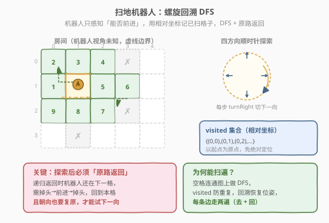
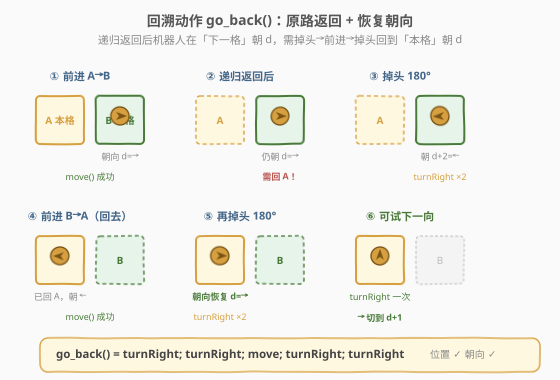
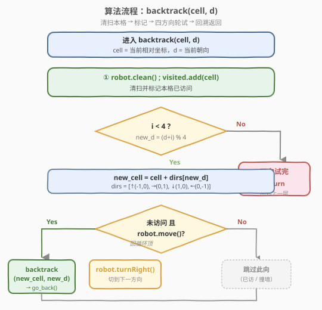
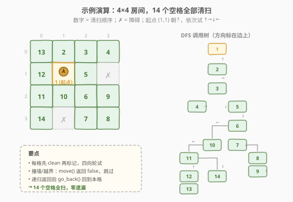

# LeetCode 扫地机器人 题解

## 1. 题目概述

- **标题 / 题号**：扫地机器人（#489，hard）
- **链接**：https://leetcode.cn/problems/robot-room-cleaner/
- **难度**：困难
- **标签**：深度优先搜索、回溯、交互式接口、设计

**题意**：给定一台机器人在一个未知布局的房间里清扫。房间是一个 $m \times n$ 的网格，每个格子要么是**空格**（可通行），要么是**障碍**（不可通行）。机器人的初始位置在某个空格上、初始朝向为「上」，但你**不知道房间大小、不知道自己在房间里的绝对坐标**。

机器人对外只暴露四个方法（交互式接口）：

| 方法 | 行为 |
|------|------|
| `robot.move()` | 尝试沿当前朝向前进一格；成功则移动并返回 `true`，遇障碍/边界则原地不动返回 `false` |
| `robot.turnLeft()` | 原地左转 90° |
| `robot.turnRight()` | 原地右转 90° |
| `robot.clean()` | 清扫当前所在格子 |

> ⚠️ 你**看不到**房间地图，也**拿不到**机器人坐标——只能通过 `move()` 的返回值感知「前方能否通行」。这正是本题的难点：在「视角受限」的前提下扫遍所有空格。

**目标**：清扫房间里的**每一个空格**（每个空格至少 `clean()` 一次）。

**示例 1**：

```text
房间：
  1  1  1  1  1
  1  1  1  1  1
  1  1  1  1  1
  1  1  1  1  1
机器人初始位置 = (1, 3)，朝向上

输出：机器人清扫了所有 20 个格子
（无论以何种顺序，只要每个空格都被 clean() 即可）
```

**示例 2**：

```text
房间：
  1  1  1
  0  1  0
  1  1  1
机器人初始位置 = (0, 1)，朝向上

输出：机器人清扫了 7 个空格（跳过两个障碍格 0）
```

**约束**：

- $m, n \in [1, 200]$
- $0 \le \text{机器人初始行} < m$，$0 \le \text{机器人初始列} < n$
- 机器人初始位置一定是空格
- 机器人初始朝向为「上」
- 机器人的移动、转弯、清扫动作都会被评测机记录并校验

> 💡 关键转化：把「未知房间」抽象成一张**隐式图**——空格是节点，相邻空格之间有边。机器人只能在节点上做 `clean()`，只能沿边 `move()`。问题等价于：**在一张看不见全貌的连通图上，从起点出发访问所有节点，且只能通过「移动 / 转向」这两个原子操作回到原位**。这天然指向 **DFS + 回溯**：递归向前探索，递归返回时把机器人「原样退回」上一层。

## 2. 解题思路

### 2.1 暴力思路

最朴素的猜想是「随机游走」：机器人不断 `move()`，撞墙就 `turnRight()` 换方向，期望最终扫遍所有格子。但随机游走**无法保证终止**——它会在已扫格子上反复打转，且没有任何机制记录「哪些格子还没扫」，最坏情况永远扫不完。即使加上「扫够 N 步就停」的兜底，也无法证明已经覆盖全部空格。

> ⚠️ 暴力的根本缺陷：**没有「已访问」的记忆，也没有「系统性覆盖」的策略**。机器人不知道自己走过哪、还剩哪没扫，自然无法判定「是否扫完」。我们需要一种**确定性、可证明完备**的遍历方法。

### 2.2 核心观察：螺旋回溯 DFS



把房间抽象成隐式连通图后，**DFS 天然适合「只知局部」的场景**：

1. **相对坐标系**：机器人不知道绝对位置，但我们可以在程序里维护一个**以起点为原点**的相对坐标 `(r, c)`。每次 `move()` 成功，就按当前朝向更新坐标；起点记为 `(0, 0)`，朝向「上」记为方向 `0`。这样无需知道房间大小，也能用 `(r, c)` 唯一标识每个格子。

2. **visited 集合**：用一个 `set` 记录已清扫的相对坐标，防止重复进入同一格子——这是 DFS 完备性的保证（每个格子只进一次，不会死循环）。

3. **四方向顺时针轮试**：在每个格子上，按**固定顺序**（上、右、下、左，顺时针）依次尝试四个方向。实现上不必显式判断当前朝向再换算——而是**每试完一个方向就 `turnRight()` 一次**，机器人自然顺时针转一圈，正好覆盖四个方向。

4. **原路返回**：DFS 递归返回时，机器人**物理上还停在子节点格子**上、朝向也不一定复原。必须显式执行一个「回溯动作」把它**退回父格子并恢复进入时的朝向**，父层才能继续试下一个方向。这是本题区别于普通网格 DFS 的核心（详见 2.3）。

> 💡 **为什么顺时针轮试 + `turnRight()` 能覆盖四方向？** 进入 `backtrack(cell, d)` 时机器人朝向 `d`。循环 `i = 0..3`：第 `i` 轮机器人朝向 `(d + i) % 4`，试 `move()`；无论成功与否，末尾 `turnRight()` 把朝向转成 `(d + i + 1) % 4`。四轮结束共右转 4 次 = $360°$，朝向回到 `d`，与进入时一致。于是每个方向都被精确尝试一次，且朝向自闭合。

### 2.3 回溯动作：原路返回 + 恢复朝向



这是全题最容易写错的一步。递归调用 `backtrack(new_cell, new_d)` 之前，机器人执行了 `move()` 从**本格 A** 进入**下格 B**，此时它朝向 `new_d`、位于 B。当递归返回时（子树已扫完），机器人**仍然在 B、朝向 `new_d`**（因为子层 DFS 内部自闭合，朝向会复原到进入子层时的 `new_d`）。

要让父层继续试下一个方向，必须把机器人**从 B 退回 A，并把朝向恢复成 `new_d`**（这样父层的 `turnRight()` 才能正确切到 `new_d + 1`）。回溯动作 `go_back()` 由四步构成：

| 步骤 | 动作 | 机器人状态 |
|------|------|-----------|
| ① | `turnRight(); turnRight()` | 仍在 B，朝向变成 `new_d + 2`（反向） |
| ② | `move()` | 沿反方向前进一格，回到 A，朝向仍是 `new_d + 2` |
| ③ | `turnRight(); turnRight()` | 仍在 A，朝向恢复成 `new_d` |

> ⚠️ **为什么要恢复朝向，而不只是位置？** 父层循环靠「每轮末尾 `turnRight()`」来切方向，这一前提是「每轮开始时朝向 = 上轮设定的方向」。若回溯后朝向错乱，后续 `turnRight()` 就试不到正确的方向，整套顺时针轮试会失灵。**位置和朝向必须同时复原**——这是「回溯」在本题中的完整含义。

> 💡 第 ② 步的 `move()` 一定会成功：来时这条路是空的（否则 `move()` 不会返回 `true`），回去时自然也是通的。障碍不会凭空出现，所以回退无需检查返回值。

### 2.4 算法流程图



DFS 函数 `backtrack(cell, d)` 的执行流程：

1. **清扫并标记**：`robot.clean()`；`visited.add(cell)`。
2. **四方向轮试**：`for i in 0..3`：
   - 计算 `new_d = (d + i) % 4`，`new_cell = cell + dirs[new_d]`；
   - 若 `new_cell` 未访问**且** `robot.move()` 成功：
     - 递归 `backtrack(new_cell, new_d)`（深入子格子）；
     - 回溯 `go_back()`（退回本格并恢复朝向）；
   - `robot.turnRight()`（切到下一方向，无论本轮是否深入）。
3. **返回**：四方向都试完，函数返回，由父层执行 `go_back()` 退回。

> 💡 注意 `turnRight()` 在 `if` 的**外面**：无论某方向是否成功深入（撞墙 / 已访问 / 深入后回溯），都要右转一次切到下一方向。只有把它放在循环体末尾，才能保证「四轮右转 = 一圈 = 朝向复原」。

### 2.5 示例演算

以一个 $4 \times 4$ 房间（14 个空格、2 个障碍）为例，机器人从 `(1, 1)` 朝上出发，按「上→右→下→左」顺时针轮试：



清扫顺序（数字 = 第几个被 `clean()`）：

| 步 | 格子 | 步 | 格子 | 步 | 格子 | 步 | 格子 |
|----|------|----|------|----|------|----|------|
| 1 | (1,1) | 2 | (0,1) | 3 | (0,2) | 4 | (0,3) |
| 5 | (1,2) | 6 | (2,2) | 7 | (3,2) | 8 | (3,3) |
| 9 | (2,3) | 10 | (2,1) | 11 | (2,0) | 12 | (1,0) |
| 13 | (0,0) | 14 | (3,0) | | | | |

关键转折点：

- **第 4 步后**：`(0,3)` 的右、下（`(1,3)` 障碍）、上（越界）、左（已访问 `(0,2)`）全部不通，递归返回，`go_back()` 退到 `(0,2)` 继续试「下」→ 进入 `(1,2)`。
- **第 9 步后**：`(2,3)` 四周都不通（上是障碍 `(1,3)`，其余已访问），递归层层返回，沿途 `go_back()` 一路退到 `(2,2)`，再试「左」→ 进入 `(2,1)`。
- **第 13 步**：`(0,0)` 是从 `(1,0)` 向上探索到达的「死角」（四周只有 `(1,0)` 已访问），扫完即返回。
- **最终**：14 个空格全部清扫，2 个障碍格从未进入。✓

> 💡 **观察 DFS 树的形状**：它不是一条直线，而是「主干 + 分叉」——每个格子的「第一个可通方向」成为主干，其余方向成为回溯后才探索的分支。这正是 DFS 「深入到死路→回退到分叉→换方向再深入」的典型形态。每条树边被走**两次**（一次前进、一次 `go_back` 返回），所以总移动数 $\approx 2 \times (\text{空格数} - 1)$。

## 3. 参考代码

### C++

```cpp
/**
 * // This is the robot's control interface.
 * // You should not implement it, or speculate about its implementation
 * class Robot {
 *   public:
 *     // Returns true if the cell in front is open and robot moves into it.
 *     // Returns false if the cell in front is blocked and robot stays put.
 *     bool move();
 *     void turnLeft();
 *     void turnRight();
 *     void clean();
 * };
 */
class Solution {
    // 顺时针四方向：上、右、下、左
    int dirs[4][2] = {{-1, 0}, {0, 1}, {1, 0}, {0, -1}};

  public:
    void cleanRoom(Robot& robot) {
        unordered_set<long long> visited;
        backtrack(robot, visited, 0, 0, 0);
    }

  private:
    // 把 (r, c) 编码成一个 long long 作为哈希键
    static long long key(int r, int c) {
        return ((long long)r << 32) | (unsigned int)c;
    }

    void backtrack(Robot& robot, unordered_set<long long>& vis,
                   int r, int c, int d) {
        vis.insert(key(r, c));
        robot.clean();
        for (int i = 0; i < 4; ++i) {
            int nd = (d + i) % 4;
            int nr = r + dirs[nd][0];
            int nc = c + dirs[nd][1];
            if (!vis.count(key(nr, nc)) && robot.move()) {
                backtrack(robot, vis, nr, nc, nd);
                goBack(robot);          // 退回本格并恢复朝向
            }
            robot.turnRight();          // 切到下一方向（无论是否深入）
        }
    }

    void goBack(Robot& robot) {
        robot.turnRight();
        robot.turnRight();
        robot.move();
        robot.turnRight();
        robot.turnRight();
    }
};
```

### Python

```python
# """
# This is the robot's control interface.
# You should not implement it, or speculate about its implementation
# """
# class Robot:
#     def move(self): return True
#     def turnLeft(self): ...
#     def turnRight(self): ...
#     def clean(self): ...

class Solution:
    def cleanRoom(self, robot):
        visited = set()
        # 顺时针四方向：上、右、下、左
        dirs = ((-1, 0), (0, 1), (1, 0), (0, -1))

        def go_back():
            # 掉头 -> 前进回本格 -> 掉头恢复朝向
            robot.turnRight()
            robot.turnRight()
            robot.move()
            robot.turnRight()
            robot.turnRight()

        def backtrack(cell, d):
            visited.add(cell)
            robot.clean()
            for i in range(4):
                new_d = (d + i) % 4
                nr = cell[0] + dirs[new_d][0]
                nc = cell[1] + dirs[new_d][1]
                if (nr, nc) not in visited and robot.move():
                    backtrack((nr, nc), new_d)
                    go_back()
                robot.turnRight()   # 切到下一方向（无论是否深入）

        backtrack((0, 0), 0)
```

> ⚠️ 两处细节决定成败：
> 1. **`go_back()` 必须在 `if` 命中分支里、递归返回之后立即调用**——此时机器人还在子格子，趁朝向尚未被打乱先退回来。
> 2. **`turnRight()` 必须在 `if` 外面、循环体末尾**——保证无论本轮是否深入，朝向都顺时针推进一格，四轮闭合。

## 4. 复杂度分析

| 维度 | 复杂度 | 说明 |
|------|--------|------|
| 时间复杂度 | $O(N)$ | $N$ = 空格数。每个空格只进入一次（`visited` 保证）；每条树边被走两次（前进 + `go_back` 返回），共 $\le 2(N-1)$ 次 `move()`；每个格子做 4 次 `turnRight()`，共 $4N$ 次转弯。总动作数 $\sim O(N)$，与房间面积成正比 |
| 空间复杂度 | $O(N)$ | `visited` 集合存所有空格坐标 $\Theta(N)$；递归栈深度最坏 $\Theta(N)$（房间退化为长条形通道），合计 $O(N)$ |

> 💡 这是该题的最优渐近复杂度：要扫遍 $N$ 个格子，至少需要 $\Omega(N)$ 次 `clean()`，无法更好。$m, n \le 200$ 时 $N \le 40000$，$O(N)$ 完全足够。

## 5. 扩展：方向编码与「虚拟边界」

**方向数组的顺序为何是「上右下左」？** 因为这是**顺时针**序，与 `turnRight()` 的转向方向一致——第 `i` 轮机器人朝向 `(d + i) % 4`，恰好对应 `dirs[(d + i) % 4]`，无需额外的方向换算。若把 `dirs` 排成「上下左右」之类非顺时针序，就必须显式维护「当前朝向对应哪个 `dirs` 下标」，代码会更绕。**让方向数组与转向动作同序**，是本题最优雅的工程技巧。

**为什么不显式判断「越界」？** 普通网格 DFS 里我们要检查 `0 <= nr < m && 0 <= nc < n`，但这里**机器人不知道房间大小**，无法判断越界。好在 `move()` 已经把「越界」和「障碍」统一封装成「返回 `false`」——我们只需信任 `move()` 的返回值即可。换言之，**房间的边界对机器人而言就是一排「看不见的障碍」**，与真实障碍无差别处理。这种「虚拟边界」思想在交互式题目里很常见。

**若改为 8 方向移动呢？** 只需把 `dirs` 扩成 8 方向、循环改成 `for i in range(8)`、`go_back` 用 `turnRight()×4` 掉头即可。但 LeetCode 机器人的 `turnLeft/turnRight` 是 90° 转向，8 方向需要额外的 45° 转向接口，本题不适用。

**与普通网格 DFS 的对照**：

| 维度 | 普通网格 DFS（如 200 岛屿） | 本题扫地机器人 |
|------|---------------------------|---------------|
| 全局地图 | 已知 `grid` | 未知，靠 `move()` 探测 |
| 坐标 | 绝对 `(i, j)` | 相对 `(r, c)`（起点为原点） |
| 越界判断 | 显式 `0 ≤ i < m` | 无需判断，`move()` 返回 `false` 即边界 |
| 回溯 | 函数返回即可（无副作用） | 必须 `go_back()` 物理移动机器人回原位 |
| 朝向 | 无概念 | 必须维护并复原 |

## 6. 面试要点

1. **为什么用 DFS 而不是 BFS？**
   - BFS 需要维护一个队列，每次从队列取一个格子作为「下一个目标」，但机器人物理上在别处——把机器人挪到任意目标格子需要一条已知路径，而这条路还没探明。DFS 的优势是「走到哪算哪」：下一步永远是「当前格子相邻的未访问格」，机器人只需 `move()` 一步就到。DFS 与「只能局部移动」的约束天然契合。

2. **`go_back()` 为什么是「两次右转 + move + 两次右转」？能不能用左转？**
   - 两次右转 = 180°，等价于两次左转。用 `turnRight()×2` 还是 `turnLeft()×2` 都行，只要能掉头。关键是掉头后 `move()` 退回，再掉头一次**恢复原朝向**。本题机器人只有 90° 转向接口，所以 180° 必须两次。

3. **为什么 `move()` 返回 `false` 时不 `turnRight()`、而返回 `true` 深入回溯后才 `turnRight()`？**
   - 其实**两种情况都要 `turnRight()`**——`turnRight()` 放在 `if` 外面，无论本轮是否深入都执行。这样四轮循环恒等于右转 4 次 = 360°，朝向必定闭合。如果把 `turnRight()` 放进 `if` 内，撞墙的方向就不右转，朝向会错乱。

4. **回溯后机器人的朝向一定是进入时的朝向吗？**
   - 是。`go_back()` 末尾的两次右转把朝向从「反向」再转 180° 回到 `new_d`——正是进入子层时的朝向。加上子层 DFS 自身四轮右转闭合，递归返回时机器人朝向 = 进入子层时朝向。这个「朝向不变式」是 `go_back()` 设计的核心目标。

5. **`visited` 用相对坐标会冲突吗？**
   - 不会。相对坐标以起点为原点，每个格子对应唯一的 `(r, c)`。只要方向数组与 `move()` 的实际位移一致（「上」=行号 -1 等），坐标就准确。注意方向定义要和机器人初始朝向对齐：题目约定初始朝向「上」，所以 `dirs[0] = (-1, 0)`（上）。

6. **能否不维护 `visited`，靠 `clean()` 状态判断？**
   - 理论上若 `robot` 能查询「当前格子是否已扫」，可省去 `visited`。但接口里 `clean()` 是**写**操作，没有「查询是否已扫」的读接口，所以必须自己在程序侧维护 `visited`。这也是交互式题目的常见模式：**外部状态只增不查，内部状态自己记账**。

## 同类练习题

| # | 题目 | 与本题的关联 |
|---|------|-------------|
| 200 | [岛屿数量](../0201-0300/200_岛屿数量.md) | 普通网格 DFS + 原地标记，对照本题「无地图、需物理回溯」的差异，理解 DFS 在「已知地图」与「未知地图」下的不同写法。 |
| 79 | [单词搜索](../0001-0100/79_单词搜索.md) | 网格 DFS + 回溯三步走（选择-递归-撤销），本题的 `go_back()` 就是「撤销」在「物理机器人」上的对应——一个是改字符、一个是动机器人。 |
| 54 | [螺旋矩阵](../0001-0100/54_螺旋矩阵.md) | 同样是「顺时针四方向」遍历网格，对照「按层螺旋」与「按 DFS 树螺旋」两种顺时针遍历的形态差异。 |
| 695 | [岛屿的最大面积](https://leetcode.cn/problems/max-area-of-island/) | 网格 DFS 计数连通块大小，复习「visited / 原地标记」两种去重写法，承接 200 的 DFS 模板。 |
| 1778 | [未知网格中的最短路径](https://leetcode.cn/problems/shortest-path-in-a-hidden-grid/) | 另一道交互式网格题（中等），机器人也只能局部感知，但目标是「最短路径」故用 BFS + 已探明图——对照本题「全遍历用 DFS、最短路用 BFS」的选题差异。 |
