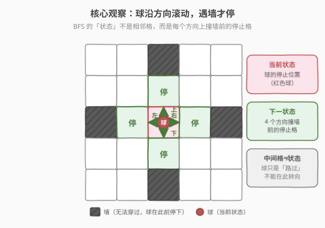
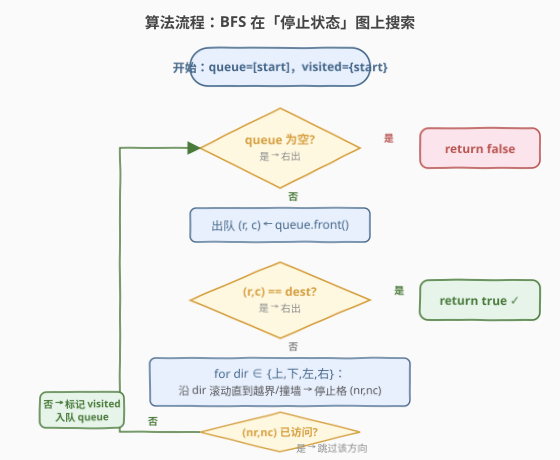
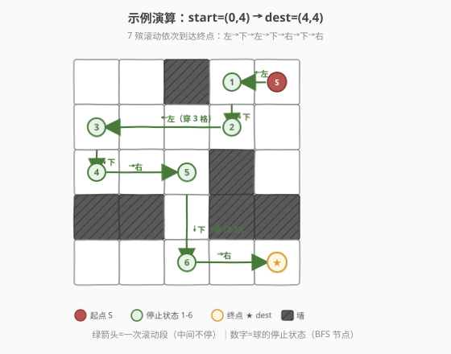

# 迷宫

- **题目名称**：迷宫
- **链接**：[490. 迷宫](https://leetcode.cn/problems/the-maze/)
- **难度**：中等
- **标签**：图、BFS、DFS、滚动模拟

## 1. 题目概述

给定一个 `m x n` 的二维矩阵 `maze`，其中 `0` 表示**空地**、`1` 表示**墙**。矩阵中有一个球，给定它的**起始位置** `start = [startRow, startCol]` 和**目标位置** `destination = [destRow, destCol]`。

球的运动规则与普通走格子的迷宫不同：

- 球可以沿**上/下/左/右**四个方向之一**滚动**；
- 一旦开始滚动，球会**一直滚下去**，直到撞上**墙**（`1`）或滚出**边界**才会**停止**；
- 球**停在**撞墙前的那一格空地上（即滚动路径上最后一个 `0` 格）；
- 球**只能在停止后**选择下一个方向，**不能在滚动中途转向**，也不能停在中间任意一格。

判断球能否**停在**目标位置 `destination`。能停在返回 `true`，否则返回 `false`。

**示例 1**：

```text
输入：maze = [
  [0,0,1,0,0],
  [0,0,0,0,0],
  [0,0,0,1,0],
  [1,1,0,1,1],
  [0,0,0,0,0]
], start = [0,4], destination = [4,4]
输出：true
解释：球先向左滚到 (0,3) 停下，再向下到 (1,3)，向左到 (1,0)，
      向下到 (2,0)，向右到 (2,2)，向下到 (4,2)，最后向右停在 (4,4)。
```

**示例 2**：

```text
输入：maze = [[0,0,1,0,0],[0,0,0,0,0],[0,0,0,1,0],[1,1,0,1,1],[0,0,0,0,0]], start = [0,4], destination = [3,2]
输出：false
解释：(3,2) 处于两个墙之间，球从任何方向滚过它时都不会在此停下（会继续滚到对面的墙），故无法停在 (3,2)。
```

**约束条件**：

- `m == maze.length`
- `n == maze[i].length`
- `1 <= m, n <= 100`
- `maze[i][j]` 为 `0` 或 `1`
- `start` 和 `destination` 格子均为 `0`（空地）
- `start != destination`

---

## 2. 解题思路

### 2.1 暴力思路

把球的每次「滚动」拆成一步一步的移动：从当前位置朝某方向走一格，看是否撞墙，没撞就继续走同一方向……直到停止。本质上 DFS 枚举所有「方向序列」，看是否存在一条序列让球停在终点。

这种做法本身能找到答案，但**关键问题在于如何定义"状态"**：

- 若把**每个格子**都当成状态，会出错——因为球**不能在中间格转向**，把中间格当状态会引入"本不该存在的转向"，导致误判可达。
- 若**不做去重**，球可能在两个停止位之间反复横跳导致无限循环或指数级展开。

正确做法是：**只在"停止位置"上建立状态图**，并在停止位置集合上做 BFS/DFS 并去重。

### 2.2 核心观察：状态 = 停止位置，BFS 在停止位图上搜索



> 💡 **状态定义**：BFS 的「节点」不是相邻格，而是**球每次撞墙前的停止格**。从一个停止位出发，朝 4 个方向各滚一次，会得到至多 4 个新的停止位——这就是状态的「邻居」。

由此把原问题转换为一张**隐式图**：

- **节点**：所有可能的「停止位置」（空地格）；
- **边**：从一个停止位 `(r,c)` 出发，沿方向 `d` 一路滚到撞墙前的停止位 `(nr,nc)`，则 `(r,c) --d--> (nr,nc)`；
- **问题**：在这张图上从 `start` 出发，能否到达 `destination`。

> ⚠️ **为什么中间格不能当状态？**
> 球**路过**一个空地格时**无法转向**，它的运动方向由上一次停止时的选择决定。如果允许在中间格转向，就等于凭空创造了不存在于原问题中的运动路径，会导致判定"能停在 dest"出错（例如 dest 是某条滚动路径的中间格，本来不该停在那里，却被误判为可达）。
> 因此 BFS 的 `visited` 必须只标记**停止位**，滚动的中间过程只是"计算下一个停止位"的过程，不入队、不去重。

### 2.3 算法流程图



**核心子过程：沿方向 `d` 滚动求停止位**

```
roll(maze, r, c, dr, dc):
    while 未越界 且 下一格 maze[r+dr][c+dc] == 0:   # 下一格是空地才能继续滚
        r += dr; c += dc
    return (r, c)                                   # 撞墙/出界前的最后空地
```

> 💡 注意判定条件是「**下一格**是空地才前进」而非「当前格是空地」，这样能保证停在撞墙前的最后一格，且起点本身已是空地。

**BFS 主流程**

1. `queue = [start]`，`visited = {start}`。
2. 当 `queue` 非空：
   - 出队 `(r, c)`。
   - 若 `(r, c) == destination`，返回 `true`。
   - 否则对 4 个方向 `(dr, dc)`：调用 `roll` 得到停止位 `(nr, nc)`；若 `(nr, nc)` 未在 `visited` 中，加入 `visited` 并入队。
3. 队列空仍未命中，返回 `false`。

### 2.4 示例演算



以示例 1 的 `5×5` 迷宫为例，BFS 展开后一条可行路径如下（每一步都是一次"滚到撞墙"）：

| 步 | 当前停止位 | 方向 | 滚动路径 | 新停止位 |
|----|-----------|------|---------|---------|
| 0 | `(0,4)` S | ← 左 | `(0,3)`（`(0,2)` 是墙） | ① `(0,3)` |
| 1 | ① `(0,3)` | ↓ 下 | `(1,3)`（`(2,3)` 是墙） | ② `(1,3)` |
| 2 | ② `(1,3)` | ← 左 | `(1,2),(1,1),(1,0)`（`(1,-1)` 出界） | ③ `(1,0)` |
| 3 | ③ `(1,0)` | ↓ 下 | `(2,0)`（`(3,0)` 是墙） | ④ `(2,0)` |
| 4 | ④ `(2,0)` | → 右 | `(2,1),(2,2)`（`(2,3)` 是墙） | ⑤ `(2,2)` |
| 5 | ⑤ `(2,2)` | ↓ 下 | `(3,2),(4,2)`（`(5,2)` 出界） | ⑥ `(4,2)` |
| 6 | ⑥ `(4,2)` | → 右 | `(4,3),(4,4)`（`(4,5)` 出界） | ★ `(4,4)` = dest |

第 6 步滚动停止位正好是 `destination`，返回 `true`。

**为什么示例 2 的 `(3,2)` 不可达？** `(3,2)` 上下都是墙（`(2,2)` 与 `(4,2)` 是空地，但 `(3,2)` 左右是墙 `(3,1)`、`(3,3)`），球从上滚下来会穿过 `(3,2)` 继续到 `(4,2)`，从下滚上来会穿过到 `(2,2)`——**球永远不会停在 `(3,2)`**，所以即使路过也无法作为停止状态。这正是"中间格非状态"的体现。

---

## 3. 参考代码

### C++

```cpp
class Solution {
    int m, n;
    int dx[4] = {0, 0, 1, -1};
    int dy[4] = {1, -1, 0, 0};

    // 从 (r,c) 沿方向 (dr,dc) 滚动，直到下一格是墙/出界，返回停止位
    pair<int,int> roll(const vector<vector<int>>& maze, int r, int c, int dr, int dc) {
        while (r + dr >= 0 && r + dr < m && c + dc >= 0 && c + dc < n
               && maze[r + dr][c + dc] == 0) {
            r += dr;
            c += dc;
        }
        return {r, c};
    }

  public:
    bool hasPath(vector<vector<int>>& maze,
                 vector<int>& start, vector<int>& destination) {
        m = maze.size();
        n = maze[0].size();
        vector<vector<char>> visited(m, vector<char>(n, 0));

        queue<pair<int,int>> q;
        q.push({start[0], start[1]});
        visited[start[0]][start[1]] = 1;

        int tr = destination[0], tc = destination[1];
        while (!q.empty()) {
            auto [r, c] = q.front(); q.pop();
            if (r == tr && c == tc) return true;
            for (int d = 0; d < 4; d++) {
                auto [nr, nc] = roll(maze, r, c, dx[d], dy[d]);
                if (!visited[nr][nc]) {
                    visited[nr][nc] = 1;
                    q.push({nr, nc});
                }
            }
        }
        return false;
    }
};
```

### Python

```python
class Solution:
    def hasPath(self, maze: List[List[int]],
                start: List[int], destination: List[int]) -> bool:
        m, n = len(maze), len(maze[0])
        dirs = [(0, 1), (0, -1), (1, 0), (-1, 0)]

        def roll(r, c, dr, dc):
            while 0 <= r + dr < m and 0 <= c + dc < n \
                    and maze[r + dr][c + dc] == 0:
                r += dr
                c += dc
            return r, c

        tr, tc = destination
        visited = [[False] * n for _ in range(m)]
        from collections import deque
        q = deque([(start[0], start[1])])
        visited[start[0]][start[1]] = True

        while q:
            r, c = q.popleft()
            if (r, c) == (tr, tc):
                return True
            for dr, dc in dirs:
                nr, nc = roll(r, c, dr, dc)
                if not visited[nr][nc]:
                    visited[nr][nc] = True
                    q.append((nr, nc))
        return False
```

---

## 4. 复杂度分析

| 维度 | 复杂度 | 说明 |
|------|--------|------|
| 时间复杂度 | `O(M × N)` | 每个空地格作为停止位至多入队/出队一次；每次出队调用 4 次 `roll`，单次 `roll` 最坏 `O(max(M,N))`，但分摊到每个格子的"被滚过"次数为常数（每个格子在每个方向上至多被滚过常数次），整体仍为 `O(M × N)` |
| 空间复杂度 | `O(M × N)` | `visited` 矩阵 `O(M×N)`；BFS 队列最坏存所有空地格 `O(M×N)` |

> 💡 **关于时间复杂度的更紧界**：一种朴素估法是「`M×N` 个状态 × 每次 `roll` `O(max(M,N))` = `O(MN·max(M,N))`」，这在最坏构造下确实可达。但 LeetCode 官方与多数实现将其归为 `O(M×N)`——因为 `roll` 沿直线滚动，每个格子在每个方向上至多被「路过」一次，可视为摊还 `O(1)`。面试中说明两种估计并指出「实际取决于迷宫结构」即可。

---

## 5. 扩展：DFS 写法与变体题

- **DFS 写法**：把 BFS 换成递归 DFS，逻辑等价。从 `start` 出发，对 4 个方向 `roll` 得到停止位，若未访问则递归。找到终点立即返回 `true`。注意 Python 需 `sys.setrecursionlimit` 防止栈溢出，`m,n ≤ 100` 时递归深度最坏 `O(M×N)=10000`。
- **求最短滚动步数**：若把问题改为"最少几次滚动能停在终点"，**BFS 天然求最短路**（每条边权为 1），直接在出队时记录步数即可；DFS 则需要记录最小值。对应题目：[499. 迷宫 III](https://leetcode.cn/problems/the-maze-iii/)（求最短**路径字符串**）。
- **求最短距离**：[505. 迷宫 II](https://leetcode.cn/problems/the-maze-ii/) 改为求起点到终点的**最短滚动距离**，边权为滚动步数（不等权），需改用 Dijkstra。

> 💡 **本题边权为 1**（每次滚动算一步，无论滚几格），所以普通 BFS 即可；505 边权为滚过的格数（不等权），所以升级为 Dijkstra。三题一脉相承，建议连做。

---

## 6. 面试要点

1. **为什么 BFS 的状态是"停止位"而不是每个格子？**

   - 球**不能在滚动中途转向**，中间格只是"路过"。若把中间格当状态，等于允许在那些格子转向，会引入原本不存在的路径，导致误判可达（典型反例：终点恰是某条滚动路径的中间格，本不该停却判 true）。
   - 因此 `visited` 只标记停止位，`roll` 子过程负责计算"沿某方向滚到撞墙前的最后一格"作为下一个状态。

2. **`roll` 的循环条件为什么判断"下一格"而不是"当前格"？**

   - 起点本身已是空地（题目保证）。判断 `maze[r+dr][c+dc] == 0` 才前进，能保证：① 不会滚进墙里；② 停在撞墙前的最后一格空地；③ 起点四周都是墙时（死胡同）原地不动，返回自身，不会无限循环。
   - 若误判为"当前格是空地就前进"，球会滚进墙里或越界，逻辑错误。

3. **起点四周都是墙会怎样？**

   - `roll` 立即返回起点自身，但起点已在 `visited` 中，不会重复入队，BFS 自然终止并返回 `false`。这是"球完全无法移动"的边界情形，代码无需特殊处理。

4. **这题和普通网格 BFS（如 200 岛屿数量、994 腐烂橘子）的区别？**

   - 普通 BFS 的边连**相邻格**，一步走一格；本题的边连**停止位**，一步滚一段（可能跨多格）。
   - 普通 BFS 的状态空间是格子集合；本题状态空间是"停止位集合"（仍是空地格的子集，但只有能作为停止位的格才有意义）。
   - 普通 BFS 边权为 1 求最短步数；本题若求最短**距离**则边权不等需 Dijkstra（505）。

5. **BFS 还是 DFS？面试怎么选？**

   - 本题只问"能否到达"，二者等价。BFS 通常更直观、且天然扩展到最短路问题（499/505）；DFS 写起来略短但有栈溢出风险。面试建议先讲清"状态=停止位"的核心观察，再写 BFS，并主动提及 499/505 的延伸，体现体系化理解。

---

## 7. 同类练习题

- [505. 迷宫 II](https://leetcode.cn/problems/the-maze-ii/)：本题的"最短滚动距离"版，边权不等，BFS 升级为 Dijkstra
- [499. 迷宫 III](https://leetcode.cn/problems/the-maze-iii/)：求最短滚动路径的**方向字符串**，Dijkstra + 字典序 tie-break，本题系列最难
- [1926. 迷宫中离入口最近的出口](https://leetcode.cn/problems/nearest-exit-from-entrance-in-maze/)：普通网格 BFS（一步一格），可与本题"一步滚一段"对照边界处理
- [994. 腐烂的橘子](https://leetcode.cn/problems/rotting-oranges/)：多源 BFS 模板，与本题的 BFS 框架同源，对照"状态定义"差异
- [130. 被围绕的区域](https://leetcode.cn/problems/surrounded-regions/)：从边界反向 DFS/BFS 标记，与本题"正向扩散"形成"正反双向"搜索的对照
