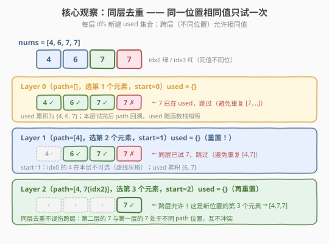
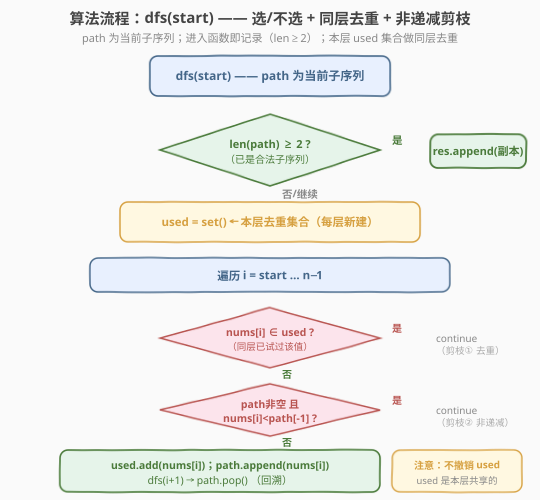

# LeetCode 非递减子序列 题解

## 1. 题目概述

- **标题 / 题号**：非递减子序列（#491，medium）
- **链接**：https://leetcode.cn/problems/non-decreasing-subsequences/
- **难度**：中等
- **标签**：数组、回溯、去重

**题意**：给定一个整数数组 `nums`，找出并返回所有该数组中**不同的**非递减子序列，子序列中**至少有两个元素**。可以按任意顺序返回答案。数组中可能含有重复元素，两个相等整数也可视作非递减的一种特殊情况。

**示例 1**：

```text
输入：nums = [4,6,7,7]
输出：[[4,6],[4,6,7],[4,6,7,7],[4,7],[4,7,7],[6,7],[6,7,7],[7,7]]
```

**示例 2**：

```text
输入：nums = [4,4,3,2,1]
输出：[[4,4]]
```

**约束**：

- $1 \leq \text{nums.length} \leq 15$
- $-100 \leq \text{nums[i]} \leq 100$

> ⚠️ **关键信号**：$n \leq 15$ 指向**回溯**；"不同的"要求**去重**；子序列必须**保持原数组顺序**——这意味着**不能对数组排序**（排序会破坏子序列的顺序语义），因此不能照搬 [47. 全排列 II](../0001-0100/47_全排列II.md) 的「排序 + `!used[i-1]`」去重套路，需要换用**同层哈希集合**去重。

## 2. 解题思路

### 2.1 暴力思路：枚举所有子序列再去重

对每个下标「选 / 不选」二选一，枚举全部 $2^n$ 个子序列，过滤掉长度不足 2 或非递减的，最后用集合对结果序列去重。$n=15$ 时 $2^{15}=32768$，能跑过但**丑陋且低效**：重复子序列被反复生成又丢弃，没利用「同位置相同值必产生同构子树」的结构剪枝。

### 2.2 核心观察：同层去重

> 💡 **关键洞察**：在搜索树的**同一层**（即子序列的**同一个位置**），如果已经尝试过某个值 `v`，那么本层后续再遇到 `v` 时**直接跳过**——因为以 `v` 开头（接在该位置）的子树已经完整展开过，再选另一个 `v` 只会产生完全相同的子序列集合。

做法：**每一层 `dfs` 新建一个 `used` 哈希集合**，记录「本位置已经尝试过哪些值」。遍历候选时若 `nums[i] ∈ used` 则 `continue`。`used` 是**层局部**的，随函数栈销毁，**不跨层**——这正是跨层（不同位置）允许相同值的原因。



**与 47 题去重的对照**：

| 维度 | [47. 全排列 II](../0001-0100/47_全排列II.md) | 本题 |
|------|----------------------------------------------|------|
| 能否排序 | 能（排列与原始顺序无关） | **不能**（子序列保序） |
| 去重手段 | 排序后 `!used[i-1]` 跳相邻同值 | 同层 `used` 哈希集合 |
| 去重本质 | 同层同值只试一次 | 同层同值只试一次（完全一致） |

> ⚠️ 另有一条**非递减剪枝**：若 `path` 非空且 `nums[i] < path.back()`，则 `nums[i]` 接到当前子序列末尾会破坏非递减性，直接 `continue`。这是「选/不选」框架下天然融入的约束，无需单独分支。

### 2.3 算法流程图



**完整步骤**（`dfs(start)` 表示从下标 `start` 开始选下一个元素）：

1. **记录答案**：若 `len(path) >= 2`，把 `path` 的**副本**加入 `res`（进入函数即记录，因为每个节点都代表一个合法的中间状态）。
2. **建本层 `used`**：`used = set()`——注意是函数局部变量，每层新建。
3. **遍历** `i` 从 `start` 到 $n-1$：
   1. `nums[i] ∈ used` → `continue`（**剪枝① 同层去重**）；
   2. `path` 非空且 `nums[i] < path.back()` → `continue`（**剪枝② 非递减**）；
   3. `used.add(nums[i])`；`path.append(nums[i])`；
   4. `dfs(i + 1)`（下一层只往后选，保证子序列下标递增）；
   5. `path.pop()`（**回溯 path**，但**不撤销 `used`**——`used` 是本层共享的，记录"这一层试过哪些值"）。

> 💡 **为什么 `path` 回溯而 `used` 不回溯？** `path` 是**跨层共享**的全局答案路径，进入下一层前压栈、返回后弹栈；`used` 是**层局部**的"已试值"台账，本层所有候选共用一个，目的是阻止同层重复试相同值。两者生命周期不同：`path` 随深度伸缩，`used` 随层销毁。

### 2.4 示例演算

以 `nums = [4,6,7,7]` 为例，搜索树如下（仅显式标出 Layer 0 对 `idx3` 的 7 的跳过，其余同层跳过见概念图）：

![示例演算：nums = [4,6,7,7] 的搜索树](../images/nds_example_walkthrough.svg)

| Layer | path | 候选范围 | 本层 used 演化 | 动作 |
|-------|------|----------|----------------|------|
| 0 | `[]` | i=0..3 | 试 4 ✓→试 6 ✓→试 7(idx2) ✓→7(idx3) ✗ | 7(idx3) 同层已试，跳过 |
| 1 | `[4]` | i=1..3 | 试 6 ✓→试 7(idx2) ✓→7(idx3) ✗ | 记 `[4,6]`、`[4,7]`；7(idx3) 跳过 |
| 2 | `[4,6]` | i=2..3 | 试 7(idx2) ✓→7(idx3) ✗ | 记 `[4,6,7]`；7(idx3) 同层跳过 |
| 3 | `[4,6,7]` | i=3..3 | 试 7(idx3) ✓ | 记 `[4,6,7,7]`（跨层允许！） |
| 2 | `[4,7]` | i=3..3 | 试 7(idx3) ✓ | 记 `[4,7,7]`（跨层允许） |
| 1 | `[6]` | i=2..3 | 试 7(idx2) ✓→7(idx3) ✗ | 记 `[6,7]` |
| 2 | `[6,7]` | i=3..3 | 试 7(idx3) ✓ | 记 `[6,7,7]` |
| 1 | `[7]` | i=3..3 | 试 7(idx3) ✓ | 记 `[7,7]` |

最终收集 8 个子序列，与示例 1 完全一致 ✓。

> 💡 **跨层允许是关键**：`[4,6,7]` 接 `7(idx3)` 得到 `[4,6,7,7]`，这里的第二个 7 与 Layer 2 跳过的那个 7 处于**不同的 path 位置**（前者是第 4 个元素，后者是第 3 个元素的候选），互不冲突。同层去重只剪"同一位置的重复尝试"，不误伤合法的跨层重复。

## 3. 参考代码

### C++

```cpp
class Solution {
  public:
    vector<vector<int>> findSubsequences(vector<int>& nums) {
        vector<vector<int>> res;
        vector<int> path;
        dfs(nums, 0, path, res);
        return res;
    }

  private:
    void dfs(const vector<int>& nums, int start, vector<int>& path,
             vector<vector<int>>& res) {
        if (path.size() >= 2) res.push_back(path);          // 进入即记录
        unordered_set<int> used;                            // 本层去重集合
        for (int i = start; i < (int)nums.size(); ++i) {
            if (used.count(nums[i])) continue;              // 剪枝① 同层去重
            if (!path.empty() && nums[i] < path.back()) continue; // 剪枝② 非递减
            used.insert(nums[i]);
            path.push_back(nums[i]);
            dfs(nums, i + 1, path, res);
            path.pop_back();                                // 只回溯 path
        }
    }
};
```

### Python

```python
class Solution:
    def findSubsequences(self, nums: list[int]) -> list[list[int]]:
        res: list[list[int]] = []
        path: list[int] = []

        def dfs(start: int) -> None:
            if len(path) >= 2:
                res.append(path[:])          # 记录副本
            used: set[int] = set()           # 本层去重集合
            for i in range(start, len(nums)):
                if nums[i] in used:
                    continue                 # 剪枝① 同层去重
                if path and nums[i] < path[-1]:
                    continue                 # 剪枝② 非递减
                used.add(nums[i])
                path.append(nums[i])
                dfs(i + 1)
                path.pop()                   # 只回溯 path

        dfs(0)
        return res
```

> ⚠️ **易错点**：
> 1. **`used` 必须是函数局部变量**：放在 `dfs` 内部、循环之前。若误写成全局/类成员，会把上一层的去重状态带到下一层，错误地剪掉合法的跨层重复（如 `[4,7,7]` 会被误杀）。
> 2. **记录答案用副本**：C++ `res.push_back(path)` 是值拷贝没问题；Python 必须写 `res.append(path[:])` 或 `path.copy()`，否则后续 `pop` 会改掉已存入的引用。
> 3. **不要 `sort(nums)`**：子序列保序，排序即破坏题意。去重完全靠 `used` 集合，不靠排序。
> 4. **`i` 从 `start` 开始**：保证选出的下标严格递增，即真正的"子序列"而非"子集"。

## 4. 复杂度分析

| 维度 | 复杂度 | 说明 |
|------|--------|------|
| 时间复杂度 | 最坏 $O(2^n \cdot n)$ | 子序列总数上界 $2^n$；每个子序列拷贝入答需 $O(n)$。$n=15$ 时 $2^{15}\cdot 15 \approx 4.9\times10^5$，去重后实际远小于此 |
| 空间复杂度 | $O(n)$ | 递归栈深 $\leq n$；`path` 长 $\leq n$；每层 `used` 集合大小 $\leq$ 值域（本题 $\leq 201$） |

> 💡 **为什么最坏是 $2^n$ 而非 $n!$？** 本题是「子序列型」回溯（每个下标选/不选，且只往后选），搜索树是二叉的退化形态，节点数上界 $2^n$；而非「排列型」回溯（每个位置可选任意未用元素，$n!$）。同层去重进一步把重复子树整体剪掉，实际节点数逼近"不同子序列数"，远小于 $2^n$。

## 5. 扩展：值域位图优化 `used`

题约束 $-100 \leq \text{nums[i]} \leq 100$，值域仅 201。`unordered_set` 的哈希常数在大规模调用时不可忽视，可用**定长布尔数组**替代：

```cpp
// 在 dfs 内部：
bool used[201] = {false};                 // 下标 = nums[i] + 100
// ...
if (used[nums[i] + 100]) continue;
used[nums[i] + 100] = true;
```

- 访问 $O(1)$ 且常数极小（无哈希、无冲突）；
- 栈上分配，函数返回即销毁，天然满足"每层新建"；
- 代价是仅适用于**值域小且已知**的场景（本题正好满足）。

> 💡 Python 中也可用 `used = [False] * 201`，但 Python 列表开销未必低于 `set`，且代码可读性略降，故 Python 版保留 `set` 即可；C++ 版在追求极致常数时推荐布尔数组。

## 6. 面试要点

1. **为什么不能像 47 题那样先排序再去重？**

   > 子序列必须保持**原数组的下标顺序**。排序会重排元素，破坏"下标递增"的语义，得到的就不再是原数组的子序列。因此去重只能靠同层 `used` 哈希集合，不能用"排序 + 相邻同值跳过"。

2. **同层去重和 47 题的 `!used[i-1]` 本质上一样吗？**

   > 一样。两者都是「**同一递归层（同一决策位置）相同值只试一次**」。区别仅在实现：47 题排序后相邻同值连续，用 `used[i-1]` 判相邻即可；本题不能排序，改用哈希集合记录本层已试值。思想完全同构。

3. **`used` 集合为什么每层新建、而不做成全局回溯？**

   > `used` 语义是"**本位置已尝试过哪些值**"，与 path 深度绑定。若做成全局回溯，需要在进入/退出层时增删元素，逻辑复杂且易错；作为函数局部变量，随栈帧自然销毁，干净且线程安全。`path` 才是需要跨层共享、手动回溯的全局状态。

4. **为什么记录答案在进入函数时、而不是选完一个元素后？**

   > 进入 `dfs` 时 `path` 已是一个完整的中间状态。只要 `len(path) >= 2` 它就是合法答案，与"接下来还要选几个"无关。在入口统一记录可避免在每个分支末尾重复写记录逻辑，且天然覆盖所有长度 $\geq 2$ 的子序列。这与 [78. 子集](../0001-0100/78_子集.md)「入口即记录」的范式一致。

5. **`[4,4,3,2,1]` 为什么只输出 `[[4,4]]`？**

   > Layer 0 选第一个 4；Layer 1 候选是 `4,3,2,1`，非递减剪枝只允许 4（`3<4` 等被剪），记 `[4,4]`。Layer 0 若选第二个 4，则 Layer 1 候选 `3,2,1` 全部 `<4` 被剪，无答案；且第二个 4 在 Layer 0 与第一个 4 同值，被同层去重跳过。其余起点（3/2/1）后续都递减，无法形成长度 ≥2 的非递减子序列。故仅 `[4,4]`。

## 同类练习题

| # | 题目 | 与本题的关联 |
|---|------|-------------|
| 47 | [全排列 II](https://leetcode.cn/problems/permutations-ii/)（[题解](../0001-0100/47_全排列II.md)） | 同层去重的"排序 + `!used[i-1]`"范本，对照「能排序」与「不能排序」两种去重实现 |
| 90 | [子集 II](https://leetcode.cn/problems/subsets-ii/) | 含重复元素的子集去重，同样可在排序后用同层跳过；对照「子集（无序）可排序」与本题「子序列（保序）不可排序」 |
| 78 | [子集](https://leetcode.cn/problems/subsets/)（[题解](../0001-0100/78_子集.md)） | 子集回溯模板，对照「入口即记录答案」的共用范式 |
| 39 | [组合总和](https://leetcode.cn/problems/combination-sum/)（[题解](../0001-0100/39_组合总和.md)） | `start` 索引控制候选范围的组合回溯模板，本题 `dfs(i+1)` 同源 |
| 417 | [太平洋大西洋水流问题](https://leetcode.cn/problems/pacific-atlantic-water-flow/)（[题解](../0401-0500/417_太平洋大西洋水流问题.md)） | 另一类「按顺序搜索 + 避免重复访问」的 DFS，对照去重在搜索中的不同形态 |
