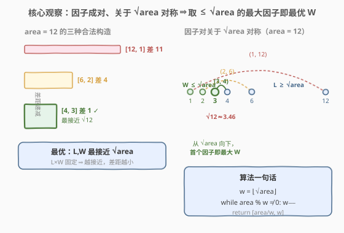
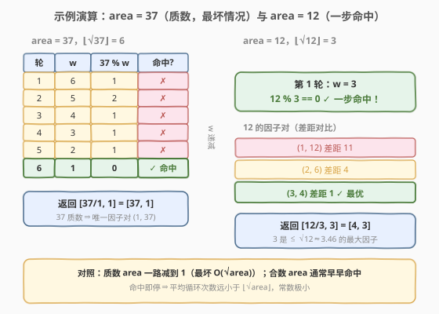

# 构造矩形

- **题目名称**：构造矩形
- **链接**：[492. 构造矩形](https://leetcode.cn/problems/construct-the-rectangle/)
- **难度**：简单
- **标签**：数学

## 1. 题目概述

给定一个具体的矩形页面面积 `area`，设计长度 `L` 和宽度 `W`，满足以下要求：

1. `L * W = area`（设计的矩形必须等于给定的目标面积）；
2. `L >= W`（宽度不应大于长度）；
3. `L - W` 尽可能小（长度与宽度的差距尽可能小）。

返回数组 `[L, W]`。

**示例 1**：

```text
输入：area = 4
输出：[2, 2]
解释：目标面积是 4，所有可能的构造方案有 [1,4]、[2,2]、[4,1]。
      但根据要求 2，[1,4] 不符合要求（L 应 >= W，写作 [4,1]）；
      根据要求 3，[2,2] 比 [4,1] 差距更小。所以输出 [2, 2]。
```

**示例 2**：

```text
输入：area = 37
输出：[37, 1]
解释：37 是质数，因子对只有 (1, 37)，故 L=37, W=1。
```

**示例 3**：

```text
输入：area = 122122
输出：[427, 286]
解释：122122 = 2 × 7 × 11 × 13 × 61，最接近 sqrt(122122)≈349.5 的因子对
      是 (286, 427)，286 × 427 = 122122，差距 141 最小。
```

**约束条件**：

- `1 <= area <= 10^7`

---

## 2. 解题思路

### 2.1 暴力思路

枚举所有可能的宽度 `W`（从 `1` 到 `area`），对每个 `W` 检查 `area % W == 0`（即 `W` 是 `area` 的因子），若成立则得到一对 `(W, area/W)`。在所有满足 `area/W >= W`（即 `L >= W`）的因子对中，选取 `L - W` 最小的一对返回。

当 `area = 10^7` 时，暴力需枚举一千万次，效率过低。其实因子是**成对**出现的，且成对分布在 $\sqrt{area}$ 两侧，无需线性扫描整个区间。

> 💡 暴力法之所以慢，是因为它把所有数都当成「候选因子」逐一试探。注意到「因子成对、且关于 $\sqrt{area}$ 对称」后，只需在 $\sqrt{area}$ 附近搜索即可。

### 2.2 核心观察：从 $\sqrt{area}$ 向下找最大因子



关键有三步推理：

**① 差距最小 ⇔ 两边最接近 $\sqrt{area}$**

固定积 $L \times W = \text{area}$，要让差 $L - W$ 最小，等价于让 $L$、$W$ 尽可能接近。而乘积固定时两者最接近的临界点就是 $L = W = \sqrt{\text{area}}$（几何上即正方形）。所以最优解一定让 $L$、$W$ 尽可能贴近 $\sqrt{\text{area}}$。

**② 因子成对、关于 $\sqrt{area}$ 对称**

若 $w$ 是 `area` 的因子，则 $\text{area}/w$ 也是因子，二者构成一对 $(w,\ \text{area}/w)$。并且：

- 当 $w < \sqrt{\text{area}}$ 时，$\text{area}/w > \sqrt{\text{area}}$（小的在左、大的在右）；
- 当 $w = \sqrt{\text{area}}$ 时二者相等（`area` 是完全平方数）。

因此所有因子对都关于 $\sqrt{\text{area}}$ 对称分布，越靠近 $\sqrt{\text{area}}$ 的对，差距 $L - W$ 越小。

**③ $W \le \sqrt{area}$，取「不超 $\sqrt{area}$ 的最大因子」即最优**

由要求 `L >= W` 知 $W \le \sqrt{\text{area}} \le L$。要差距最小，就要让 $W$ 尽可能大（从而 $L = \text{area}/W$ 尽可能小，两边夹向 $\sqrt{\text{area}}$）。所以所求 $W$ 就是 **「不超过 $\sqrt{\text{area}}$ 的最大因子」**。

于是算法极为简洁：**从 $w = \lfloor\sqrt{\text{area}}\rfloor$ 开始向下递减，第一个满足 `area % w == 0` 的 $w$ 就是最优宽 $W$，长 $L = \text{area} / w$。**

> 💡 **为什么"第一个"就是最优？** 因为从 $\sqrt{\text{area}}$ 向下递减时，$w$ 是按「从大到小」试探的。遇到的第一个因子，就是所有「$\le \sqrt{\text{area}}$ 的因子」中**最大**的那一个——这正对应差距最小的因子对。

> ⚠️ **为何只搜到 $\sqrt{area}$ 而不搜更大？** 因为 $W$ 的上界就是 $\sqrt{\text{area}}$（要求 `L >= W`）。比 $\sqrt{\text{area}}$ 大的因子对应的"宽度"其实会违反 `L >= W`，那其实是同一个因子对里"长度"的角色，已在 $(w, \text{area}/w)$ 对称位置覆盖。搜一遍 $\le \sqrt{\text{area}}$ 就等价于搜完所有合法对。

### 2.3 算法流程图


流程核心是一个「**自顶向下递减、命中即停**」的循环：`w` 从 $\lfloor\sqrt{\text{area}}\rfloor$ 出发，每轮判定 `area % w == 0`，命中就立即返回 `[area/w, w]`（此时 $w$ 最大、差距最小）；未命中则 `w--` 继续。最坏情况下 `area` 为质数，`w` 一路减到 `1`（1 是任何数的因子），循环必然终止。

### 2.4 示例演算



以 `area = 37`（质数）为例，$\lfloor\sqrt{37}\rfloor = 6$，从 `w = 6` 向下递减：

| 轮次 | w | 37 % w | 命中？ | 说明 |
|------|----|--------|--------|------|
| 1 | 6 | 1 | ✗ | 37 = 6×6+1，非因子 |
| 2 | 5 | 2 | ✗ | 37 = 5×7+2，非因子 |
| 3 | 4 | 1 | ✗ | 37 = 4×9+1，非因子 |
| 4 | 3 | 1 | ✗ | 37 = 3×12+1，非因子 |
| 5 | 2 | 1 | ✗ | 37 = 2×18+1，非因子 |
| 6 | 1 | 0 | ✓ | 1 必为因子 |

命中 `w = 1`，返回 `[37/1, 1] = [37, 1]`。

> 💡 `37` 是质数，唯一因子对就是 `(1, 37)`，所以一路减到 1 才命中——这正是「最坏情况」：循环次数为 $\lfloor\sqrt{37}\rfloor = 6$ 次。

再以 `area = 12` 为例，$\lfloor\sqrt{12}\rfloor = 3$：

| 轮次 | w | 12 % w | 命中？ | 说明 |
|------|----|--------|--------|------|
| 1 | 3 | 0 | ✓ | 12 = 3×4，命中！ |

一步命中 `w = 3`，返回 `[12/3, 3] = [4, 3]`，差距 $4 - 3 = 1$ 最小（对照因子对 `(1,12)` 差 11、`(2,6)` 差 4，`(3,4)` 差 1 确实最小）。

---

## 3. 参考代码

### C++

```cpp
class Solution {
  public:
    vector<int> constructRectangle(int area) {
        int w = (int)sqrt(area);
        while (area % w != 0) {   // 从 sqrt 向下找第一个因子
            --w;
        }
        return {area / w, w};     // [L, W]
    }
};
```

### Python

```python
class Solution:
    def constructRectangle(self, area: int) -> list[int]:
        w = int(area ** 0.5)
        while area % w != 0:      # 从 sqrt 向下找第一个因子
            w -= 1
        return [area // w, w]     # [L, W]
```

> 💡 **两个细节**：
> 1. **起始点用 `sqrt`**：`(int)sqrt(area)` / `int(area ** 0.5)` 取的是 $\lfloor\sqrt{\text{area}}\rfloor$，确保起始 $w \le \sqrt{\text{area}}$，满足 `L >= W` 的前提。
> 2. **循环必终止**：即便 `area` 是质数，`w` 减到 `1` 时 `area % 1 == 0` 必然成立，不会死循环。因此循环里不必额外加 `w > 0` 的边界判定。

---

## 4. 复杂度分析

| 维度 | 复杂度 | 说明 |
|------|--------|------|
| 时间复杂度 | $O(\sqrt{\text{area}})$ | `w` 从 $\lfloor\sqrt{\text{area}}\rfloor$ 递减到首个因子；最坏 `area` 为质数时减到 1，循环 $\lfloor\sqrt{\text{area}}\rfloor$ 次 |
| 空间复杂度 | $O(1)$ | 仅用常数额外变量 |

> 💡 `area <= 10^7` 时 $\sqrt{\text{area}} \le 3163$，最坏约三千次取模，性能无忧。

---

## 5. 扩展：差距与 $\sqrt{area}$ 的关系

为何「最接近 $\sqrt{\text{area}}$」等价于「差距最小」？可作严格推导。设 $L = \sqrt{\text{area}} + d$、$W = \sqrt{\text{area}} - d$（$d \ge 0$ 表示偏离量），则：

$$
L \times W = (\sqrt{\text{area}} + d)(\sqrt{\text{area}} - d) = \text{area} - d^2
$$

要使乘积等于 `area`，需 $d = 0$（即正方形）。当 `area` 非完全平方数时，$d$ 无法取 0，只能取使 $L, W$ 均为整数的最小偏离。此时差距为：

$$
L - W = (\sqrt{\text{area}} + d) - (\sqrt{\text{area}} - d) = 2d
$$

即**差距正比于偏离量 $d$**，故最小化差距 ⇔ 最小化 $d$ ⇔ $L, W$ 最接近 $\sqrt{\text{area}}$。从 $w \le \sqrt{\text{area}}$ 一侧看，$W$ 越大（越靠近 $\sqrt{\text{area}}$），$d$ 越小，差距越小——这正是「取不超过 $\sqrt{\text{area}}$ 的最大因子」的数学依据。

> 💡 这也解释了为何 `area` 为完全平方数（如 `area = 4`）时答案恰为 $[\sqrt{\text{area}}, \sqrt{\text{area}}]$：此时 $d = 0$，差距为 0，达到理论下界。

---

## 6. 面试要点

1. **为什么从 $\sqrt{area}$ 开始向下找，而不是从 1 开始向上找？**

   - 从 1 向上找会找到「最小的因子」（对应 $W$ 最小、$L$ 最大、差距最大），与目标相反。而差距最小要求 $W$ 尽可能大（贴近 $\sqrt{\text{area}}$），所以要从 $\sqrt{\text{area}}$ **向下**找，遇到的第一个因子就是「$\le \sqrt{\text{area}}$ 的最大因子」，即最优 $W$。方向必须正确。

2. **为什么"第一个命中的因子"就是最优，不需要比较所有因子对？**

   - 从 $\sqrt{\text{area}}$ 向下递减时，$w$ 按从大到小顺序试探。第一个命中的因子，是所有 $\le \sqrt{\text{area}}$ 的因子中**最大**的。而 $W$ 越大差距越小（见第 5 节推导），所以最大者即最优者，无需继续向下搜索比较，命中即返回。

3. **循环会死循环吗？边界如何保证？**

   - 不会。`w` 从 $\lfloor\sqrt{\text{area}}\rfloor$ 递减，最坏减到 `1`。而 `1` 是任意正整数的因子（`area % 1 == 0` 恒成立），所以循环最迟在 `w == 1` 时终止。无需额外边界判定，代码极简。

4. **为何不用从 1 到 $\sqrt{area}$ 枚举所有因子再取最大？**

   - 那样需要枚举完整个 $[1, \sqrt{\text{area}}]$ 区间并记录最大因子，复杂度同为 $O(\sqrt{\text{area}})$，但多用了变量和遍历开销。本题从 $\sqrt{\text{area}}$ **倒序**找、命中即停，平均情况下远早于质数最坏情况就命中（如 `area = 12` 一步命中），常数更优。

5. **如果 `area` 非常大（如 $10^{14}$），本算法还够用吗？**

   - $\sqrt{10^{14}} = 10^7$，最坏千万次取模，可能超时。此时需改用**质因数分解 + 因子枚举**：先分解 `area` 为质因数幂积，再生成所有因子，从中找最接近 $\sqrt{\text{area}}$ 的。但本题 `area <= 10^7`，$\sqrt{\text{area}} \le 3163$，本算法完全够用，无需引入复杂度。

---

## 7. 同类练习题

- [69. x 的平方根](https://leetcode.cn/problems/sqrtx/)：同样以 $\sqrt{n}$ 为核心量，二分或牛顿法求整数平方根，是本题「从 $\sqrt{\text{area}}$ 出发」的前置基础
- [367. 有效的完全平方数](https://leetcode.cn/problems/valid-perfect-square/)：判断 `num` 是否为完全平方数，与本题「`area` 为完全平方数时差距为 0」的特例呼应
- [507. 完美数](https://leetcode.cn/problems/perfect-number/)：枚举真因子求和，同样利用「因子成对、只需搜到 $\sqrt{n}$」的对称性优化
- [875. 爱吃香蕉的珂珂](https://leetcode.cn/problems/koko-eating-bananas/)：另一类「在答案空间搜索」的题，对比「单调二分答案」与本题「从 $\sqrt{}$ 向下找因子」两种搜索视角
