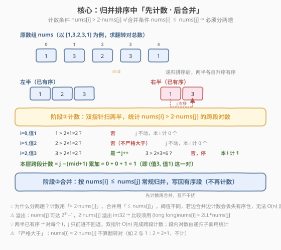
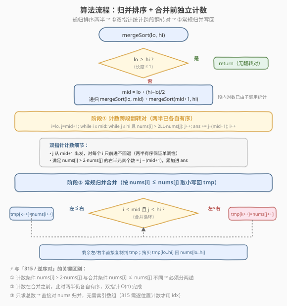

# LeetCode 翻转对 题解

## 1. 题目概述

- **标题 / 题号**：翻转对（#493，hard）
- **链接**：https://leetcode.cn/problems/reverse-pairs/
- **难度**：困难
- **标签**：数组、分治、归并排序、树状数组

**题意**：给定一个整数数组 `nums`，返回数组中的**翻转对**总数。翻转对定义为满足下述条件的数对 `(i, j)`：

$$
0 \le i < j < \text{nums.length} \quad \text{且} \quad \text{nums}[i] > 2 \times \text{nums}[j]
$$

**示例 1**：

```text
输入：nums = [1,3,2,3,1]
输出：2
解释：翻转对为
  (1, 4)：nums[1]=3 > 2×nums[4]=2×1=2  ✓
  (3, 4)：nums[3]=3 > 2×nums[4]=2×1=2  ✓
  注意 (2,4) 不算：nums[2]=2 不大于 2×1=2（等于不算）
```

**示例 2**：

```text
输入：nums = [2,4,3,5,1]
输出：3
解释：翻转对为
  (1, 4)：4 > 2×1=2  ✓
  (2, 4)：3 > 2×1=2  ✓
  (3, 4)：5 > 2×1=2  ✓
  注意 (0,4) 不算：2 不大于 2×1=2（等于不算）
```

**约束**：

- `1 <= nums.length <= 5 * 10^4`
- `-2^31 <= nums[i] <= 2^31 - 1`

> ⚠️ **值域陷阱**：`nums[i]` 取值范围是完整 `int32`，因此 `2 * nums[j]` 可达 $2^{32}$，**溢出 `int`**。C++ 比较时必须转 `long long`，即 `(long long)nums[i] > 2LL * nums[j]`，这是本题最高频的 WA 原因。

> 💡 本题是 [剑指 Offer 51. 数组中的逆序对](../0101-0200/LCOF51_数组中的逆序对.md) 与 [315. 计算右侧小于当前元素的个数](../0301-0400/315_计算右侧小于当前元素的个数.md) 的**同骨架变体**：都用归并排序的合并阶段批量统计跨段对数。区别在于本题计数条件是 `nums[i] > 2*nums[j]`，与合并条件 `nums[i] <= nums[j]` **不同**，因此计数必须在合并**之前**单独做一趟双指针扫描。

## 2. 解题思路

### 2.1 暴力思路：双重循环逐对比较

最直观的做法：枚举所有 $i < j$，判断 `nums[i] > 2 * nums[j]`。

```text
for i in range(n):
    for j in range(i+1, n):
        if nums[i] > 2 * nums[j]:
            ans += 1
```

> ⚠️ **致命缺陷**：$n \le 5 \times 10^4$ 时，数对总数达 $\binom{n}{2} \approx 1.25 \times 10^9$，双重循环必然超时。和逆序对一样，必须借助归并排序在合并阶段「批量统计」。

### 2.2 核心观察：归并排序 + 合并前独立计数



关键洞察来自归并排序的**分治结构**：递归排序左右两半后，跨段翻转对（`i` 在左半、`j` 在右半）可在两半**各自有序**的前提下用双指针 $O(n)$ 统计；段内翻转对由递归子调用负责。三层累加即总数：

$$
\text{总数} = \text{左半内对数} + \text{右半内对数} + \text{跨段对数}
$$

**但本题有一个关键不同**（相比逆序对/315）：计数条件 `nums[i] > 2*nums[j]` 与合并条件 `nums[i] <= nums[j]` **不是同一个阈值**。若像逆序对那样「边合并边计数」，合并时元素按 `<=` 取小，会打乱 `> 2*` 所需的有序参照，无法保证双指针单调前进。

因此必须**分两趟**：

1. **阶段①计数**（合并之前，两半仍各自有序）：双指针 `i` 扫左半、`j` 扫右半。对每个 `i`，前进 `j` 直到 `nums[i] <= 2*nums[j]`（即不再满足翻转对）。此时 `j - (mid+1)` 就是右半中满足 `nums[i] > 2*nums[k]` 的元素个数，累加进 `ans`。由于两半有序，`i` 递增时 `j` 只前进不回退，总扫描 $O(n)$。

2. **阶段②合并**：按常规 `nums[i] <= nums[j]` 归并写回，使本段有序供上层使用。

> 💡 **为什么 `j` 不回退？** 左半升序，`nums[i]` 随 `i` 增大而增大。若 `nums[i] > 2*nums[j]`，则更大的 `nums[i+1]` 必然也 `> 2*nums[j]`。所以 `j` 的「不满足位置」单调右移，无需回退。

> ⚠️ **「严格大于」语义**：条件是 `>` 而非 `>=`。当 `nums[i] == 2*nums[j]` 时**不算**翻转对（如 `2` 与 `1`：$2 = 2 \times 1$，不计）。双指针在 `nums[i] > 2*nums[j]` 为假时即停，天然保证严格性。

### 2.3 算法流程图



**完整步骤**：

1. **初始化**：辅助数组 `tmp`，全局答案 `ans = 0`。
2. **递归切分**：`mergeSort(lo, hi)`，若 `lo >= hi` 返回（长度 $\le 1$ 无翻转对）。
3. **分治**：`mid = lo + (hi-lo)/2`，递归左右半（段内对数由子调用统计）。
4. **阶段①计数跨段**（两半已有序）：
   - `j = mid + 1`
   - 对 `i` 从 `lo` 到 `mid`：`while j <= hi 且 nums[i] > 2LL*nums[j]: j++`；`ans += j - (mid+1)`
5. **阶段②常规归并**：`i=lo, j=mid+1, k=lo`，按 `nums[i] <= nums[j]` 取小写 `tmp`；剩余直接复制；拷贝 `tmp[lo..hi]` 回 `nums[lo..hi]`。

### 2.4 示例演算

以 `nums = [1,3,2,3,1]` 为例，完整演示递归树每个合并节点的计数与合并。

![示例演算：[1,3,2,3,1] → 2](../images/reverse_pairs_walkthrough.svg)

**递归树（4 个合并节点）**：

| 节点 | 合并对象 | 计数比较 | 跨段计数 | 合并后段 |
|------|----------|----------|----------|----------|
| ①(0,0,1) | `[1]·[3]` | 1 > 2×3=6? 否 | 0 | `[1,3]` |
| ②(0,1,2) | `[1,3]·[2]` | 1>4?否 3>4?否 | 0 | `[1,2,3]` |
| ③(3,3,4) | `[3]·[1]` | 3 > 2×1=2? 是 | **1** | `[1,3]` |
| ④(0,2,4) | `[1,2,3]·[1,3]` | 见下表 | **1** | `[1,1,2,3,3]` |

**节点④计数细节**（`lo=0, mid=2, hi=4`，左半 `[1,2,3]` · 右半 `[1,3]`）：

| 步骤 | i→左值 | 比较 | j 动作 | 计数 |
|------|--------|------|--------|------|
| 1 | 0, 值1 | 1 > 2×1=2? 否 | j 不动(=3) | ans += 3−3 = 0 |
| 2 | 1, 值2 | 2 > 2×1=2? 否(不严格) | j 不动(=3) | ans += 3−3 = 0 |
| 3 | 2, 值3 | 3 > 2×1=2? 是 → j: 3→4; 3 > 2×3=6? 否，停 | j=4 | ans += 4−3 = 1 |

最终 `ans = 0 + 0 + 1 + 1 = 2`，与示例一致。

> 💡 **节点②为何 `3 > 2×2=4` 为假？** $3 \not> 4$，所以值 `3` 与值 `2` 不构成翻转对。只有 `nums[i]` 严格大于 $2 \times \text{nums}[j]$ 才算——这比逆序对的 `nums[i] > nums[j]` 门槛更高，多数对会被过滤。

> 💡 **跨段 + 段内 = 总数**：节点④统计的跨段对（值3在下标2 与 值1在下标4）加上节点③统计的段内对（下标3的3 与 下标4的1），恰覆盖全部 2 个翻转对，分治保证不重不漏。

## 3. 参考代码

### C++

```cpp
class Solution {
    vector<int> tmp;
    int ans = 0;
  public:
    int reversePairs(vector<int>& nums) {
        int n = nums.size();
        tmp.resize(n);
        mergeSort(nums, 0, n - 1);
        return ans;
    }

  private:
    void mergeSort(vector<int>& nums, int lo, int hi) {
        if (lo >= hi) return;
        int mid = lo + (hi - lo) / 2;
        mergeSort(nums, lo, mid);
        mergeSort(nums, mid + 1, hi);
        // 阶段①：计数跨段翻转对（两半已有序，双指针 O(n)）
        int j = mid + 1;
        for (int i = lo; i <= mid; i++) {
            while (j <= hi && (long long)nums[i] > 2LL * nums[j]) j++;
            ans += j - (mid + 1);
        }
        // 阶段②：常规归并合并
        merge(nums, lo, mid, hi);
    }

    void merge(vector<int>& nums, int lo, int mid, int hi) {
        int i = lo, j = mid + 1, k = lo;
        while (i <= mid && j <= hi) {
            if (nums[i] <= nums[j]) tmp[k++] = nums[i++];
            else tmp[k++] = nums[j++];
        }
        while (i <= mid) tmp[k++] = nums[i++];
        while (j <= hi) tmp[k++] = nums[j++];
        for (int p = lo; p <= hi; p++) nums[p] = tmp[p];
    }
};
```

### Python

```python
class Solution:
    def reversePairs(self, nums: List[int]) -> int:
        n = len(nums)
        tmp = [0] * n
        ans = 0

        def merge_sort(lo: int, hi: int) -> None:
            nonlocal ans
            if lo >= hi:
                return
            mid = lo + (hi - lo) // 2
            merge_sort(lo, mid)
            merge_sort(mid + 1, hi)
            # 阶段①：计数跨段翻转对（两半已有序，双指针 O(n)）
            j = mid + 1
            for i in range(lo, mid + 1):
                while j <= hi and nums[i] > 2 * nums[j]:
                    j += 1
                ans += j - (mid + 1)
            # 阶段②：常规归并合并
            i, j, k = lo, mid + 1, lo
            while i <= mid and j <= hi:
                if nums[i] <= nums[j]:
                    tmp[k] = nums[i]
                    i += 1
                else:
                    tmp[k] = nums[j]
                    j += 1
                k += 1
            while i <= mid:
                tmp[k] = nums[i]
                i += 1
                k += 1
            while j <= hi:
                tmp[k] = nums[j]
                j += 1
                k += 1
            for p in range(lo, hi + 1):
                nums[p] = tmp[p]

        merge_sort(0, n - 1)
        return ans
```

> 💡 **Python 无溢出**：Python 整数任意精度，`2 * nums[j]` 不会溢出，直接比较即可。C++ 必须用 `(long long)nums[i] > 2LL * nums[j]` 规避 `int32` 溢出。
>
> 💡 **Python 栈深**：$n = 5 \times 10^4$ 时递归深度约 $\log_2 n \approx 16$，远低于默认限制 1000，无需 `setrecursionlimit`。但 Python 递归常数较大，必要时可改为迭代式归并。

## 4. 复杂度分析

| 维度 | 复杂度 | 说明 |
|------|--------|------|
| **时间复杂度** | $O(n \log n)$ | 归并树共 $O(\log n)$ 层；每层阶段①计数双指针合计 $O(n)$（`i`、`j` 各扫一遍），阶段②合并也是 $O(n)$ |
| **空间复杂度** | $O(n)$ | 辅助数组 `tmp` 为 $O(n)$；递归栈 $O(\log n)$，主导项为 `tmp` |

> 💡 **为何计数不增加复杂度？** 阶段①中 `j` 对整个右半只前进不回退（`i` 递增时 `j` 单调右移），所以每层计数总扫描量为 $O(\text{左半长} + \text{右半长}) = O(n)$，与合并同阶，不改变 $O(n \log n)$ 总复杂度。

## 5. 扩展：树状数组解法

与 [逆序对](../0101-0200/LCOF51_数组中的逆序对.md) / [315](../0301-0400/315_计算右侧小于当前元素的个数.md) 一样，**树状数组**（BIT）也能 $O(n \log n)$ 解决本题：从右往左遍历，对每个 `nums[i]` 查询「已插入元素中满足 $2 \times \text{nums}[k] < \text{nums}[i]$ 的个数」。

**思路**：

1. **离散化**：把所有 `nums[i]` 和 `2*nums[j]`（注意溢出用 `long long`）的值一并排序去重，压缩到 $[1, m]$。
2. **从右往左**遍历：对 `nums[i]`，查询 BIT 中严格小于 `nums[i]` 的已插入 `2*nums[k]` 的个数（即右侧满足 `nums[i] > 2*nums[k]` 的个数），累加进 `ans`，再把 `2*nums[i]` 的 rank 插入 BIT。

```cpp
class BIT {
    vector<int> tree;
    int n;
  public:
    BIT(int n) : tree(n + 1), n(n) {}
    void update(int i, int delta) {
        for (; i <= n; i += i & (-i)) tree[i] += delta;
    }
    int query(int i) {
        int sum = 0;
        for (; i > 0; i -= i & (-i)) sum += tree[i];
        return sum;
    }
};

class Solution {
  public:
    int reversePairs(vector<int>& nums) {
        // 收集所有需要离散化的值：nums[i] 与 2LL*nums[i]
        vector<long long> vals;
        for (int x : nums) {
            vals.push_back(x);
            vals.push_back(2LL * x);
        }
        sort(vals.begin(), vals.end());
        vals.erase(unique(vals.begin(), vals.end()), vals.end());
        int m = vals.size();
        BIT bit(m);
        int ans = 0;
        for (int i = (int)nums.size() - 1; i >= 0; --i) {
            // 查询已插入的 2*nums[k] 中严格小于 nums[i] 的个数
            int rank = lower_bound(vals.begin(), vals.end(), (long long)nums[i])
                       - vals.begin() + 1;           // nums[i] 的 rank（1-indexed）
            ans += bit.query(rank - 1);              // 严格小于 nums[i]
            // 插入 2*nums[i] 的 rank
            int rank2 = lower_bound(vals.begin(), vals.end(), 2LL * nums[i])
                        - vals.begin() + 1;
            bit.update(rank2, 1);
        }
        return ans;
    }
};
```

> 💡 **归并 vs 树状数组**：
> - **归并排序**：不需离散化，代码结构清晰，面试默写首选。缺点是修改原数组（本题无妨，题目只求总数）。
> - **树状数组**：需离散化（且要同时离散化 `nums[i]` 与 `2*nums[i]` 两类值），但思路「在线」——逐个从右往左插入查询，天然适合动态场景。本题两者均可，归并更易默写。

## 6. 面试要点

1. **本题和逆序对/315 的区别在哪？为什么要「先计数后合并」分两趟？**

   - 逆序对计数条件 `nums[i] > nums[j]` 与合并条件 `nums[i] <= nums[j]` 是**同一阈值**的互补，可边合并边计数；本题计数条件 `nums[i] > 2*nums[j]` 与合并条件 `nums[i] <= nums[j]` **阈值不同**，若边合并边计数会打乱 `> 2*` 所需的有序参照，双指针无法单调。因此必须在合并前单独做一趟计数——此时两半仍各自有序，双指针 $O(n)$ 完成。

2. **为什么计数阶段 `j` 不回退？复杂度还是 $O(n \log n)$？**

   - 左半升序，`nums[i]` 随 `i` 增大而增大。若 `nums[i] > 2*nums[j]` 成立，则更大的 `nums[i+1]` 必然也成立，所以 `j` 的终止位置单调右移。每层计数 `i`、`j` 各扫一遍共 $O(n)$，与合并同阶，总复杂度仍 $O(n \log n)$。

3. **溢出怎么处理？**

   - `nums[j]` 可达 $2^{31}-1$，`2*nums[j]` 可达 $2^{32}$ 溢出 `int32`。C++ 比较必须写成 `(long long)nums[i] > 2LL * nums[j]`，把右操作数提升到 `long long` 后再比较。Python 整数任意精度无此问题。这是本题最高频的 WA 点。

4. **「严格大于」如何保证？`nums[i] == 2*nums[j]` 算不算？**

   - 不算。条件是 `>` 而非 `>=`。双指针 `while` 条件为 `nums[i] > 2*nums[j]`，为假即停（包括相等情形），`j` 停在第一个不满足的位置，`j - (mid+1)` 恰好是严格满足的个数。

5. **为什么本题不需要索引数组（315 需要）？**

   - 315 要求「每个位置单独的计数」，归并会打乱位置，必须用 `idx[]` 把计数归属到原始下标。本题只求**总数**，无需逐位置输出，直接对 `nums` 归并即可，省去索引数组，代码比 315 更简洁。

## 同类练习题

| # | 题目 | 与本题的关联 |
|---|------|-------------|
| 剑指 Offer 51 | [数组中的逆序对](https://leetcode.cn/problems/shu-zu-zhong-de-ni-xu-dui-lcof/)（[题解](../0101-0200/LCOF51_数组中的逆序对.md)） | 本题的简化版——计数条件 `nums[i] > nums[j]` 与合并条件互补，可边合并边计数，掌握后本题只需把计数拆成独立一趟 |
| 315 | [计算右侧小于当前元素的个数](https://leetcode.cn/problems/count-of-smaller-numbers-after-self/)（[题解](../0301-0400/315_计算右侧小于当前元素的个数.md)） | 归并 + 索引数组的进阶版——要求逐位置计数，掌握后本题是「只求总数 + 计数条件不同」的退化 |
| 327 | [区间和的个数](https://leetcode.cn/problems/count-of-range-sum/) | 归并排序 + 前缀和统计区间个数，分治计数的另一变体，计数条件为区间 `[lower, upper]`，同样需在合并前独立双指针 |
| 912 | [排序数组](https://leetcode.cn/problems/sort-an-array/)（[题解](../0901-1000/912_排序数组.md)） | 归并排序母题，掌握 merge 模板后本题只需在合并前加一段双指针计数 |
