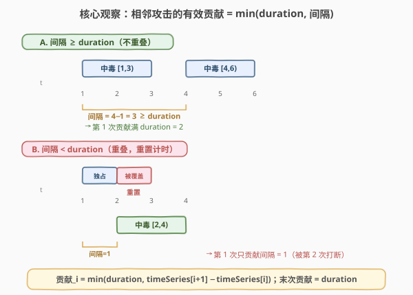
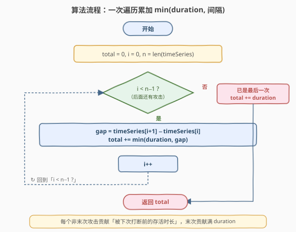
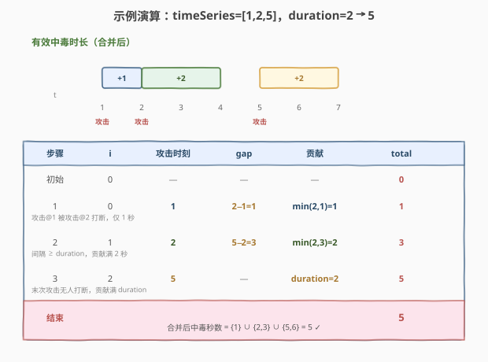

# LeetCode 提莫攻击 题解

## 1. 题目概述

- **标题 / 题号**：提莫攻击（#495，easy）
- **链接**：https://leetcode.cn/problems/teemo-attacking/
- **难度**：简单
- **标签**：数组、模拟、区间合并

**题意**：给定一个**非降序**整数数组 `timeSeries`，其中 `timeSeries[i]` 表示提莫在第 `timeSeries[i]` 秒发起一次攻击；再给定整数 `duration` 表示中毒持续时间。每次攻击使敌人中毒 `duration` 秒：若敌人在中毒期间**再次**被攻击，则中毒计时器**重置**（重新计时 `duration` 秒）。返回敌人在整个过程中处于中毒状态的总秒数。

> 💡 **时刻约定**：第 $t$ 秒的攻击使敌人在第 $t, t+1, \ldots, t+\text{duration}-1$ 秒中毒，即对应半开区间 $[t,\ t+\text{duration})$。两次攻击若区间重叠，则合并为一段连续的中毒时间，**不重复计数**。

**示例 1**：

```text
输入：timeSeries = [1,4], duration = 2
输出：4
解释：第 1 秒攻击中毒覆盖 {1,2}，第 4 秒攻击中毒覆盖 {4,5}，两段不重叠，合计 4 秒。
```

**示例 2**：

```text
输入：timeSeries = [1,2], duration = 2
输出：3
解释：第 1 秒攻击本应覆盖 {1,2}，但第 2 秒再次攻击重置计时，覆盖 {2,3}；
      合并后为 {1,2,3}，共 3 秒。
```

**约束**：

- $1 \le \text{timeSeries.length} \le 10^4$
- $0 \le \text{timeSeries}[i],\ \text{duration} \le 10^7$
- `timeSeries` 按**非降序**排列

> 💡 **题目本质**：把每次攻击展开成等长区间 $[t_i,\ t_i+\text{duration})$，求所有区间**并集的总长度**。由于区间等长且左端点已排序，无需显式建区间数组——只需看相邻攻击的间隔，即可判定是否重叠并累加有效贡献。

## 2. 解题思路

### 2.1 暴力思路

- **逐秒模拟**：开一个布尔数组 `poisoned[0..maxT]`，对每次攻击把 $[t_i,\ t_i+\text{duration})$ 内的每一秒标记为 `true`，最后统计 `true` 的个数。时间 $O(n\cdot\text{duration}+\text{maxT})$，空间 $O(\text{maxT})$。当 `duration` 取到 $10^7$ 时空间与时间都直接爆炸。
- **显式区间合并**：把每次攻击转为区间 $[t_i,\ t_i+\text{duration})$，按左端点排序后扫描合并，累加合并后区间长度。时间 $O(n\log n)$（若未排序）或 $O(n)$（本题已排序），空间 $O(n)$ 存区间数组。逻辑正确但**多存了一份区间数据**，且模板较重。

> ⚠️ 两种朴素做法要么在 `duration` 很大时崩溃，要么为「等长 + 已排序」这一特例背负了不必要的开销。突破口在于——**每次攻击的有效贡献只取决于它与下一次攻击的间隔**，可以就地累加，无需任何额外存储。

### 2.2 核心观察：相邻间隔决定有效贡献



设第 $i$ 次攻击时刻为 $t_i$，与下一次攻击的间隔为 $\text{gap}_i = t_{i+1} - t_i$。关键观察有两点：

1. **间隔 $\ge$ duration（不重叠）**：本次中毒完整存活 `duration` 秒，直到自然结束才被下次攻击接上，贡献满 `duration`。
2. **间隔 $<$ duration（重叠）**：本次中毒尚未结束就被下次攻击**重置计时**，从 $t_i$ 到 $t_{i+1}$ 这段（共 $\text{gap}_i$ 秒）是本次的「独占贡献」，之后由下次攻击接管。

两种情况合并为一个表达式：

$$\text{贡献}_i = \min(\text{duration},\ \text{gap}_i)$$

**最后一次攻击**无人打断，贡献满 `duration`。

> 💡 **为什么不会漏算或重复**：被下次打断后，重叠区 $[t_{i+1},\ t_i+\text{duration})$ 完全由下次攻击重新覆盖（下次从 $t_{i+1}$ 起重新计时 `duration` 秒，必包含该重叠区）。因此每次攻击只认领「到下次攻击前的存活段」，各段互不重叠且并集恰好等于合并后区间——这正是区间合并的「就地折叠」版本。

### 2.3 算法流程图



算法只需一趟遍历：

1. 初始化 `total = 0`，`n = len(timeSeries)`；若 $n = 0$ 直接返回 0（防御空数组）。
2. 令 $i = 0$，当 $i < n - 1$ 时循环：
   - 计算 $\text{gap} = \text{timeSeries}[i+1] - \text{timeSeries}[i]$。
   - `total += min(duration, gap)`。
   - $i\mathrel{+}= 1$。
3. 循环结束，`total += duration`（最后一次攻击的满额贡献），返回 `total`。

> ⚠️ **边界细节**：$n = 1$ 时循环不执行，直接返回 `0 + duration = duration`，即单次攻击中毒 `duration` 秒，正确；`duration = 0` 时每步 `min(0, gap) = 0`，末次也加 0，返回 0，正确。两种极端均无需特判。

### 2.4 示例演算

以 `timeSeries = [1, 2, 5]`，`duration = 2` 为例（既含重叠也含不重叠）：



| 步骤 | i | 攻击时刻 | gap | 贡献 | total | 说明 |
|------|---|----------|-----|------|-------|------|
| 初始 | 0 | — | — | — | 0 | total 归零 |
| 1 | 0 | 1 | $2-1=1$ | $\min(2,1)=1$ | 1 | 被 attack@2 打断，仅 1 秒 |
| 2 | 1 | 2 | $5-2=3$ | $\min(2,3)=2$ | 3 | 间隔 ≥ duration，贡献满 2 秒 |
| 3 | 2 | 5 | —（末次） | duration=2 | 5 | 末次无人打断，加满 duration |
| 结束 | — | — | — | — | **5** | 合并 = $\{1\}\cup\{2,3\}\cup\{5,6\} = 5$ |

最终结果为 **5** ✓。第 1 步 `gap=1 < duration=2`，attack@1 只贡献 1 秒（被 attack@2 接管重叠区）；第 2 步 `gap=3 ≥ duration=2`，attack@2 完整存活 2 秒；第 3 步 attack@5 作为末次加满 `duration`。

## 3. 参考代码

### C++

```cpp
class Solution {
  public:
    int findPoisonedDuration(vector<int>& timeSeries, int duration) {
        int n = timeSeries.size();
        if (n == 0) return 0;
        int total = 0;
        for (int i = 0; i < n - 1; ++i) {
            total += min(duration, timeSeries[i + 1] - timeSeries[i]);
        }
        return total + duration;
    }
};
```

### Python

```python
class Solution:
    def findPoisonedDuration(self, timeSeries: List[int], duration: int) -> int:
        n = len(timeSeries)
        if n == 0:
            return 0
        total = 0
        for i in range(n - 1):
            total += min(duration, timeSeries[i + 1] - timeSeries[i])
        return total + duration
```

> 💡 **简洁写法**：Python 3.10+ 可用 `pairwise` 把循环折叠为一行：
> ```python
> return sum(min(duration, b - a) for a, b in pairwise(timeSeries)) + duration
> ```
> 已隐含处理 $n=1$（`pairwise` 对单元素序列产生空迭代，结果为 `0 + duration`），但 $n=0$ 时仍返回 `duration` 而非 0，故需前置 `if not timeSeries: return 0`。面试中推荐显式循环写法，讲清「相邻间隔」语义。

## 4. 复杂度分析

| 维度 | 复杂度 | 说明 |
|------|--------|------|
| 时间复杂度 | $O(n)$ | 一趟遍历，每个相邻对 $O(1)$ 处理，共 $n-1$ 次 |
| 空间复杂度 | $O(1)$ | 仅用 `total`、循环变量等常数空间 |

> 💡 这是该题的最优解：时间已达下界 $O(n)$（必须至少查看每个攻击时刻才能确定总时长），空间为常数。无需排序（输入已非降序）、无需哈希、无需区间数组。

## 5. 扩展：从区间合并视角看本题

本题可视为 [56. 合并区间](https://leetcode.cn/problems/merge-intervals/) 的一个**退化特例**：

| 维度 | 56. 合并区间 | 495. 提莫攻击 |
|------|--------------|---------------|
| 区间长度 | 任意 | 等长（均为 `duration`） |
| 左端点顺序 | 需排序 $O(n\log n)$ | 已非降序，免排序 |
| 输出 | 合并后的区间列表 | 合并后总长度 |
| 解法 | 显式扫描合并 | 折叠为 $\min(\text{duration},\ \text{gap})$ |

**化归路径**：

1. **通用区间合并**：排序后扫描，若当前区间左端 $\le$ 上一区间右端，则合并（取右端较大者）；否则开启新区间。累加各合并区间的长度。
2. **代入等长 + 已排序**：相邻区间 $[t_i, t_i+\text{duration})$ 与 $[t_{i+1}, t_{i+1}+\text{duration})$ 重叠当且仅当 $t_{i+1} < t_i + \text{duration}$，即 $\text{gap}_i < \text{duration}$。
3. **折叠成表达式**：重叠时本次贡献 $\text{gap}_i$，不重叠时贡献 $\text{duration}$，正是 $\min(\text{duration},\ \text{gap}_i)$。

> 💡 掌握这条化归链，遇到「等长区间 + 已排序」类问题可直接套用 $\min$ 公式省去显式合并；遇到一般区间合并再退回通用模板。先讲通用思路再化简，是面试中展示化归能力的标准路径。

## 6. 面试要点

1. **为什么 `min(duration, gap)` 就够？会不会漏算重叠部分？**
   - 不会。每次攻击只认领「到下次攻击前的存活段」$\min(\text{duration},\ \text{gap})$。被下次打断后，重叠区 $[t_{i+1},\ t_i+\text{duration})$ 完全由下次攻击重新覆盖（下次从 $t_{i+1}$ 起重新计时，必含该重叠区）。各次「独占贡献」互不重叠且并集恰为合并后区间，无重复无遗漏。

2. **数组只有一个元素或 `duration = 0` 时算法是否正确？**
   - 单元素：循环不执行，返回 `0 + duration = duration`，正确。`duration = 0`：每步 `min(0, gap) = 0`，末次加 0，返回 0，正确。两种边界都无需特判（仅需保留 $n = 0$ 的防御检查）。

3. **为什么不直接用「区间合并」模板？**
   - 可以用，但本题是区间合并的退化特例：区间等长且左端点已排序。显式建区间数组 + 扫描合并是多此一举，`min(duration, gap)` 把合并逻辑折叠成一个表达式，空间从 $O(n)$ 降到 $O(1)$。若面试官追问，先讲区间合并思路，再化简到 `min` 公式，能展示化归能力。

4. **如果 `timeSeries` 未排序怎么办？**
   - 先排序再套同一公式。排序 $O(n\log n)$ 成为主项，公式部分仍 $O(n)$。LeetCode 本题保证非降序，故整体 $O(n)$。若面试官改条件为「未排序」，加一行 `sort` 即可。

5. **半开区间 $[t, t+\text{duration})$ 与闭区间 $[t, t+\text{duration}-1]$ 的选择有影响吗？**
   - 无影响。两种约定下「下次攻击打断本次」的判定都是 $\text{gap} < \text{duration}$，贡献公式都是 $\min(\text{duration},\ \text{gap})$。半开区间更便于推理（区间长度 = 右端 − 左端），推荐采用。

## 同类练习题

| # | 题目 | 与本题的关联 |
|---|------|-------------|
| 56 | [合并区间](https://leetcode.cn/problems/merge-intervals/)（[题解](../0001-0100/56_合并区间.md)） | 本题的「通用版」——区间长度任意、需排序后扫描合并；掌握后再回看 495 即可理解 $\min$ 公式如何折叠合并逻辑 |
| 228 | [汇总区间](https://leetcode.cn/problems/summary-ranges/)（[题解](../0201-0300/228_汇总区间.md)） | 同样扫描相邻元素的差值，把连续段压缩为区间表示，对照本题「按间隔判定重叠」的思路 |
| 435 | [无重叠区间](https://leetcode.cn/problems/non-overlapping-intervals/)（[题解](../0401-0500/435_无重叠区间.md)） | 区间调度贪心，按右端点排序保留最多互不重叠区间，是「重叠判定」的另一面 |
| 452 | [用最少数量的箭引爆气球](https://leetcode.cn/problems/minimum-number-of-arrows-to-burst-balloons/)（[题解](../0401-0500/452_用最少数量的箭引爆气球.md)） | 区间重叠贪心，按右端点合并可一并引爆的气球，与本题「合并重叠中毒段」同源 |
| 763 | [划分字母区间](https://leetcode.cn/problems/partition-labels/) | 先记录每个字母最后出现位置，再扫描合并重叠区间——一道需要「先构造区间再合并」的综合题，可作为 56 → 495 化归链的延伸练习 |
