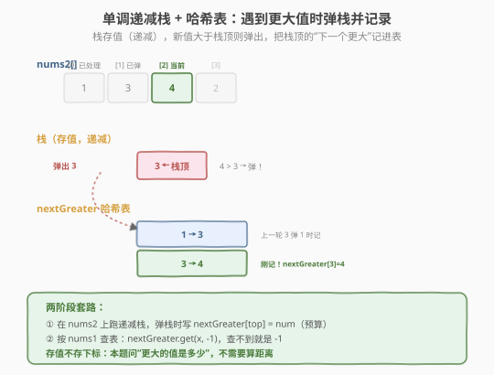
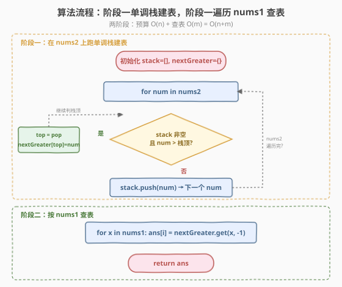
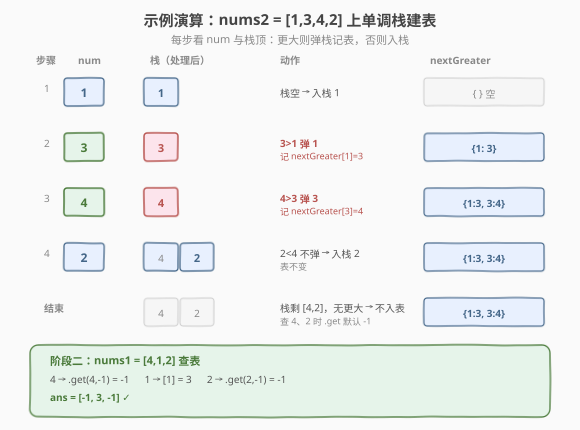

# LeetCode 下一个更大元素 I 题解

## 1. 题目概述

- **标题 / 题号**：下一个更大元素 I（#496，easy）
- **链接**：https://leetcode.cn/problems/next-greater-element-i/
- **难度**：简单
- **标签**：数组、哈希表、单调栈

**题意**：给定两个**没有重复元素**的数组 `nums1` 和 `nums2`，其中 `nums1` 是 `nums2` 的子集。对 `nums1` 中的每个元素 `x`，找出 `x` 在 `nums2` 中对应位置的**右侧第一个更大**的元素值。如果不存在更大的元素，答案为 `-1`。返回数组 `ans`，长度与 `nums1` 相同。

**示例 1**：

```text
输入：nums1 = [4,1,2], nums2 = [1,3,4,2]
输出：[-1,3,-1]
解释：
  nums1 中 4 → 在 nums2 下标 2，右边没有更大 → -1
  nums1 中 1 → 在 nums2 下标 0，右边第一个更大是 3 → 3
  nums1 中 2 → 在 nums2 下标 3，右边没有更大 → -1
```

**示例 2**：

```text
输入：nums1 = [2,4], nums2 = [1,2,3,4]
输出：[3,-1]
解释：
  nums1 中 2 → 在 nums2 下标 1，右边第一个更大是 3 → 3
  nums1 中 4 → 在 nums2 下标 3，右边没有更大 → -1
```

**约束**：

- `1 <= nums1.length <= nums2.length <= 1000`
- `0 <= nums1[i], nums2[i] <= 10^4`
- `nums1` 和 `nums2` 中所有整数**互不相同**
- `nums1` 中的所有整数都出现在 `nums2` 中

> 💡 这是 **单调栈（monotonic stack）** 的入门题，与同一天的 [每日温度](../0701-0800/739_每日温度.md) 是同一套模板。区别在于：每日温度问"隔几天"需要存**下标**算距离，本题问"下一个更大的**值**是多少"且只需回答 `nums1` 里的元素——所以可以先在 `nums2` 上跑一遍单调栈，把"每个值的下一个更大值"存进**哈希表**，再按 `nums1` 查表。题目保证元素**互不相同**，正是为了让"值"能直接当哈希表的键。

## 2. 解题思路

### 2.1 暴力思路：双重循环

对 `nums1` 中每个 `x`，先在 `nums2` 里定位 `x` 的下标 `j`，再从 `j+1` 向后找第一个比 `x` 大的元素。

```text
for x in nums1:
    j = index of x in nums2
    for k in j+1 .. n:
        if nums2[k] > x:
            ans[i] = nums2[k]
            break
    else:
        ans[i] = -1
```

时间复杂度 `O(m * n)`（`m = len(nums1)`，`n = len(nums2)`），最坏 `10^6`，能过但**不够优雅**。更关键的是：`nums2` 里很多元素的"下一个更大"会被重复计算——比如 `nums1` 同时问 1 和 3，它们的答案都要在 `nums2` 里向后扫，扫过的区间大量重叠。

> ⚠️ 暴力法的浪费在于：`nums2` 的"下一个更大"信息本可以**一次性算完**并缓存，却被 `nums1` 的每个查询反复重算。把"算答案"和"查答案"拆成两步——先用单调栈把 `nums2` 所有元素的下一个更大值预算进哈希表，再 `O(1)` 查表，正是本题的最优解。

### 2.2 核心观察：单调递减栈 + 哈希表

**关键定义**：维护一个**栈**，栈中存放 `nums2` 的**值**，从栈底到栈顶**单调递减**。同时维护一个哈希表 `nextGreater`：`nextGreater[v] = v 的下一个更大值`。

**核心规则**：遍历 `nums2` 中每个 `num`：

- 若 `num` **大于**栈顶值：说明 `num` 就是栈顶那个值的"下一个更大"！弹出栈顶 `top`，`nextGreater[top] = num`。**循环弹**直到栈顶 ≥ `num`（保持单调性）或栈空。
- 然后**把** `num` **入栈**（它还没找到下一个更大，等后续更大的来结算）。



**为什么栈里存值而不是下标？** 因为本题问的是"下一个更大的**值**是多少"，不需要算距离/位置差。每日温度要算"隔几天"才必须存下标；这里只需比较值并记录值，所以**直接存值**即可，代码更简洁。这是单调栈题的灵活之处：**需要位置差存下标，只需比值存值**。

> 💡 **两阶段套路**：① 在"全集" `nums2` 上跑单调栈，把每个值的下一个更大值存进哈希表 `O(n)`；② 遍历"查询集" `nums1`，`O(1)` 查表填答案 `O(m)`。总时间 `O(n + m)`，把暴力的 `O(m*n)` 降到线性。这种"**预处理 + 查表**"的思路在 503、901 等题中反复出现。

### 2.3 算法流程图



**完整步骤**：

1. **初始化**：栈 `stack = []`，哈希表 `nextGreater = {}`
2. **阶段一（遍历 `nums2`）**：对每个 `num`：
   - `while stack 非空 且 num > stack.top()`：
     - `top = stack.pop()`
     - `nextGreater[top] = num`（栈顶值的下一个更大就是 `num`）
   - `stack.push(num)`
3. **阶段二（遍历 `nums1`）**：对每个 `x`：
   - `ans[i] = nextGreater.get(x, -1)`（查不到说明没下一个更大，填 -1）
4. **返回** `ans`

> ⚠️ 阶段一结束后，栈中剩余的值（如示例的 4、2）没有下一个更大，`nextGreater` 里没有它们的键。阶段二用 `.get(x, -1)` 兜底，自动返回 -1，无需额外处理——和每日温度"answer 初始化为 0"是同一种思路。

### 2.4 示例演算

以 `nums1 = [4,1,2]`，`nums2 = [1,3,4,2]` 为例。先在 `nums2` 上跑单调栈建表：



**阶段一（建表）**：

| 步骤 | num | 栈（值，递减） | 动作 | nextGreater |
|------|-----|---------------|------|-------------|
| 1 | 1 | [] | 栈空，入栈 1 | {} |
| 2 | 3 | [1] | 3>1，弹 1 → nextGreater[1]=3；入栈 3 | {1:3} |
| 3 | 4 | [3] | 4>3，弹 3 → nextGreater[3]=4；入栈 4 | {1:3, 3:4} |
| 4 | 2 | [4] | 2<4，不弹，入栈 2 | {1:3, 3:4} |
| 结束 | — | [4,2] | 剩余值无下一个更大，不入表 | {1:3, 3:4} |

**阶段二（查表）**：

| nums1 元素 | 查 nextGreater | 结果 |
|-----------|---------------|------|
| 4 | `.get(4, -1)` → 无键 | -1 |
| 1 | `[1]` → 3 | 3 |
| 2 | `.get(2, -1)` → 无键 | -1 |

最终 `ans = [-1, 3, -1]`，与示例 1 一致。

> 💡 注意阶段一第 2、3 步：一个新值进来可能连续弹多个栈顶（3 弹了 1，4 弹了 3），这正是单调栈"一次结算多个答案"的威力。结束后栈剩 `[4,2]`（4 在栈底、2 在栈顶，递减），它们后面没有更大值，因此 `nextGreater` 里没有 4 和 2 的键——阶段二查它们时自动得 -1。

## 3. 参考代码

### C++

```cpp
// 下一个更大元素I.cpp —— 单调递减栈 + 哈希表
// 编译: g++ -O2 -std=c++17 下一个更大元素I.cpp -o nge1
#include <vector>
#include <stack>
#include <unordered_map>
using namespace std;

class Solution {
  public:
    vector<int> nextGreaterElement(vector<int>& nums1, vector<int>& nums2) {
        stack<int> stk;                       // 存值，单调递减
        unordered_map<int, int> nextGreater;  // value -> 下一个更大值

        // 阶段一：在 nums2 上跑单调栈，建表
        for (int num : nums2) {
            while (!stk.empty() && num > stk.top()) {
                int top = stk.top();
                stk.pop();
                nextGreater[top] = num;        // 栈顶值的下一个更大就是 num
            }
            stk.push(num);
        }

        // 阶段二：按 nums1 查表
        vector<int> ans;
        ans.reserve(nums1.size());
        for (int x : nums1) {
            auto it = nextGreater.find(x);
            ans.push_back(it == nextGreater.end() ? -1 : it->second);
        }
        return ans;
    }
};
```

### Python

```python
class Solution:
    def nextGreaterElement(self, nums1: list[int], nums2: list[int]) -> list[int]:
        stack = []                 # 存值，单调递减
        next_greater = {}          # value -> 下一个更大值

        # 阶段一：在 nums2 上跑单调栈，建表
        for num in nums2:
            while stack and num > stack[-1]:
                top = stack.pop()
                next_greater[top] = num
            stack.append(num)

        # 阶段二：按 nums1 查表，查不到默认 -1
        return [next_greater.get(x, -1) for x in nums1]
```

> 💡 Python 用 `dict.get(x, -1)` 一行兜底"查不到返回 -1"，比 C++ 的 `find` + 判断更简洁。栈用 `list`，`stack[-1]` 是栈顶值——本题存值不存下标，所以 `stack[-1]` 直接就是待比较的元素值。

## 4. 复杂度分析

| 维度 | 复杂度 | 说明 |
|------|--------|------|
| **时间复杂度** | `O(n + m)` | 阶段一 `nums2` 每个值入栈 1 次、出栈 1 次，共 `O(n)`；阶段二 `nums1` 查表 `m` 次每次 `O(1)`，共 `O(m)` |
| **空间复杂度** | `O(n)` | 栈最多存 `n` 个值；哈希表最多存 `n` 个键值对（严格递减时全部入栈、无弹出） |

> ⚠️ 虽然 `while` 嵌套在 `for` 里，但**均摊分析**：`nums2` 中每个值至多入栈 1 次出栈 1 次，`while` 的总弹出次数 ≤ `n`，所以阶段一总时间 `O(n)` 而非 `O(n²)`。哈希表查询平均 `O(1)`，最坏 `O(n)`（哈希冲突退化），但题目元素互不相同且值域不大，实际表现稳定。

## 5. 扩展：与每日温度的对比

### 5.1 同模板，两个关键差异

496 和 [每日温度（739）](../0701-0800/739_每日温度.md) 用的是**同一个单调递减栈模板**，差别只有两点：

| 维度 | 每日温度（739） | 下一个更大元素 I（496） |
|------|----------------|----------------------|
| **栈里存什么** | 下标（要算 `i - top` 距离） | 值（只需记录下一个更大的值） |
| **如何输出** | 弹栈时直接写 `answer[top] = i - top` | 弹栈时写哈希表，再按 `nums1` 查表 |
| **查询对象** | 对**每个**位置输出 | 只对 `nums1` 里的元素输出（`nums2` 的子集） |
| **无答案默认值** | `0` | `-1` |

> 💡 **存下标 vs 存值**是单调栈题的核心选择：需要**位置差/距离**时存下标（每日温度、柱状图最大矩形），只需**比值/记录值**时存值（本题、下一个更大元素 II）。记这个口诀就不会选错。

### 5.2 两阶段套路：预处理 + 查表

本题引入了"**预算 + 查表**"的两阶段结构：

```python
# 阶段一：在全集上预处理
for num in nums2:
    while stack and num > stack[-1]:
        next_greater[stack.pop()] = num
    stack.append(num)
# 阶段二：按查询集 O(1) 取答案
return [next_greater.get(x, -1) for x in nums1]
```

当"算答案"的成本高于"查答案"，且查询多次复用同一份数据时，这个套路很通用：

| 题目 | 预处理对象 | 查询对象 |
|------|-----------|---------|
| 496 下一个更大元素 I | `nums2`（全集） | `nums1`（子集） |
| 503 下一个更大元素 II | 拼接两遍的数组 | 原数组每个位置 |
| 901 股票价格跨度 | 历史价格流 | 当前价格往前累加 |

> 💡 这种"用空间换时间、把重复计算提出来预处理"的思想，和 [Day 1 两数之和](../0001-0100/1_两数之和.md) 用哈希表把 `O(n²)` 降到 `O(n)` 是一脉相承的——本质都是"**先建索引，再查索引**"。

### 5.3 相关变体题

| 题目 | 与本题差异 |
|------|-----------|
| 503 下一个更大元素 II | 数组**循环**，需拼接两遍或用取模模拟环形 |
| 739 每日温度 | 存下标算距离，输出"隔几天"而非"更大的值" |
| 84 柱状图最大矩形 | 找左右第一个**更矮**，递增栈，两侧各扫一遍 |
| 901 股票价格跨度 | 弹栈时**累加跨度**而非单值记录 |

> 💡 这些题的骨架**完全相同**——都是"遍历 + while 弹栈结算 + 入栈"。差别仅在比较方向、结算内容、扫描方向。掌握 496 的两阶段模板，503 可秒杀，901 也能快速迁移。

## 6. 面试要点

1. **为什么栈里存值而不是下标？**

   - 本题问"下一个更大的**值**是多少"，不需要算位置差。存值就能直接比较和写入哈希表，代码更简洁。
   - 每日温度要算"隔几天"（`i - top`），才必须存下标。**通用原则**：需要位置差存下标，只需比值存值。
   - 如果题目改成"返回下一个更大元素的**下标差**"，就得改存下标——存什么取决于"答案需要什么信息"。

2. **为什么要用哈希表？能不能直接对 nums1 每个元素扫一遍？**

   - 可以暴力 `O(m*n)`，但当 `nums1` 有多个元素时，`nums2` 的"下一个更大"会被重复计算。
   - 哈希表把 `nums2` 的预算结果缓存，每个 `nums1` 查询 `O(1)`，总时间从 `O(m*n)` 降到 `O(n+m)`。
   - 题目保证元素**互不相同**，所以"值"能唯一当键——这是能用哈希表的前提。若有重复值，需改为存下标再映射。

3. **为什么是单调递减栈？**

   - 找"下一个更大"，栈里存"还没找到更大的"值，它们应**递减**排列——栈顶是最小、最迫切等更大值的元素，新来的值先和它比。
   - 若栈递增（栈顶最大），新来的小值入栈后压在大值下面，永远等不到更大的来结算，破坏"栈顶先结算"机制。
   - 口诀：**找更大用递减栈，找更小用递增栈**。和每日温度完全一致。

4. **时间复杂度为什么是 O(n + m) 而不是 O(n*m)？**

   - 阶段一虽 `while` 嵌套 `for`，但**均摊**：`nums2` 每个值入栈 1 次、出栈 1 次，`while` 总弹出 ≤ `n`，阶段一 `O(n)`。
   - 阶段二 `nums1` 查哈希表 `m` 次，每次平均 `O(1)`，共 `O(m)`。
   - 合计 `O(n + m)`。这是"每个元素均摊 O(1)"的经典例子，与每日温度、合并链表同源。

5. **栈中剩余元素为什么不用处理？**

   - 阶段一结束后栈里剩的是"右边没有更大值"的元素（如示例的 4、2），它们从未被结算，`nextGreater` 里没有它们的键。
   - 阶段二用 `dict.get(x, -1)` 查不到键自动返回 -1，正好符合"无更大元素返回 -1"的题意。
   - 不需要遍历栈补 `-1`——这是"查表默认值"的妙处，和每日温度"`answer` 初始化为 0"异曲同工。

> 💡 **一句话总结**：496 是单调栈的入门题——它把"算答案"和"查答案"拆成两阶段：先在 `nums2` 上用递减栈把每个值的下一个更大值预算进哈希表 `O(n)`，再按 `nums1` 查表 `O(m)`，总 `O(n+m)`。和每日温度相比，核心差异是"**存值不存下标**"（不需算距离）和"**哈希表 + 查表**"（只回答子集查询）。这个两阶段骨架可迁移到 503、901 等所有"找下一个更 X"问题，是面试必会的入门模板。

## 同类练习题

| # | 题目 | 与本题的关联 |
|---|------|-------------|
| 503 | [下一个更大元素 II](https://leetcode.cn/problems/next-greater-element-ii/)（[题解](../0501-0600/503_下一个更大元素 II.md)） | 循环数组，拼接两遍再用同模板 |
| 739 | [每日温度](https://leetcode.cn/problems/daily-temperatures/)（[题解](../0701-0800/739_每日温度.md)） | 同模板存下标算距离，本题的"姊妹题" |
| 901 | [股票价格跨度](https://leetcode.cn/problems/online-stock-span/)（[题解](../0901-1000/901_股票价格跨度.md)） | 单调递减栈，弹栈时累加跨度 |
| 84 | [柱状图中最大的矩形](https://leetcode.cn/problems/largest-rectangle-in-histogram/)（[题解](../0001-0100/84_柱状图中最大的矩形.md)） | 找左右第一个更矮，递增栈两侧扫描 |
