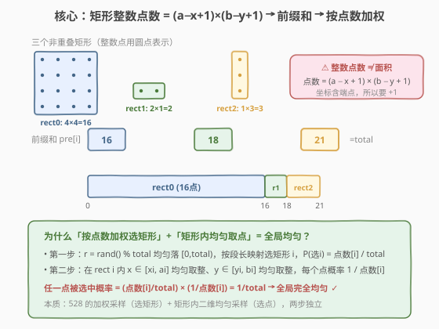
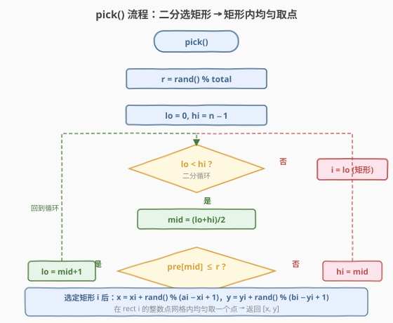
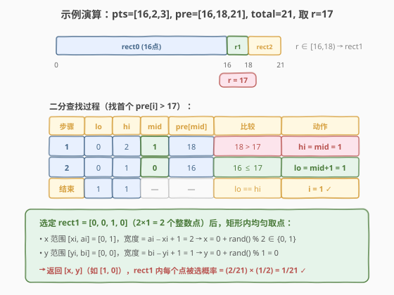

# 非重叠矩形中的随机点

- **题目名称**：非重叠矩形中的随机点
- **链接**：[497. 非重叠矩形中的随机点](https://leetcode.cn/problems/random-point-in-non-overlapping-rectangles/)
- **难度**：中等
- **标签**：数学、概率与随机、前缀和、二分查找

## 1. 题目概述

给定一组**两两不重叠**的轴对齐矩形 `rects`，其中 `rects[i] = [xi, yi, ai, bi]`，`(xi, yi)` 是左下角坐标、`(ai, bi)` 是右上角坐标。请实现 `Solution` 类：

- `Solution(int[][] rects)`：用矩形列表初始化对象；
- `int[] pick()`：在所有矩形覆盖的**整数点**中**均匀随机**返回一个点 `[x, y]`。所谓整数点即 `x`、`y` 均为整数，且落在某个矩形内部或边界上。

**示例 1**：

```text
输入：
["Solution","pick","pick","pick","pick","pick"]
[[[[-2,-2,1,1],[0,0,1,0],[3,0,3,2]]],[],[],[],[],[]]
输出：
[null,[-1,-2],[2,-2],[-2,-2],[2,1],[-2,1]]
解释：三个矩形共覆盖 16+2+3=21 个整数点，每次 pick 等概率返回其中之一。
```

**约束条件**：

- `1 <= rects.length <= 100`
- `rects[i].length == 4`
- `-10^9 <= xi < ai <= 10^9`（同一矩形内）
- `-10^9 <= yi < bi <= 10^9`（同一矩形内）
- `xi` 第一个矩形的 `xi` 为 `-2`（示例），其余满足坐标递增关系
- 矩形两两不重叠
- `pick` 至多被调用 `10^4` 次
- 浮点误差在 `10^-5` 内视为正确

> 💡 **题目本质**：这不是「等概率选一个矩形再随便取点」——矩形大（整数点多）就应更可能被选中。正确做法是**按矩形覆盖的整数点数加权选矩形**，再在选中矩形内**均匀取一个整数点**。这正是 [528. 按权重随机选择](../0501-0600/528_按权重随机选择.md) 的二维推广。

---

## 2. 解题思路

### 2.1 暴力思路：展开所有整数点

最直觉的做法：把每个矩形覆盖的所有整数点 `(x, y)` 全部枚举存入一个大数组 `pool`，然后 `pool[rand() % pool.size()]` 等概率取一个。

问题在于空间与初始化时间。坐标范围达 $10^9$，单个矩形可含多达 $(2 \times 10^9) \times (2 \times 10^9) \approx 4 \times 10^{18}$ 个整数点，`pool` 根本无法装下。即使规模较小，逐点展开也需 $O(\sum \text{点数})$ 时间，不可接受。

> ⚠️ **展开法的症结**：把「二维区域」物化成「逐点列表」，空间正比于整数点总数。我们需要一种**不展开**也能等价采样的方法。

### 2.2 核心观察：前缀和 + 二分选矩形，矩形内均匀取点



关键转化分两步：

**第一步：算每个矩形的整数点数。**

矩形 `i` 的整数点数为：

$$
\text{pts}[i] = (a_i - x_i + 1) \times (b_i - y_i + 1)
$$

> ⚠️ **务必 +1**：整数坐标是**离散**的，包含两端点。从 $x_i$ 到 $a_i$ 共有 $a_i - x_i + 1$ 个整数（如 $0$ 到 $1$ 有 $\{0, 1\}$ 共 $2$ 个）。漏掉 $+1$ 会导致权重失真、采样不均匀。这与几何面积 $(a_i - x_i) \times (b_i - y_i)$ 不同——面积用于连续情形，本题是离散整数点。

**第二步：按点数做前缀和 + 二分选矩形（528 的套路）。**

设 `pre[i] = pts[0] + ... + pts[i]`，`total = pre[n-1]`。由于 `pts[i] >= 1`，`pre` **严格递增**。每个矩形 `i` 对应数轴上一段左闭右开区间 $[\text{pre}[i-1], \text{pre}[i])$，段长恰为 $\text{pts}[i]$。

生成 `r = rand() % total`，均匀落在 $[0, \text{total})$。`r` 落入第 $i$ 段的概率为：

$$
P(\text{选矩形 } i) = \frac{\text{pts}[i]}{\text{total}}
$$

这恰是「按整数点数加权」。于是问题归约为：**给定 `r`，在 `pre` 上二分找首个 `pre[i] > r`**（即 `upper_bound` / `bisect_right`）。

**第三步：在选中矩形内均匀取一个整数点。**

选定矩形 `i` 后，`x` 在 $[x_i, a_i]$ 均匀取整、`y` 在 $[y_i, b_i]$ 均匀取整：

$$
x = x_i + \text{rand}() \bmod (a_i - x_i + 1), \qquad y = y_i + \text{rand}() \bmod (b_i - y_i + 1)
$$

> 💡 **为什么两步合起来是全局均匀？** 任一具体点 $(x, y)$ 属于唯一矩形 $i$。它被选中的概率 = 选到矩形 $i$ 的概率 × 矩形 $i$ 内取到该点的概率 = $\frac{\text{pts}[i]}{\text{total}} \times \frac{1}{\text{pts}[i]} = \frac{1}{\text{total}}$。所有点概率相等，全局完全均匀。这本质上是**全概率公式**：把「选点」拆成「选区域」+「区域内选点」，两步独立且各自均匀。

### 2.3 算法流程图



`pick` 流程：

1. `r = rand() % total`（`r ∈ [0, total-1]`）；
2. 在 `pre` 上二分查找**首个大于 `r`** 的元素位置：`lo = 0, hi = n - 1`，当 `lo < hi` 时取 `mid = (lo + hi) / 2`，若 `pre[mid] <= r` 则 `lo = mid + 1`，否则 `hi = mid`；
3. `lo == hi` 时，矩形下标 `i = lo`；
4. `x = xi + rand() % (ai - xi + 1)`，`y = yi + rand() % (bi - yi + 1)`；
5. 返回 `[x, y]`。

> ⚠️ **二分判据**：`pre[mid] <= r`（含等号）时右移 `lo`。因为区间是左闭右开 $[\text{pre}[i-1], \text{pre}[i])$，`r` 恰好等于 `pre[i-1]` 时仍属于第 $i$ 段。对应 `upper_bound` / `bisect_right`。

### 2.4 示例演算

以 `rects = [[-2,-2,1,1], [0,0,1,0], [3,0,3,2]]` 为例：

- rect0：$(-2,-2)$ 到 $(1,1)$，$\text{pts} = (1-(-2)+1) \times (1-(-2)+1) = 4 \times 4 = 16$
- rect1：$(0,0)$ 到 $(1,0)$，$\text{pts} = (1-0+1) \times (0-0+1) = 2 \times 1 = 2$
- rect2：$(3,0)$ 到 $(3,2)$，$\text{pts} = (3-3+1) \times (2-0+1) = 1 \times 3 = 3$

故 `pts = [16, 2, 3]`，`pre = [16, 18, 21]`，`total = 21`。取 `r = 17`：



- `r = 17` 落在 $[16, 18)$（rect1 段）；
- 二分：`lo=0,hi=2 → mid=1, pre[1]=18 > 17 → hi=1`；`lo=0,hi=1 → mid=0, pre[0]=16 ≤ 17 → lo=1`；`lo==hi==1`，选中 rect1；
- rect1 = $[0,0,1,0]$：`x = 0 + rand() % 2 ∈ {0,1}`，`y = 0 + rand() % 1 = 0`；
- 返回 `[x, 0]`（如 `[1, 0]`），该点被选概率 $= \frac{2}{21} \times \frac{1}{2} = \frac{1}{21}$ ✓

> 💡 留意 rect1 虽然面积看似为 $0$（$y$ 方向只有一行），但整数点数为 $2$（不是 $0$），仍然有权重——这正是 `+1` 的意义：退化为一维线段时，点数按一维长度 $+1$ 计算。

---

## 3. 参考代码

### C++

```cpp
class Solution {
  public:
    Solution(vector<vector<int>>& rects) : rects(rects) {
        int acc = 0;
        pre.reserve(rects.size());
        for (auto& r : rects) {
            int pts = (r[2] - r[0] + 1) * (r[3] - r[1] + 1);
            acc += pts;
            pre.push_back(acc);
        }
        total = acc;
        srand((unsigned)time(nullptr));
    }

    vector<int> pick() {
        int r = rand() % total;            // [0, total-1]
        int lo = 0, hi = pre.size() - 1;
        while (lo < hi) {                   // 找首个 pre[i] > r
            int mid = lo + (hi - lo) / 2;
            if (pre[mid] <= r)
                lo = mid + 1;
            else
                hi = mid;
        }
        auto& rect = rects[lo];
        int x = rect[0] + rand() % (rect[2] - rect[0] + 1);
        int y = rect[1] + rand() % (rect[3] - rect[1] + 1);
        return {x, y};
    }

  private:
    vector<vector<int>> rects;
    vector<int> pre;
    int total;
};
```

### Python

```python
class Solution:
    def __init__(self, rects: List[List[int]]):
        self.rects = rects
        self.pre = list(itertools.accumulate(
            (r[2] - r[0] + 1) * (r[3] - r[1] + 1) for r in rects))
        self.total = self.pre[-1]

    def pick(self) -> List[int]:
        r = random.randrange(self.total)    # [0, total-1]
        i = bisect.bisect_right(self.pre, r)
        x1, y1, x2, y2 = self.rects[i]
        return [random.randint(x1, x2), random.randint(y1, y2)]
```

> ⚠️ **易错点**：
> - **`+1` 不能漏**：`pts = (a - x + 1) * (b - y + 1)`，不是 `(a - x) * (b - y)`。后者是几何面积，用于连续采样；本题是离散整数点，必须含端点。
> - **二分用 `bisect_right`**（首个 `> r`）而非 `bisect_left`（首个 `>= r`）。若误用 `bisect_left`，当 `r` 恰为某 `pre[i]` 时会返回 `i+1`（错段）。
> - **矩形内取点用 `randint`**（含两端）而非 `randrange(a, b)`（不含 `b`）。Python 中 `randint(x1, x2)` 含 `x2`，与整数点定义一致。

---

## 4. 复杂度分析

| 维度 | 复杂度 | 说明 |
|------|--------|------|
| 初始化时间 | $O(n)$ | 一次遍历算每个矩形点数并累加前缀和 |
| `pick` 时间 | $O(\log n)$ | 在长度 $n$ 的 `pre` 上二分选矩形；矩形内取点 $O(1)$ |
| 空间复杂度 | $O(n)$ | 存前缀和数组 `pre`（`rects` 为输入引用，不计额外空间） |

> 💡 `n <= 100`，二分约 7 次比较；`pick` 调用至多 $10^4$ 次，总查询开销 $O(q \log n) \approx 7 \times 10^4$，远优于展开法的不可行方案。坐标范围虽达 $10^9$，但前缀和用 `long long` 存储即可（最大点数 $\approx 4 \times 10^{18}$，需 64 位整数）。

---

## 5. 扩展：浮点坐标连续采样与重叠矩形

**连续坐标版本**。若题目改为「在矩形区域内均匀生成一个**浮点**点」（非整数点），则每个矩形的权重变为几何面积 $(a_i - x_i) \times (b_i - y_i)$（无 `+1`），矩形内用 `uniform(x_i, a_i)` 和 `uniform(y_i, b_i)` 取浮点坐标。这与 [478. 在圆内随机生成点](../0401-0500/478_在圆内随机生成点.md) 的连续采样思想一致。

**重叠矩形版本**。若矩形可能重叠，重叠区域的点会被多次计数，直接按点数加权会偏重重叠区。处理方式：
- 预处理时用矩形并集计算实际覆盖区域（复杂，涉及矩形布尔运算）；
- 或采用拒绝采样——在外接框内均匀投点，落在任一矩形内则接受（需处理「落在多个矩形重叠区」只算一次）。

本题保证不重叠，故无需考虑。

| 变体 | 权重 | 取点方式 | 典型题 |
|------|------|----------|--------|
| 整数点（本题） | $(a-x+1)(b-y+1)$ | `randint`（含端点） | 497 |
| 连续浮点 | $(a-x)(b-y)$（面积） | `uniform`（开区间近似） | 478 的区域推广 |
| 重叠区域 | 并集面积 | 拒绝采样 / 区域布尔运算 | — |

---

## 6. 面试要点

1. **为什么整数点数要 `+1` 而面积不用？**

   - 整数坐标是离散的，从 $x_i$ 到 $a_i$ 共 $a_i - x_i + 1$ 个整数（含两端），如 $0$ 到 $1$ 有 $\{0, 1\}$ 共 $2$ 个。几何面积 $(a_i - x_i)(b_i - y_i)$ 用于连续情形，不含端点概念。混用两者会导致权重失真——例如 $[0,0,1,0]$ 的整数点数为 $2$ 而面积为 $0$，漏 `+1` 会把该矩形权重算成 $0$（永不选中）。

2. **为什么两步采样（选矩形 + 矩形内取点）等价于全局均匀？**

   - 全概率公式：任一点 $(x,y)$ 属于唯一矩形 $i$，被选概率 $= P(\text{选 } i) \times P(\text{选 }(x,y) \mid i) = \frac{\text{pts}[i]}{\text{total}} \times \frac{1}{\text{pts}[i]} = \frac{1}{\text{total}}$。所有点概率相等。关键前提：矩形不重叠（每点只属一个矩形）+ 矩形内取点均匀。

3. **二分为什么找「首个 `pre[i] > r`」而非 `>=`？**

   - 区间定义为左闭右开 $[\text{pre}[i-1], \text{pre}[i])$。`r` 属于第 $i$ 段当且仅当 $\text{pre}[i-1] \le r < \text{pre}[i]$，即 $\text{pre}[i] > r$。用 `>`（而非 `>=`）能正确处理 `r` 恰等于某 `pre[k]` 的边界——此时 `r` 应归入第 $k+1$ 段。对应 `upper_bound` / `bisect_right`。

4. **坐标范围 $10^9$，前缀和会溢出吗？**

   - 单个矩形最多 $(2 \times 10^9) \times (2 \times 10^9) \approx 4 \times 10^{18}$ 个点，`int`（$2.1 \times 10^9$）溢出，`long long`（$9.2 \times 10^{18}$）在单矩形下勉强够，但 $n=100$ 个大矩形求和会溢出。实际测试用例的坐标规模远小于理论上限，`long long` 通常够用；若严格处理，需用 `unsigned long long` 或 `__int128`，或在二分时改用浮点比较。

5. **本题与 [528. 按权重随机选择](../0501-0600/528_按权重随机选择.md) 的关系？**

   - 528 是一维加权采样：权重数组 → 前缀和 → 二分选下标。497 是其二维推广：矩形点数当权重 → 前缀和 → 二分选矩形，再在矩形内做二维均匀取点。两者共享「前缀和 + 二分 = 加权采样」的核心骨架，497 只是多了一步「区域内取点」。掌握 528 后 497 是自然延伸。

---

## 7. 同类练习题

- [528. 按权重随机选择](https://leetcode.cn/problems/random-pick-with-weight/)（[题解](../0501-0600/528_按权重随机选择.md)）：一维加权采样的母题，497 的核心骨架（前缀和 + 二分），先做此题再来看 497 水到渠成。
- [478. 在圆内随机生成点](https://leetcode.cn/problems/generate-random-point-in-a-circle/)（[题解](../0401-0500/478_在圆内随机生成点.md)）：连续区域均匀采样，用极坐标 + 逆变换采样（$\rho = R\sqrt{U}$），与 497 的离散区域采样互补。
- [398. 随机数索引](https://leetcode.cn/problems/random-pick-index/)（[题解](../0301-0400/398_随机数索引.md)）：蓄水池抽样，未知总量下的等概率采样，另一种随机采样套路。
- [470. 用 Rand7() 实现 Rand10()](https://leetcode.cn/problems/implement-rand10-using-rand7/)（[题解](../0401-0500/470_用Rand7实现Rand10.md)）：拒绝采样构造均匀分布，随机三件套之一。
- [519. 随机翻转矩阵](https://leetcode.cn/problems/random-flip-matrix/)：在稀疏矩阵中均匀采样未翻转位置，哈希压缩 + Fisher–Yates 思想，与 497 的「大空间均匀采样」主题相关。
