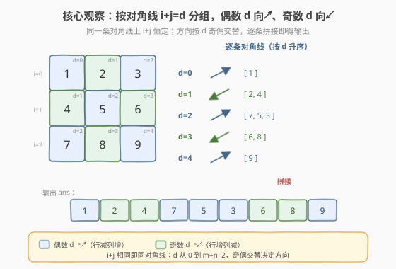
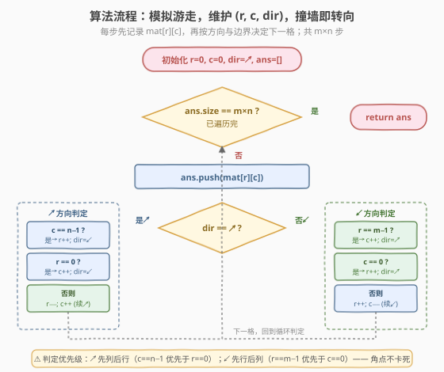
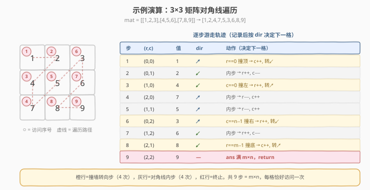

# 对角线遍历

- **题目名称**：对角线遍历
- **链接**：[498. 对角线遍历](https://leetcode.cn/problems/diagonal-traverse/)
- **难度**：中等
- **标签**：数组、矩阵、模拟

## 1. 题目概述

给定一个大小为 $m \times n$ 的矩阵 `mat`，以**对角线遍历**的顺序，用一个数组返回矩阵中的所有元素。遍历规则：从左上角 `(0,0)` 出发，先沿**右上方向**走，撞到边界后**转向左下**，如此往复，直到访问完所有 $m \times n$ 个元素。

**示例 1**：

```text
输入：mat = [[1,2,3],[4,5,6],[7,8,9]]
输出：[1,2,4,7,5,3,6,8,9]
解释：遍历路径如右图，1→2→4→7→5→3→6→8→9
```

**示例 2**：

```text
输入：mat = [[1,2],[3,4]]
输出：[1,2,3,4]
```

**约束条件**：

- $m == \text{mat.length}$
- $n == \text{mat}[i].\text{length}$
- $1 \le m, n \le 10^4$
- $1 \le m \times n \le 10^4$
- $-10^5 \le \text{mat}[i][j] \le 10^5$

> 💡 **题目本质**：这是一道**矩阵遍历模拟**题，和 [54. 螺旋矩阵](../0001-0100/54_螺旋矩阵.md) 是同一家族——都要按某种“拐弯”规则把矩阵扫一遍。区别在于：螺旋矩阵沿四条边界转圈、向内收缩；本题沿对角线 zigzag、靠“撞墙转向”切换方向。突破口是发现「同一条对角线上 $i+j$ 恒定」这一结构，从而把“何时转向”简化为“撞到矩阵边界即转向”。

---

## 2. 解题思路

### 2.1 暴力思路

- **逐条对角线收集 + 反转**：观察到同一对角线上的格子满足 $i+j=d$，对角线编号 $d$ 从 $0$ 到 $m+n-2$。对每个 $d$ 枚举所有满足 $i+j=d$ 的合法格子 $(i, d-i)$，按某个方向收集进临时列表，再把**偶数 $d$** 的列表反转（因为偶数对角线要“从下到上”输出），最后拼接。
- 这个做法正确，但要为每条对角线开一个临时列表，空间 $O(m \times n)$（存所有中间列表），且需要额外的反转/拼接逻辑，常数较大。

> ⚠️ 暴力法的浪费在于：**答案本可以一边走一边填**，却先分组存储再重组。事实上，只要维护当前位置 $(r,c)$ 和一个方向标志，模拟“沿对角线游走、撞墙转向”，就能一趟遍历直接产出答案，无需任何中间分组。

### 2.2 核心观察：模拟游走 + 撞墙转向



关键观察有三点：

1. **同一对角线 $i+j$ 恒定**：位置 $(r,c)$ 所在对角线编号 $d = r + c$。$d$ 从 $0$（左上角）递增到 $m+n-2$（右下角），遍历顺序正是按 $d$ 升序逐条扫。
2. **方向由 $d$ 奇偶决定**：$d$ 为偶数时沿**右上**（$r$ 减、$c$ 增）走；$d$ 为奇数时沿**左下**（$r$ 增、$c$ 减）走。两个方向交替切换。
3. **撞墙即转向**：沿当前方向走到“撞墙”时，需要换到下一条对角线（$d$ 增 1），方向随之翻转。撞墙的两种情形要分清：
   - **右上方向↗**：要么撞**右墙**（$c = n-1$，没法再往右），要么撞**顶墙**（$r = 0$，没法再往上）。撞右墙时只能**向下**（$r{+}1$）；撞顶墙时只能**向右**（$c{+}1$）。两者都把方向翻转为↙。
   - **左下方向↙**：要么撞**底墙**（$r = m-1$），要么撞**左墙**（$c = 0$）。撞底墙时**向右**（$c{+}1$）；撞左墙时**向下**（$r{+}1$）。两者都把方向翻转为↗。

> 💡 **为什么判定有优先级**：在**右上**方向走到右上角点 $(0, n-1)$ 时，同时满足 $r=0$ 和 $c=n-1$——此时应该**向下**走（因为右边已无路），而不是向右。所以必须**先判 $c=n-1$（右墙），再判 $r=0$（顶墙）**。同理，左下方向走到左下角点 $(m-1, 0)$ 时，要**向右**走，故**先判 $r=m-1$（底墙），再判 $c=0$（左墙）**。这套优先级保证角点不卡死，是本题最容易写错的地方。

### 2.3 算法流程图



算法只需一趟游走，共 $m \times n$ 步：

1. **初始化**：`r = 0, c = 0, dir = ↗`（右上），`ans = []`。
2. 循环 $m \times n$ 次：
   - 把 `mat[r][c]` 追加进 `ans`。
   - 若 `dir == ↗`：
     - 若 `c == n-1`（撞右墙）：`r++`，`dir = ↙`。
     - 否则若 `r == 0`（撞顶墙）：`c++`，`dir = ↙`。
     - 否则（对角线内步）：`r--`，`c++`。
   - 否则（`dir == ↙`）：
     - 若 `r == m-1`（撞底墙）：`c++`，`dir = ↗`。
     - 否则若 `c == 0`（撞左墙）：`r++`，`dir = ↗`。
     - 否则（对角线内步）：`r++`，`c--`。
3. 返回 `ans`。

> ⚠️ **边界细节**：单行矩阵（$m=1$）时，↗ 方向每步都撞顶墙 $r=0$，于是不断 `c++` 向右扫，正确输出整行；单列矩阵（$n=1$）时，↗ 方向每步都撞右墙 $c=n-1=0$，于是不断 `r++` 向下扫，正确输出整列。$1 \times 1$ 矩阵只走一步直接返回。所有极端情形无需特判，模拟逻辑自然覆盖。

### 2.4 示例演算

以 `mat = [[1,2,3],[4,5,6],[7,8,9]]`，$m=n=3$ 为例：



| 步 | (r,c) | 值 | dir | 动作（决定下一格） |
|----|-------|----|-----|--------------------|
| 1 | (0,0) | 1 | ↗ | $r=0$ 撞顶 → `c++`, 转↙ |
| 2 | (0,1) | 2 | ↙ | 内步 → `r++, c--` |
| 3 | (1,0) | 4 | ↙ | $c=0$ 撞左 → `r++`, 转↗ |
| 4 | (2,0) | 7 | ↗ | 内步 → `r--, c++` |
| 5 | (1,1) | 5 | ↗ | 内步 → `r--, c++` |
| 6 | (0,2) | 3 | ↗ | $c=n{-}1$ 撞右 → `r++`, 转↙ |
| 7 | (1,2) | 6 | ↙ | 内步 → `r++, c--` |
| 8 | (2,1) | 8 | ↙ | $r=m{-}1$ 撞底 → `c++`, 转↗ |
| 9 | (2,2) | 9 | — | `ans` 满 $m \times n$，返回 |

最终 `ans = [1,2,4,7,5,3,6,8,9]`，与示例 1 一致 ✓。

> 💡 注意第 1、6 步：第 1 步在 $(0,0)$ 沿↗走，$c=0 \ne n{-}1$ 但 $r=0$ 撞顶，于是向右到 $(0,1)$ 并转向↙；第 6 步在 $(0,2)$ 沿↗走，$c=n{-}1=2$ 撞右（此时虽也 $r=0$ 撞顶，但右墙优先），于是向下到 $(1,2)$ 并转向↙。这正是「先列后行」优先级在角点的体现。4 次撞墙转向（橙行）+ 4 次对角线内步（灰行）+ 1 次终止（红行）= 9 步，每格恰好访问一次。

---

## 3. 参考代码

### C++

```cpp
// 对角线遍历.cpp —— 模拟游走：维护 (r, c, dir)，撞墙即转向
// 编译: g++ -O2 -std=c++17 对角线遍历.cpp -o diag
#include <vector>
using namespace std;

class Solution {
  public:
    vector<int> findDiagonalOrder(vector<vector<int>>& mat) {
        int m = mat.size(), n = mat[0].size();
        vector<int> ans;
        ans.reserve(m * n);

        int r = 0, c = 0;
        int dir = 1; // 1 = 右上(↗), -1 = 左下(↙)

        for (int k = 0; k < m * n; ++k) {
            ans.push_back(mat[r][c]);
            if (dir == 1) {                 // 右上方向
                if (c == n - 1) {           // 撞右墙（优先于顶墙，处理右上角点）
                    ++r;
                    dir = -1;
                } else if (r == 0) {        // 撞顶墙
                    ++c;
                    dir = -1;
                } else {                    // 对角线内步
                    --r;
                    ++c;
                }
            } else {                        // 左下方向
                if (r == m - 1) {           // 撞底墙（优先于左墙，处理左下角点）
                    ++c;
                    dir = 1;
                } else if (c == 0) {        // 撞左墙
                    ++r;
                    dir = 1;
                } else {                    // 对角线内步
                    ++r;
                    --c;
                }
            }
        }
        return ans;
    }
};
```

### Python

```python
class Solution:
    def findDiagonalOrder(self, mat: list[list[int]]) -> list[int]:
        m, n = len(mat), len(mat[0])
        ans = []
        r = c = 0
        up = True  # True = 右上(↗), False = 左下(↙)

        for _ in range(m * n):
            ans.append(mat[r][c])
            if up:                       # 右上方向
                if c == n - 1:           # 撞右墙（优先于顶墙）
                    r += 1
                    up = False
                elif r == 0:             # 撞顶墙
                    c += 1
                    up = False
                else:                    # 对角线内步
                    r -= 1
                    c += 1
            else:                        # 左下方向
                if r == m - 1:           # 撞底墙（优先于左墙）
                    c += 1
                    up = True
                elif c == 0:             # 撞左墙
                    r += 1
                    up = True
                else:                    # 对角线内步
                    r += 1
                    c -= 1
        return ans
```

> 💡 **方向变量**：C++ 用 `dir = ±1`、Python 用 `up: bool`，两者等价。也可写成两个增量 `(dr, dc)`：↗ 是 `(-1, +1)`、↙ 是 `(+1, -1)`，撞墙时按规则改写 `(r, c)` 并把 `(dr, dc)` 取反。bool 版本可读性更好，面试推荐。

---

## 4. 复杂度分析

| 维度 | 复杂度 | 说明 |
|------|--------|------|
| 时间复杂度 | $O(m \times n)$ | 恰好游走 $m \times n$ 步，每步 $O(1)$，每个元素访问一次 |
| 空间复杂度 | $O(1)$ | 仅用 `r, c, dir` 三个常数变量（不计返回数组 `ans` 本身） |

> 💡 这是该题的最优解：时间必须至少 $\Omega(m \times n)$（每个元素至少看一次），已达到下界；空间为常数（不计输出）。相比“分组 + 反转”的 $O(m \times n)$ 中间空间，模拟法更省。

---

## 5. 扩展：对角线分组解法（i+j 哈希）

模拟法适合**规则矩阵**（每行等长）。若题目退化为“行不等长”或“需要按对角线做别的处理”，模拟游走的边界判定会失效，此时更通用的做法是**按 $i+j$ 分组**：

```python
from collections import defaultdict

class Solution:
    def findDiagonalOrder(self, mat: list[list[int]]) -> list[int]:
        m, n = len(mat), len(mat[0])
        diag = defaultdict(list)
        for i in range(m):
            for j in range(n):
                diag[i + j].append(mat[i][j])
        ans = []
        for d in range(m + n - 1):
            if d % 2 == 0:          # 偶数对角线：从下到上（i 降序），翻转
                ans.extend(reversed(diag[d]))
            else:                   # 奇数对角线：从上到下（i 升序），原序
                ans.extend(diag[d])
        return ans
```

**为什么这样做对**：按行优先扫描时，同一对角线 $d$ 的格子是按 $i$ **升序**（即从上到下）进入 `diag[d]` 的。题目要求偶数 $d$ 按 $i$ **降序**（从下到上）输出，所以偶数对角线要 `reversed`；奇数 $d$ 按 $i$ 升序输出，原序即可。

| 解法 | 时间 | 空间 | 适用场景 |
|------|------|------|----------|
| 模拟游走（主解） | $O(mn)$ | $O(1)$ | 规则矩阵，追求常数空间 |
| 对角线分组 + 反转 | $O(mn)$ | $O(mn)$ | 通用，易扩展到不等长行（见 1424） |

> 💡 **迁移到 1424**：[1424. 对角线遍历 II](https://leetcode.cn/problems/diagonal-traverse-ii/) 的输入是若干**不等长**的行（`nums[i]` 长度不同），模拟游走无法判定“右墙/底墙”。但「$i+j$ 相同即同对角线」的结构依然成立——只需按 $i+j$ 分组，偶数对角线翻转即可。分组解法的价值正在于此：**把“位置结构”从“边界判定”中解耦**，对不规则输入依然有效。

---

## 6. 面试要点

1. **为什么同一对角线 $i+j$ 恒定？这有什么用？**

   - 沿右上/左下方向走一步，$(r,c)$ 变为 $(r{-}1,c{+}1)$ 或 $(r{+}1,c{-}1)$，$r+c$ 保持不变。所以同一条对角线上所有格子的 $i+j$ 相等，记为对角线编号 $d$。
   - 用处有二：① 解释遍历顺序——$d$ 从 $0$ 到 $m+n-2$ 递增，对应从左上到右下逐条扫；② 解释方向交替——$d$ 偶则↗、$d$ 奇则↙。这也催生了第 5 节的分组解法。

2. **撞墙时的判定优先级为什么是「右上先列后行、左下先行后列」？**

   - 角点会同时满足两个边界条件。右上方向走到 $(0, n-1)$ 时 $r=0$ 且 $c=n-1$，应**向下**（右边无路），故先判 $c=n-1$；若先判 $r=0$ 会错误地“向右”越界。
   - 左下方向走到 $(m-1, 0)$ 时应**向右**（下边无路），故先判 $r=m-1$。口诀：**谁的方向已被堵死先判谁**——↗ 的横向是 $c$，故先判列；↙ 的纵向是 $r$，故先判行。

3. **单行或单列矩阵会出错吗？**

   - 不会。单行（$m=1$）：↗ 方向每步 $r=0$ 撞顶（且 $c \ne n{-}1$ 直到末列），持续 `c++` 向右扫完整行。单列（$n=1$）：↗ 方向每步 $c=n{-}1=0$ 撞右，持续 `r++` 向下扫完整列。两种极端都由通用逻辑自然覆盖，无需特判。

4. **时间复杂度为什么是 $O(m \times n)$ 而不是更高？**

   - 循环体执行 $m \times n$ 次，每步只有若干 `if/else` 和坐标自增自减，都是 $O(1)$。没有嵌套循环、没有回溯——每个格子进 `ans` 一次、访问一次。总时间严格 $O(m \times n)$，达到下界。

5. **模拟法和分组法各自的适用场景？**

   - 模拟法：规则矩阵、追求 $O(1)$ 额外空间、代码紧凑。缺点是边界判定易写错（优先级）。
   - 分组法（$i+j$ 哈希）：思路直白、不易错，且可扩展到不等长行（1424）。缺点是 $O(m \times n)$ 中间空间。面试中先讲模拟法展示对边界的把控，再提分组法作为通用兜底，体现思路的完整性。

> 💡 **一句话总结**：498 是矩阵遍历模拟的招牌题——核心是「同对角线 $i+j$ 恒定 + 方向按 $d$ 奇偶交替 + 撞墙转向」。维护 $(r, c, \text{dir})$ 一趟游走即可 $O(mn)$ 时间、$O(1)$ 空间出解。和螺旋矩阵同属“边界驱动型遍历”，但本题的难点在「角点的判定优先级」，记牢「右上先列后行、左下先行后列」就不会越界。

---

## 7. 同类练习题

- [54. 螺旋矩阵](https://leetcode.cn/problems/spiral-matrix/)（[题解](../0001-0100/54_螺旋矩阵.md)）：同属“边界驱动型矩阵遍历”，四条边界转圈收缩，对照本题的“对角线 zigzag 撞墙转向”
- [59. 螺旋矩阵 II](https://leetcode.cn/problems/spiral-matrix-ii/)（[题解](../0001-0100/59_螺旋矩阵II.md)）：螺旋遍历的生成版（按序填数），与 54 互为正反，进一步巩固边界收缩模拟
- [1424. 对角线遍历 II](https://leetcode.cn/problems/diagonal-traverse-ii/)：本题的“不等长行”变体，模拟游走失效，必须用第 5 节的 $i+j$ 分组解法，体会分组法的通用价值
- [1329. 将矩阵按对角线排序](https://leetcode.cn/problems/sort-the-matrix-diagonally/)：同样利用「同对角线 $i+j$ 恒定」的结构分组，但对每条对角线做排序而非遍历，巩固对角线分组思想
- [73. 矩阵置零](https://leetcode.cn/problems/set-matrix-zeroes/)（[题解](../0001-0100/73_矩阵置零.md)）：另一类矩阵原地操作题，对照体会“用矩阵自身做标记”与“模拟游走”两种矩阵处理范式
