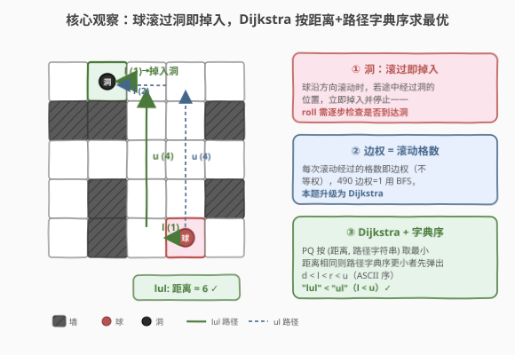
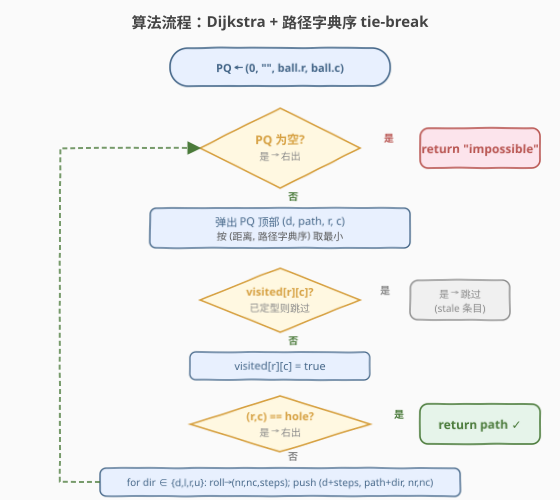
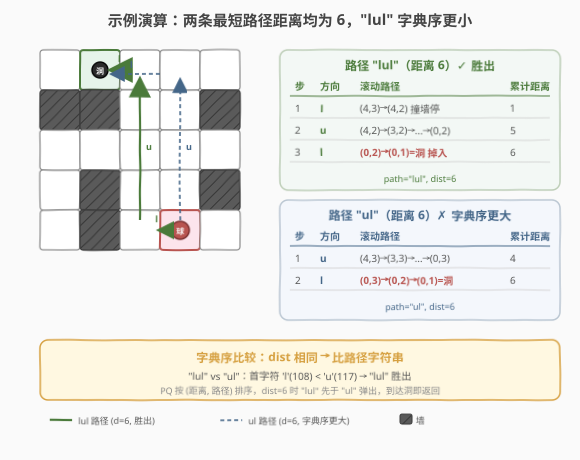

# LeetCode 迷宫III 题解

## 1. 题目概述

- **标题 / 题号**：迷宫III（#499，hard）
- **链接**：https://leetcode.cn/problems/the-maze-iii/
- **难度**：困难
- **标签**：图、最短路、Dijkstra、堆、滚动模拟

**题意**：给定一个 `m x n` 的二维矩阵 `maze`，其中 `0` 表示**空地**、`1` 表示**墙**。矩阵中有一个球和一个**洞**。给定球的**起始位置** `ball = [rowBall, colBall]` 和**洞的位置** `hole = [rowHole, colHole]`。

球的运动规则与 [490. 迷宫](../0401-0500/490_迷宫.md) 完全一致：

- 球可以沿**上/下/左/右**四个方向之一**滚动**，方向字符分别为 `u`/`d`/`l`/`r`；
- 一旦开始滚动，球会**一直滚下去**，直到撞上**墙**（`1`）或滚出**边界**才会**停止**；
- 球**只能在停止后**选择下一个方向，**不能在滚动中途转向**。

**本题与 490 的关键区别**：迷宫中有一个**洞**。球在滚动过程中如果**经过洞所在的位置**，会**立即掉入洞中**并停止（不必等到撞墙）。

要求：找到球从起点滚入洞的**最短距离**路径。距离定义为球从起点（不含）到洞（含）所经过的**空地格数**。输出由 `u`/`d`/`l`/`r` 组成的**方向字符串**。若有多条最短路径，输出**字典序最小**的那个。若球无法到达洞，输出 `"impossible"`。

**示例 1**：

```text
输入：maze = [
  [0,0,0,0,0],
  [1,1,0,0,1],
  [0,0,0,0,0],
  [0,1,0,0,1],
  [0,1,0,0,0]
], ball = [4,3], hole = [0,1]
输出："lul"
解释：两条最短路径距离均为 6：
  路径1: left -> up -> left = "lul"，距离 6
  路径2: up -> left = "ul"，距离 6
  "lul" < "ul"（'l' < 'u'），故输出 "lul"。
```

**示例 2**：

```text
输入：maze = [[0,0,0,0,0],[1,1,0,0,1],[0,0,0,0,0],[0,1,0,0,1],[0,1,0,0,0]], ball = [4,3], hole = [3,0]
输出："impossible"
解释：球无法到达洞 (3,0)。洞在第 0 列，该列被墙 (1,0) 隔断，
      球无法停在能滚过 (3,0) 的任何位置。
```

**约束**：

- `m == maze.length`
- `n == maze[i].length`
- `1 <= m, n <= 30`
- `maze[i][j]` 为 `0` 或 `1`
- `ball` 和 `hole` 均在空地上，且初始不在同一位置
- 迷宫边界可视为墙

## 2. 解题思路

### 2.1 暴力思路

DFS 枚举所有方向序列，记录每条能掉入洞的路径及其距离，最后取最短距离中字典序最小者。问题在于：状态空间是「停止位」的序列，数量可达指数级，且无法像普通 BFS 那样简单地用 `visited` 去重——因为**同一条路径字符串唯一确定终点**，但不同路径可能到达同一停止位，需要比较距离和字典序。

> ⚠️ 本题与 490 有两处关键升级：
> - **洞**：球滚过洞即掉入，`roll` 函数需逐步检查是否到达洞；
> - **最短距离 + 字典序**：边权为滚动格数（不等权），需 Dijkstra；距离相同时取字典序最小的路径。

### 2.2 核心观察：Dijkstra + 路径字符串字典序 tie-break



三个核心要点：

| 要点 | 说明 |
|------|------|
| **① 洞：滚过即掉入** | `roll` 函数在逐步滚动时，每移动一格就检查是否到达洞。若到达洞则立即停止，不再继续滚到撞墙。这是与 490/505 最大的区别 |
| **② 边权 = 滚动格数** | 490 每次滚动算 1 步（等权 BFS）；505/499 每次滚动的格数即边权（不等权），需升级为 Dijkstra |
| **③ 字典序 tie-break** | 优先队列按 `(距离, 路径字符串)` 排序。距离相同时，路径字典序更小者先弹出。第一次弹出洞即得到最优解 |

> 💡 **状态定义**：与 490 一致——BFS/Dijkstra 的「节点」是**停止位**（含洞），中间格只是"路过"。但从每个停止位出发，`roll` 可能在中途掉入洞，此时洞即为下一个停止位。

> ⚠️ **字典序方向字符顺序**：`d` < `l` < `r` < `u`（按 ASCII 值 `100 < 108 < 114 < 117`）。优先队列中路径字符串的比较天然遵循此序，无需额外处理。

### 2.3 算法流程图



**核心子过程：沿方向 `d` 滚动求停止位（含洞检测）**

```
roll(maze, r, c, dr, dc, hole):
    steps = 0
    while 下一格 (r+dr, c+dc) 在界内且为空地:
        r += dr; c += dc; steps += 1
        if (r, c) == hole: break    # 掉入洞，立即停止
    return (r, c, steps)
```

> 💡 与 490 的 `roll` 唯一区别：滚动每步检查是否到达洞。若到达洞则 `break`，不再继续滚到撞墙。

**Dijkstra 主流程**

1. `pq = [(0, "", ball)]`（优先队列，元素为 `(距离, 路径, 行, 列)`，按 `(距离, 路径)` 取最小）。
2. `visited` 矩阵初始化为 `false`。
3. 当 `pq` 非空：
   - 弹出 `(d, path, r, c)`（距离最小，距离相同则路径字典序最小）。
   - 若 `visited[r][c]`，跳过（已定型）。
   - 标记 `visited[r][c] = true`。
   - 若 `(r, c) == hole`，返回 `path`（保证最短 + 字典序最小）。
   - 否则对 4 个方向调用 `roll` 得到 `(nr, nc, steps)`；若 `!visited[nr][nc]`，将 `(d+steps, path+dir_char, nr, nc)` 入队。
4. 队列空仍未到达洞，返回 `"impossible"`。

> 💡 **为什么 `visited` 只在弹出时标记？** Dijkstra 的核心不变量：第一次弹出某格时，其 `(距离, 路径)` 已是最优。后续弹出同一格的条目必为 stale（距离更大或距离相同但路径更大），直接跳过。这保证了每个格只被处理一次，且路径字典序 tie-break 正确。

### 2.4 示例演算



以示例 1 的 `5×5` 迷宫为例，球 `(4,3)`，洞 `(0,1)`：

**路径 "lul"（距离 6）**：

| 步 | 方向 | 起点 | 滚动路径 | 停止位 | 累计距离 |
|----|------|------|---------|--------|---------|
| 1 | `l` | `(4,3)` | `(4,2)`（`(4,1)` 是墙，停） | `(4,2)` | 1 |
| 2 | `u` | `(4,2)` | `(3,2),(2,2),(1,2),(0,2)`（出界停） | `(0,2)` | 5 |
| 3 | `l` | `(0,2)` | `(0,1)` = 洞，**掉入** | 洞 `(0,1)` | 6 |

**路径 "ul"（距离 6）**：

| 步 | 方向 | 起点 | 滚动路径 | 停止位 | 累计距离 |
|----|------|------|---------|--------|---------|
| 1 | `u` | `(4,3)` | `(3,3),(2,3),(1,3),(0,3)`（出界停） | `(0,3)` | 4 |
| 2 | `l` | `(0,3)` | `(0,2),(0,1)` = 洞，**掉入** | 洞 `(0,1)` | 6 |

两条路径距离均为 6。PQ 中 `(6, "lul", 0, 1)` 与 `(6, "ul", 0, 1)` 同时存在，但 `"lul" < "ul"`（首字符 `'l'` < `'u'`），故 `"lul"` 先弹出，到达洞即返回。

**为什么示例 2 的 `(3,0)` 不可达？** 洞 `(3,0)` 在第 0 列。第 0 列被墙 `(1,0)` 隔断为上下两段：上段只有 `(0,0)`（球可达但向下滚被 `(1,0)` 挡住），下段 `(2,0),(3,0),(4,0)` 无法从任何可达停止位滚入（第 1 列的墙 `(4,1),(3,1)` 阻断了水平方向的进入路径）。球永远无法滚过 `(3,0)`，返回 `"impossible"`。

## 3. 参考代码

### C++

```cpp
class Solution {
    int m, n;
    // 按方向字符 ASCII 序排列：d < l < r < u
    int dx[4] = {1, 0, 0, -1};   // down, left, right, up
    int dy[4] = {0, -1, 1, 0};
    char dirCh[4] = {'d', 'l', 'r', 'u'};

    // 从 (r,c) 沿方向 (dr,dc) 滚动；遇洞则掉入，否则滚到撞墙/出界前停止
    tuple<int,int,int> roll(const vector<vector<int>>& maze,
                            int r, int c, int dr, int dc, int hr, int hc) {
        int steps = 0;
        while (r + dr >= 0 && r + dr < m && c + dc >= 0 && c + dc < n
               && maze[r + dr][c + dc] == 0) {
            r += dr;
            c += dc;
            steps++;
            if (r == hr && c == hc) break;   // 掉入洞，立即停止
        }
        return {r, c, steps};
    }
public:
    string findShortestWay(vector<vector<int>>& maze,
                           vector<int>& ball, vector<int>& hole) {
        m = maze.size();
        n = maze[0].size();
        int hr = hole[0], hc = hole[1];

        // 优先队列：(距离, 路径, 行, 列)，greater 使其按 (距离, 路径) 取最小
        using T = tuple<int, string, int, int>;
        priority_queue<T, vector<T>, greater<T>> pq;
        vector<vector<char>> visited(m, vector<char>(n, 0));

        pq.push({0, "", ball[0], ball[1]});

        while (!pq.empty()) {
            auto [d, path, r, c] = pq.top(); pq.pop();
            if (visited[r][c]) continue;          // 已定型，跳过
            visited[r][c] = 1;
            if (r == hr && c == hc) return path;   // 到达洞，返回路径
            for (int k = 0; k < 4; k++) {
                auto [nr, nc, steps] = roll(maze, r, c, dx[k], dy[k], hr, hc);
                if (!visited[nr][nc]) {
                    pq.push({d + steps, path + dirCh[k], nr, nc});
                }
            }
        }
        return "impossible";
    }
};
```

### Python

```python
class Solution:
    def findShortestWay(self, maze: List[List[int]],
                       ball: List[int], hole: List[int]) -> str:
        m, n = len(maze), len(maze[0])
        hr, hc = hole
        # 按方向字符 ASCII 序：d < l < r < u
        dirs = [(1, 0, 'd'), (0, -1, 'l'), (0, 1, 'r'), (-1, 0, 'u')]

        def roll(r, c, dr, dc):
            steps = 0
            while 0 <= r + dr < m and 0 <= c + dc < n \
                    and maze[r + dr][c + dc] == 0:
                r += dr
                c += dc
                steps += 1
                if (r, c) == (hr, hc):
                    break                            # 掉入洞
            return r, c, steps

        import heapq
        pq = [(0, "", ball[0], ball[1])]
        visited = [[False] * n for _ in range(m)]

        while pq:
            d, path, r, c = heapq.heappop(pq)
            if visited[r][c]:
                continue                              # 已定型
            visited[r][c] = True
            if (r, c) == (hr, hc):
                return path                           # 到达洞
            for dr, dc, ch in dirs:
                nr, nc, steps = roll(r, c, dr, dc)
                if not visited[nr][nc]:
                    heapq.heappush(pq, (d + steps, path + ch, nr, nc))
        return "impossible"
```

## 4. 复杂度分析

| 维度 | 复杂度 | 说明 |
|------|--------|------|
| 时间复杂度 | $O(M \times N \times \max(M, N))$ | 每个停止位至多弹出一次（`visited` 去重）；每次弹出调用 4 次 `roll`，单次 `roll` 最坏 $O(\max(M,N))$；PQ 操作 $O(\log(M \times N))$，路径字符串比较 $O(L)$（$L$ 为路径长度，上界 $O(M \times N)$），整体由 `roll` 主导 |
| 空间复杂度 | $O(M \times N)$ | `visited` 矩阵 $O(M \times N)$；PQ 最坏存 $O(M \times N)$ 个条目 |

> 💡 **与 490/505 的复杂度对比**：三者状态空间均为 $O(M \times N)$。490 用 BFS（等权，$O(M \times N)$）；505 用 Dijkstra（不等权，多一个 $\log$ 因子）；499 在 505 基础上多了路径字符串存储与比较，但 $M, N \leq 30$ 时路径长度上界很小，实际开销可忽略。

## 5. 扩展：迷宫三题对比与变体

### 迷宫三题一脉相承

| 题目 | 目标 | 边权 | 算法 | 输出 |
|------|------|------|------|------|
| [490. 迷宫](../0401-0500/490_迷宫.md) | 能否到达 | 每次滚动 = 1（等权） | BFS | `true` / `false` |
| [505. 迷宫 II](https://leetcode.cn/problems/the-maze-ii/) | 最短距离 | 滚动格数（不等权） | Dijkstra | 距离值 |
| **499. 迷宫 III**（本题） | 最短距离 + 字典序最小路径 | 滚动格数（不等权） | Dijkstra + 路径 tie-break | 方向字符串 |

### 为什么 499 不能用普通 BFS？

490 的边权为 1（每次滚动算一步，无论滚几格），普通 BFS 即可求最短路。499 的边权为滚动经过的格数（可能 1~30），**边权不等**，BFS 无法保证第一次到达即最短，必须用 Dijkstra。

### 为什么不用 DFS + 记忆化？

DFS 可以做，但需要为每个格子维护「最优 (距离, 路径)」并在发现更优解时重新搜索，实现复杂且效率不如 Dijkstra 的 PQ 自然处理。Dijkstra 的 PQ 按 `(距离, 路径)` 排序，第一次弹出洞即得到全局最优，无需回溯。

## 6. 面试要点

1. **这题与 490 迷宫的区别是什么？**

   - **洞**：490 只判断能否停在终点；499 的终点是洞，球**滚过即掉入**，`roll` 需逐步检查是否到达洞，而非只滚到撞墙。
   - **最短距离**：490 只问可达性（BFS）；499 求最短**距离**（滚过的格数），边权不等，升级为 Dijkstra。
   - **字典序**：499 要求最短距离相同时输出字典序最小的路径字符串，PQ 按 `(距离, 路径)` 排序天然处理。

2. **为什么 `visited` 在弹出时标记而不是入队时标记？**

   - Dijkstra 的不变量：**第一次弹出某格时，其 `(距离, 路径)` 已是全局最优**。若在入队时标记 `visited`，可能错过更优的入队条目（后来发现更短距离但已被标记）。
   - 弹出时标记保证了：每个格只被处理一次，且处理时的状态是最优的。后续 stale 条目（距离更大或路径更大）被 `visited` 跳过。

3. **路径字典序 tie-break 为什么正确？**

   - PQ 按 `(距离, 路径字符串)` 排序。距离相同时，路径字典序更小者先弹出。
   - 从某格出发到洞的后续路径只取决于当前格的位置，与历史路径无关。因此**到达某格的最优（最短距离 + 字典序最小路径）一经确定，后续扩展必为全局最优**。这是 Dijkstra 贪心选择性质在字典序 tie-break 下的正确性保证。

4. **`roll` 函数中洞检测的位置？**

   - 在 `while` 循环内，每**移动一格**后立即检查 `(r, c) == hole`。若到达洞则 `break`，不再继续滚动。这保证了球"滚过洞即掉入"的语义。
   - 若把洞检测放在循环条件中（`&& (r+dr, c+dc) != hole`），球会在洞前一格停下——这是错误的。

5. **方向字符顺序 `d < l < r < u` 有什么影响？**

   - PQ 中路径字符串的比较按 ASCII 序：`d`(100) < `l`(108) < `r`(114) < `u`(117)。
   - 代码中 `dirs` 数组按此序排列，但实际上**处理顺序不影响正确性**——PQ 的 `(距离, 路径)` 排序保证字典序最小的路径最先弹出。按字典序排列方向只是让扩展更自然。

## 同类练习题

| # | 题目 | 与本题的关联 |
|---|------|-------------|
| 490 | [迷宫](https://leetcode.cn/problems/the-maze/) | 本题的「可达性」基础版，等权 BFS，理解「状态 = 停止位」的核心观察 |
| 505 | [迷宫 II](https://leetcode.cn/problems/the-maze-ii/) | 本题的「最短距离」版，边权不等，BFS 升级为 Dijkstra（无字典序要求） |
| 743 | [网络延迟时间](https://leetcode.cn/problems/network-delay-time/) | 堆优化 Dijkstra 单源最短路模板，对照本题的 PQ 用法 |
| 1926 | [迷宫中离入口最近的出口](https://leetcode.cn/problems/nearest-exit-from-entrance-in-maze/) | 普通网格 BFS（一步一格），与本题「一步滚一段」对照边界处理差异 |
| 787 | [K 站中转内最便宜的航班](https://leetcode.cn/problems/cheapest-flights-within-k-stops/) | 限制松弛 Bellman-Ford，与 Dijkstra 对照另一种最短路思路 |
