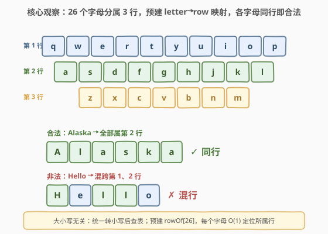
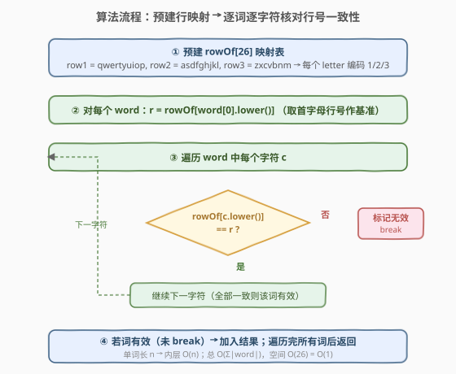
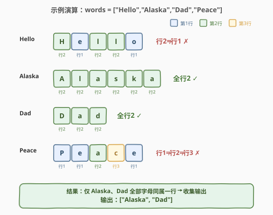

# 键盘行

- **题目名称**：键盘行
- **链接**：[500. 键盘行](https://leetcode.cn/problems/keyboard-row/)
- **难度**：简单
- **标签**：数组、哈希表、字符串

## 1. 题目概述

给你一个字符串数组 `words`，返回**可以用美式键盘同一行字母**打出来的所有单词。美式键盘的字母布局分三行：

- **第 1 行**：`qwertyuiop`
- **第 2 行**：`asdfghjkl`
- **第 3 行**：`zxcvbnm`

单词中大小写字母均可出现，判断时**忽略大小写**（统一按小写处理）。

**示例 1**：

```text
输入：words = ["Hello","Alaska","Dad","Peace"]
输出：["Alaska","Dad"]
解释：
  Hello  → H,e,l,l,o 分属第 2、1 行，混行，不合法
  Alaska → A,l,a,s,k,a 全属第 2 行，合法
  Dad    → D,a,d 全属第 2 行，合法
  Peace  → P,e,a,c,e 分属第 1、2、3 行，混行，不合法
```

**示例 2**：

```text
输入：words = ["omk"]
输出：[]
解释：o 属第 1 行，m 属第 3 行，k 属第 2 行，混行，不合法。
```

**示例 3**：

```text
输入：words = ["adsdf","sfd"]
输出：["adsdf","sfd"]
解释：两个单词的所有字母都属第 2 行（asdfghjkl），合法。
```

**约束条件**：

- $1 \le \text{words.length} \le 20$
- $1 \le \text{words}[i].\text{length} \le 100$
- `words[i]` 仅由英文字母（大小写）组成

> 💡 **题目本质**：26 个字母被键盘布局固定分成 3 组。判断一个单词是否「同一行」，等价于检查它的所有字母是否落在同一组——这是一个**集合归类 + 一致性校验**问题。

---

## 2. 解题思路

### 2.1 暴力思路

对每个单词，枚举它的每个字母，逐一与三行字符集做匹配：先确定第一个字母属于哪一行（把三行的字符串逐一 `find`），再检查后续每个字母是否也属于该行（同样逐一 `find`）。

这种写法每次匹配要在长度为 10/9/7 的字符串里线性查找，虽能通过（数据量小），但逻辑松散、重复查找多，且没有利用「字母总数只有 26 个」这一关键约束。

> ⚠️ 暴力法的低效源于「每次查行号都要重新搜索字符串」。其实 26 个字母到行号的映射是**固定不变**的，完全可以预计算成一张 $O(1)$ 查询的表，避免反复扫描。

### 2.2 核心观察：预建 letter→row 映射表，逐字符核对一致性



关键有两步推理：

**① 字母→行号映射是固定的、有限的**

键盘只有 3 行、共 26 个字母。每个字母唯一归属于某一行，且这个归属关系在整个程序运行期间不变。因此可以**预先**构建一张长度为 26 的数组 `rowOf`，`rowOf[c - 'a']` 直接给出字母 `c` 所在的行号（1/2/3），查询 $O(1)$。

**② 单词合法 ⇔ 所有字母行号一致**

拿到映射表后，判断一个单词是否合法只需：取首字母行号 `r` 作基准，遍历后续每个字母，若 `rowOf[c] != r` 则该词非法、立即停止；全部一致才合法。这是一个**一致性校验**，本质上和「数组所有元素是否相等」同构。

> 💡 **为什么取首字母作基准？** 因为如果单词合法（全部同行），首字母的行号就是该行行号，任何字母都可作为基准；如果单词非法，那么至少存在一个字母与首字母不同行，遍历时必然能发现差异。取首字母只是因为它是「免费」的——不需要额外扫描就能拿到基准值。

> ⚠️ **大小写处理**：题目允许大小写混用。统一做法是查表前先把字母转小写（`tolower` / `.lower()`），这样 `rowOf` 只需 26 个槽位覆盖 a–z，无需为 A–Z 再开 26 个槽。

### 2.3 算法流程图



算法分为「预处理」与「逐词校验」两阶段：

1. **预处理**：把三行字母字符串写入 `rowOf[26]`——遍历 `row1 = "qwertyuiop"`，把每个字母的槽位标 `1`；同理 `row2` 标 `2`、`row3` 标 `3`。此步 $O(26)$，常数时间。
2. **逐词校验**：对每个 `word`：
   - 取 `r = rowOf[tolower(word[0]) - 'a']` 作基准行号。
   - 遍历 `word` 中每个字符 `c`，若 `rowOf[tolower(c) - 'a'] != r`，标记无效并 `break`。
   - 若遍历完未 `break`（全部一致），将该词加入结果列表。
3. **返回**结果列表。

> 💡 **提前终止**：内层循环一旦发现行号不一致立即 `break`，不必扫完整词。对于非法词，平均在很靠前的位置就能发现差异，常数更优。

### 2.4 示例演算

以 `words = ["Hello","Alaska","Dad","Peace"]` 为例：



| 单词 | 各字母行号 | 判定 | 说明 |
|------|-----------|------|------|
| `Hello` | H=2, e=**1**, l=2, l=2, o=**1** | ✗ 非法 | 第 2 个字母 `e` 行号为 1 ≠ 基准 2，break |
| `Alaska` | A=2, l=2, a=2, s=2, k=2, a=2 | ✓ 合法 | 全部行号 = 2，一致 |
| `Dad` | D=2, a=2, d=2 | ✓ 合法 | 全部行号 = 2，一致 |
| `Peace` | P=1, e=1, a=**2**, c=**3**, e=1 | ✗ 非法 | 第 3 个字母 `a` 行号为 2 ≠ 基准 1，break |

最终收集合法词 `["Alaska", "Dad"]` ✓。

> 💡 注意 `Hello` 虽然首字母 `H` 属第 2 行，但第 2 个字母 `e` 属第 1 行——只要发现一个不一致即可判非法，无需扫到末尾。这正是「提前终止」的价值。

---

## 3. 参考代码

### C++

```cpp
class Solution {
  public:
    vector<string> findWords(vector<string>& words) {
        // 三行字母，用于初始化 rowOf 映射表
        const string rows[3] = {"qwertyuiop", "asdfghjkl", "zxcvbnm"};
        int rowOf[26] = {0};
        for (int i = 0; i < 3; ++i) {
            for (char c : rows[i]) {
                rowOf[c - 'a'] = i + 1;   // 编码 1/2/3
            }
        }

        vector<string> result;
        for (const string& w : words) {
            int r = rowOf[tolower(w[0]) - 'a'];   // 首字母行号作基准
            bool valid = true;
            for (char c : w) {
                if (rowOf[tolower(c) - 'a'] != r) {
                    valid = false;                // 行号不一致，非法
                    break;
                }
            }
            if (valid) result.push_back(w);
        }
        return result;
    }
};
```

### Python

```python
class Solution:
    def findWords(self, words: List[str]) -> List[str]:
        rows = ["qwertyuiop", "asdfghjkl", "zxcvbnm"]
        row_of = {}
        for i, row in enumerate(rows, start=1):
            for c in row:
                row_of[c] = i          # 字母 → 行号 1/2/3

        result = []
        for w in words:
            r = row_of[w[0].lower()]   # 首字母行号作基准
            if all(row_of[c.lower()] == r for c in w):
                result.append(w)
        return result
```

> 💡 **两种写法的细节**：
> 1. **C++ 用数组 `rowOf[26]`**：以 `c - 'a'` 为下标，纯数组随机访问，最贴合「$O(1)$ 查询」的本质。Python 用字典 `row_of` 语义更直观，哈希查询也是 $O(1)$。
> 2. **Python 的 `all(...)`** 内部短路求值——遇到第一个 `False` 即停止，等价于 C++ 的 `break`，但表达更声明式。面试中两种风格均可，按语言习惯选择。

---

## 4. 复杂度分析

| 维度 | 复杂度 | 说明 |
|------|--------|------|
| 时间复杂度 | $O(\sum_{w \in \text{words}} |w|)$ | 预处理 $O(26)$；每个单词遍历其所有字符，总和为 $\sum|w|$；内层每个字符 $O(1)$ 查表 |
| 空间复杂度 | $O(1)$ | `rowOf` 数组/字典固定 26 项，与输入规模无关；结果列表不计入额外空间（为输出本身） |

> 💡 本题数据规模极小（`words.length ≤ 20`，`words[i].length ≤ 100`），任何合理做法都能通过。但「预建映射表」的思路是**通用工程范式**——面对「有限固定集合的归类问题」时，预计算映射表把查找从 $O(n)$ 降到 $O(1)$，是首选优化方向。

---

## 5. 扩展：用位掩码表示行集合并集

除了「逐字符查表比对」，还可以用**位运算**判断一个单词是否只使用了一行的字母：

- 为每行字母构建一个位掩码：`mask1 = 0b...`（`qwertyuiop` 对应位为 1），同理 `mask2`、`mask3`。
- 把单词所有字母（转小写后）的位取并集，得到 `used`。
- 若 `used` 是 `mask1`、`mask2`、`mask3` 之一的子集（`used & mask == used`），则该词合法。

```cpp
// 位掩码写法（思路展示）
unsigned mask[3] = {0};
for (int i = 0; i < 3; ++i)
    for (char c : rows[i])
        mask[i] |= 1u << (c - 'a');

for (const string& w : words) {
    unsigned used = 0;
    for (char c : w) used |= 1u << (tolower(c) - 'a');
    for (int i = 0; i < 3; ++i)
        if ((used & mask[i]) == used) { result.push_back(w); break; }
}
```

> 💡 位掩码法的优势在于「先合并再判断」——把整个单词压缩成一个 26 位整数后，只需做至多 3 次位运算比较。对于超长单词（本题约束 100，但若放宽），避免了逐字符查表的循环开销。两种方法复杂度同阶，选择视可读性而定：映射表法更直观，位掩码法更紧凑。

---

## 6. 面试要点

1. **为什么预建映射表而不是每次搜索三行字符串？**

   - 三行字母字符串总长 26，每次 `find` 最多扫 10 个字符。对一个长 100 的单词，暴力法最多 $100 \times 10 = 1000$ 次字符比较。而预建 `rowOf[26]` 后，每个字母 $O(1)$ 直接取行号，100 次比较即可。更重要的是，映射表只建一次、复用于所有单词，把「重复的搜索工作」变成「一次预处理 + 常数查询」，这是工程中「空间换时间」的经典范式。

2. **大小写如何处理？为什么只建 26 槽而不是 52 槽？**

   - 统一在查表前 `tolower` / `.lower()` 转小写，这样 `rowOf` 只需覆盖 a–z 共 26 个槽。若不转换而建 52 槽，则 A–Z 和 a–z 要分别赋值，代码冗余且易漏。转小写是更简洁、更不易错的做法。

3. **取首字母行号作基准是否安全？空字符串怎么办？**

   - 约束保证 `words[i].length >= 1`，所以 `word[0]` 必然存在，取首字母安全。若单词合法（全同行），首字母行号即该行行号；若非法，遍历中必然遇到行号不同的字母而被检出。任何位置的字母都可作基准，首字母只是最方便获取。

4. **能否不用映射表，直接用集合判断？**

   - 可以。把三行字母存为三个 `set`，对每个单词先确定首字母属于哪个 `set`，再检查其余字母是否都在该 `set` 中。逻辑等价，但 `set` 查询虽也是 $O(1)$，常数大于数组下标访问。数组 `rowOf[26]` 是最轻量的实现。

5. **如果键盘布局变化（如 Dvorak 键盘），算法需要怎么改？**

   - 只需修改初始化时的三行字母字符串，算法逻辑完全不变。这正是「预处理与逻辑分离」的好处——映射表是数据，校验是逻辑，数据变了逻辑不动。体现了对**开闭原则**的朴素遵循。

---

## 7. 同类练习题

- [1160. 拼写单词](https://leetcode.cn/problems/find-words-that-can-be-formed-by-letters/)：同样用字母→计数映射，判断单词能否由给定字母拼出，是「预建字符表 + 逐字符校验」的同套路题
- [1832. 判断句子是否为全字母句](https://leetcode.cn/problems/check-if-the-sentence-is-pangram/)：用长度 26 的布尔数组/位掩码统计字母出现情况，判断是否覆盖 a–z 全集，与本题的 `rowOf[26]` 同构
- [1528. 重新排列字符串](https://leetcode.cn/problems/shuffle-string/)：按 indices 数组把字符放回正确位置，同样是「遍历字符串 + 索引映射」的轻量模拟题
- [205. 同构字符串](https://leetcode.cn/problems/isomorphic-strings/)（[题解](../0201-0300/205_同构字符串.md)）：双向哈希双射判定，与本题「逐字符核对一致性」思想相通——都是用映射表验证字符间的对应关系
