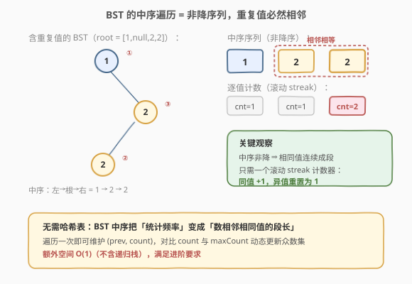
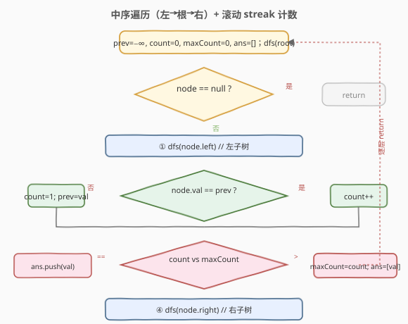
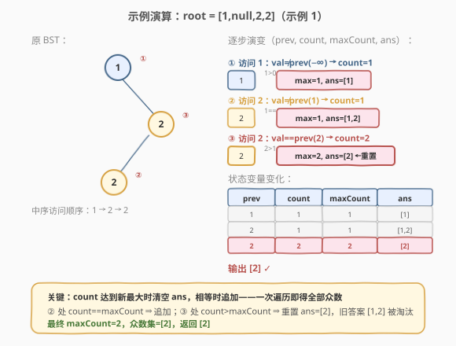

# LeetCode 二叉搜索树中的众数 题解

## 1. 题目概述

- **标题 / 题号**：二叉搜索树中的众数（#501，easy）
- **链接**：https://leetcode.cn/problems/find-mode-in-binary-search-tree/
- **难度**：简单
- **标签**：树、BST、中序遍历

**题意**：给定一棵**含重复值的二叉搜索树（BST）**的根节点 `root`，找出并返回 BST 中的所有**众数**（出现频率最高的元素）。若存在多个众数，可按**任意顺序**返回。

本题的 BST 定义允许重复值：

- 结点左子树中所含节点的值 **小于等于** 当前节点的值
- 结点右子树中所含节点的值 **大于等于** 当前节点的值
- 左子树和右子树都是 BST

**示例 1**：

```text
输入：root = [1,null,2,2]
输出：[2]
解释：树形如下，值为 2 的节点出现 2 次，值为 1 的节点出现 1 次，众数为 [2]。
        1
         \
          2
         /
        2
```

**示例 2**：

```text
输入：root = [0]
输出：[0]
```

**约束**：

- 树中节点的数目在范围 $[1, 10^4]$ 内
- $-10^5 \leq \text{Node.val} \leq 10^5$

**进阶**：你能不使用额外空间吗？（假设由递归产生的隐式调用栈的开销不被计算在内）

> 💡 进阶要求的是 $O(1)$ **额外**空间——除递归栈外不得再用哈希表/数组。这正是 BST 中序有序性质发挥威力的地方：把「统计频率」转化为「数相邻相同值的段长」。

## 2. 解题思路

### 2.1 暴力思路：哈希表计数

最直觉的做法：无视 BST 的结构性质，任意遍历整棵树，用**哈希表**记录每个值的出现次数，最后扫描哈希表取最大频次对应的值。

- 时间 $O(n)$，空间 $O(n)$（哈希表最坏存 $n$ 个不同值）。

> ⚠️ 暴力法能用但**没有利用 BST 的任何性质**——把它换成普通二叉树一样成立。面试官追问「能否 $O(1)$ 额外空间」时，哈希表方案直接出局。

### 2.2 核心观察：中序遍历把重复值挤到一起



BST 的关键性质：**中序遍历（左→根→右）得到一条非降序列**。注意本题 BST 定义允许 `left <= root <= right`，所以中序序列**不严格递增**，相等的值会被排成**连续的一段**。

于是「求众数」等价于「在中序序列里找最长等值段」：

- 维护 `prev`（上一个访问到的值）、`count`（当前等值段的长度）。
- 每访问一个节点：
  - 若 `node.val == prev`：`count++`（延续当前段）。
  - 若 `node.val != prev`：`count = 1`，`prev = node.val`（开启新段）。
- 同时维护 `maxCount`（历史最长段长）与 `ans`（众数集合）：
  - `count == maxCount`：当前值也是众数，追加进 `ans`。
  - `count > maxCount`：发现更长段，更新 `maxCount`，**清空** `ans` 后追加当前值。
  - `count < maxCount`：跳过。

> 💡 一句话记忆：**中序让相同值连续 ⇒ 一个滚动 `count` 取代哈希表**。整个遍历只多用 $O(1)$ 个标量变量，满足进阶的 $O(1)$ 额外空间要求（递归栈不计）。

### 2.3 算法流程图



```
1. 初始化 prev=−∞, count=0, maxCount=0, ans=[]
2. dfs(node):
   a. 若 node==null: return
   b. dfs(node.left)                       // 左
   c. 更新 streak：
        if node.val == prev: count++
        else:               count = 1; prev = node.val
   d. 更新众数集：
        if count == maxCount: ans.push(node.val)
        else if count > maxCount:
            maxCount = count; ans = [node.val]
   e. dfs(node.right)                      // 右
3. return ans
```

> ⚠️ `prev` 的初值要选一个**不可能等于任何节点值**的哨兵。约束中 $-10^5 \leq \text{Node.val}$，故用 `LONG_MIN`（C++）或一个比下界更小的常量；Python 直接用 `None` 判「首节点」即可。

### 2.4 示例演算

以 `root = [1,null,2,2]`（示例 1）为例，中序访问顺序为 `1 → 2 → 2`：



| 步骤 | 访问值 | `prev` | `count` | 与 `maxCount` 比较 | `maxCount` | `ans` |
|------|--------|--------|---------|--------------------|------------|-------|
| ①    | 1      | 1      | 1       | $1 > 0$（重置）     | 1          | [1]   |
| ②    | 2      | 2      | 1       | $1 == 1$（追加）    | 1          | [1,2] |
| ③    | 2      | 2      | 2       | $2 > 1$（重置）     | 2          | [2]   |

- 步骤 ①：首个节点，`count=1 > maxCount=0`，置 `maxCount=1`、`ans=[1]`。
- 步骤 ②：值由 1 变 2，新段 `count=1`，恰好等于 `maxCount=1`，2 也是众数，追加得 `[1,2]`。
- 步骤 ③：值仍为 2，`count=2`，**超过** `maxCount=1`，于是 2 才是真正的众数，清空 `ans` 重置为 `[2]`，`maxCount` 升至 2。

最终 `ans=[2]`，与官方输出一致。

> 💡 注意步骤 ② 的「假众数」陷阱：1 的频次 1 在当时是最大值，于是被暂存进 `ans`；直到步骤 ③ 出现更高频次，1 才被淘汰。算法只需一次遍历就能正确处理这种「先低后高」的情形，无需回扫。

## 3. 参考代码

### C++（递归中序 + 滚动计数）

```cpp
class Solution {
    long prev = LONG_MIN;   // 上一个访问到的值，哨兵取下界之外
    int count = 0;          // 当前等值段长度
    int maxCount = 0;       // 历史最长段长
    vector<int> ans;        // 众数集合
  public:
    vector<int> findMode(TreeNode* root) {
        dfs(root);
        return ans;
    }
  private:
    void dfs(TreeNode* node) {
        if (!node) return;
        dfs(node->left);                       // 左
        if (node->val == prev) count++;        // 延续当前段
        else { prev = node->val; count = 1; }  // 开启新段
        if (count == maxCount) ans.push_back(node->val);
        else if (count > maxCount) {
            maxCount = count;
            ans = {node->val};                 // 发现更长段，清空重置
        }
        dfs(node->right);                      // 右
    }
};
```

### Python（递归中序 + 滚动计数）

```python
class Solution:
    def findMode(self, root: Optional[TreeNode]) -> List[int]:
        self.prev = None   # None 表示尚未访问任何节点
        self.count = 0
        self.max_count = 0
        self.ans = []

        def dfs(node: Optional[TreeNode]) -> None:
            if not node:
                return
            dfs(node.left)                       # 左
            if self.prev is not None and node.val == self.prev:
                self.count += 1                   # 延续当前段
            else:
                self.prev = node.val
                self.count = 1                    # 开启新段
            if self.count == self.max_count:
                self.ans.append(node.val)
            elif self.count > self.max_count:
                self.max_count = self.count
                self.ans = [node.val]             # 发现更长段，清空重置
            dfs(node.right)                       # 右

        dfs(root)
        return self.ans
```

### C++（Morris 中序，严格 O(1) 空间）

```cpp
class Solution {
  public:
    vector<int> findMode(TreeNode* root) {
        long prev = LONG_MIN;
        int count = 0, maxCount = 0;
        vector<int> ans;
        TreeNode* cur = root;
        while (cur) {
            if (cur->left == nullptr) {
                // 无左子：直接访问 cur，再转向右子
                if (cur->val == prev) count++;
                else { prev = cur->val; count = 1; }
                if (count == maxCount) ans.push_back(cur->val);
                else if (count > maxCount) { maxCount = count; ans = {cur->val}; }
                cur = cur->right;
            } else {
                // 找 cur 中序前驱（左子树最靠右的节点）
                TreeNode* pred = cur->left;
                while (pred->right && pred->right != cur) pred = pred->right;
                if (pred->right == nullptr) {
                    pred->right = cur;     // 建立线索
                    cur = cur->left;
                } else {
                    pred->right = nullptr; // 拆除线索，访问 cur
                    if (cur->val == prev) count++;
                    else { prev = cur->val; count = 1; }
                    if (count == maxCount) ans.push_back(cur->val);
                    else if (count > maxCount) { maxCount = count; ans = {cur->val}; }
                    cur = cur->right;
                }
            }
        }
        return ans;
    }
};
```

> 💡 Morris 版把「访问节点」的逻辑抽成同一段代码（两个分支都执行一次），用临时线索替代递归栈，做到**含递归栈在内**的 $O(1)$ 空间。代价是临时修改树结构（建线索再拆除）。面试中若没强调「连递归栈都不许用」，递归版更稳；能把 Morris 写对则是加分项。

## 4. 复杂度分析

| 维度 | 复杂度 | 说明 |
|------|--------|------|
| 时间复杂度 | $O(n)$ | 每个节点恰好访问一次（递归/Morris 各一次入栈出栈或线索往返） |
| 空间复杂度（递归） | $O(H)$ | 递归栈深度等于树高；平衡时 $O(\log n)$，链状退化为 $O(n)$。**额外**变量仅 $O(1)$ |
| 空间复杂度（Morris） | $O(1)$ | 无递归栈、无哈希表，仅 `prev/count/maxCount/ans` 指针；`ans` 不计（输出必备） |
| 空间复杂度（哈希表暴力） | $O(n)$ | 哈希表最坏存 $n$ 个不同值，不满足进阶 |

> ⚠️ 严格按题意「递归栈不计」时，递归版的额外空间就是 $O(1)$（`prev/count/maxCount` 三个标量 + `ans` 输出）。Morris 则更进一步连栈都省掉。

## 5. 扩展：为什么 `count > maxCount` 时要清空 `ans`？

这是本算法最容易写错的地方。考虑众数集 `ans` 的不变式：

> **`ans` 始终保存「截至当前、频次等于 `maxCount` 的所有值」。**

当 `count > maxCount` 出现时，历史所有「频次 = 旧 `maxCount`」的值都**不再是众数**——它们的频次已被新的更大值超越。若不清空 `ans` 直接追加，会留下淘汰值，例如示例中步骤 ③ 不清空就会得到 `[1,2,2]` 而非 `[2]`。

清空后追加当前值，不变式得以恢复：此刻只有当前值的频次等于新 `maxCount`。

> 💡 等价写法：也可两遍历法——第一遍只求 `maxCount`（不维护 `ans`），第二遍重新中序、把所有 `count == maxCount` 的值收集进 `ans`。代码更不易错，但遍历两次；本题一遍历法已足够，掌握不变式即可一次写对。

## 6. 面试要点

1. **为什么中序遍历能取代哈希表？关键在 BST 的什么性质？**

   - 本题 BST 定义允许 `left <= root <= right`，故中序遍历得到**非降序列**，相等的值必然排成连续一段。
   - 「统计每个值的频次」就退化为「数相邻相同值的段长」，一个滚动 `count` 即可，无需哈希表，额外空间 $O(1)$。

2. **`prev` 的初值怎么选？为什么不能直接用 `node.val` 的某个值？**

   - 必须选一个**不可能等于任何节点值**的哨兵，否则首节点会被误判为「延续旧段」而非「开启新段」，`count` 错乱。
   - C++ 用 `LONG_MIN`（小于 $-10^5$ 下界），Python 用 `None` 显式判首节点更清晰。约束已知时也可用 `INT_MIN` 外的任意越界值。

3. **`count == maxCount` 和 `count > maxCount` 两种分支为什么都要写？**

   - `==` 分支处理「并列众数」：多个值频次相同且都是最大时都要收集（题目允许多个众数）。
   - `>` 分支处理「刷新纪录」：发现更高频次时，旧众数全部作废，必须清空 `ans` 再追加当前值。漏写任一分支都会导致答案错误。

4. **递归版算不算满足「不使用额外空间」的进阶要求？**

   - 题目明示「由递归产生的隐式调用栈的开销不被计算在内」，所以递归版的额外空间就是 `prev/count/maxCount/ans` 这几个标量，算 $O(1)$，满足进阶。
   - 若面试官进一步要求「连递归栈都不能用」，再上 Morris 中序，做到含栈在内的 $O(1)$。

5. **和 98（验证 BST）、538（累加树）、230（第 K 小）有什么共通点？**

   - 都建立在「BST 中序有序」这一性质上：98 用中序单调性验证，538 用反序中序做后缀和，230 用中序找第 k 小，501 用中序把频率统计降维成段长计数。
   - 掌握「中序遍历 + 在访问根时维护一个滚动状态」这一个模板，能迁移到一整类 BST 题。

## 同类练习题

| # | 题目 | 与本题的关联 |
|---|------|-------------|
| 98 | [验证二叉搜索树](https://leetcode.cn/problems/validate-binary-search-tree/) | 用中序单调性验证 BST，与本题同根于「中序有序」性质 |
| 230 | [二叉搜索树中第 K 小的元素](https://leetcode.cn/problems/kth-smallest-element-in-a-bst/) | 中序升序找第 k 个，与本题互为中序应用的镜像 |
| 538 | [把二叉搜索树转换为累加树](https://leetcode.cn/problems/convert-bst-to-greater-tree/) | 反序中序 + 滚动累加和，与本题「中序 + 滚动计数」同模板 |
| 94 | [二叉树的中序遍历](https://leetcode.cn/problems/binary-tree-inorder-traversal/) | 中序遍历的递归 / 迭代 / Morris 三种写法，是本题的基础 |
| 173 | [二叉搜索树迭代器](https://leetcode.cn/problems/binary-search-tree-iterator/) | 延迟中序的迭代器实现，可改造为「按非降序流式吐值」以衔接本题 |
