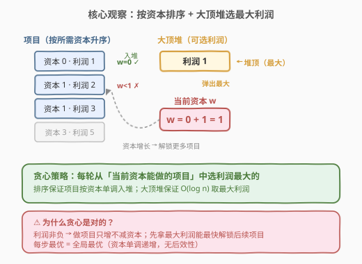
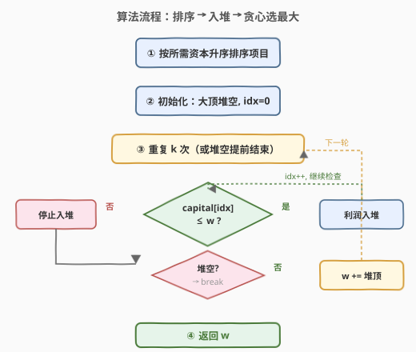
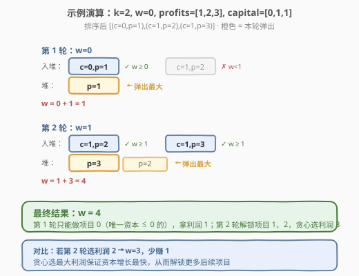

# IPO

- **题目名称**：IPO
- **链接**：[502. IPO](https://leetcode.cn/problems/ipo/)
- **难度**：中等
- **标签**：贪心、堆、优先队列、排序

## 1. 题目概述

给定 `n` 个项目，每个项目 `i` 有**纯利润** `profits[i]` 和**启动所需最低资本** `capital[i]`。你拥有初始资本 `w`，最多可完成 `k` 个**不同**项目。每完成一个项目，资本 `w` 增加 `profits[i]`（利润为正，资本只增不减）。求完成至多 `k` 个项目后的**最终最大资本**。

**示例 1**：

```text
输入：k = 2, w = 0, profits = [1,2,3], capital = [0,1,1]
输出：4
解释：
  第 1 轮 w=0，只能做项目 0（capital=0），完成后 w = 0+1 = 1
  第 2 轮 w=1，可做项目 1 或 2（capital 均为 1），选利润最大的项目 2，w = 1+3 = 4
```

**示例 2**：

```text
输入：k = 3, w = 0, profits = [1,2,3], capital = [0,1,2]
输出：6
解释：依次做项目 0 → 1 → 2，w = 0→1→3→6
```

**约束条件**：

- $1 \leq k \leq 10^5$
- $0 \leq w \leq 10^9$
- $n = \text{profits.length} = \text{capital.length}$
- $1 \leq n \leq 10^5$
- $0 \leq \text{profits}[i] \leq 10^4$
- $0 \leq \text{capital}[i] \leq 10^9$

> 💡 本题的核心矛盾是「资源受限下的最优选择」——资本有限，只能做一部分项目，如何安排顺序使最终资本最大？这是经典的**贪心 + 优先队列**模式：用排序保证候选集单调推进，用堆在候选集里高效取最大。

---

## 2. 解题思路

### 2.1 暴力思路

每轮遍历所有未完成的项目，找出 `capital[i] <= w` 中 `profits[i]` 最大的，完成它，资本增加后进入下一轮。时间复杂度 $O(k \cdot n)$，当 $k, n$ 都到 $10^5$ 时达到 $10^{10}$，必定超时。

> ⚠️ 暴力法的瓶颈在于「每轮都要从头扫描所有项目找可用且利润最大的」。但注意到一个关键单调性：**资本 `w` 只增不减**，一旦某个项目的 `capital[i] <= w`，它在未来所有轮次里都可用——没必要每轮重新检查。

### 2.2 核心观察：排序 + 大顶堆



关键洞察分两步：

1. **按所需资本升序排序项目**。这样可用一个指针 `idx` 从头扫描——资本 `w` 增长后，只需把 `idx` 往后推（新解锁的项目全部入堆），已入堆的无需重复检查。

2. **用大顶堆维护「当前可做的所有项目的利润」**。每轮从堆顶弹出最大利润，加到 `w` 上。堆保证每次选的是当前最优。

> 💡 **为什么贪心正确？** 利润非负（$0 \leq \text{profits}[i]$），做项目只会增加资本、不会减少。因此每步选最大利润能**最快增长资本**，从而最快解锁更多项目——局部最优即全局最优，具有**无后效性**：当前选择不影响未来可用项目集的单调扩张。

### 2.3 算法流程图



```
1. 将 n 个项目按 capital 升序排序（同 capital 顺序无所谓）
2. 初始化大顶堆 heap（空），指针 idx = 0
3. 重复 k 次：
   a. while idx < n 且 projects[idx].capital <= w:
        heap.push(projects[idx].profit)
        idx++
   b. if heap 为空: break  ← 没有可做的项目了
   c. w += heap.pop()  ← 弹出最大利润
4. 返回 w
```

> 💡 步骤 3a 是关键：`idx` 只前进不回退，每个项目最多入堆一次、出堆一次。指针的单调性来自 `w` 的单调性——`w` 只增不减，所以 `capital <= w` 的项目集合只扩不缩。

### 2.4 示例演算

以 `k=2, w=0, profits=[1,2,3], capital=[0,1,1]` 为例。排序后项目序列为 `[(c=0,p=1), (c=1,p=2), (c=1,p=3)]`：



| 轮次 | w（开始） | 入堆项目 | 堆内容 | 弹出 | w（结束） |
|------|----------|----------|--------|------|----------|
| 1 | 0 | (c=0,p=1) | {1} | 1 | 1 |
| 2 | 1 | (c=1,p=2), (c=1,p=3) | {3, 2} | 3 | 4 |

- 第 1 轮：`w=0`，只有 `c=0` 的项目可用，入堆利润 1，弹出最大利润 1，`w = 0+1 = 1`
- 第 2 轮：`w=1`，`idx` 推进解锁 `c=1` 的两个项目（利润 2、3），都入堆。堆 `{3,2}` 弹出最大利润 3，`w = 1+3 = 4`
- 达到 `k=2` 轮，返回 `w=4` ✓

> 💡 对比：若第 2 轮贪小选利润 2，`w=3`，少赚 1。贪心选最大利润 3 保证资本增长最快，这也是「贪心 + 堆」的威力——堆在 $O(\log n)$ 内给出当前最优，而非暴力遍历。

---

## 3. 参考代码

### C++

```cpp
class Solution {
  public:
    int findMaximizedCapital(int k, int w, vector<int>& profits,
                             vector<int>& capital) {
        int n = profits.size();
        vector<pair<int, int>> projects;
        for (int i = 0; i < n; i++)
            projects.push_back({capital[i], profits[i]});
        sort(projects.begin(), projects.end());  // 按 capital 升序

        priority_queue<int> heap;  // 大顶堆，存可用项目的利润
        int idx = 0;
        for (int i = 0; i < k; i++) {
            while (idx < n && projects[idx].first <= w)
                heap.push(projects[idx++].second);
            if (heap.empty())
                break;
            w += heap.top();
            heap.pop();
        }
        return w;
    }
};
```

### Python

```python
class Solution:
    def findMaximizedCapital(self, k: int, w: int,
                             profits: List[int],
                             capital: List[int]) -> int:
        projects = sorted(zip(capital, profits))  # 按 capital 升序
        heap = []   # 大顶堆（Python 用负数模拟）
        idx = 0
        n = len(projects)
        for _ in range(k):
            while idx < n and projects[idx][0] <= w:
                heapq.heappush(heap, -projects[idx][1])
                idx += 1
            if not heap:
                break
            w += -heapq.heappop(heap)
        return w
```

> ⚠️ Python 的 `heapq` 是小顶堆，存负数模拟大顶堆：`heappush(heap, -profit)` 入堆，`-heappop(heap)` 取出最大利润。C++ 的 `priority_queue<int>` 默认就是大顶堆，无需额外处理。

---

## 4. 复杂度分析

| 维度 | 复杂度 | 说明 |
|------|--------|------|
| 时间复杂度 | $O(n \log n + k \log n)$ | 排序 $O(n \log n)$；每轮最多入堆一次共 $n$ 次、出堆 $k$ 次，每次 $O(\log n)$ |
| 空间复杂度 | $O(n)$ | 排序后的项目数组 + 堆（最坏存全部 $n$ 个利润） |

> 💡 当 $k \geq n$ 时，最多做 $n$ 个项目（每个只能做一次），所以实际循环 $\min(k, n)$ 轮。堆操作总量 $O(n + k)$ 次，每次 $O(\log n)$，时间上界 $O((n + k) \log n)$，可安全处理 $n, k = 10^5$ 的数据规模。

---

## 5. 扩展：贪心正确性的形式化论证

### 5.1 交换论证

假设最优解选了利润序列 $p_1, p_2, \dots, p_m$（$m \leq k$），而贪心解选了 $g_1, g_2, \dots, g_m'$。我们要证明贪心解的最终资本 $\geq$ 最优解。

关键引理：**在第 $i$ 轮，贪心选择的利润 $g_i$ 是当前可用项目中的最大值**。设最优解第 $i$ 轮选了 $p_i$，则 $g_i \geq p_i$（因为 $p_i$ 也在可用集中，而 $g_i$ 是可用集的最大值）。

- 贪心第 $i$ 轮后的资本 $w_i^g = w_{i-1}^g + g_i$
- 最优第 $i$ 轮后的资本 $w_i^o = w_{i-1}^o + p_i$

归纳：$w_0^g = w_0^o = w$（初始相同）。若 $w_{i-1}^g \geq w_{i-1}^o$，则贪心的可用集 $\supseteq$ 最优的可用集（资本更大能解锁更多），故 $g_i \geq p_i$，从而 $w_i^g \geq w_i^o$。归纳成立。

> ⚠️ 注意：最优解可能选了某个贪心未选的项目，导致后续可用集不同。但由于利润非负、资本单调递增，贪心「拿最大」的策略保证每步资本 $\geq$ 最优，后续可用集也 $\supseteq$ 最优——这就是无后效性的体现。

### 5.2 如果利润可以为负呢？

若 `profits[i]` 可以为负，贪心不再正确——可能需要「先亏后赚」（做一个亏本项目以解锁高利润后续项目）。此时问题变成一个更难的组合优化，可能需要 DP 或网络流。本题约束 `profits[i] >= 0` 正是保证贪心正确性的关键条件。

---

## 6. 面试要点

1. **为什么用堆而不是每轮遍历找最大？**

   - 暴力每轮 $O(n)$ 扫描所有项目，$k$ 轮共 $O(kn)$，$10^5 \times 10^5 = 10^{10}$ 超时
   - 堆把「找最大」从 $O(n)$ 降到 $O(\log n)$，总时间 $O(n \log n + k \log n)$
   - 核心是利用 `w` 单调递增的单调性，让项目只入堆一次

2. **为什么要先排序？排序的作用是什么？**

   - 排序保证 `idx` 指针单调推进：`w` 增长后只需往后扫新解锁的项目
   - 若不排序，每轮都要遍历全部项目找 `capital <= w` 的，退化到 $O(kn)$
   - 排序 + 指针 = 把「每轮重新筛选可用项目」变成「增量式入堆」

3. **贪心为什么正确？关键条件是什么？**

   - 利润非负（`profits[i] >= 0`）→ 资本 `w` 单调递增 → 每步选最大利润不损害未来
   - 无后效性：当前选择不影响未来可用集的单调扩张（选了某项目只是把它从堆里移除，不会缩小可用集）
   - 若利润可为负，贪心失效（可能需先亏后赚），需要更复杂的算法

4. **堆里存的是什么？为什么不存 `(capital, profit)` 二元组？**

   - 堆里只存**利润**，因为入堆时已经确认 `capital <= w`（可用），后续只需比利润大小
   - 若存二元组，堆的比较还要考虑 capital，但 capital 已经没有意义了（都满足条件）
   - 简化存储 = 更少的内存 + 更快的比较

5. **这题和 [621. 任务调度器](../0601-0700/621_任务调度器.md) 有什么异同？**

   - 都是「资源约束下的贪心调度」，都用到了堆/排序
   - 621 用数学公式直接算框架大小（最高频决定下界）；502 用堆模拟贪心选择（每轮选最大利润）
   - 621 的约束是「同类间隔 n」；502 的约束是「资本门槛 + 最多 k 个」
   - 共同模式：**排序建立单调性 + 堆/公式高效选择**

---

## 7. 同类练习题

- [621. 任务调度器](https://leetcode.cn/problems/task-scheduler/)（[题解](../0601-0700/621_任务调度器.md)）：同为贪心 + 资源调度，但用数学公式而非堆模拟
- [253. 会议室 II](https://leetcode.cn/problems/meeting-rooms-ii/)（[题解](../0201-0300/253_会议室II.md)）：小顶堆维护「正在进行的会议结束时间」，与本题大顶堆维护「可选利润」形成对照
- [215. 数组中的第 K 个最大元素](https://leetcode.cn/problems/kth-largest-element-in-an-array/)（[题解](../0201-0300/215_数组中的第K个最大元素.md)）：堆的基础应用，巩固 `priority_queue` / `heapq` 的使用
- [703. 数据流中的第 K 大元素](https://leetcode.cn/problems/kth-largest-element-in-a-stream/)：小顶堆维护 top-k，与本题大顶堆选最大形成「堆方向」的对比
- [871. 最低加油次数](https://leetcode.cn/problems/minimum-number-of-refueling-stops/)：贪心 + 大顶堆，与本题几乎同构——「行驶距离」对应「资本」，「加油量」对应「利润」
