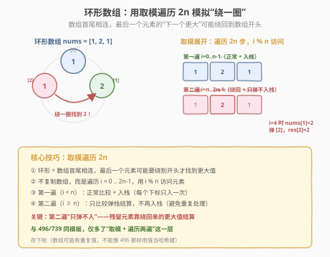
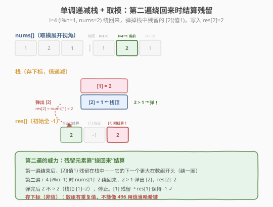

# 下一个更大元素 II

- **题目名称**：下一个更大元素 II
- **链接**：[503. 下一个更大元素 II](https://leetcode.cn/problems/next-greater-element-ii/)
- **难度**：中等
- **标签**：数组、单调栈

## 1. 题目概述

给定一个**循环整数数组** `nums`（`nums[nums.length - 1]` 的下一个元素是 `nums[0]`）。对每个元素，返回它的**下一个更大元素**——即从当前位置向后（可循环）查找第一个比它大的元素的**值**。如果不存在更大的元素，答案为 `-1`。返回数组 `res`，长度与 `nums` 相同。

**示例 1**：

```text
输入：nums = [1,2,1]
输出：[2,-1,2]
解释：
  nums[0]=1 → 下一个更大是 2（下标 1）→ res[0]=2
  nums[1]=2 → 循环一圈也没有更大的 → res[1]=-1
  nums[2]=1 → 向后绕回开头，下一个更大是 2（下标 1）→ res[2]=2
```

**示例 2**：

```text
输入：nums = [1,2,3,4,3]
输出：[2,3,4,-1,4]
解释：
  nums[0]=1 → 下一个更大是 2 → res[0]=2
  nums[1]=2 → 下一个更大是 3 → res[1]=3
  nums[2]=3 → 下一个更大是 4 → res[2]=4
  nums[3]=4 → 循环一圈也没有更大的 → res[3]=-1
  nums[4]=3 → 向后绕回，下一个更大是 4（下标 3）→ res[4]=4
```

**约束条件**：

- `1 <= nums.length <= 10^4`
- `-10^9 <= nums[i] <= 10^9`

> 💡 这是 **单调栈（monotonic stack）** 的环形数组变体，与同一天的 [每日温度（739）](每日温度.md)、[下一个更大元素 I（496）](下一个更大元素%20I.md) 是同一套模板。核心差异只有一点：数组是**循环**的，最后一个元素的"下一个更大"可能绕回到数组开头。解法是把遍历范围从 `n` 扩展到 `2n`，用 `i % n` 取模访问——第一遍正常入栈，第二遍"只弹不入栈"让残留元素靠绕回来的更大值结算。骨架与 739/496 **完全一致**，只是套了一层"取模 + 两遍遍历"的外壳。

---

## 2. 解题思路

### 2.1 暴力思路：双重循环 + 循环绕回

对每个 `i`，从 `i+1` 开始向后扫描（到 `i+n-1` 为止，用取模绕回），找到第一个 `nums[j % n] > nums[i]`。

```text
for i in 0..n:
    for j in i+1 .. i+n:
        if nums[j % n] > nums[i]:
            res[i] = nums[j % n]
            break
    else:
        res[i] = -1
```

时间复杂度 `O(n²)`，`n = 10^4` 时约 `10^8` 次，勉强能过但**不够优雅**。和 739/496 一样，问题在于每个元素向后扫描时**重复比较了大量已扫过的元素**——这些重复比较可以通过单调栈消除。

> ⚠️ 暴力法与 739/496 的暴力法是同一个毛病：重复扫描。循环数组只是让"向后"的范围从 `n-i` 变成 `n`，本质没变。单调栈照样能把 `O(n²)` 降到 `O(n)`——关键是怎么让栈在"绕一圈"后还能继续结算残留元素。

### 2.2 核心观察：单调递减栈 + 取模遍历 2n

**关键定义**：维护一个**栈**，栈中存放下标，对应值从栈底到栈顶**单调递减**。结果数组 `res` 初始全 `-1`。

**核心规则**：遍历 `i` **从 0 到 2n-1**，用 `i % n` 访问数组元素：

- 若 `nums[i % n]` **大于**栈顶对应值：说明 `nums[i % n]` 就是栈顶那个元素的"下一个更大"！弹出栈顶 `top`，`res[top] = nums[i % n]`。**循环弹**直到栈顶值 ≥ 当前值或栈空。
- **只有** `i < n` **时才入栈**（每个下标只入一次，避免第二遍重复入栈）。



**为什么要遍历两遍？** 因为数组是环形的，最后一个元素的"下一个更大"可能在数组开头。第一遍（`i < n`）正常处理，但栈中可能残留一些没找到更大值的元素——它们的答案需要"绕一圈"回到数组前半部分才能找到。第二遍（`i ≥ n`）正是让这些残留元素有机会被绕回来的更大值结算。

**为什么第二遍只弹不入栈？** 如果第二遍也入栈，同一个下标会被处理两次，导致重复结算和逻辑混乱。第一遍已经让所有下标都入过栈了，第二遍只需"继续用绕回来的值弹栈结算"，不需要再入栈。

> 💡 **存下标而非值**：和 739 一样存下标，因为 `res[top]` 要按下标写入。更关键的是——503 的数组**可能有重复值**（如 `[1,2,1]`），不能像 496 那样用值当哈希表的键。存下标 + 用数组存结果是唯一可行的方式。这是 503 与 496 的本质区别：**496 保证元素互不相同（可用哈希），503 允许重复（必须存下标）**。

### 2.3 算法流程图



**完整步骤**：

1. **初始化**：栈 `stack = []`，结果 `res` 全填 `-1`
2. **遍历** `i` **从 0 到 2n-1**：
   - `idx = i % n`
   - `while stack 非空 且 nums[idx] > nums[stack.top()]`：
     - `top = stack.pop()`
     - `res[top] = nums[idx]`（栈顶的下一个更大就是当前值）
   - `if i < n`：`stack.push(i)`（只在第一遍入栈）
3. **结束**：栈中剩余元素 `res` 保持 `-1`（循环一圈也没找到更大值）

> ⚠️ **两个关键细节**：① 比较时用 `nums[i % n]` 取模访问，但入栈时存原始下标 `i`（仅 `i < n` 时）——注意不是存 `i % n`，因为第一遍 `i < n` 时 `i % n == i`，存 `i` 即可。② `res` 初始化为 `-1` 而非 `0`，因为题目要求"无更大元素返回 -1"，且元素值可能是负数或 0，用 0 会混淆。

### 2.4 示例演算

以 `nums = [1, 2, 1]` 为例，`n = 3`，遍历 `2n = 6` 步：

![示例演算：[1,2,1] 的 6 步单调栈变化](../images/nge_ii_example_walkthrough.svg)

| 步骤 | i | i%n | nums值 | 栈（下标） | 动作 | res 变化 |
|------|---|-----|--------|-----------|------|----------|
| 1 | 0 | 0 | 1 | [] → [0] | 栈空，入栈 0 | [-1,-1,-1] |
| 2 | 1 | 1 | 2 | [0] → [1] | 2>1 弹0，res[0]=2；入栈1 | [2,-1,-1] |
| 3 | 2 | 2 | 1 | [1] → [1,2] | 1<2，入栈2 | [2,-1,-1] |
| — | — | — | — | — | **第一遍结束 / 第二遍开始** | — |
| 4 | 3 | 0 | 1 | [1,2] 不变 | 1≯1 不弹；i≥n 不入栈 | [2,-1,-1] |
| 5 | 4 | 1 | 2 | [1,2] → [1] | 2>1 弹2，res[2]=2；2≯2 停 | **[2,-1,2]** |
| 6 | 5 | 2 | 1 | [1] 不变 | 1≯2 不弹；i≥n 不入栈 | [2,-1,2] |
| 结束 | — | — | — | [1] 残留 | res[1] 保持 -1 | [2,-1,2] ✓ |

**关键瞬间**在第 5 步（`i=4`，`i%n=1`）：第一遍结束后 `[2]`（值 1）残留在栈中，它的下一个更大在数组开头（需绕一圈）。第二遍 `i=4` 绕回到 `nums[1]=2`，`2 > 1` 弹出 `[2]`，`res[2]=2`——这就是"环形"的意义。栈中最终残留 `[1]`（值 2，是最大值），循环一圈也没找到更大，`res[1]` 保持 `-1`。

> 💡 对比 739/496：如果是非循环数组，`[2]`（最后的 1）栈中残留后永远等不到更大值，`res[2]` 只能是 `-1`。但 503 的环形让第二遍能绕回来，给残留元素"第二次机会"——这正是遍历 `2n` 而非 `n` 的意义。

---

## 3. 参考代码

### C++

```cpp
// 下一个更大元素II.cpp —— 单调递减栈 + 取模遍历 2n
// 编译: g++ -O2 -std=c++17 下一个更大元素II.cpp -o nge2
#include <vector>
#include <stack>
using namespace std;

class Solution {
  public:
    vector<int> nextGreaterElements(vector<int>& nums) {
        int n = nums.size();
        vector<int> res(n, -1); // 默认 -1（无更大元素）
        stack<int> stk;         // 存下标，对应值单调递减

        for (int i = 0; i < 2 * n; ++i) {
            int idx = i % n;
            // 当前值比栈顶大 → 结算栈顶
            while (!stk.empty() && nums[idx] > nums[stk.top()]) {
                int top = stk.top();
                stk.pop();
                res[top] = nums[idx]; // 栈顶的下一个更大就是当前值
            }
            if (i < n) {
                stk.push(i); // 只在第一遍入栈，避免重复
            }
        }
        // 栈中剩余元素 res 已是 -1，无需处理
        return res;
    }
};
```

### Python

```python
class Solution:
    def nextGreaterElements(self, nums: list[int]) -> list[int]:
        n = len(nums)
        res = [-1] * n
        stack = []  # 存下标，值单调递减

        for i in range(2 * n):
            idx = i % n
            # 当前值比栈顶大 → 结算栈顶
            while stack and nums[idx] > nums[stack[-1]]:
                top = stack.pop()
                res[top] = nums[idx]
            if i < n:
                stack.append(i)  # 只在第一遍入栈
        # 栈中剩余 res 已是 -1
        return res
```

> 💡 代码与 739 的单调栈骨架**几乎完全一致**，只有三处改动：① 外层循环从 `n` 变 `2n`，加 `idx = i % n` 取模；② `if i < n` 限制只在第一遍入栈；③ `res` 初始值从 `0` 改 `-1`，结算时写 `nums[idx]`（值）而非 `i - top`（距离）。把这三处改动套在 739 模板上就是 503 的完整解法。

---

## 4. 复杂度分析

| 维度 | 复杂度 | 说明 |
|------|--------|------|
| **时间复杂度** | `O(n)` | 虽遍历 `2n` 步，但每个下标至多入栈 1 次、出栈 1 次，`while` 总弹出 ≤ `n`，总操作 `O(2n) = O(n)` |
| **空间复杂度** | `O(n)` | 栈最多存 `n` 个下标（值严格递减时全部入栈、无弹出）；结果数组 `O(n)` |

> ⚠️ 虽然遍历 `2n` 步看似翻倍，但均摊分析下每个元素仍只入栈出栈各 1 次。第二遍的 `while` 弹出的是第一遍残留的元素，这些元素在第一遍没被弹出，总共也不超过 `n` 次。所以总时间 `O(n)`，常数因子约为 2~3 倍，与 739/496 同级。

---

## 5. 扩展：三道"下一个更大"对比与取模技巧

### 5.1 三道题一表对比

739、496、503 是"下一个更大"单调栈三部曲，骨架完全相同，差异如下：

| 维度 | 739 每日温度 | 496 下一个更大 I | 503 下一个更大 II |
|------|-------------|-----------------|------------------|
| **数组是否循环** | 否 | 否 | **是**（核心差异） |
| **元素是否唯一** | 不保证 | **保证互不相同** | 不保证（可有重复） |
| **栈里存什么** | 下标 | **值** | 下标 |
| **输出什么** | 距离 `i - top` | 更大的**值** | 更大的**值** |
| **遍历范围** | `n` | `n`（在 nums2 上） | **`2n`（取模）** |
| **无答案默认值** | `0` | `-1` | `-1` |
| **是否需哈希表** | 否 | **是**（值→更大值） | 否 |

> 💡 **存下标 vs 存值**的决策树：① 需要算位置差（739）→ 存下标；② 元素互不相同且只需比值（496）→ 存值 + 哈希表；③ 元素有重复或需按下标写结果（503）→ 存下标。503 同时满足"需按下标写结果"和"有重复值"两个条件，所以必须存下标——这是它与 496 的根本区别。

### 5.2 取模遍历：环形数组的通用技巧

"环形数组"是面试中的常见变体，核心技巧统一为**取模遍历**：

```python
for i in range(2 * n):      # 遍历两圈
    idx = i % n             # 取模映射回原数组
    # 用 nums[idx] 处理...
    if i < n:
        stack.append(i)     # 只在第一圈入栈
```

这个模式不限于单调栈，凡是"环形数组上找下一个更 X"的问题都能套用：

| 题目 | 环形处理方式 |
|------|-------------|
| 503 下一个更大元素 II | 取模遍历 `2n`，第二遍只弹不入栈 |
| 918 环形子数组最大和 | 拼接两遍 + 限制长度 / 前缀和 + 单调队列 |
| 213 打家劫舍 II | 环形 → 拆成两个线性子问题（首取/尾取） |

> 💡 **取模 vs 拼接**：503 也可以"物理拼接"——把 `nums + nums` 拼成 `2n` 长度再跑单调栈，逻辑等价但空间 `O(n)` 额外开销。取模遍历省去拼接，空间更优，是更推荐的写法。

### 5.3 为什么第二遍只弹不入栈？

这是 503 最容易出错的细节。假设第二遍也入栈：

```python
# ❌ 错误写法：第二遍也入栈
for i in range(2 * n):
    idx = i % n
    while stack and nums[idx] > nums[stack[-1]]:
        res[stack.pop()] = nums[idx]
    stack.append(idx)  # 第二遍也会 push，导致下标重复入栈！
```

问题在于同一个下标会被入栈两次（如 `i=0` 和 `i=n` 都 push 下标 0），导致：
- 重复结算：`res[0]` 可能被覆写多次
- 栈膨胀：最多存 `2n` 个下标，空间翻倍
- 逻辑混乱：第二遍入栈的元素本应已在第一遍处理过

正确做法是 `if i < n` 限制只在第一遍入栈——第二遍纯粹是"给残留元素第二次机会"的结算阶段，不需要新增待结算元素。

> 💡 **一句话记忆**：第一遍"**又弹又入**"（正常单调栈），第二遍"**只弹不入**"（清理残留）。两遍共用同一个 `while` 弹栈逻辑，只是入栈有条件限制。

---

## 6. 面试要点

1. **为什么要遍历 2n 而不是 n？**

   - 数组是环形的，最后一个元素的"下一个更大"可能在数组开头。只遍历 `n` 步，栈中残留的元素永远等不到绕回来的更大值。
   - 遍历 `2n` 步相当于"走两圈"：第一圈正常处理 + 入栈，第二圈让残留元素有机会被绕回来的更大值结算。
   - 不需要遍历更多（如 `3n`），因为两圈已经覆盖了所有可能的"下一个更大"——任何元素的下一个更大最多在绕一圈的范围内。

2. **为什么第二遍只弹不入栈？**

   - 第一遍已经让所有 `n` 个下标都入过栈。第二遍如果也入栈，同一下标会重复入栈，导致重复结算和栈膨胀。
   - 第二遍的目的是"给第一遍残留的元素第二次机会"——用绕回来的值继续弹栈结算，不需要新增待结算元素。
   - `if i < n` 这个条件是 503 相比 739 的**唯一结构性改动**，其余逻辑完全一致。

3. **为什么存下标而不是存值？**

   - 两个原因：① `res[top]` 要按下标写入结果，存值找不到写入位置；② 503 的数组**可能有重复值**（如 `[1,2,1]` 有两个 1），不能像 496 那样用值当哈希键。
   - 496 保证元素互不相同，所以能存值 + 哈希表。503 没有这个保证，存下标是唯一可行方式。
   - 通用原则：**有重复值或需按下标写结果 → 存下标；元素唯一且只需比值 → 存值**。

4. **时间复杂度为什么是 O(n) 而不是 O(n²)？**

   - 虽遍历 `2n` 步且 `while` 嵌套在 `for` 里，但**均摊分析**：每个下标至多入栈 1 次、出栈 1 次，`while` 的总弹出次数 ≤ `n`（不是每步都弹 `n` 次）。
   - `for` 跑 `2n` 轮，每轮的 `while` 总共弹出 ≤ `n` 次，总操作 `O(2n) + O(n) = O(n)`。
   - 常数因子约为 2~3 倍（两遍遍历 + 弹栈），但渐进复杂度仍是 `O(n)`，与 739/496 同级。

5. **取模遍历和物理拼接哪个更好？**

   - **取模遍历**（`i % n`）更优：无需额外空间，直接在原数组上操作，空间 `O(n)`（仅栈）。
   - **物理拼接**（`nums + nums`）逻辑等价，但需 `O(n)` 额外空间存拼接数组，且代码不够优雅。
   - 两者时间复杂度相同，面试中推荐取模写法，更体现对环形结构的理解。

> 💡 **一句话总结**：503 是单调栈的环形变体——它把 739 的遍历范围从 `n` 扩到 `2n`，用 `i % n` 取模访问，第一遍"又弹又入"、第二遍"只弹不入"，让残留元素靠绕回来的更大值结算。与 496 的根本区别是"**存下标不存值**"（数组有重复值，不能用哈希）。这个"取模 + 两遍遍历"的技巧可迁移到所有环形数组上的"找下一个更 X"问题，是面试必会的环形数组套路。

---

## 7. 同类练习题
- [739. 每日温度](https://leetcode.cn/problems/daily-temperatures/)（[题解](每日温度.md)）：同模板存下标，非循环、输出距离
- [496. 下一个更大元素 I](https://leetcode.cn/problems/next-greater-element-i/)（[题解](下一个更大元素 I.md)）：同模板存值 + 哈希，元素互不相同
- [556. 下一个更大元素 III](https://leetcode.cn/problems/next-greater-element-iii/)：下一个排列变体，字符串处理
- [901. 股票价格跨度](https://leetcode.cn/problems/online-stock-span/)（[题解](股票价格跨度.md)）：单调递减栈，弹栈时累加跨度
- [84. 柱状图中最大的矩形](https://leetcode.cn/problems/largest-rectangle-in-histogram/)（[题解](../../week1/day7/柱状图中最大的矩形.md)）：找左右第一个更矮，递增栈两侧扫描
