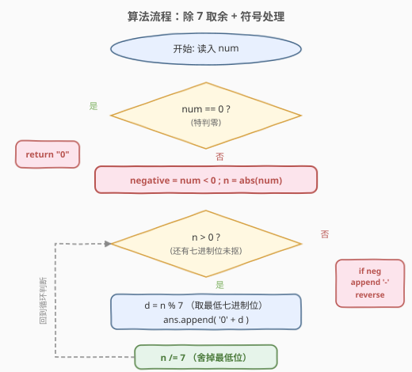
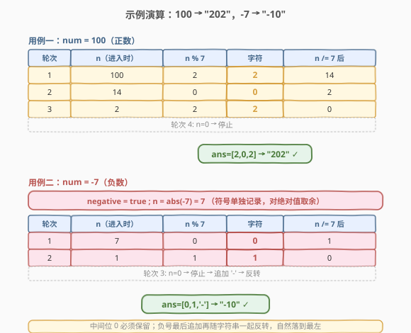

# LeetCode 七进制数 题解

## 1. 题目概述

- **标题 / 题号**：七进制数（#504，easy）
- **链接**：https://leetcode.cn/problems/base-7/
- **难度**：简单
- **标签**：数学

**题意**：给定一个整数 `num`，将其转换为**七进制**的字符串表示。对于负整数，在结果前加负号 `-`，其余按绝对值转换——这与 [405. 数字转换为十六进制数](../0401-0500/405_数字转换为十六进制数.md) 的「补码表示」截然不同。

**示例 1**：

```text
输入：num = 100
输出："202"
解释：100 = 2×49 + 0×7 + 2 = 2×7² + 0×7¹ + 2×7⁰
```

**示例 2**：

```text
输入：num = -7
输出："-10"
解释：7 = 1×7 + 0，加负号得 "-10"
```

**约束**：

- $-10^7 \le \text{num} \le 10^7$

> 💡 本题是「进制转换」家族中最朴素的成员：基数 $7$ 既不是 $2$ 的幂（无法用位运算抠位），数码又含 $0$（无须像 [168. Excel表列名称](https://leetcode.cn/problems/excel-sheet-column-title/) 那样先减 1 平移）。因此它是最干净的「除 K 取余」模板，可作为一切进制转换的入门母题。

## 2. 解题思路

### 2.1 暴力思路：调用库函数

各语言都有进制转换工具：Python 的 `numpy.base_repr(num, 7)`、Java 的 `Integer.toString(num, 7)`、C++ 则需手写。但题目考察的正是手写实现，且库函数对负数的处理未必符合预期（如 Python 的 `numpy.base_repr` 不处理负号）。所以手写「除 7 取余」才是正解。

### 2.2 核心观察：除 K 取余 + 符号单独处理


破局点是把「七进制转换」拆成两件事：**抠位** 与 **处理符号**。

**抠位**：七进制的一位表示 $0 \sim 6$ 的数值，对应「该位权值 $7^k$ 的系数」。把整数 $n$ 反复「除以 7 取余」，得到的余数序列**从低位到高位**正是七进制各位数码。这是因为任意整数 $n$ 可唯一分解为

$$n = d_0 + d_1 \cdot 7 + d_2 \cdot 7^2 + \cdots + d_k \cdot 7^k,\quad d_i \in \{0,1,\dots,6\}$$

对 $n$ 取 `% 7` 得最低位 $d_0$，再 `/ 7` 舍掉最低位（等价于右移一个七进制位），循环往复直到 $n = 0$。

**处理符号**：$7$ 不是 $2$ 的幂，一位七进制无法对齐整数个二进制位，**没有「位运算 + 无符号重解释」的捷径**。负数的补码在这里毫无意义——题目要求的是「带负号的绝对值七进制」，而非「补码的七进制」。所以正确做法是：**记录符号 → 对 `abs(num)` 做取余 → 末尾追加 `-` → 反转**。

> ⚠️ **为什么不能像 [405](../0401-0500/405_数字转换为十六进制数.md) 那样用位运算？** 405 的关键洞察是「$16 = 2^4$，一个十六进制位恰好对齐 4 个二进制位」，于是 `& 0xf` 抠一组、`>> 4` 丢一组，分组边界与位边界天然对齐。而 $7$ 与 $2$ 没有幂关系，$7^1 = 7$ 跨越 $2$ 与 $2^3$ 之间，无法用整数个 bit 表示一个七进制位。所以必须退回算术取余 `% 7` + 整除 `/ 7`。这是「2 幂进制 vs 非 2 幂进制」的分水岭。

以 `num = 100`（正数，验证抠位）为例：$100 = 2 \times 49 + 0 \times 7 + 2$。
- 第 1 轮：`100 % 7 = 2`（最低位 $d_0$），`100 / 7 = 14`；
- 第 2 轮：`14 % 7 = 0`（中间位 $d_1$），`14 / 7 = 2`；
- 第 3 轮：`2 % 7 = 2`（最高位 $d_2$），`2 / 7 = 0`，停止。
- 产出序列 `['2','0','2']`，反转得 `"202"` ✓。

以 `num = -7`（负数，验证符号处理）为例：记录符号 `-`，`n = abs(-7) = 7`。
- 第 1 轮：`7 % 7 = 0`，`7 / 7 = 1`；
- 第 2 轮：`1 % 7 = 1`，`1 / 7 = 0`，停止。
- 产出序列 `['0','1']`，追加 `'-'`，反转得 `"-10"` ✓。

> 💡 **与十进制翻位的同构**：本题的 `% 7 / 7` 与 [9. 回文数](../0001-0100/9_回文数.md) 的 `% 10 / 10` 完全同构——只是把「弹出末位」的基数从 $10$ 换成 $7$。[7. 整数反转](../0001-0100/7_整数反转.md) 同样基于这套「弹出 / 压入」机制。掌握 `% K / K` 模板，任意进制的「抠位」都能秒杀。

### 2.3 算法流程图



整体只有一个循环：先特判 `num == 0` 返回 `"0"`，再记录负号标志并对 `n = abs(num)` 反复「`d = n % 7` 取余 → 追加字符 → `n /= 7` 缩小」，循环结束后若为负数则追加 `'-'`，最后反转字符串。`abs(num)` 必为非负，循环条件 `n > 0` 保证 `num = 0` 已被特判拦截，不会产出空串。

### 2.4 示例演算



**用例一：`num = 100` → `"202"`**

| 轮次 | `n`（进入时） | `n % 7` | 字符 | `n /= 7` 后 |
|------|---------------|---------|------|-------------|
| 1 | 100 | 2 | `2` | 14 |
| 2 | 14 | 0 | `0` | 2 |
| 3 | 2 | 2 | `2` | 0 |
| 4 | 0 | — | 停止 | — |

产出序列 `['2','0','2']`，符号为正无需追加 `-`，反转得 `"202"` ✓。注意中间位的 `0` 必须保留——它是 $d_1 = 0$ 的有效位，若漏掉会得到错误的 `"22"`（$22_7 = 16 \ne 100$）。

**用例二：`num = -7` → `"-10"`**

先记录符号 `negative = true`，令 `n = abs(-7) = 7`。

| 轮次 | `n`（进入时） | `n % 7` | 字符 | `n /= 7` 后 |
|------|---------------|---------|------|-------------|
| 1 | 7 | 0 | `0` | 1 |
| 2 | 1 | 1 | `1` | 0 |
| 3 | 0 | — | 停止 | — |

产出序列 `['0','1']`，因 `negative` 为真追加 `'-'`，反转得 `"-10"` ✓。符号是最后追加再随字符串一起反转的，所以反转后负号自然落在最左——这与「先反转再加负号」等价但更简洁。

> ⚠️ **`num = 0` 为什么必须特判？** 若不特判，`n = abs(0) = 0`，循环条件 `n > 0` 直接为假，`ans` 为空，反转后仍是空串 `""`，而题目要求返回 `"0"`。特判一行 `if num == 0: return "0"` 即可绕开。

## 3. 参考代码

### C++

```cpp
class Solution {
  public:
    string convertToBase7(int num) {
        if (num == 0) return "0";
        bool negative = num < 0;
        int n = abs(num);                 // 取绝对值，符号单独记录
        string ans;
        while (n > 0) {
            ans.push_back(char('0' + n % 7));   // 取最低七进制位 → 字符
            n /= 7;                              // 舍掉最低位
        }
        if (negative) ans.push_back('-');        // 负数末尾追加负号
        reverse(ans.begin(), ans.end());         // 低位先产出，最后反转
        return ans;
    }
};
```

### Python

```python
class Solution:
    def convertToBase7(self, num: int) -> str:
        if num == 0:
            return "0"
        negative = num < 0
        n = abs(num)
        ans = []
        while n > 0:
            ans.append(str(n % 7))   # 取最低七进制位
            n //= 7                  # 舍掉最低位（务必用 //）
        if negative:
            ans.append("-")
        return "".join(ans[::-1])    # 反转成高位在前
```

> ⚠️ **三个易错点**：
> 1. **Python 整除务必用 `//`**。`n / 7` 得浮点数（如 `7 / 7 = 1.0`），后续 `% 7` 虽能继续但类型混乱、效率低，且 `1.0 // 7` 才得 `0`。C++ 中 `int / int` 自动整除，无此坑。
> 2. **`abs(INT_MIN)` 的隐患本题无虞**。C++ 中 `abs(INT_MIN)` 在 32 位 `int` 下技术上溢出（返回 `INT_MIN` 本身），但本题约束 $|num| \le 10^7 \ll 2^{31}$，绝对值安全。若推广到无约束的 32 位整数，须改用 `long long n = abs((long long)num)` 或「先转无符号再处理」。
> 3. **产出顺序是低位在前，最后必须反转**。与 [405](../0401-0500/405_数字转换为十六进制数.md) / [415. 字符串相加](../0401-0500/415_字符串相加.md) 同理——`% 7` 总是抠当前最低位，先写入的是低位字符，需 `reverse` 一次。负号在反转前追加，反转后自然落到最左。

## 4. 复杂度分析

| 维度 | 复杂度 | 说明 |
|------|--------|------|
| 时间复杂度 | $O(\log_7 \lvert n \rvert)$ | 每轮 `n` 缩小到原来的 $1/7$，循环次数即七进制位数；$|num| \le 10^7$ 时最多 $\lceil\log_7 10^7\rceil = 9$ 轮 |
| 空间复杂度 | $O(\log_7 \lvert n \rvert)$ | 结果字符串长度等于循环次数（负数多 1 个符号位）；不计输出则 $O(1)$ |

> 💡 约束 $|num| \le 10^7$ 给出常数上界 $9$ 轮，故时间与空间均可视为 $O(1)$。但按位数增长的渐进界 $O(\log_7 n)$ 是更本质的刻画，便于推广到任意 $K$ 进制：循环次数为 $\lceil\log_K |n|\rceil$。

## 5. 扩展：进制转换的两种范式

本题与 [405. 数字转换为十六进制数](../0401-0500/405_数字转换为十六进制数.md) 构成「进制转换」的对照双题，恰好覆盖两种范式：

| 维度 | 本题（504，七进制） | 405（十六进制） |
|------|----------------------|------------------|
| 基数 | $7$（非 $2$ 的幂） | $16 = 2^4$（$2$ 的幂） |
| 抠位手段 | 算术 `% 7` + `/ 7` | 位运算 `& 0xf` + `>> 4` |
| 负数处理 | 取 `abs` + 末尾补 `-` | 无符号重解释（补码天然兼容） |
| 数码偏移 | $0 \sim 6$ 含 $0$，无须平移 | $0 \sim 15$ 含 $0$，无须平移 |
| 循环上界 | $\lceil\log_7 n\rceil \le 9$ | 固定 $\le 8$（32 位补码） |

**判据**：进制基数是 $2$ 的幂 → 位运算抠位 + 无符号重解释（如二、八、十六进制）；否则 → 算术取余 + 符号单独处理（如七、十、十二进制）。掌握这条判据，任意进制转换都能立刻选对工具。

**数码偏移的第三种情况**：当数码**不含 0**时（如 [168. Excel表列名称](https://leetcode.cn/problems/excel-sheet-column-title/) 的 $1 \sim 26$ 对应 `A \sim Z`），需在每轮取余前**先减 1**把 $1 \sim 26$ 平移到 $0 \sim 25$，否则无法正确映射最低位（余数 $0$ 会越界对应到第 26 个字母）。本题数码 $0 \sim 6$ 含 $0$，直接 `'0' + d` 即可，无须平移。

> 💡 一句话：**进制转换三步走**——① 判断基数是否 $2$ 的幂（定抠位手段）；② 判断数码是否含 $0$（定是否平移）；③ 判断负数表示方式（补码 or 带符号绝对值）。三步选定后，套 `% K / K` 或 `& mask >> shift` 模板即可。

## 6. 面试要点

1. **为什么七进制不能用位运算抠位？**

   > 位运算抠位要求「一位 K 进制恰好对齐整数个二进制位」，即 $K = 2^m$。十六进制 $K = 16 = 2^4$，掩码 `0xf` 取低 4 位、`>> 4` 丢一组，边界对齐。七进制 $K = 7$ 不是 $2$ 的幂，$7^1 = 7$ 跨越 $2^2 = 4$ 与 $2^3 = 8$ 之间，一位七进制无法用整数个 bit 表示，分组边界与位边界不对齐。故必须退回算术 `% 7` + `/ 7`。

2. **负数为什么是「取绝对值 + 补负号」而不是「补码」？**

   > 题目明确要求带负号的七进制表示（如 `-7` → `"-10"`），而非「七进制补码」。补码表示只对 $2$ 的幂进制有意义——它依赖「固定位宽 + 位模式重解释」，十六进制的 `0xFFFFFFFF` 直接对应 32 位补码全 1。七进制无法映射到位模式，且题目约束 $|num| \le 10^7$ 远小于 $2^{31}$，不存在补码场景。所以正确做法是：记录符号 → 对 `abs(num)` 取余 → 末尾追加 `-` → 反转。

3. **`num = 0` 为什么要特判？**

   > `n = abs(0) = 0`，循环条件 `n > 0` 为假，`ans` 为空，反转后仍是空串 `""`，而题目要求返回 `"0"`。特判 `if num == 0: return "0"` 一行绕开。也可改为「循环后若 `ans` 为空则赋 `"0"`」，效果相同。

4. **中间位的 `0` 为什么不能省略？**

   > 七进制数 `202` 的中间位 `0` 表示 $d_1 = 0$，即 $7^1$ 项系数为 0。若省略成 `22`，则 $22_7 = 2 \times 7 + 2 = 16 \ne 100$，数值完全改变。循环中 `n % 7 = 0` 时仍要 `append('0')`，不能跳过——这与十进制中 `101` 不能写成 `11` 是同一个道理。

5. **`abs(INT_MIN)` 在 C++ 中会出问题吗？本题需要担心吗？**

   > C++ 中 `abs(INT_MIN)`（`INT_MIN = -2147483648`）在 32 位 `int` 下技术上溢出，因为 `INT_MIN` 的绝对值 $2^{31}$ 超出 `int` 上界 $2^{31} - 1$，结果未定义（多数实现返回 `INT_MIN` 本身）。但本题约束 $|num| \le 10^7 \ll 2^{31}$，绝对值安全无虞。若推广到无约束 32 位整数，应改用 `long long n = abs((long long)num);` 或先转无符号处理。

6. **和 [405. 数字转换为十六进制数](../0401-0500/405_数字转换为十六进制数.md) 的核心区别是什么？**

   > 三个维度：① 抠位手段——405 用 `& 0xf` + `>> 4`（$16 = 2^4$ 对齐位边界），本题用 `% 7` + `/ 7`（$7$ 非 2 幂）；② 负数——405 用无符号重解释让补码自动生效（`-1` → `"ffffffff"`），本题取绝对值后补负号（`-7` → `"-10"`）；③ 循环上界——405 固定 $\le 8$ 轮（32 位补码），本题 $\le 9$ 轮（$|num| \le 10^7$）。两者共享「从低位到高位、每轮抠一位、最后反转」的骨架，差别仅在抠位手段与负数范式。

> 💡 **一句话总结**：504 是「非 2 幂进制转换」的招牌题——用 `% 7` 抠低位、`/ 7` 舍低位、`abs` + 末尾 `-` 处理负数，$O(\log_7 n)$/O(1) 一趟扫完。核心洞察是「$7$ 非 2 幂故必须算术取余，负数按带符号绝对值处理」，与 405 的「位运算 + 无符号重解释」形成对照双题。

## 同类练习题

| # | 题目 | 与本题的关联 |
|---|------|-------------|
| 405 | [数字转换为十六进制数](https://leetcode.cn/problems/convert-a-number-to-hexadecimal/)（[题解](../0401-0500/405_数字转换为十六进制数.md)） | 2 幂进制转换的对照题，用 `& 0xf` + `>> 4` 位运算抠位、无符号重解释处理补码负数，与本题「算术取余 + 绝对值」形成两种范式对照 |
| 168 | [Excel表列名称](https://leetcode.cn/problems/excel-sheet-column-title/) | 1-indexed 26 进制分解，数码 $1 \sim 26$ 不含 0，需先减 1 平移到 $0 \sim 25$，是「数码不含 0 须平移」的变体，与本题「数码含 0 无须平移」对照 |
| 171 | [Excel表列序号](https://leetcode.cn/problems/excel-sheet-column-number/)（[题解](../0101-0200/171_Excel表列序号.md)） | 进制转换的**反方向**——从 26 进制字符串合成整数（Horner 累乘加），与本题「整数分解为进制字符串」互为逆运算 |
| 172 | [阶乘后的零](https://leetcode.cn/problems/factorial-trailing-zeroes/)（[题解](../0101-0200/172_阶乘后的零.md)） | 质因数分解计数（勒让德公式 $v_5(n!)$），与本题「按基数分解整数」共享「进制/因数」主题，但聚焦于「数某个质因子的总个数」而非「写出表示」 |
| 7 | [整数反转](https://leetcode.cn/problems/reverse-integer/)（[题解](../0001-0100/7_整数反转.md)） | 十进制「弹出末位 / 压入新数」机制，是本题 `% 7 / 7` 的十进制原版，重点考察 32 位溢出处理 |
