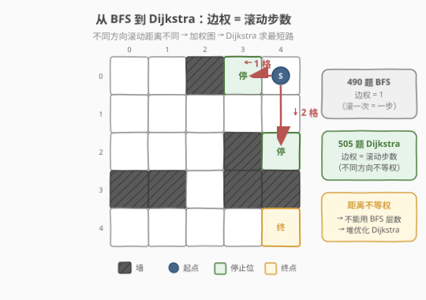
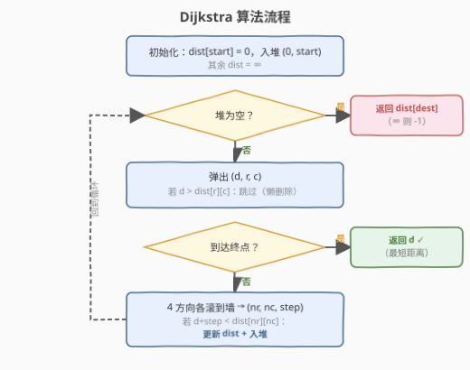
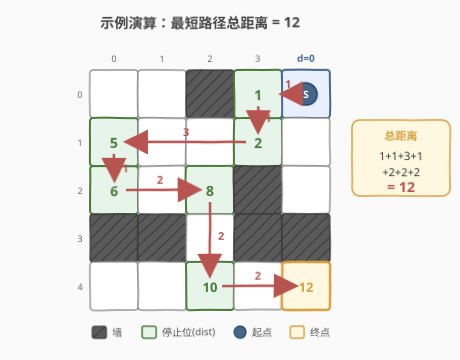

# LeetCode 迷宫 II 题解

## 1. 题目概述

- **标题 / 题号**：迷宫 II（#505，medium）
- **链接**：https://leetcode.cn/problems/the-maze-ii/
- **难度**：中等
- **标签**：图、Dijkstra、堆/优先队列、广度优先搜索

**题意**：给定一个 `m x n` 的二维矩阵 `maze`，其中 `0` 表示**空地**、`1` 表示**墙**。矩阵中有一个球，给定其**起始位置** `start = [startRow, startCol]` 和**目标位置** `destination = [destRow, destCol]`。

球的运动规则与 [490. 迷宫](../0401-0500/490_迷宫.md) 完全相同：

- 球可以沿**上/下/左/右**四个方向之一**滚动**；
- 一旦开始滚动，球会**一直滚下去**，直到撞上**墙**（`1`）或滚出**边界**才会**停止**；
- 球停在撞墙前的那一格空地上（即滚动路径上最后一个 `0` 格）；
- 球**只能在停止后**选择下一个方向，**不能在滚动中途转向**。

本题改为求球**停在**目标位置所需的**最短滚动距离**（经过的空格总数）。无法到达返回 `-1`。

**示例 1**：

```text
输入：maze = [
  [0,0,1,0,0],
  [0,0,0,0,0],
  [0,0,0,1,0],
  [1,1,0,1,1],
  [0,0,0,0,0]
], start = [0,4], destination = [4,4]
输出：12
解释：最短路径为 (0,4)→(0,3)→(1,3)→(1,0)→(2,0)→(2,2)→(4,2)→(4,4)，
      各段滚动距离 1+1+3+1+2+2+2 = 12。
```

**示例 2**：

```text
输入：maze = [[0,0,1,0,0],[0,0,0,0,0],[0,0,0,1,0],[1,1,0,1,1],[0,0,0,0,0]], start = [0,4], destination = [3,2]
输出：-1
解释：(3,2) 左右都是墙，球从任何方向滚过时都不会在此停下，故无法停在 (3,2)。
```

**约束**：

- `m == maze.length`
- `n == maze[i].length`
- `1 <= m, n <= 100`
- `maze[i][j]` 为 `0` 或 `1`
- `start` 和 `destination` 格子均为 `0`（空地）

## 2. 解题思路

### 2.1 暴力思路：为什么 BFS 不行？

[490 题](../0401-0500/490_迷宫.md) 只问「能否到达」，每次滚动算一步（边权为 1），普通 BFS 按层数扩展即可。本题改为求**最短滚动距离**，每次滚动经过的格数不同（可能滚 1 格也可能滚 10 格），**边权不等**。

> ⚠️ 边权不等时，BFS 的"层数 = 距离"不再成立：一条两段各 1 格的路径距离为 2，可能比一条一段 10 格的路径更短，却排在更深的层。按 BFS 入队顺序处理会得到错误的最短路。

一个朴素的替代是 DFS 枚举所有路径取最小值，但停止位之间可能反复横跳，不加记忆化则指数级膨胀。需要让"当前已知距离最小的停止位"优先被处理——这正是 **Dijkstra** 的核心。

### 2.2 核心观察：堆优化 Dijkstra（边权 = 滚动步数）



承接 490 题的「停止位 = 图节点」模型，本题只需把**边权**从 1 改为**滚动步数**：

- **节点**：所有可能的停止位置（空地格）；
- **边**：从停止位 `(r,c)` 出发沿方向 `d` 滚到撞墙前的停止位 `(nr,nc)`，边权 = 滚过的格数 `step`；
- **问题**：在这张**加权图**上求 `start` 到 `destination` 的最短路径。

> 💡 **与 490 的唯一区别**：490 边权恒为 1（只问能否到达），BFS 即可；505 边权为滚动步数（不等权），必须升级为 Dijkstra。算法骨架（`roll` 子过程求停止位）完全复用。

**做法**：用最小堆存放 `(距离, 行, 列)`，每次取出距离最小的停止位进行松弛：

1. 初始化 `dist[start] = 0`，入堆 `(0, start_r, start_c)`，其余 `dist` 为 $\infty$。
2. 弹出堆顶 `(d, r, c)`——由于边权非负，`d` 已是该位置的最短距离。
3. 若 `(r,c) == destination`，直接返回 `d`（第一次弹出终点即最短路）。
4. 否则对 4 个方向滚动求停止位 `(nr, nc)` 和步数 `step`：若 $d + \text{step} < \text{dist}[nr][nc]$，更新并入堆。
5. 堆空仍未到达终点，返回 `-1`。

### 2.3 算法流程图



**核心子过程：沿方向滚动求停止位与步数**（与 490 题完全相同，额外计数）

```text
roll(maze, r, c, dr, dc):
    step = 0
    while 未越界 且 下一格 maze[r+dr][c+dc] == 0:
        r += dr; c += dc; step++
    return (r, c, step)    # 停止位 + 滚动步数
```

> 💡 判定条件是「**下一格**是空地才前进」而非「当前格是空地」，保证停在撞墙前的最后一格，且起点本身已是空地。

### 2.4 示例演算



以示例 1 的 $5 \times 5$ 迷宫为例，Dijkstra 逐步弹出距离最小的停止位并松弛。最终最短路径如下（与 490 题可达路径一致，但本题需验证它确实是最短的）：

| 步 | 当前停止位 | dist | 方向 | 滚动路径 | 新停止位 | 步数 | 新 dist |
|----|-----------|------|------|---------|---------|------|---------|
| 0 | `(0,4)` S | 0 | ← 左 | `(0,3)` | `(0,3)` | 1 | 1 |
| 1 | `(0,3)` | 1 | ↓ 下 | `(1,3)` | `(1,3)` | 1 | 2 |
| 2 | `(1,3)` | 2 | ← 左 | `(1,2),(1,1),(1,0)` | `(1,0)` | 3 | 5 |
| 3 | `(1,0)` | 5 | ↓ 下 | `(2,0)` | `(2,0)` | 1 | 6 |
| 4 | `(2,0)` | 6 | → 右 | `(2,1),(2,2)` | `(2,2)` | 2 | 8 |
| 5 | `(2,2)` | 8 | ↓ 下 | `(3,2),(4,2)` | `(4,2)` | 2 | 10 |
| 6 | `(4,2)` | 10 | → 右 | `(4,3),(4,4)` | ★ `(4,4)` | 2 | 12 |

第 6 步弹出 `(4,4)` 时 `dist = 12`，即为最短距离。

> 💡 **为什么这条路径是最短的？** Dijkstra 的贪心正确性保证了每次弹出的停止位其 `dist` 已是最小（非负边权 + 最小堆）。在弹出 `(4,4)` 之前，所有 `dist < 12` 的停止位都已被处理过，没有任何路径能以更短距离到达终点。例如从 `(4,2)` 向左到 `(4,0)`（dist 12）再向右到 `(4,4)`（dist 16）更远；从 `(2,2)` 向上到 `(1,2)`（dist 9）再向下到 `(4,2)`（dist 12）也不更优。

**为什么示例 2 的 `(3,2)` 返回 `-1`？** 与 490 题分析一致：`(3,2)` 左右是墙 `(3,1)`、`(3,3)`，球从上滚下来会穿过到 `(4,2)`，从下滚上来会穿过到 `(1,2)`——球永远不会停在 `(3,2)`，所以它从未入堆，`dist[3][2]` 保持 $\infty$，最终返回 `-1`。

## 3. 参考代码

### C++

```cpp
class Solution {
    int dx[4] = {0, 0, 1, -1};
    int dy[4] = {1, -1, 0, 0};

  public:
    int shortestDistance(vector<vector<int>>& maze,
                          vector<int>& start, vector<int>& dest) {
        int m = maze.size(), n = maze[0].size();
        vector<vector<int>> dist(m, vector<int>(n, INT_MAX));
        dist[start[0]][start[1]] = 0;

        // 最小堆：(距离, 行, 列)
        priority_queue<tuple<int, int, int>,
                       vector<tuple<int, int, int>>,
                       greater<>> pq;
        pq.push({0, start[0], start[1]});

        while (!pq.empty()) {
            auto [d, r, c] = pq.top();
            pq.pop();
            if (d > dist[r][c]) continue;            // 懒删除
            if (r == dest[0] && c == dest[1]) return d;  // 首次弹出终点 = 最短路

            for (int k = 0; k < 4; k++) {
                int nr = r, nc = c, step = 0;
                while (nr + dx[k] >= 0 && nr + dx[k] < m &&
                       nc + dy[k] >= 0 && nc + dy[k] < n &&
                       maze[nr + dx[k]][nc + dy[k]] == 0) {
                    nr += dx[k];
                    nc += dy[k];
                    step++;
                }
                if (d + step < dist[nr][nc]) {
                    dist[nr][nc] = d + step;
                    pq.push({d + step, nr, nc});
                }
            }
        }
        return -1;
    }
};
```

### Python

```python
class Solution:
    def shortestDistance(self, maze: List[List[int]],
                         start: List[int], destination: List[int]) -> int:
        import heapq
        m, n = len(maze), len(maze[0])
        dist = [[float('inf')] * n for _ in range(m)]
        dist[start[0]][start[1]] = 0

        pq = [(0, start[0], start[1])]  # 最小堆：(距离, 行, 列)
        dirs = [(0, 1), (0, -1), (1, 0), (-1, 0)]

        while pq:
            d, r, c = heapq.heappop(pq)
            if d > dist[r][c]:            # 懒删除
                continue
            if [r, c] == destination:     # 首次弹出终点 = 最短路
                return d
            for dr, dc in dirs:
                nr, nc, step = r, c, 0
                while 0 <= nr + dr < m and 0 <= nc + dc < n \
                        and maze[nr + dr][nc + dc] == 0:
                    nr += dr
                    nc += dc
                    step += 1
                if d + step < dist[nr][nc]:
                    dist[nr][nc] = d + step
                    heapq.heappush(pq, (d + step, nr, nc))
        return -1
```

> 💡 **懒删除（lazy deletion）**：堆中可能存在同一停止位的多条旧记录（距离已被更新得更小）。弹出时若 `d > dist[r][c]` 说明过期，直接 `continue` 跳过，无需真正从堆中删除。这与 [743. 网络延迟时间](../0701-0800/743_网络延迟时间.md) 的 Dijkstra 写法完全一致。

> ⚠️ **提前返回的正确性**：`if (r == dest[0] && c == dest[1]) return d;` 在懒删除检查**之后**执行。由于 Dijkstra 按距离递增顺序弹出，第一次弹出终点时的 `d` 必为最短距离。若终点不是任何方向的停止位（如示例 2 的 `(3,2)`），它永远不会被入堆，循环结束后返回 `-1`。

## 4. 复杂度分析

| 维度 | 复杂度 | 说明 |
|------|--------|------|
| 时间复杂度 | $O(M \times N \times \max(M, N))$ | 每个停止位至多被弹出（处理）一次；每次处理时 4 个方向各滚动 $O(\max(M,N))$；堆操作 $O(M \times N \log(M \times N))$ 被滚动代价主导 |
| 空间复杂度 | $O(M \times N)$ | `dist` 矩阵 $O(M \times N)$；堆最坏存 $O(M \times N)$ 个元素 |

> 💡 **与 490 题复杂度对比**：490 用 BFS，每个停止位处理一次、每次滚动 $O(\max(M,N))$，整体 $O(M \times N \times \max(M,N))$。505 的 Dijkstra 多了堆操作 $O(\log(M \times N))$，但被滚动代价主导，渐近复杂度相同。$M, N \leq 100$ 时约 $10^6$ 次操作，远在时限内。

## 5. 扩展：迷宫三题对比

| 维度 | 490 迷宫 | 505 迷宫 II（本题） | 499 迷宫 III |
|------|---------|-------------------|-------------|
| 问什么 | 能否到达 | 最短滚动**距离** | 最短路径**方向字符串** |
| 边权 | 1（每次滚动算一步） | 滚动步数（不等权） | 滚动步数（不等权） |
| 算法 | BFS | Dijkstra | Dijkstra + 字典序 tie-break |
| 返回值 | `true/false` | 最短距离 / `-1` | 最短路径字符串 / `"impossible"` |

三题共享同一套「`roll` 子过程 + 停止位图」骨架，只是搜索策略和返回值不同：

- **490 → 505**：BFS 升级为 Dijkstra（边权从 1 变不等权）。
- **505 → 499**：在 Dijkstra 基础上，当距离相同时比较方向字符串的字典序（`d, u, l, r` 排序），需要在松弛时维护等距路径的字符串。

> 💡 面试中先讲清 490 的「停止位 = 状态」核心观察，再说明 505 只需把 BFS 换成 Dijkstra，最后提及 499 的字典序 tie-break，能体现对迷宫系列的体系化理解。

## 6. 面试要点

1. **为什么不能用 BFS？和 490 题的区别是什么？**

   - 490 题边权为 1（每次滚动算一步），BFS 按层数扩展天然得最短步数。505 边权为滚动步数（不等权），BFS 的"层数 = 距离"不再成立，必须用 Dijkstra 让距离最小的停止位优先处理。

2. **什么时候可以提前返回 `d`？**

   - 在懒删除检查之后（`d > dist[r][c]` 跳过），若弹出的 `(r,c)` 是终点，直接返回 `d`。Dijkstra 按距离递增弹出，首次弹出终点即最短路。若终点不是任何方向的停止位，它永不入堆，最终返回 `-1`。

3. **`roll` 子过程的循环条件为什么判断"下一格"？**

   - 判断 `maze[r+dr][c+dc] == 0` 才前进，保证停在撞墙前最后一格空地，且不会滚进墙里。起点本身已是空地（题目保证），四周都是墙时原地不动返回自身。

4. **懒删除是什么？为什么不用 `visited` 数组？**

   - 490 用 `visited` 是因为 BFS 每个停止位只入队一次（边权为 1，先到即最短）。505 边权不等，同一停止位可能被多次松弛（发现更短距离），不能简单跳过。用 `dist` 数组 + 懒删除：弹出时若 `d > dist[r][c]` 说明是过期记录，跳过即可。

5. **这题和 743 网络延迟时间的 Dijkstra 有什么异同？**

   - 骨架完全相同：最小堆 + `dist` 数组 + 懒删除 + 松弛。区别在于 743 的图是显式的（邻接表），505 的图是隐式的（滚动求邻居），每次求邻居需 $O(\max(M,N))$ 滚动。核心思想一致。

## 同类练习题

| # | 题目 | 与本题的关联 |
|---|------|-------------|
| 490 | [迷宫](https://leetcode.cn/problems/the-maze/)（[题解](../0401-0500/490_迷宫.md)） | 本题的前传，BFS 判可达，理解「停止位 = 状态」的基石 |
| 499 | [迷宫 III](https://leetcode.cn/problems/the-maze-iii/)（[题解](../0401-0500/499_迷宫III.md)） | 本题的进阶，Dijkstra + 字典序 tie-break 求最短路径字符串 |
| 743 | [网络延迟时间](https://leetcode.cn/problems/network-delay-time/)（[题解](../0701-0800/743_网络延迟时间.md)） | 堆优化 Dijkstra 模板，本题的算法骨架 |
| 1926 | [迷宫中离入口最近的出口](https://leetcode.cn/problems/nearest-exit-from-entrance-in-maze/) | 普通网格 BFS（一步一格），对照「一步滚一段」的边界处理差异 |
| 1631 | [最小体力消耗路径](https://leetcode.cn/problems/path-with-minimum-effort/) | Dijkstra 变体，路径代价定义为边上最大权差，对照不同边权定义下的 Dijkstra 应用 |
