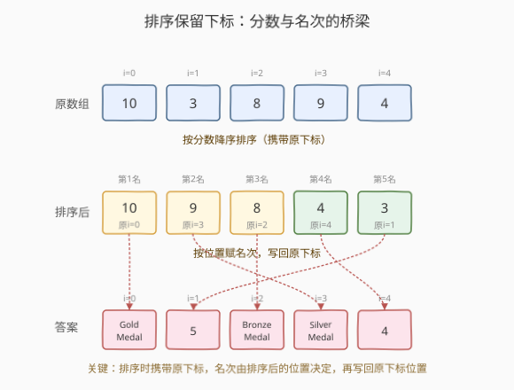
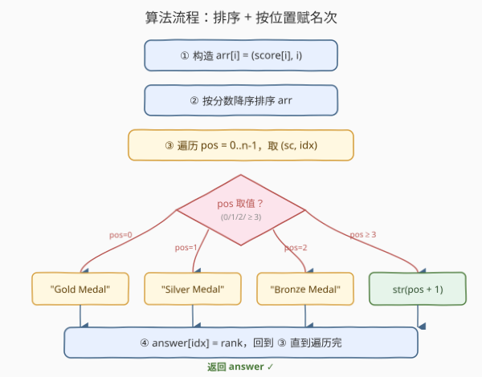

# 相对名次

- **题目名称**：相对名次
- **链接**：[506. 相对名次](https://leetcode.cn/problems/relative-ranks/)
- **难度**：简单
- **标签**：数组、排序、堆（优先队列）

## 1. 题目概述

给你一个长度为 `n` 的整数数组 `score`，其中 `score[i]` 表示第 `i` 位运动员在比赛中的得分。**所有得分互不相同**。运动员的排名由得分决定：第 1 名得分最高，第 2 名得分次高，依此类推。排名规则：

- 第 1 名 → `"Gold Medal"`
- 第 2 名 → `"Silver Medal"`
- 第 3 名 → `"Bronze Medal"`
- 第 4 名及以后 → 其名次的字符串形式（如第 4 名为 `"4"`）

返回长度为 `n` 的数组 `answer`，其中 `answer[i]` 是第 `i` 位运动员的排名。

**示例 1**：

```text
输入：score = [5,4,3,2,1]
输出：["Gold Medal","Silver Medal","Bronze Medal","4","5"]
解释：得分已降序，名次依次为 1..5。
```

**示例 2**：

```text
输入：score = [10,3,8,9,4]
输出：["Gold Medal","5","Bronze Medal","Silver Medal","4"]
解释：
  score[0]=10 → 第1名 → "Gold Medal"
  score[1]=3  → 第5名 → "5"
  score[2]=8  → 第3名 → "Bronze Medal"
  score[3]=9  → 第2名 → "Silver Medal"
  score[4]=4  → 第4名 → "4"
```

**约束条件**：

- `n == score.length`
- `1 <= n <= 10^4`
- `0 <= score[i] <= 10^6`
- `score` 中的所有值**互不相同**

> 💡 核心难点不在排名规则本身，而在于**「排序后的位置」如何对应回「原数组的下标」**——直接对 `score` 排序会丢失原始下标信息，导致无法把名次写回正确的位置。这是本题唯一的小陷阱。

---

## 2. 解题思路

### 2.1 暴力思路：双重循环数更大者

对每个 `score[i]`，统计有多少个 `score[j] > score[i]`，这个计数 `+1` 就是它的名次。再按名次映射成奖牌或字符串。

```text
for i in 0..n:
    rank = 1
    for j in 0..n:
        if score[j] > score[i]: rank += 1
    answer[i] = medalOrStr(rank)
```

时间复杂度 `O(n²)`，`n = 10^4` 时约 `10^8` 次比较，能过但**完全没有必要**。问题在于每个元素都在重复扫描整个数组——这本质上就是个**排序**问题，却被写成了暴力枚举。

> ⚠️ 这里的 `rank = 1 + (大于 score[i] 的元素个数)` 其实就是「排序后从大到小的位置 + 1」。一旦意识到这一点，排序就是顺理成章的优化。

### 2.2 核心观察：排序时携带原下标，名次由排序后的位置决定

**关键定义**：构造二元组数组 `arr[i] = (score[i], i)`，按分数**降序**排序。排序后 `arr[pos]` 的 `pos`（从 0 开始）就是该运动员的排名减一：

$$\text{rank} = \text{pos} + 1$$

- `pos = 0` → 第 1 名 → `"Gold Medal"`
- `pos = 1` → 第 2 名 → `"Silver Medal"`
- `pos = 2` → 第 3 名 → `"Bronze Medal"`
- `pos ≥ 3` → `str(pos + 1)`

最后把名次写回 `answer[arr[pos].原下标]` 即可。



**为什么要携带原下标？** 因为我们需要把名次写回到 `answer` 的**原位置**。如果只对 `score` 排序，原始下标信息就丢了——你只知道「10 分是第 1 名」，却不知道 10 分原来在哪个位置。携带 `(score, i)` 二元组正是为了在排序后仍能找回原始下标。

> 💡 **「排序 + 携带原下标」是非常通用的技巧**：凡是「排序后需要把结果写回原数组对应位置」的题目都能套用。例如 [324. 摆动排序 II](../0301-0400/324_摆动排序II.md) 中「排序后按交错位置回填」、[179. 最大数](../0101-0200/179_最大数.md) 中「自定义排序后拼接」都用了类似思路。**只要排序会打乱下标，就考虑携带原下标**。

### 2.3 算法流程图



**完整步骤**：

1. **构造二元组**：`arr[i] = (score[i], i)`，`i = 0..n-1`
2. **降序排序**：按 `score` 从大到小排 `arr`
3. **遍历赋名次**：`pos = 0..n-1`，取 `(sc, idx) = arr[pos]`
   - `pos == 0` → `rank = "Gold Medal"`
   - `pos == 1` → `rank = "Silver Medal"`
   - `pos == 2` → `rank = "Bronze Medal"`
   - 否则 → `rank = str(pos + 1)`
   - `answer[idx] = rank`
4. **返回** `answer`

> ⚠️ **`pos` 与 `rank` 的对应**：`pos` 是 0-indexed 的排序位置，而名次是 1-indexed（第 1 名、第 2 名…），所以数值名次要写 `str(pos + 1)`。`pos = 3` 对应第 4 名 → `"4"`，不是 `"3"`。这是本题最容易写错的细节。

### 2.4 示例演算

以 `score = [10, 3, 8, 9, 4]`，`n = 5` 为例：

![示例演算：score = [10, 3, 8, 9, 4]](../images/relative_ranks_example_walkthrough.svg)

| 排序位置 pos | 分数 sc | 原下标 idx | 名次 | 写入 answer |
|------|------|------|----------|--------------|
| 0（第1名） | 10 | 0 | `"Gold Medal"` | `answer[0] = "Gold Medal"` |
| 1（第2名） | 9 | 3 | `"Silver Medal"` | `answer[3] = "Silver Medal"` |
| 2（第3名） | 8 | 2 | `"Bronze Medal"` | `answer[2] = "Bronze Medal"` |
| 3（第4名） | 4 | 4 | `"4"` | `answer[4] = "4"` |
| 4（第5名） | 3 | 1 | `"5"` | `answer[1] = "5"` |

最终 `answer = ["Gold Medal", "5", "Bronze Medal", "Silver Medal", "4"]`。

**关键瞬间**在第 1 行：分数最高的 `10` 原本在下标 `0`，排序后落到 `pos = 0`，于是 `answer[0]` 被赋为 `"Gold Medal"`——「排序后的位置」与「原下标」通过二元组建立了桥梁。注意 `score[1]=3` 虽然在原数组里排第 2 位，但分数最低，实际名次是第 5 → `answer[1] = "5"`，这正说明**名次由分数决定，与原数组顺序无关**。

---

## 3. 参考代码

### C++

```cpp
// 相对名次.cpp —— 排序 + 携带原下标，按位置赋名次
// 编译: g++ -O2 -std=c++17 相对名次.cpp -o ranks
#include <vector>
#include <string>
#include <algorithm>
using namespace std;

class Solution {
  public:
    vector<string> findRelativeRanks(vector<int>& score) {
        int n = score.size();
        vector<pair<int,int>> arr(n);
        for (int i = 0; i < n; ++i) {
            arr[i] = {score[i], i};        // (分数, 原下标)
        }
        // 按分数降序
        sort(arr.begin(), arr.end(),
             [](const auto& a, const auto& b) { return a.first > b.first; });

        vector<string> ans(n);
        for (int pos = 0; pos < n; ++pos) {
            int idx = arr[pos].second;     // 写回原下标
            if (pos == 0)      ans[idx] = "Gold Medal";
            else if (pos == 1) ans[idx] = "Silver Medal";
            else if (pos == 2) ans[idx] = "Bronze Medal";
            else               ans[idx] = to_string(pos + 1);
        }
        return ans;
    }
};
```

### Python

```python
class Solution:
    def findRelativeRanks(self, score: list[int]) -> list[str]:
        n = len(score)
        # 按分数降序，携带原下标
        arr = sorted(((s, i) for i, s in enumerate(score)), reverse=True)
        ans = [""] * n
        for pos, (_, idx) in enumerate(arr):
            if pos == 0:
                ans[idx] = "Gold Medal"
            elif pos == 1:
                ans[idx] = "Silver Medal"
            elif pos == 2:
                ans[idx] = "Bronze Medal"
            else:
                ans[idx] = str(pos + 1)
        return ans
```

> 💡 Python 还有一种更紧凑的写法：用 `sorted` 直接对 `range(n)` 按 `score` 排序，省去构造二元组：`order = sorted(range(n), key=lambda i: score[i], reverse=True)`，再按 `pos` 赋名次。逻辑等价，本质都是「排序一个能指回原位置的东西」。

---

## 4. 复杂度分析

| 维度 | 复杂度 | 说明 |
|------|--------|------|
| **时间复杂度** | `O(n log n)` | 排序主导 `O(n log n)`；构造二元组与回填名次各 `O(n)`，总体为排序复杂度 |
| **空间复杂度** | `O(n)` | 二元组数组 `arr` 占 `O(n)`；结果数组 `ans` 占 `O(n)`（输出不计则 `O(n)` 辅助） |

> 💡 题目保证分数**互不相同**，所以排序后位置与名次是**一一对应**的，无需处理同分并列的情况。若允许同分（变体题），则需用「稳定排序 + 同分同名次」的规则，本题不必考虑。

---

## 5. 扩展：堆解法与计数排序解法

### 5.1 大顶堆：天然按名次顺序弹出

把 `(score, i)` 全部压入大顶堆，逐个弹出。每次弹出的就是当前未排名中分数最高者，弹出的顺序天然就是第 1 名、第 2 名…，用一个 `pos` 计数器即可赋名次。

```cpp
// 大顶堆解法（C++）
#include <queue>
class Solution {
  public:
    vector<string> findRelativeRanks(vector<int>& score) {
        int n = score.size();
        priority_queue<pair<int,int>> pq;   // 默认大顶堆，按 score 降序
        for (int i = 0; i < n; ++i) pq.push({score[i], i});
        vector<string> ans(n);
        int pos = 0;
        while (!pq.empty()) {
            int idx = pq.top().second; pq.pop();
            if (pos == 0)      ans[idx] = "Gold Medal";
            else if (pos == 1) ans[idx] = "Silver Medal";
            else if (pos == 2) ans[idx] = "Bronze Medal";
            else               ans[idx] = to_string(pos + 1);
            ++pos;
        }
        return ans;
    }
};
```

| 维度 | 排序解法 | 堆解法 |
|------|----------|--------|
| 时间 | `O(n log n)` | `O(n log n)`（建堆 `O(n)` + `n` 次弹出各 `O(log n)`） |
| 空间 | `O(n)` | `O(n)` |
| 何时更优 | 通用、常数小 | 只需前 K 名时（弹 K 次即可，`O(n + K log n)`） |
| 直观性 | 排完一次性遍历 | 弹一个定一个，更贴合「逐个定名次」的语义 |

> 💡 当题目只需要**前 3 名**（如只发奖牌、忽略后续名次），堆可以只弹 3 次，复杂度 `O(n)` 建堆 + `O(3 log n)` 弹出 ≈ `O(n)`，优于排序的 `O(n log n)`。但本题需要所有人的名次，必须弹完，堆相比排序没有渐近优势，反而常数更大。

### 5.2 计数排序：值域受限时的 `O(n)` 解法

题目约束 `0 <= score[i] <= 10^6`，值域 `M = 10^6 + 1` 不大。可用计数排序绕过比较排序的 `O(n log n)` 下界，做到 `O(n + M)`：

1. 用一个长度 `M` 的数组 `rank_of`，`rank_of[v]` 记录值 `v` 在原数组中的下标（值互不相同）。
2. 从大到小扫描 `rank_of`，跳过未出现的值，用一个递增计数器 `pos` 给每个出现的值赋名次，写回 `answer[rank_of[v]]`。

```python
class Solution:
    def findRelativeRanks(self, score: list[int]) -> list[str]:
        M = max(score) + 1
        idx_of = [-1] * M              # 值 -> 原下标
        for i, v in enumerate(score):
            idx_of[v] = i
        ans = [""] * len(score)
        pos = 0
        for v in range(M - 1, -1, -1): # 从大到小扫描值域
            if idx_of[v] == -1:
                continue
            i = idx_of[v]
            if pos == 0:      ans[i] = "Gold Medal"
            elif pos == 1:    ans[i] = "Silver Medal"
            elif pos == 2:    ans[i] = "Bronze Medal"
            else:             ans[i] = str(pos + 1)
            pos += 1
        return ans
```

> ⚠️ 计数排序**空间 `O(M)`**：当 `M = 10^6` 时约占 4~8 MB，可接受；但若值域更大（如 `10^9`）则不可行。本题 `M ≤ 10^6 + 1` 是计数排序的甜区，能换来渐近更优的 `O(n + M)`。**面试中可作为「值域受限时的优化」主动提出来**，体现对排序下界的理解。

### 5.3 三种解法对比

| 解法 | 时间 | 空间 | 适用场景 |
|------|------|------|----------|
| 排序 + 携带下标（主解） | `O(n log n)` | `O(n)` | 通用，最简洁，推荐 |
| 大顶堆 | `O(n log n)` | `O(n)` | 只需前 K 名时优势明显 |
| 计数排序 | `O(n + M)` | `O(M)` | 值域 `M` 不大时，理论最优 |

---

## 6. 面试要点

1. **为什么不能直接对 `score` 排序？**

   - 直接排序会丢失原始下标信息。题目要求 `answer[i]` 是第 `i` 位运动员的名次，必须把名次写回原位置——如果不知道「10 分原来在第 0 位」，就无法把 `"Gold Medal"` 写到 `answer[0]`。
   - 解决方法：构造 `(score, i)` 二元组再排序，排序时下标跟着分数一起移动。**「排序 + 携带原下标」是所有「排序后需回填原位置」题目的通用套路**。

2. **`pos` 和名次的对应关系是什么？为什么 `pos ≥ 3` 时写 `str(pos + 1)` 而不是 `str(pos)`？**

   - `pos` 是 0-indexed 的排序位置，名次是 1-indexed（第 1 名、第 2 名…）。`pos = 0` 即第 1 名，`pos = 3` 即第 4 名。
   - 前 3 名用奖牌字符串特判，第 4 名起用数字字符串，所以 `pos ≥ 3` 时写 `str(pos + 1)`（如 `pos = 3` → `"4"`）。漏掉 `+1` 是最常见 bug。

3. **题目保证分数互不相同，这个条件的作用？**

   - 互不相同 ⇒ 排序后每个位置对应唯一名次，无需处理并列（同分同名次）。若允许同分，需改用稳定排序并在同分段内赋相同名次，复杂度不变但实现更繁琐。
   - 同时这也意味着「值 → 下标」是一一映射，计数排序解法中可用 `idx_of[v]` 直接存单个下标而非列表。

4. **堆解法相比排序解法有优势吗？**

   - 本题需要所有人的名次，堆要弹出 `n` 次，总时间 `O(n log n)`，与排序相同但常数更大，**没有渐近优势**。
   - 堆的优势在「只需前 K 名」时：弹 K 次即可，`O(n + K log n)`。若面试官追问「只要前 3 名怎么办」，堆（或快速选择）就是答案。

5. **如果分数值域很小，能优化到 `O(n)` 吗？**

   - 可以，用计数排序。题目 `0 <= score[i] <= 10^6`，值域 `M = 10^6 + 1`，开一个 `O(M)` 的数组记录每个值出现的原下标，再从大到小扫描值域赋名次，总时间 `O(n + M)`、空间 `O(M)`。
   - 当 `M` 与 `n` 同阶或更小时，`O(n + M)` 优于 `O(n log n)`。但 `M` 很大（如 `10^9`）时空间爆炸，不可行——这是计数排序的固有局限。

> 💡 **一句话总结**：506 的本质是「排序 + 携带原下标」——构造 `(score, i)` 二元组，按分数降序排，排序后的位置就是名次（前 3 特判奖牌，其余 `str(pos+1)`），再写回原下标。难点不在排名规则，而在排序后如何找回原位置。这招对所有「排序打乱下标但需回填原位置」的题通用。

---

## 7. 同类练习题

- [215. 数组中的第K个最大元素](https://leetcode.cn/problems/kth-largest-element-in-an-array/)（[题解](../0201-0300/215_数组中的第K个最大元素.md)）：Top-K 思路，排序 / 堆 / 快速选择三选一，对比本题「全部排名」与「只要第 K 大」的差异
- [179. 最大数](https://leetcode.cn/problems/largest-number/)（[题解](../0101-0200/179_最大数.md)）：自定义排序 + 排序后按原顺序拼接，同样依赖「排序结果回填」的思想
- [324. 摆动排序 II](https://leetcode.cn/problems/wiggle-sort-ii/)（[题解](../0301-0400/324_摆动排序II.md)）：排序后按交错位置回填到原数组，进阶版「排序 + 位置重映射」
- [502. IPO](https://leetcode.cn/problems/ipo/)（[题解](../0501-0600/502_IPO.md)）：排序解锁 + 大顶堆逐轮取最大，组合使用排序与堆
- [703. 数据流中的第 K 大元素](https://leetcode.cn/problems/kth-largest-element-in-a-stream/)：动态维护 Top-K 的小顶堆，对比本题静态一次性排名
