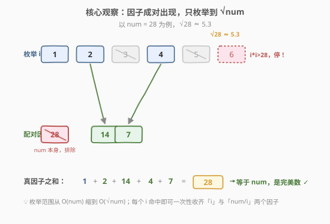
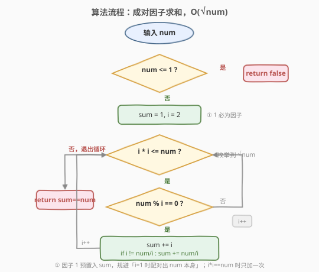
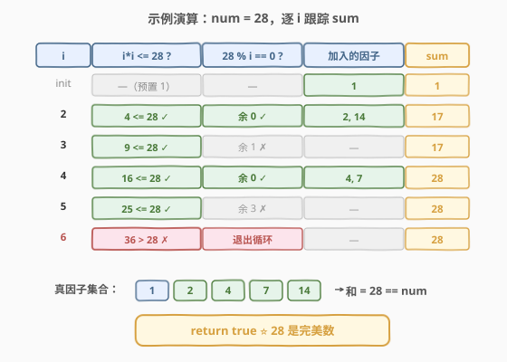

# 完美数

- **题目名称**：完美数
- **链接**：[507. 完美数](https://leetcode.cn/problems/perfect-number/)
- **难度**：简单
- **标签**：数学、数论

## 1. 题目概述

对一个 **正整数** `num`，若它**等于其所有真因子（除了自身以外的正因子）之和**，则称其为**完美数**（perfect number）。给定整数 `num`，判断它是否为完美数。

**示例 1**：

```text
输入：num = 28
输出：true
解释：28 = 1 + 2 + 4 + 7 + 14，真因子之和恰为 28。
```

**示例 2**：

```text
输入：num = 7
输出：false
解释：7 的真因子只有 1，1 ≠ 7。
```

**示例 3**：

```text
输入：num = 6
输出：true
解释：6 = 1 + 2 + 3，是最小的完美数。
```

**约束条件**：

- $1 \le \text{num} \le 10^8$

> 💡 **进阶**：朴素枚举到 `num` 的 $O(\text{num})$ 算法在 $10^8$ 规模下约 $10^8$ 次取模，必然超时；需优化到 $O(\sqrt{\text{num}})$。

---

## 2. 解题思路

### 2.1 暴力思路：枚举到 num/2

最直观的做法：枚举 $i \in [1, \text{num}/2]$，凡 `num % i == 0` 即为真因子，累加后与 `num` 比较（真因子不可能超过 `num/2`，因为最大的真因子是 `num/2` 本身，仅当 `num` 为偶数时取到）。

```text
若 num <= 1：返回 false
sum = 0
for i in 1..num/2:
    if num % i == 0: sum += i
返回 sum == num
```

时间 $O(\text{num})$。当 $\text{num} = 10^8$ 时循环 $5 \times 10^7$ 次，远超时限。问题在于：**绝大多数被枚举的 `i` 根本不是因子**——我们做的是大范围盲目扫描。换个视角：因子是**成对出现**的，只需枚举到 $\sqrt{\text{num}}$。

### 2.2 核心观察：因子成对出现，只枚举到 √num



关键直觉：**若 $i$ 整除 $\text{num}$，则配对因子 $\text{num}/i$ 也整除 $\text{num}$**。两者一“小”一“大”，且较小的那个必 $\le \sqrt{\text{num}}$（否则两个都 $> \sqrt{\text{num}}$，乘积 $> \text{num}$，矛盾）。所以：

- 枚举 $i \in [1, \lfloor\sqrt{\text{num}}\rfloor]$；
- 每命中一个 `num % i == 0`，**一次性收齐** $i$ 与 $\text{num}/i$ 两个因子；
- 枚举范围从 $O(\text{num})$ 缩到 $O(\sqrt{\text{num}})$。

以 `num = 28` 为例（$\sqrt{28} \approx 5.3$）：

- $i=1$：配对 $28/1=28$（即 `num` 本身，**排除**，只计入 $1$）；
- $i=2$：配对 $28/2=14$，计入 $2$ 与 $14$；
- $i=3$：不整除，跳过；
- $i=4$：配对 $28/4=7$，计入 $4$ 与 $7$；
- $i=5$：不整除，跳过；
- $i=6$：$6 \times 6 = 36 > 28$，停止。

真因子和 $= 1 + 2 + 14 + 4 + 7 = 28$，等于 `num`，是完美数。

> 💡 **两个边界细节**：
>
> 1. **$i=1$ 的配对是 `num` 本身**：真因子定义排除自身，故 $i=1$ 时只加 $1$，不加 $\text{num}$。最简洁的写法是**预置 `sum = 1`、循环从 $i=2$ 起**，把「$1$ 必为因子」这一事实直接初始化掉，自然规避该问题。
> 2. **完全平方数**：若 $\text{num}$ 是完全平方数（如 $\text{num}=16$，$i=4$），则 $i = \text{num}/i = \sqrt{\text{num}}$，此时**只加一次**，避免重复计入。判定条件 `i != num / i` 即可。

### 2.3 算法流程图



算法是「**两道预检关 + 一道配对循环**」：

1. **预检关**：`num <= 1` 直接返回 `false`（$1$ 没有真因子，和为 $0 \ne 1$）；
2. **初始化**：`sum = 1`（因子 $1$ 预置），`i = 2`；
3. **循环** `i * i <= num`：
   - 若 `num % i == 0`：`sum += i`；若 `i != num / i`，再 `sum += num / i`；
   - `i++`；
4. **判定**：返回 `sum == num`。

### 2.4 示例演算



跟踪 `num = 28` 的 `sum` 演变（`sum` 初值 $1$）：

| 阶段 | $i \times i \le 28$? | $28 \% i == 0$? | 加入因子 | `sum` |
|------|----------------------|------------------|----------|-------|
| init（预置 1） | — | — | $1$ | $1$ |
| $i=2$ | $4 \le 28$ ✅ | 余 $0$ ✅ | $2,\ 14$ | $17$ |
| $i=3$ | $9 \le 28$ ✅ | 余 $1$ ✗ | — | $17$ |
| $i=4$ | $16 \le 28$ ✅ | 余 $0$ ✅ | $4,\ 7$ | $28$ |
| $i=5$ | $25 \le 28$ ✅ | 余 $3$ ✗ | — | $28$ |
| $i=6$ | $36 > 28$ ✗ | 退出循环 | — | $28$ |

最终 `sum == num == 28`，返回 `true` ⭐。

> ⚠️ 注意循环条件是 `i * i <= num`（含等号），这样 $\text{num}$ 为完全平方数时 $\sqrt{\text{num}}$ 这一项也会被处理（通过 `i != num / i` 保证只加一次）。

---

## 3. 参考代码

### C++

```cpp
class Solution {
  public:
    bool checkPerfectNumber(int num) {
        if (num <= 1) return false;     // 1 没有真因子
        int sum = 1;                     // 因子 1 预置
        for (int i = 2; i * i <= num; ++i) {
            if (num % i == 0) {
                sum += i;
                if (i != num / i) sum += num / i;  // 完全平方数只加一次
            }
        }
        return sum == num;
    }
};
```

### Python

```python
class Solution:
    def checkPerfectNumber(self, num: int) -> bool:
        if num <= 1:
            return False
        s = 1
        i = 2
        while i * i <= num:
            if num % i == 0:
                s += i
                if i != num // i:
                    s += num // i
            i += 1
        return s == num
```

> 💡 **为什么 `num <= 1` 返回 `false`？** $1$ 的正因子只有它自己，真因子集为空，和为 $0 \ne 1$；负数与 $0$ 不在完美数定义内。该特判同时规避了「`sum=1` 而循环不执行 → `sum==num==1` 误判为 `true`」的陷阱。

---

## 4. 复杂度分析

| 维度 | 复杂度 | 说明 |
|------|--------|------|
| 时间复杂度 | $O(\sqrt{\text{num}})$ | 循环至多到 $\lfloor\sqrt{\text{num}}\rfloor$，$\text{num}=10^8$ 时约 $10^4$ 次 |
| 空间复杂度 | $O(1)$ | 仅用常数个变量 `sum`、`i` |

> ⚠️ 本题数据规模 $10^8$ 下，$O(\sqrt{\text{num}}) \approx 10^4$，远低于时限；而暴力的 $O(\text{num}) \approx 10^8$ 必然超时。这正是「成对因子」优化的价值所在。

---

## 5. 扩展：欧几里得-欧拉定理与 O(1) 打表

### 5.1 偶完美数的通式

**欧几里得-欧拉定理**：每个偶完美数都形如

$$
P = 2^{p-1}(2^p - 1)
$$

其中 $p$ 与 $2^p - 1$ **同为质数**（$2^p - 1$ 称为**梅森素数**）。

- 反过来也成立：只要 $2^p - 1$ 是梅森素数，上式给出的就是偶完美数。
- **奇完美数**是否存在至今未解，是数论著名开放问题（已知若存在必 $> 10^{1500}$ 且有不少于 9 个不同质因子）。

### 5.2 范围内的完美数极少

本题 $\text{num} \le 10^8$，对应 $2^p - 1 \le 10^8 / 2^{p-1}$。逐个验证 $p$：

| $p$ | $2^p-1$ 是否梅森素数 | $2^{p-1}(2^p-1)$ | 完美数 |
|-----|----------------------|-------------------|--------|
| $2$ | $3$ ✅ | $2 \times 3 = 6$ | $6$ |
| $3$ | $7$ ✅ | $4 \times 7 = 28$ | $28$ |
| $5$ | $31$ ✅ | $16 \times 31 = 496$ | $496$ |
| $7$ | $127$ ✅ | $64 \times 127 = 8128$ | $8128$ |
| $13$ | $8191$ ✅ | $4096 \times 8191 = 33550336$ | $33550336$ |
| $17$ | $131071$ ✅ | $\approx 8.6 \times 10^9 > 10^8$ | 超出范围 |

故 $10^8$ 范围内**只有 5 个完美数**：$6,\ 28,\ 496,\ 8128,\ 33550336$。可直接打表 $O(1)$：

```cpp
class Solution {
  public:
    bool checkPerfectNumber(int num) {
        return num == 6 || num == 28 || num == 496
            || num == 8128 || num == 33550336;
    }
};
```

| 解法 | 时间 | 空间 | 适用场景 |
|------|------|------|----------|
| 成对因子枚举 | $O(\sqrt{n})$ | $O(1)$ | 通用、体现算法思想，面试首选 |
| 打表（欧几里得-欧拉） | $O(1)$ | $O(1)$ | 利用完美数极稀疏的特性，竞赛 trick |

> 💡 实战中 $O(\sqrt{n})$ 已足够快（$10^8$ 仅 $10^4$ 次），无需打表；打表解法适合作为「了解完美数背景」的延伸。面试中应主动说明 $O(\sqrt{n})$ 的思路，打表仅作 bonus 提及。

---

## 6. 面试要点

1. **为什么枚举到 $\sqrt{\text{num}}$ 就够？**

   - 因子成对：$i$ 整除 $\text{num}$ $\Rightarrow$ $\text{num}/i$ 也整除 $\text{num}$，且两者一较小一较大，较小者 $\le \sqrt{\text{num}}$。
   - 故所有真因子都能在枚举 $[1, \lfloor\sqrt{\text{num}}\rfloor]$ 时通过配对一次性收齐，时间从 $O(\text{num})$ 降到 $O(\sqrt{\text{num}})$。

2. **为什么 `sum` 初始化为 $1$，循环从 $i=2$ 起？**

   - $1$ 是任何正整数的因子，其配对 $\text{num}/1 = \text{num}$ 是 `num` 本身——而真因子定义排除自身。
   - 把 $1$ 预置入 `sum`、循环跳过 $i=1$，可干净地规避「配对出 `num` 本身」的特判，比在循环内判 `num / i != num` 更简洁。

3. **完全平方数（如 $\text{num}=16$）怎么处理？**

   - 当 $i = \sqrt{\text{num}}$ 时 $i = \text{num}/i$，该因子只应计入一次。
   - 用 `if (i != num / i) sum += num / i;` 防止重复累加。循环条件用 `i * i <= num`（含等号）确保该项被处理到。

4. **`num = 1` 为什么返回 `false`？**

   - $1$ 的正因子只有自身，真因子集为空，和为 $0 \ne 1$。
   - 若不做 `num <= 1` 特判，会因 `sum = 1` 且循环不执行而误判 `1 == 1` 为 `true`——这是最常见的边界坑。

5. **完美数有哪些？如何 $O(1)$ 解决？**

   - 由欧几里得-欧拉定理，偶完美数形如 $2^{p-1}(2^p-1)$（$p$ 与 $2^p-1$ 同为质数）。
   - $10^8$ 内仅 $6,\ 28,\ 496,\ 8128,\ 33550336$ 五个，直接判等即 $O(1)$。奇完美数是否存在仍是数论开放问题。

> 💡 **一句话总结**：因子成对出现，枚举到 $\sqrt{\text{num}}$ 即可一次性收齐所有真因子；预置 `sum=1` 规避 `num` 自身被计入、`i != num/i` 防完全平方数重复——$O(\sqrt{n})$ 一趟搞定。

---

## 7. 同类练习题

- [204. 计数质数](https://leetcode.cn/problems/count-primes/)（[站内题解](../0201-0300/204_计数质数.md)）：同为数论基础题，用筛法把朴素 $O(n\sqrt n)$ 优化到 $O(n \log \log n)$，呼应本题「枚举到 $\sqrt n$」的优化思路
- [509. 斐波那契数](https://leetcode.cn/problems/fibonacci-number/)（[站内题解](../0501-0600/509_斐波那契数.md)）：简单数学/DP 入门，与本题同为「数学直觉 + 边界处理」的 Easy 数论题
- [172. 阶乘后的零](https://leetcode.cn/problems/factorial-trailing-zeroes/)：数论题，统计因子 $5$ 的个数（勒让德公式），与本题「因子分析」同源但更进阶
- [263. 丑数](https://leetcode.cn/problems/ugly-number/)：判断单数是否只含指定质因子，试除法的直接应用，与本题「逐因子判定」思路相通
- [812. 最大三角形面积](https://leetcode.cn/problems/largest-triangle-area/)：用枚举 + 鞋带公式，同样是「枚举范围优化」的几何/数学综合应用
