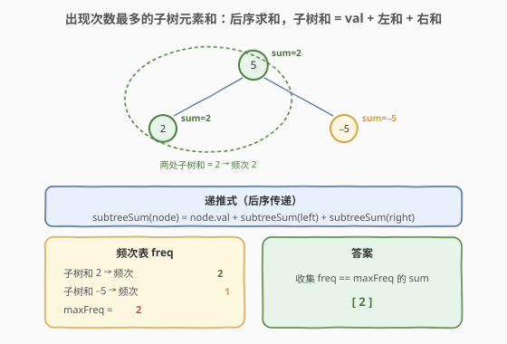
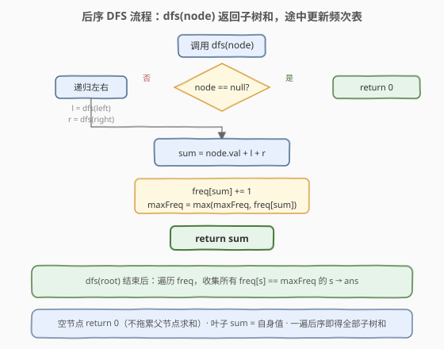

# 出现次数最多的子树元素和

- **题目名称**：出现次数最多的子树元素和
- **链接**：[508. 出现次数最多的子树元素和](https://leetcode.cn/problems/most-frequent-subtree-sum/)
- **难度**：中等
- **标签**：树、二叉树、深度优先搜索、后序遍历、哈希表

## 1. 题目概述

给你一棵二叉树的根节点 `root`，返回出现次数最多的**子树元素和**。如果多个子树和出现次数相同且并列最高，则返回**全部**这些值（顺序任意）。

> **子树元素和**：以某节点为根的子树（包含该节点本身）中**所有节点值之和**。

**示例 1**：

```text
输入：root = [5,2,-3]
输出：[2,-3,4]

    5
   / \
  2   -3
```

三棵子树的元素和分别为：叶 `2` → `2`；叶 `-3` → `-3`；根 `5` → `5+2+(-3)=4`。三者频次均为 1，并列最高，故全部返回。

**示例 2**：

```text
输入：root = [5,2,-5]
输出：[2]

    5
   / \
  2   -5
```

三棵子树的元素和分别为：叶 `2` → `2`；叶 `-5` → `-5`；根 `5` → `5+2+(-5)=2`。子树和 `2` 出现两次（左叶与根），频次最高，故返回 `[2]`。

**约束条件**：

- 树中节点数目范围 `[1, 10^4]`
- `-10^5 <= Node.val <= 10^5`

> 💡 本题是「**后序遍历 + 返回值向上传递**」家族的又一成员。子树和天然具有最优子结构：以 `node` 为根的子树和 = `node.val` + 左子树和 + 右子树和。一次后序 DFS 即可求出所有子树和，再用哈希表计数取众数即可。与 [250. 统计同值子树](../0201-0300/250_统计同值子树.md)（后序传递布尔同值性）相比，本题传递的是**数值**而非布尔，骨架完全一致。

---

## 2. 解题思路

### 2.1 暴力思路：逐节点独立求和

最直观的做法：遍历每个节点，对每个节点调用一次 `subtreeSum(node)` 重新扫描整棵子树求和。时间 $O(n^2)$（每个节点被重复求和多次），空间 $O(h)$ 递归栈。能过小数据，但**完全没有利用「子树和可由子问题组合」的性质**——父节点的子树和就等于左右子树和加上自身值，无需重复扫描。

### 2.2 核心观察：后序传递 + 哈希计数



**关键洞察**：子树和具有**最优子结构**——

$$
\text{subtreeSum}(node) = node.val + \text{subtreeSum}(node.left) + \text{subtreeSum}(node.right)
$$

这意味着只需一次**后序遍历**（先递归左、右，再处理根），`dfs(node)` 返回以 `node` 为根的子树和，在返回前把它计入频次表。空节点返回 `0`（不拖累父节点求和）。

> ⚠️ **空节点返回 0**：与 [250](../0201-0300/250_统计同值子树.md) 中空节点返回 `true`（空真为真）不同，本题空节点返回 `0`——因为求和的「幺元」是 0，`val + 0 + 0 = val` 恰好让叶子节点的子树和等于自身值。这是加法运算的单位元约定。

于是整个算法分两步：

1. **一遍后序 DFS** 求出每个节点的子树和，同时用哈希表 `freq` 统计每个和出现的次数，并维护全局最大频次 `maxFreq`；
2. **遍历 `freq`**，收集所有频次等于 `maxFreq` 的子树和，即为答案。

> 💡 **为什么可能有多解？** 不同节点的子树和可能相等（如示例 2 中根 `5` 与左叶 `2` 的子树和都是 `2`），频次累加；若最终多个和的频次并列最高，则全部返回。这正是哈希表计数后做「等值过滤」的用武之地。

### 2.3 算法流程图



**DFS 完整步骤**（函数 `dfs(node)` 返回 `int`）：

1. **空节点**：返回 `0`（加法幺元，叶子节点求和退化为自身值）；
2. **递归左右**：`l = dfs(node.left)`，`r = dfs(node.right)`；
3. **求和**：`sum = node.val + l + r`；
4. **计数**：`freq[sum] += 1`，并更新 `maxFreq = max(maxFreq, freq[sum])`；
5. **返回**：`return sum`（向上传递给父节点参与求和）。

DFS 结束后，再扫一遍 `freq`，把所有 `freq[s] == maxFreq` 的 `s` 收集进答案数组。

### 2.4 示例演算

以 `root = [5,2,-5]`（示例 2）为例，后序遍历顺序与计数过程：

![示例演算：[5,2,-5] 后序逐节点求和与计数](../images/mfss_walkthrough.svg)

| 后序访问节点 | 求和计算 | 子树和 | freq 更新 | maxFreq |
|-------------|----------|--------|-----------|---------|
| ① 叶 `2` | `2 + 0 + 0` | 2 | `{2:1}` | 1 |
| ② 叶 `-5` | `-5 + 0 + 0` | -5 | `{2:1, -5:1}` | 1 |
| ③ 根 `5` | `5 + 2 + (-5)` | 2 | `{2:2, -5:1}` | 2 |

最终 `maxFreq = 2`，收集 `freq == 2` 的子树和 → `[2]` ✓。

> 💡 **观察频次累加**：③ 根节点的子树和 `5+2+(-5)=2` 恰好等于 ① 左叶的子树和 `2`，二者频次累加使 `2` 的频次升到 2，成为唯一众数。这正说明「不同节点的子树和可能相同」——哈希表计数是本题的核心数据结构。

---

## 3. 参考代码

### C++

```cpp
class Solution {
    unordered_map<int, int> freq;
    int maxFreq = 0;
  public:
    vector<int> findFrequentTreeSum(TreeNode* root) {
        dfs(root);
        vector<int> ans;
        for (auto& [s, f] : freq) {
            if (f == maxFreq) ans.push_back(s);
        }
        return ans;
    }
  private:
    int dfs(TreeNode* node) {
        if (!node) return 0;                 // 空节点：加法幺元
        int sum = node->val + dfs(node->left) + dfs(node->right);
        int f = ++freq[sum];                 // 计数
        maxFreq = max(maxFreq, f);           // 维护最大频次
        return sum;                          // 向上传递子树和
    }
};
```

### Python

```python
class Solution:
    def findFrequentTreeSum(self, root: Optional[TreeNode]) -> List[int]:
        from collections import defaultdict
        freq = defaultdict(int)
        max_freq = 0

        def dfs(node: Optional[TreeNode]) -> int:
            nonlocal max_freq
            if node is None:
                return 0                     # 空节点：加法幺元
            total = node.val + dfs(node.left) + dfs(node.right)
            freq[total] += 1                 # 计数
            if freq[total] > max_freq:
                max_freq = freq[total]       # 维护最大频次
            return total                     # 向上传递子树和

        dfs(root)
        return [s for s, f in freq.items() if f == max_freq]
```

> 💡 两版等价。`dfs` 同时承担「求子树和」与「更新频次表」两职——返回值是子树和（向上参与父节点求和），副作用是更新 `freq` 与 `maxFreq`。这种「数值返回 + 副作用计数」是树形统计题的通用模板，与 [250](../0201-0300/250_统计同值子树.md) 的「布尔返回 + 副作用计数」如出一辙，只是返回类型从 `bool` 换成了 `int`。

---

## 4. 复杂度分析

| 维度 | 复杂度 | 说明 |
|------|--------|------|
| 时间复杂度 | $O(n)$ | 每个节点只访问一次，每次做 $O(1)$ 求和与哈希更新；最后扫一遍 `freq` 收集答案，最多 $n$ 个不同和 |
| 空间复杂度 | $O(n)$ | 哈希表 `freq` 最坏存 $n$ 个不同子树和；递归栈 $O(h)$，平衡树 $O(\log n)$，退化链状 $O(n)$ |
| 最坏情况 | $O(n)$ 空间 | 树退化为单侧链时递归深度达 $n$，且每个节点子树和互不相同 → `freq` 也有 $n$ 项 |

> ⚠️ 暴力法 $O(n^2)$ 的浪费在于：求某节点子树和时已扫描过其子树，但父节点又重新扫描一遍。后序传递法把「子树和」压缩成一个 `int` 向上传递，父节点直接 `val + l + r` 即可，避免了重复扫描——这本质上是**记忆化思想**在树形结构上的体现，与 [250](../0201-0300/250_统计同值子树.md)、[543. 二叉树的直径](./543_二叉树的直径.md) 同源。

---

## 5. 扩展：两遍遍历 vs 一遍统计

上面的写法在 DFS 中**实时维护** `maxFreq`，DFS 结束后再扫一遍 `freq` 收集答案——这是两遍遍历（一遍 DFS + 一遍哈希扫描）。还有一种等价写法：DFS 只负责填 `freq`，结束后再单独求 `maxFreq` 并收集：

```python
def findFrequentTreeSum(self, root: Optional[TreeNode]) -> List[int]:
    from collections import defaultdict
    freq = defaultdict(int)

    def dfs(node: Optional[TreeNode]) -> int:
        if node is None:
            return 0
        total = node.val + dfs(node.left) + dfs(node.right)
        freq[total] += 1
        return total

    dfs(root)
    max_freq = max(freq.values()) if freq else 0
    return [s for s, f in freq.items() if f == max_freq]
```

> 💡 两种写法时间复杂度相同（都是 $O(n)$）。实时维护 `maxFreq` 的版本在每次计数时做一次 `max` 比较（$O(1)$），省去了最后再扫一遍 `freq` 求 `max` 的开销；但代码可读性上，「先填表再求众数」的写法更清晰。面试中两种都可接受，实时维护版略优。

---

## 6. 面试要点

1. **为什么用后序遍历而不是前序或中序？**

   > 子树和的计算依赖子树的结果——只有先知道左右子树和，才能算出当前节点的子树和（`val + l + r`）。这是典型的「子问题结果决定父问题」结构，对应后序（左右根）。前序/中序在处理父节点时尚未获取子树和，无法在一次遍历内完成求和。

2. **空节点为什么返回 `0` 而不是别的值？**

   > 加法的幺元是 0：`val + 0 + 0 = val`，恰好让叶子节点（左右子树为空）的子树和等于自身值。若返回非 0 值会污染求和。这与 [250](../0201-0300/250_统计同值子树.md) 中空节点返回 `true`（布尔运算的幺元）同理——**返回值的选取取决于聚合运算的单位元**。

3. **暴力 $O(n^2)$ 和最优 $O(n)$ 的本质区别是什么？**

   > 暴力法对每个节点独立调用 `subtreeSum` 重新扫描子树，子树和无法复用。最优法把子树和压缩成一个 `int` 向上传递，父节点直接 `val + l + r`，无需重复扫描。这是「自底向上传递子结构结论」的通用优化范式——同样的思想见之于 [543. 二叉树的直径](./543_二叉树的直径.md)（传递子树高度）与 [124. 二叉树中的最大路径和](https://leetcode.cn/problems/binary-tree-maximum-path-sum/)（传递子树最大贡献）。

4. **如何处理多个子树和频次并列最高的情况？**

   > 题目要求并列最高时全部返回。做法是：DFS 中只维护 `maxFreq`（不急着收集答案），DFS 结束后再扫一遍 `freq`，把所有 `freq[s] == maxFreq` 的 `s` 收集进结果数组。若在 DFS 中实时收集，当 `maxFreq` 被刷新时需清空已收集的答案，逻辑更易出错——「先填表再过滤」是最稳的写法。

5. **如果题目改为「返回频次最高的子树和的频次」而非具体值，怎么改？**

   > 直接返回 `maxFreq` 即可，连收集答案的步骤都省了。进一步若改为「第 k 频繁的子树和」，则需按频次排序 `freq`（$O(n \log n)$）或用桶排序（按频次分桶，$O(n)$）——这是 [347. 前 K 个高频元素](https://leetcode.cn/problems/top-k-frequent-elements/) 的树形变体。

> 💡 **一句话总结**：508 的灵魂是「**后序遍历 + 数值返回值传递子结构结论 + 哈希表计数**」——`dfs` 返回子树和（`int`），父节点据此 `val + l + r` 组合，一次遍历 $O(n)$ 求出全部子树和并完成计数。这个「自底向上传递数值，在根处聚合」的模板是所有树形统计题的核心套路。

---

## 7. 同类练习题

- [250. 统计同值子树](https://leetcode.cn/problems/count-univalue-subtrees/)（[题解](../0201-0300/250_统计同值子树.md)）：同套后序传递骨架，把「子树和」换成「子树是否同值」（布尔返回值），对照理解返回值类型随聚合运算变化
- [543. 二叉树的直径](https://leetcode.cn/problems/diameter-of-binary-tree/)（[题解](./543_二叉树的直径.md)）：后序传递子树高度，在节点处聚合直径，同套「后序 + 返回值 + 副作用记录最值」模板
- [124. 二叉树中的最大路径和](https://leetcode.cn/problems/binary-tree-maximum-path-sum/)：后序传递子树最大贡献值，在节点处聚合路径和，把「求和」升级为「带剪枝的最大贡献」
- [501. 二叉搜索树中的众数](https://leetcode.cn/problems/find-mode-in-binary-search-tree/)：BST 中序有序 → 众数可用 $O(1)$ 空间等值段计数；与本题的「任意树 + 哈希计数」形成 $O(1)$ vs $O(n)$ 空间对照
- [437. 路径总和 III](https://leetcode.cn/problems/path-sum-iii/)：前缀和 + 哈希表在树上的应用，与本题的「哈希计数」思想在树形路径问题上的延伸
