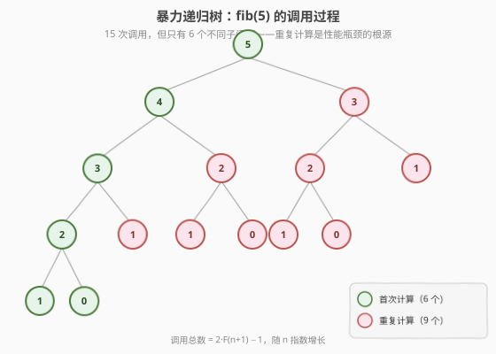
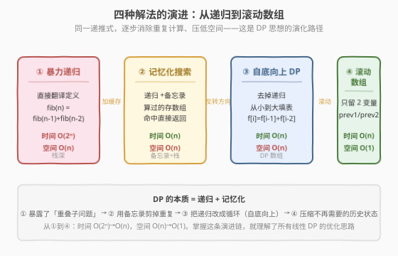
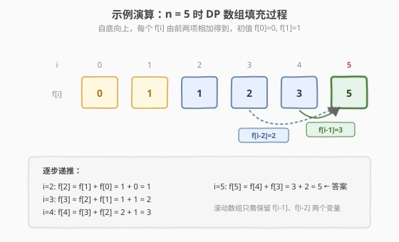

# LeetCode 斐波那契数 题解

## 1. 题目概述

- **标题 / 题号**：斐波那契数（#509，easy）
- **链接**：https://leetcode.cn/problems/fibonacci-number/
- **难度**：简单
- **标签**：动态规划、递归、记忆化搜索

**题意**：斐波那契数列（通常记作 `F(n)`）定义如下：

$$F(n) = \begin{cases} 0, & n = 0 \\ 1, & n = 1 \\ F(n-1) + F(n-2), & n > 1 \end{cases}$$

给定 `n`，计算 `F(n)`。

**示例 1**：

```text
输入：n = 2
输出：1
解释：F(2) = F(1) + F(0) = 1 + 0 = 1
```

**示例 2**：

```text
输入：n = 3
输出：2
解释：F(3) = F(2) + F(1) = 1 + 1 = 2
```

**示例 3**：

```text
输入：n = 4
输出：3
解释：F(4) = F(3) + F(2) = 2 + 1 = 3
```

**约束**：

- `0 <= n <= 30`

> 💡 这是**动态规划最经典的入门题**——它把「递归 → 记忆化 → 自底向上 DP → 滚动数组」这条完整的优化链压缩在一道题里。理解了它，你就理解了 DP 的本质：**递归 + 记忆化**。它也是 [70. 爬楼梯](../0001-0100/70_爬楼梯.md) 的同源题，区别仅在初值（斐波那契 `F(0)=0, F(1)=1`；爬楼梯 `f(1)=1, f(2)=2`），递推骨架完全相同。

## 2. 解题思路

### 2.1 暴力思路：直接翻译定义的递归

斐波那契的定义本身就是递推式，最直觉的做法是**把它逐字翻译成递归函数**：

```text
fib(5)
├── fib(4)
│   ├── fib(3)
│   │   ├── fib(2)
│   │   │   ├── fib(1) = 1
│   │   │   └── fib(0) = 0
│   │   └── fib(1) = 1
│   └── fib(2)            ← 重复！
│       ├── fib(1) = 1    ← 重复！
│       └── fib(0) = 0    ← 重复！
└── fib(3)                ← 重复！
    ├── fib(2)            ← 重复！
    └── fib(1) = 1        ← 重复！
```

完整的递归调用树如下（以 `n=5` 为例）：



调用总数随 `n` **指数增长**：`fib(n)` 的调用次数等于 $2F(n+1) - 1$。`n=30` 时约 $2.7 \times 10^6$ 次，虽然本题 `n ≤ 30` 勉强能过，但 `n=45` 就会到 $3.5 \times 10^{13}$ 次，**直接超时**。

> ⚠️ 暴力递归的问题在于**重叠子问题**：`fib(3)` 在不同分支里被反复计算（上图中红色节点全是重复）。子问题总数只有 `n+1` 个（`fib(0)` 到 `fib(n)`），却做了指数级的工作。这正是**记忆化搜索**与**动态规划**出场的契机。

### 2.2 核心观察：重叠子问题 + 记忆化

**关键定义**：设 `F(i)` = 第 `i` 个斐波那契数。

**核心思考**：递归树里同一子问题（如 `fib(3)`）被多次求解。既然子问题总数只有 `n+1` 个，**每个子问题只需算一次**，之后命中缓存直接返回即可。这就是**记忆化搜索**（top-down DP）：

```text
fib(n, memo):
    if n in memo:           // 命中缓存，O(1) 返回
        return memo[n]
    if n <= 1:
        return n            // F(0)=0, F(1)=1
    memo[n] = fib(n-1, memo) + fib(n-2, memo)   // 算完存起来
    return memo[n]
```

加了备忘录后，每个 `fib(k)` 只被**真正计算一次**，其余调用都是 `O(1)` 的缓存命中。递归树被「剪」成了线性结构，时间从 $O(2^n)$ 降到 $O(n)$。

> 💡 **DP 的本质就是递归 + 记忆化**。所谓「最优子结构」在这里体现为 `F(n)` 可由 `F(n-1)` 和 `F(n-2)` 唯一确定；「重叠子问题」体现为同一个 `F(k)` 被多个上层状态依赖。记忆化是消除重复的最直接手段。

### 2.3 从自顶向下到自底向上：DP 数组

记忆化搜索是「自顶向下」——从 `F(n)` 出发递归到 `F(0)`/`F(1)`，回溯时填表。既然填表顺序确定，**何不直接反过来**，从 `F(0)` 往上算？这就是**自底向上 DP**，去掉了递归栈：



**四步法**（所有 DP 题通用）：

1. **状态定义**：`F(i)` = 第 `i` 个斐波那契数
2. **转移方程**：$F(i) = F(i-1) + F(i-2)$，$i > 1$
3. **初始条件**：$F(0) = 0$，$F(1) = 1$
4. **计算顺序**：从 `i=2` 到 `i=n`，**自底向上**

> 💡 **自顶向下 vs 自底向上**：记忆化搜索（top-down）更贴近自然思维、只算需要的子问题，但有递归栈开销；自底向上（bottom-up）用循环避免栈开销、常数因子更小，但可能算了一些用不到的状态。本题所有子问题都需要，两者等价；面试中**自底向上更常用**，因为它更简洁、无栈溢出风险。

### 2.4 滚动数组优化 + 示例演算

`F(i)` 只依赖 `F(i-1)` 和 `F(i-2)`，更早的状态（`F(i-3)` 及以前）**不再被引用**——不需要存整个数组，用两个变量滚动即可。

以 `n=5` 为例，看 `F` 数组如何从初值递推到答案：



| i | F(i-2) | F(i-1) | F(i) = F(i-1) + F(i-2) | 说明 |
|---|--------|--------|------------------------|------|
| 0 | — | — | 0 | 初值 |
| 1 | — | — | 1 | 初值 |
| 2 | F(0)=0 | F(1)=1 | 0+1=**1** | 两项相加 |
| 3 | F(1)=1 | F(2)=1 | 1+1=**2** | 两项相加 |
| 4 | F(2)=1 | F(3)=2 | 1+2=**3** | 两项相加 |
| 5 | F(3)=2 | F(4)=3 | 2+3=**5** | 答案 |

最终 `F(5) = 5`。滚动数组只需 `prev1`（存 `F(i-1)`）和 `prev2`（存 `F(i-2)`）两个变量。

> 💡 注意初值与 [70. 爬楼梯](../0001-0100/70_爬楼梯.md) 不同：斐波那契从 `F(0)=0` 起步（数列 `0,1,1,2,3,5,8…`），爬楼梯从 `f(1)=1` 起步（方法数 `1,2,3,5,8…`）。骨架相同，初值不同——面试时说清自己的定义即可。

## 3. 参考代码

### C++

```cpp
// 斐波那契数.cpp —— 四种解法对比
// 编译: g++ -O2 -std=c++17 斐波那契数.cpp -o fib
#include <vector>
#include <cstring>
using namespace std;

// 版本 1：暴力递归（O(2^n)，仅作对照，n=30 时约 270 万次调用）
class Solution1 {
  public:
    int fib(int n) {
        if (n <= 1) return n;
        return fib(n - 1) + fib(n - 2);
    }
};

// 版本 2：记忆化搜索 / 自顶向下 DP（O(n) 时间，O(n) 空间）
class Solution2 {
  public:
    int fib(int n) {
        vector<int> memo(n + 1, -1);
        return dfs(n, memo);
    }
  private:
    int dfs(int n, vector<int>& memo) {
        if (n <= 1) return n;
        if (memo[n] != -1) return memo[n];        // 命中缓存
        return memo[n] = dfs(n - 1, memo) + dfs(n - 2, memo);
    }
};

// 版本 3：自底向上 DP 数组（O(n) 时间，O(n) 空间）
class Solution3 {
  public:
    int fib(int n) {
        if (n <= 1) return n;
        vector<int> f(n + 1);
        f[0] = 0;
        f[1] = 1;
        for (int i = 2; i <= n; ++i)
            f[i] = f[i - 1] + f[i - 2];
        return f[n];
    }
};

// 版本 4：滚动数组（O(n) 时间，O(1) 空间，推荐）
class Solution {
  public:
    int fib(int n) {
        if (n <= 1) return n;
        int prev2 = 0;  // F(0)
        int prev1 = 1;  // F(1)
        for (int i = 2; i <= n; ++i) {
            int cur = prev1 + prev2;  // F(i) = F(i-1) + F(i-2)
            prev2 = prev1;            // 滚动：F(i-2) <- F(i-1)
            prev1 = cur;              // 滚动：F(i-1) <- F(i)
        }
        return prev1;
    }
};
```

### Python

```python
class Solution:
    def fib(self, n: int) -> int:
        if n <= 1:
            return n
        prev2, prev1 = 0, 1          # F(0), F(1)
        for i in range(2, n + 1):
            prev2, prev1 = prev1, prev1 + prev2   # 滚动
        return prev1
```

记忆化搜索版本（Python 的 `functools.cache` 一行搞定）：

```python
from functools import cache

class Solution:
    def fib(self, n: int) -> int:
        @cache
        def dfs(k: int) -> int:
            return k if k <= 1 else dfs(k - 1) + dfs(k - 2)
        return dfs(n)
```

> 💡 Python 的 `a, b = b, a + b` 是**同时赋值**，无需临时变量——滚动数组的最简写法，与 [70. 爬楼梯](../0001-0100/70_爬楼梯.md) 完全一致。

## 4. 复杂度分析

| 维度 | 暴力递归 | 记忆化搜索 | 自底向上 DP | 滚动数组 |
|------|----------|------------|-------------|----------|
| **时间复杂度** | `O(2ⁿ)` | `O(n)` | `O(n)` | `O(n)` |
| **空间复杂度** | `O(n)`（递归栈） | `O(n)`（备忘录+栈） | `O(n)`（DP 数组） | `O(1)` |
| **说明** | 重复计算子问题 | 缓存命中剪枝 | 循环填表无栈开销 | 只保留 2 变量 |
| **最优时间** | — | — | — | `O(log n)`（矩阵快速幂，见扩展） |

> 💡 本题 `n ≤ 30`，四种解法都能过；面试中推荐**滚动数组**版（版本 4），代码最短、空间最优。

## 5. 扩展：通项公式与矩阵快速幂

### 5.1 通项公式（Binet 公式）

斐波那契数列有闭式解（$\varphi = \frac{1+\sqrt{5}}{2}$ 为黄金比）：

$$F(n) = \frac{\varphi^n - (1-\varphi)^n}{\sqrt{5}} = \frac{1}{\sqrt{5}}\left[\left(\frac{1+\sqrt{5}}{2}\right)^n - \left(\frac{1-\sqrt{5}}{2}\right)^n\right]$$

理论 `O(1)`，但浮点精度在 `n > 70` 时失效，面试不常用。

### 5.2 矩阵快速幂：`O(log n)` 解法

递推 $F(i) = F(i-1) + F(i-2)$ 可写成矩阵形式：

$$\begin{pmatrix} F(i) \\ F(i-1) \end{pmatrix} = \begin{pmatrix} 1 & 1 \\ 1 & 0 \end{pmatrix} \begin{pmatrix} F(i-1) \\ F(i-2) \end{pmatrix}$$

迭代展开得 $\begin{pmatrix} F(n) \\ F(n-1) \end{pmatrix} = \begin{pmatrix} 1 & 1 \\ 1 & 0 \end{pmatrix}^{n-1} \begin{pmatrix} F(1) \\ F(0) \end{pmatrix}$，矩阵幂用**快速幂**可在 `O(log n)` 内算出。`n=30` 时收益不明显，但当题目把 `n` 放大到 $10^9$ 并要求对某质数取模时（如剑指 Offer 10 的模 $10^9+7$ 变体、[50. Pow(x, n)](../0001-0100/50_Powx_n.md) 的快速幂模板），这是唯一可行解法。

### 5.3 与爬楼梯的对比

| 维度 | 斐波那契数（509） | 爬楼梯（70） |
|------|-------------------|-------------|
| 递推式 | $F(i) = F(i-1) + F(i-2)$ | $f(i) = f(i-1) + f(i-2)$ |
| 初值 | $F(0)=0,\ F(1)=1$ | $f(1)=1,\ f(2)=2$ |
| 数列 | `0, 1, 1, 2, 3, 5, 8, 13…` | `1, 2, 3, 5, 8, 13…` |
| 起点 | 从 `F(0)=0` 开始 | 从第 1 阶开始 |
| `n` 上限 | 30 | 45 |
| 本质 | 同一个递推骨架，仅初值不同 | 同左 |

> 💡 二者数列错位一格：爬楼梯的 `f(n)` 恰好等于斐波那契的 `F(n+1)`。骨架完全相同，掌握一个就掌握两个。

## 6. 面试要点

1. **为什么这题是「DP 入门」的标杆？**

   - 它同时满足 DP 的两个前提：**最优子结构**（`F(n)` 由 `F(n-1)`、`F(n-2)` 唯一确定）和**重叠子问题**（暴力递归中 `F(3)`、`F(2)` 等被反复计算）。
   - 它把「递归 → 记忆化 → 自底向上 → 滚动数组」的完整优化链压缩在一道题里，是最小、最清晰的 DP 教学样本。

2. **记忆化搜索和自底向上 DP 有什么区别？**

   - **方向**：记忆化是自顶向下（从 `F(n)` 递归到 base case，回溯时填表）；自底向上是反过来的循环填表。
   - **开销**：记忆化有递归栈（深度 `n`，可能栈溢出）；自底向上是循环，常数更小。
   - **子问题覆盖**：记忆化只算「真正被依赖」的子问题；自底向上可能多算。本题所有子问题都被依赖，两者等价。
   - 面试中通常写自底向上，但若状态依赖关系复杂、稀疏，记忆化更直观。

3. **为什么滚动数组能省到** `O(1)` **空间？**

   - `F(i)` 只依赖 `F(i-1)` 和 `F(i-2)`，更早的状态（`F(i-3)` 及以前）不再被任何后续状态引用——这是**无后效性**的直接体现。
   - 用 `prev1`/`prev2` 两个变量滚动即可。推广：若状态依赖前 `k` 项，滚动数组需 `k` 个变量。

4. `n=30` **时结果会溢出吗？**

   - `F(30) = 832040`，远小于 `int` 上限（约 $2.1 \times 10^9$），C++ `int` 安全。
   - 但 `F(46) ≈ 1.8 \times 10^9` 仍勉强安全，`F(47)` 就溢出了。若题目放宽 `n`（如剑指 Offer 10 的取模变体），结果要用 `long long` 或对 $10^9+7$ 取模。

5. **如果把递推改成** `F(i) = F(i-1) + F(i-2) + F(i-3)`**怎么处理？**

   - 这是**三阶递推**（Tribonacci 数列，见 [1137. 第 N 个泰波那契数](https://leetcode.cn/problems/n-th-tribonacci-number/)）。
   - 滚动数组需 3 个变量；时间仍 `O(n)`，空间仍 `O(1)`。
   - 进一步推广：`F(i) = \sum_{j=1}^{k} F(i-j)` 可用前缀和优化，避免内层求和把时间拉到 `O(nk)`。

> 💡 **一句话总结**：斐波那契数是 DP 的「第零题」——它用最小的体量展示了 DP 的完整演化链（递归 → 记忆化 → 自底向上 → 滚动数组），并揭示了 DP 的本质是「递归 + 记忆化」。掌握这条链，所有线性 DP（爬楼梯、打家劫舍、解码方法、最小花费爬楼梯）的优化思路都能秒迁移。

## 同类练习题

| # | 题目 | 与本题的关联 |
|---|------|-------------|
| 70 | [爬楼梯](https://leetcode.cn/problems/climbing-stairs/) | 同源递推骨架，初值不同（计数 vs 数列） |
| 1137 | [第 N 个泰波那契数](https://leetcode.cn/problems/n-th-tribonacci-number/) | 三阶递推，滚动数组扩展为 3 变量 |
| 746 | [使用最小花费爬楼梯](https://leetcode.cn/problems/min-cost-climbing-stairs/) | 把加法改成 `min` + 花付，计数 → 最优化 |
| 198 | [打家劫舍](https://leetcode.cn/problems/house-robber/) | 把加法改成 `max`，是「选/不选」类线性 DP 的入门 |
| 50 | [Pow(x, n)](https://leetcode.cn/problems/powx-n/) | 快速幂模板，是矩阵快速幂求 `O(log n)` 斐波那契的基础 |
