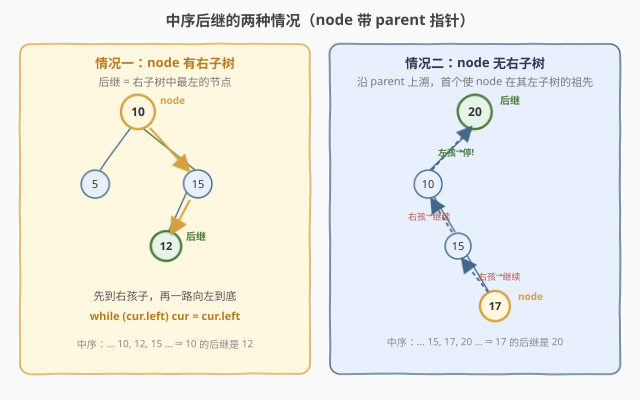
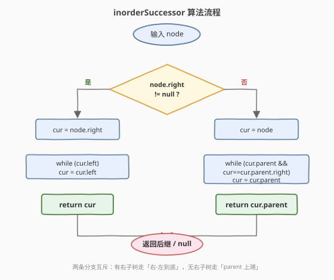
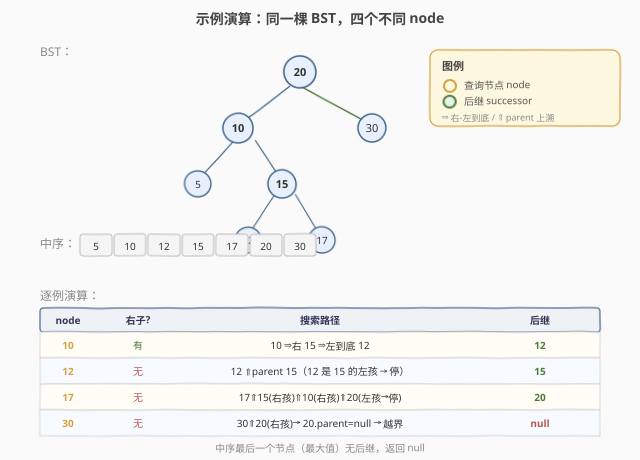

# 二叉搜索树中的中序后继 II

- **题目名称**：二叉搜索树中的中序后继 II
- **链接**：[510. 二叉搜索树中的中序后继 II](https://leetcode.cn/problems/inorder-successor-in-bst-ii/)
- **难度**：中等
- **标签**：树、BST、中序遍历、父指针

## 1. 题目概述

给定一棵**二叉搜索树（BST）**中的某个节点 `node`（**不是根节点**），每个节点除了 `val`、`left`、`right` 之外还额外持有 **`parent` 指针**指向其父节点。请找出 `node` 在 BST 中的**中序后继**——即中序遍历序列中紧跟在 `node` 之后的那个节点（值大于 `node.val` 的最小节点）。若 `node` 已是中序最后一个节点，返回 `null`。

节点定义（C++）：

```cpp
class Node {
public:
    int val;
    Node* left;
    Node* right;
    Node* parent;
};
```

**示例 1**：

```text
输入：tree = [2,1,3], node = 1
输出：2
解释：中序为 1 → 2 → 3，1 的中序后继是 2。
```

**示例 2**：

```text
输入：tree = [5,3,6,2,4,null,null,1], node = 6
输出：null
解释：6 是中序的最后一个节点（也是 BST 的最大值），没有后继。
```

**约束条件**：

- 树中节点数在 `[1, 10^4]` 范围内
- `-10^5 <= Node.val <= 10^5`
- 树中所有值**互不相同**
- 给定的 `node` 一定在树中
- `root` 保证是一棵合法的 BST

> 💡 **与 285 的区别**：[285. 二叉搜索树中的中序后继](https://leetcode.cn/problems/inorder-successor-in-bst/) 给的是**根节点**，要靠从根二分下降定位；本题给的是**目标节点本身**且带 `parent` 指针，可以**就地**判断后继，无需从根出发，更高效。

---

## 2. 解题思路

### 2.1 暴力思路：从根做一次中序

若能拿到根节点，可以从中序遍历序列里找到 `node` 的下一个。但中序遍历需 `O(n)` 时间、`O(H)` 空间，且要存整条序列或额外标志位——完全没用上「给的是 `node` 本身」和「`parent` 指针」这两个关键信息。

更聪明的暴力：从根二分下降找大于 `node.val` 的最小节点（285 的解法），时间 `O(H)`、空间 `O(1)`。但仍要求**先拿到 root**，而本题只给 `node`——需要先沿 `parent` 爬到根再二分下降，两趟 `O(H)`。能做，但不够直接。

### 2.2 核心观察：分两种情况就地求解



利用 BST 中序「左→根→右」的规律，**中序后继就是「下一个被访问的节点」**。从 `node` 的视角看，下一个被访问谁，取决于 `node` 在中序里的位置，而这又由 `node` 有没有右子树决定——分两种情况：

**情况一：`node` 有右子树。**

中序是「左→根→右」。`node` 访问完后，紧接着要访问的是它的**右子树**。而右子树的中序第一个节点，就是右子树中**最靠左**的那个节点（一路 `left` 走到底，包括右子树根本身没有左孩子时就是根）。

$$
\text{后继} = \text{node.right 的最左节点}, \quad \text{即一路 } cur = cur.\text{left} \text{ 直到无左孩子}
$$

**情况二：`node` 没有右子树。**

`node` 在中序里是某棵子树的「根」或「左孩子」访问链的终点，它的后继只能在**祖先**中找——因为 `node` 没有右子树，中序不会再回到它的下方。

关键洞察：**中序后继 = 第一个把 `node` 放在它左子树里的祖先**。换一种等价说法：沿 `parent` 指针向上走，只要 `node` 是其父亲的**右孩子**，就说明「`node` 这一支整棵都被访问完了」（因为中序先左后根后右，右孩子访问完意味着父亲也访问过了），必须继续上溯；一旦 `node` 是其父亲的**左孩子**，说明父亲还没被访问——**这个父亲就是后继**。

$$
\text{后继} = \text{沿 parent 上溯，首个使 node 位于其左子树的祖先}
$$

> 💡 **一句话记忆**：有右子树 → 「右一下、左到底」；无右子树 → 「沿 parent 爬，直到我是左孩子，我爹就是后继」。

### 2.3 算法流程图



两条分支互斥：`node.right` 是否非空决定走哪条，各自一个 `while` 循环即可定位后继。

### 2.4 示例演算



以一棵 `20 / 10,30 / 5,15 / 12,17` 的 BST 为例（中序 `5,10,12,15,17,20,30`），考察四个不同 `node`：

| node | 右子? | 搜索路径 | 后继 | 走的分支 |
|------|-------|----------|------|----------|
| 10   | 有    | 10 ⇒右 15 ⇒左到底 12       | 12   | 情况一 |
| 12   | 无    | 12 ⇑ 15（12 是 15 的左孩 → 停）| 15   | 情况二 |
| 17   | 无    | 17⇑15(右孩)⇑10(右孩)⇑20(左孩→停)| 20 | 情况二 |
| 30   | 无    | 30⇑20(右孩)→ 20.parent=null → 越界 | null | 情况二 |

> ⚠️ **特殊情况**：`node` 是中序最后一个节点（即 BST 最大值，必在右下角且无右子树）时，沿 `parent` 上溯会一路都是「右孩子」直到根仍不停，最终 `cur.parent == null`，返回 `null`——这正是「无后继」的判定。

---

## 3. 参考代码

### C++

```cpp
class Solution {
public:
    Node* inorderSuccessor(Node* node) {
        if (node->right) {
            // 情况一：有右子树 → 右子树最左节点
            Node* cur = node->right;
            while (cur->left) cur = cur->left;
            return cur;
        }
        // 情况二：无右子树 → 沿 parent 上溯，直到成为某祖先的左孩子
        Node* cur = node;
        while (cur->parent && cur == cur->parent->right) cur = cur->parent;
        return cur->parent;
    }
};
```

### Python

```python
class Solution:
    def inorderSuccessor(self, node: 'Node') -> 'Node':
        if node.right:
            # 情况一：有右子树 → 右子树最左节点
            cur = node.right
            while cur.left:
                cur = cur.left
            return cur
        # 情况二：无右子树 → 沿 parent 上溯，直到成为某祖先的左孩子
        cur = node
        while cur.parent and cur is cur.parent.right:
            cur = cur.parent
        return cur.parent
```

> ⚠️ **易错点**：情况二的循环条件是 `cur == cur.parent->right`（**右孩子**才继续上爬），不是左孩子。直觉上容易记反——记住「右孩子意味着这支访问完了，得继续找爹；左孩子意味着爹还没访问，爹就是后继」。

---

## 4. 复杂度分析

| 维度 | 复杂度 | 说明 |
|------|--------|------|
| 时间复杂度 | `O(H)` | 两条分支都是沿一条树路径线性走，最长 `H` 步；`H` 为树高，平衡时 `O(log n)`，链状退化为 `O(n)` |
| 空间复杂度 | `O(1)` | 只用常数个指针 `cur`，无递归栈、无额外容器 |

> 💡 本题**不需要从根出发**，给定 `node` + `parent` 指针后全程就地移动，时间和空间都极优。对比 [285](https://leetcode.cn/problems/inorder-successor-in-bst/) 从根二分下降也是 `O(H)` 时间 `O(1)` 空间，但 285 没有 `parent` 指针只能靠 root；本题的 `parent` 指针让我们**不需要 root 也能 `O(H)` 定位**。

---

## 5. 扩展：与 285 的对照及「前驱」对称版

### 5.1 与 285 的对照

[285. 二叉搜索树中的中序后继](https://leetcode.cn/problems/inorder-successor-in-bst/) 给根 + 目标值 `p`，**没有 `parent` 指针**。解法是**从根二分下降**维护候选后继：

- 若 `p.val < root.val`，则 `root` 可能是后继，记下候选，转入左子树继续找更小的后继；
- 若 `p.val >= root.val`，转入右子树。

两题时间都是 `O(H)`、空间 `O(1)`，但**信息源不同**：285 靠「root + 二分」从上往下定位，510 靠「node + parent」从下往上/往右就地定位。面试中若被追问「没有 parent 指针怎么办」，就切到 285 的从根二分下降版。

### 5.2 中序前驱（对称问题）

把后继的逻辑**左右镜像**即得**中序前驱**（中序序列中 `node` 的前一个节点）：

- 若 `node` 有左子树 → 前驱 = 左子树**最右**节点（一路 `cur = cur.right` 到底）；
- 若 `node` 无左子树 → 沿 `parent` 上溯，直到成为某祖先的**右孩子**，该祖先即前驱。

```cpp
Node* inorderPredecessor(Node* node) {
    if (node->left) {
        Node* cur = node->left;
        while (cur->right) cur = cur->right;
        return cur;
    }
    Node* cur = node;
    while (cur->parent && cur == cur->parent->left) cur = cur->parent;
    return cur->parent;
}
```

> 💡 后继看「右子树 / 左孩子」，前驱看「左子树 / 右孩子」——把 `right↔left` 互换即可，记忆负担为零。

---

## 6. 面试要点

1. **为什么「有右子树」时后继在右子树最左，而不是右孩子本身？**

   - 中序是「左→根→右」。访问 `node`（作为根）后进入右子树，而右子树的中序第一个节点是其**最左**节点（一路向左到底）。若右子树根无左孩子，最左就是右子树根本身——此时后继确实是右孩子，是「最左」的特例。所以统一写「右子树最左」即覆盖所有情况。

2. **为什么「无右子树」时后继是「首个使 node 在左子树的祖先」？**

   - `node` 无右子树 ⇒ `node` 在中序里访问完后不会再回到它的子树。沿 `parent` 上爬：若 `node` 是父亲的**右孩子**，按「左→根→右」父亲在 `node` 之前已访问，得继续爬；若 `node` 是父亲的**左孩子**，父亲尚未访问，**父亲就是 `node` 之后第一个被访问的节点**——即后继。

3. **`node` 是最大值时返回 `null` 的逻辑体现在哪？**

   - 最大值必在右下角且无右子树（否则还有更大的），走情况二的循环：一路都是「右孩子」直到根，`cur` 爬到根后 `cur->parent == null`，循环终止，返回 `null`。无需特判。

4. **本题与 285、173 的关系？**

   - 三者都是「BST + 中序定位」家族：510 给 `node`+`parent`，**就地** `O(H)` 找后继；285 给 `root` 无 `parent`，**从根二分下降** `O(H)` 找后继；[173. BST 迭代器](https://leetcode.cn/problems/binary-search-tree-iterator/) 把整棵树封装成「按中序逐个吐出」的迭代器，本质是**延迟版中序遍历**。掌握中序这一个模板，整类 BST 定位题都能拿下。

5. **进阶：若频繁查询任意节点的后继，如何预处理？**

   - 两种思路：(a) 一次中序遍历建立 `节点 → 后继` 的哈希表，查询 `O(1)`、空间 `O(n)`，适合查询密集；(b) 给每个节点维护 `size`/`subtreeMin`/`subtreeMax` 并保持平衡（AVL/红黑），查询时按子树元数据二分定位 `O(log n)`，适合动态修改场景。

---

## 7. 同类练习题

- [285. 二叉搜索树中的中序后继](https://leetcode.cn/problems/inorder-successor-in-bst/)：无 `parent` 指针版，从根二分下降维护候选后继，与本题互为对照
- [173. 二叉搜索树迭代器](https://leetcode.cn/problems/binary-search-tree-iterator/)：把中序遍历封装成「延迟吐出」的迭代器，本质是「全局版」的中序后继
- [230. 二叉搜索树中第 K 小的元素](https://leetcode.cn/problems/kth-smallest-element-in-a-bst/)：中序升序找第 k 个，与本题同根于「BST 中序有序」
- [94. 二叉树的中序遍历](https://leetcode.cn/problems/binary-tree-inorder-traversal/)：中序遍历的递归 / 迭代 / Morris 三种写法，理解后继概念的基础
- [98. 验证二叉搜索树](https://leetcode.cn/problems/validate-binary-search-tree/)：用中序单调性验证 BST，同一性质的不同应用
