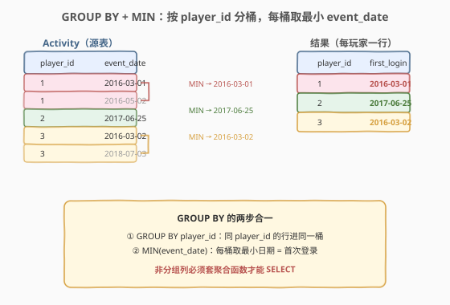
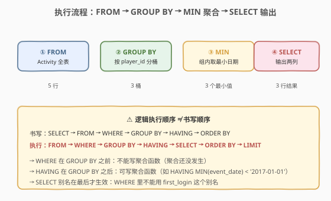
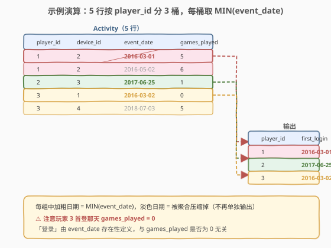

# LeetCode 游戏玩法分析 I 题解

## 1. 题目概述

- **标题 / 题号**：游戏玩法分析 I（#511，easy）
- **链接**：https://leetcode.cn/problems/game-play-analysis-i/
- **难度**：简单
- **标签**：SQL、聚合、GROUP BY、MIN

**题意**：给定 `Activity` 表，每行记录一名玩家在某个日期使用某台设备登录并玩过若干局游戏。编写 SQL 查询，报告**每个玩家的首次登录日期**。

**表结构**：

```text
Table: Activity
+--------------+---------+
| Column Name  | Type    |
+--------------+---------+
| player_id    | int     |  ← 主键之一
| device_id    | int     |
| event_date   | date    |  ← 主键之一
| games_played | int     |
+--------------+---------+
```

> 💡 **关键约束**：`(player_id, event_date)` 是复合主键——同一个玩家在同一天不会有两条记录，但**一个玩家可以跨越多个日期登录**（即一个 `player_id` 对应多行）。题目要的就是「每个玩家的所有行里 `event_date` 最小的那一行」。

**示例 1**：

```text
输入：
Activity 表:
+-----------+-----------+------------+--------------+
| player_id | device_id | event_date | games_played |
+-----------+-----------+------------+--------------+
| 1         | 2         | 2016-03-01 | 5            |
| 1         | 2         | 2016-05-02 | 6            |
| 2         | 3         | 2017-06-25 | 1            |
| 3         | 1         | 2016-03-02 | 0            |
| 3         | 4         | 2018-07-03 | 5            |
+-----------+-----------+------------+--------------+

输出：
+-----------+-------------+
| player_id | first_login |
+-----------+-------------+
| 1         | 2016-03-01  |
| 2         | 2017-06-25  |
| 3         | 2016-03-02  |
+-----------+-------------+
```

**解释**：

- 玩家 1 有两行（2016-03-01、2016-05-02），最早是 `2016-03-01`
- 玩家 2 只有一行，首次登录即 `2017-06-25`
- 玩家 3 有两行（2016-03-02、2018-07-03），最早是 `2016-03-02`

**约束**：

- `Activity` 表的复合主键为 `(player_id, event_date)`
- 每行 `games_played` 可能为 0（玩家登录了但没玩）
- 结果可按任意顺序返回

> 💡 本题是 SQL **分组聚合**的最小母题——它把「按某列分组，对每组取最值」这一最核心的 SQL 范式压缩在一行查询里。掌握了 `GROUP BY` + `MIN`，所有「每组第一个/最大/最小」类问题都能套用。它是 [262. 行程和用户](../0201-0300/262_行程和用户.md) 这类复杂聚合题的基础。

## 2. 解题思路

### 2.1 暴力思路：过程式逐玩家扫描

最直觉的做法是用过程式语言逐个 `player_id` 处理：取出该玩家所有行，遍历找出最小的 `event_date`，写回结果。伪代码如下：

```text
for each player_id in DISTINCT(player_id):
    min_date = MAX
    for each row where row.player_id == player_id:
        min_date = min(min_date, row.event_date)
    emit (player_id, min_date)
```

但**纯 SQL 没有显式循环语句**——SQL 的思维是「集合操作」。上述「分组 + 组内求最值」的模式，在 SQL 里有一个一一对应的语法：**`GROUP BY` + 聚合函数**。

> ⚠️ 关键转换：把「外层按玩家分桶、内层对桶内行求最小」翻译成 `GROUP BY player_id`（分桶）+ `MIN(event_date)`（组内聚合）。这是 SQL 思维方式与过程式思维方式的根本差异——**声明「要什么」而非「怎么做」**。

### 2.2 核心观察：GROUP BY + MIN 一行搞定



**两步合一**：

1. **`GROUP BY player_id`**：把 `Activity` 的所有行按 `player_id` 分组——同一个 `player_id` 的所有行进入同一桶。
2. **`MIN(event_date)`**：对每个桶内的 `event_date` 列求最小值，即该玩家的首次登录日期。

$$\text{first\_login}(p) = \min_{\substack{r \in \text{Activity} \\ r.\text{player\_id} = p}} r.\text{event\_date}$$

`SELECT` 同时输出 `player_id`（分组键，每组唯一）和 `MIN(event_date)`（聚合结果），即得答案。

> 💡 **`GROUP BY` 的语义**：它把「一组行」压缩成「一行」——分组键直接选出，非分组键**必须套聚合函数**（`MIN`/`MAX`/`COUNT`/`SUM`/`AVG`）才能出现在 `SELECT` 中。本题 `device_id` 和 `games_played` 既不在分组键里、也没聚合，所以不能输出——这是 SQL 的硬性规则（除非开了 `ONLY_FULL_GROUP_BY` 之外的宽松模式，但那是隐患）。

### 2.3 算法流程图



逻辑执行顺序（与书写顺序不同，是 SQL 初学者最易混淆的点）：

| 书写顺序 | 子句 | 执行顺序 | 作用 |
|----------|------|----------|------|
| 1 | `SELECT` | ④ 最后 | 选输出列（含聚合） |
| 2 | `FROM` | ① 最先 | 确定数据源表 |
| 3 | `WHERE` | ② | 行级过滤（分组前） |
| 4 | `GROUP BY` | ③ | 按键分桶 |
| 5 | `HAVING` | ⑤ | 组级过滤（分组后） |
| 6 | `ORDER BY` | ⑥ | 排序 |

> 💡 本题没有 `WHERE`/`HAVING`/`ORDER BY`，但记住「`FROM → WHERE → GROUP BY → SELECT`」这条顺序链至关重要——它解释了为什么 `WHERE` 里不能写聚合函数（聚合还没发生），而 `HAVING` 里可以（聚合已经完成）。

### 2.4 示例演算

以示例数据为例，观察 `GROUP BY player_id` 如何把 5 行压缩成 3 行：



| player_id | 桶内 event_date | MIN(event_date) | 选中的行 |
|-----------|-----------------|-----------------|----------|
| 1 | 2016-03-01, 2016-05-02 | **2016-03-01** | device_id=2, games_played=5 |
| 2 | 2017-06-25 | **2017-06-25** | device_id=3, games_played=1 |
| 3 | 2016-03-02, 2018-07-03 | **2016-03-02** | device_id=1, games_played=0 |

> 💡 注意玩家 3 的首次登录那天 `games_played = 0`——「登录了但没玩」也算首次登录，因为「登录」由 `event_date` 存在性定义，与 `games_played` 是否为 0 无关。第 5 节会讨论「若还要输出当天的设备/局数怎么办」。

## 3. 参考代码

### SQL（解法 A：GROUP BY + MIN，推荐）

```sql
SELECT player_id, MIN(event_date) AS first_login
FROM Activity
GROUP BY player_id;
```

> 💡 **写法要点**：
> - `GROUP BY player_id` 按玩家分桶，每个 `player_id` 一组。
> - `MIN(event_date)` 对每组取最小日期，别名 `first_login` 与题目输出列名一致。
> - `player_id` 是分组键，可直接 `SELECT`；`event_date` 不是分组键，必须套 `MIN` 才能输出。
> - 整个查询只有一行——SQL 聚合题的最简形态。

### SQL（解法 B：窗口函数 ROW_NUMBER）

```sql
SELECT player_id, event_date AS first_login
FROM (
    SELECT player_id, event_date,
           ROW_NUMBER() OVER (PARTITION BY player_id ORDER BY event_date) AS rn
    FROM Activity
) t
WHERE rn = 1;
```

> 💡 **窗口函数写法**：`ROW_NUMBER() OVER (PARTITION BY player_id ORDER BY event_date)` 给每个玩家按日期升序编号，`rn = 1` 即首次登录行。比 `GROUP BY + MIN` 啰嗦，但**优势在于能顺带输出首次登录那天的其他列**（如 `device_id`、`games_played`）——这正是 [512. 游戏玩法分析 II](https://leetcode.cn/problems/game-play-analysis-ii/) 的要求（见第 5 节、第 7 节）。

### Python（pandas）

```python
import pandas as pd

def game_analysis(activity: pd.DataFrame) -> pd.DataFrame:
    return (
        activity.groupby('player_id', as_index=False)['event_date']
        .min()
        .rename(columns={'event_date': 'first_login'})
    )
```

> 💡 **pandas 对照**：`groupby('player_id')` 对应 `GROUP BY player_id`；`['event_date'].min()` 对应 `MIN(event_date)`；`as_index=False` 让分组键保持普通列而非索引，对应 `SELECT player_id` 作为输出列；`rename` 对应 `AS first_login`。

## 4. 复杂度分析

| 维度 | 复杂度 | 说明 |
|------|--------|------|
| **时间（GROUP BY + MIN）** | $O(n)$ ~ $O(n \log n)$ | $n$ = `Activity` 行数。若 `player_id` 有索引，分组可借索引有序遍历为 $O(n)$；无索引则需排序 $O(n \log n)$。每组内 `MIN` 一次线性扫描，总计 $O(n)$ |
| **时间（窗口函数）** | $O(n \log n)$ | `PARTITION BY ... ORDER BY` 通常需对每个分区排序，总计 $O(n \log n)$；若 `player_id` 有索引且数据已按日期局部有序，可优化 |
| **空间** | $O(n)$ | 分组/排序缓冲区；结果集大小 $O(k)$，$k$ = 不同 `player_id` 数（$k \le n$） |
| **结果行数** | $O(k)$ | 每个玩家一行，$k$ = 不同玩家数 |

> ⚠️ SQL 复杂度取决于**执行计划**：`GROUP BY` 在有索引时可走「索引有序扫描」近似 $O(n)$，无索引则需排序。面试中说明「`GROUP BY` 需分组、`MIN` 组内线性扫描、整体 $O(n)$~$O(n \log n)$，给 `player_id` 建索引能加速」即可。注意 `(player_id, event_date)` 是主键，MySQL 的主键本身就是聚簇索引，分组效率很高。

## 5. 扩展

### 5.1 若还要输出首次登录那天的 device_id / games_played

本题只问「首次登录日期」，`GROUP BY + MIN` 足矣。但「游戏玩法分析」系列里 [512. 游戏玩法分析 II](https://leetcode.cn/problems/game-play-analysis-ii/) 进一步要求输出**首次登录那天使用的 `device_id`**——此时 `GROUP BY + MIN` 就力不从心了，因为 `device_id` 不是分组键、也没法直接聚合（它和 `MIN(event_date)` 不一定来自同一行）。

两种扩展写法：

```sql
-- 写法 1：子查询匹配 (player_id, min_date)
SELECT a.player_id, a.device_id, a.event_date AS first_login
FROM Activity a
JOIN (
    SELECT player_id, MIN(event_date) AS min_date
    FROM Activity
    GROUP BY player_id
) m ON a.player_id = m.player_id AND a.event_date = m.min_date;

-- 写法 2：窗口函数（更通用）
SELECT player_id, device_id, event_date AS first_login
FROM (
    SELECT player_id, device_id, event_date,
           ROW_NUMBER() OVER (PARTITION BY player_id ORDER BY event_date) AS rn
    FROM Activity
) t
WHERE rn = 1;
```

> 💡 写法 1 的子查询求出每人的最小日期，再 `JOIN` 回原表取出那一行的 `device_id`——本质是「先求最小值，再定位到行」。写法 2 直接用 `ROW_NUMBER` 给每人按日期排序取第 1 行。当 `(player_id, event_date)` 是主键时两者等价；若最小日期可能并列（非主键场景），`ROW_NUMBER` 只取一行而 `JOIN` 会展开多行，需注意去重。

### 5.2 MIN vs MAX：求「最近一次登录」

把 `MIN` 换成 `MAX` 即得每个玩家的**最近一次登录日期**——同一套 `GROUP BY` 骨架，只改聚合函数。这是「每组最值」范式的灵活性：`MIN`/`MAX` 取最值、`COUNT` 取计数、`SUM` 取求和、`AVG` 取均值，分组键不变、聚合函数按需替换。

### 5.3 GROUP BY 与窗口函数的取舍

| 维度 | `GROUP BY` + 聚合 | 窗口函数 |
|------|-------------------|----------|
| **输出行数** | 每组一行（压缩） | 每行一行（展开，可再筛选） |
| **能否输出非聚合列** | 不能（除非套聚合） | 能（`rn=1` 那行的所有列） |
| **本题适用** | ✓ 最简 | ✓ 但啰嗦 |
| **512（要 device_id）** | 需 JOIN 回原表 | ✓ 直接取 |
| **性能** | 通常更优（只出一行/组） | 需排序，略重 |

> 💡 **选择口诀**：只要「每组的某个最值」用 `GROUP BY`；还要「最值所在行的其他列」用窗口函数或 `JOIN` 回原表。本题是前者，所以 `GROUP BY + MIN` 是最优解。

## 6. 面试要点

1. **为什么 `SELECT` 里 `event_date` 必须套 `MIN`？**

   - `GROUP BY player_id` 把多个行压缩成一行，分组键 `player_id` 每组唯一可直接选；但 `event_date` 不是分组键，一个组内有多个值，SQL 不知道选哪个——必须用聚合函数（`MIN`/`MAX`/`COUNT` 等）把它们归约成单个值。这是 SQL 标准的硬性规则，开启 `ONLY_FULL_GROUP_BY` 模式后违反会直接报错。

2. **`GROUP BY` 和 `DISTINCT` 有什么区别？**

   - `DISTINCT` 只去重（保留不同行），不聚合；`GROUP BY` 既分组又能对每组套聚合函数。本题要的是「每组取最小日期」——`DISTINCT` 做不到，必须 `GROUP BY`。若题目只要「所有不同 `player_id`」，则 `SELECT DISTINCT player_id FROM Activity` 与 `GROUP BY player_id` 等价。

3. **SQL 的逻辑执行顺序是什么？**

   - `FROM → WHERE → GROUP BY → HAVING → SELECT → ORDER BY → LIMIT`。注意 `SELECT` 在 `GROUP BY` 之后——所以 `WHERE` 里不能用 `SELECT` 里定义的别名（如 `first_login`），也不能在 `WHERE` 里写聚合函数（聚合还没发生）。`HAVING` 是组级过滤，可以写聚合。

4. **`MIN(event_date)` 对 `date` 类型有什么注意点？**

   - `date` 类型天然可比较（按年月日字典序即时间序），`MIN` 直接取最早。若是 `varchar` 存日期，需保证格式统一（如 `'YYYY-MM-DD'`）才能让字符串比较等价于日期比较；否则需 `STR_TO_DATE` 转换（详见 [262. 行程和用户](../0201-0300/262_行程和用户.md) 第 5.3 节）。

5. **复合主键 `(player_id, event_date)` 对本题有什么影响？**

   - 它保证了同一玩家同一天不会有两条记录——所以「首次登录日期」是良定义的（不会出现同一天多行无法取舍的情况）。但首次登录那天的 `device_id` 仍可能需要单独取（见第 5.1 节），因为 `device_id` 不在主键里。主键在 MySQL 中是聚簇索引，`GROUP BY player_id` 能高效利用。

> 💡 **一句话总结**：511 是 SQL **分组聚合**的入门母题——核心就一句 `GROUP BY player_id` + `MIN(event_date)`。考点不在写法难度，而在理解「`GROUP BY` 把多行压一行、非分组列必须聚合」这条 SQL 根基。记住这个范式，所有「每组最值」类问题都能秒迁移。

## 同类练习题

| # | 题目 | 与本题的关联 |
|---|------|-------------|
| 512 | [游戏玩法分析 II](https://leetcode.cn/problems/game-play-analysis-ii/) | 直接延伸——同样的首次登录，但要求输出当天的 `device_id`，需窗口函数或子查询 JOIN 回原表 |
| 534 | [游戏玩法分析 III](https://leetcode.cn/problems/game-play-analysis-iii/) | 把 `MIN` 换成**累计求和**（`SUM(...) OVER (PARTITION BY player_id ORDER BY event_date)`），同表同分组键，聚合方式升级为窗口累计 |
| 550 | [游戏玩法分析 IV](https://leetcode.cn/problems/game-play-analysis-iv/) | 在首次登录基础上做**留存率**统计——先用本题的 `GROUP BY + MIN` 求首登日期，再 JOIN 判断次日是否登录，是本题的实战应用 |
| 262 | [行程和用户](../0201-0300/262_行程和用户.md) | `GROUP BY` + 条件聚合（`AVG(CASE WHEN...)`）的 Hard 升级版，分组骨架相同，聚合函数更复杂 |
| 177 | [第 N 高的薪水](../0101-0200/177_第N高的薪水.md) | `GROUP BY` + 排序 + `LIMIT` 取第 N 高，是「分组后取特定行」的另一变体 |
