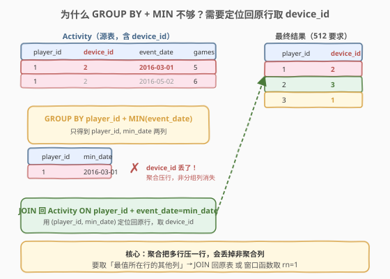
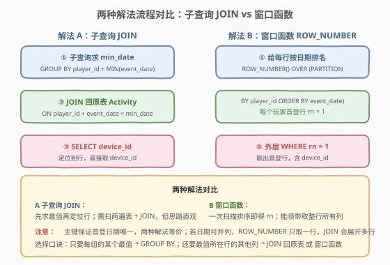
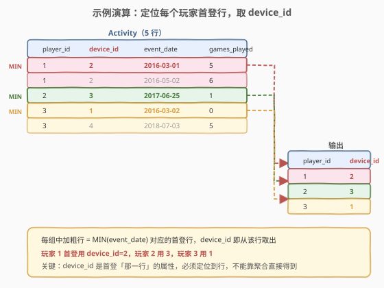

# 游戏玩法分析 II

- **题目名称**：游戏玩法分析 II
- **链接**：[512. 游戏玩法分析 II](https://leetcode.cn/problems/game-play-analysis-ii/)
- **难度**：简单
- **标签**：SQL、聚合、GROUP BY、子查询、JOIN、窗口函数

## 1. 题目概述

给定 `Activity` 表（结构与 [511. 游戏玩法分析 I](../0501-0600/511_游戏玩法分析I.md) 完全相同），每行记录一名玩家在某个日期使用某台设备登录并玩过若干局游戏。编写 SQL 查询，报告**每个玩家首次登录那天所使用的 `device_id`**。

**表结构**：

```text
Table: Activity
+--------------+---------+
| Column Name  | Type    |
+--------------+---------+
| player_id    | int     |  ← 主键之一
| device_id    | int     |
| event_date   | date    |  ← 主键之一
| games_played | int     |
+--------------+---------+
```

> 💡 **与 511 的差异**：511 只要「每个玩家的首次登录**日期**」，`GROUP BY player_id` + `MIN(event_date)` 一行搞定；本题要的是首次登录那天使用的**设备 id**——`device_id` 是「首登那一行」的属性，不是分组键，也没法直接聚合。这正是本题的考点：**当需要「最值所在行的其他列」时，单纯的 `GROUP BY` + 聚合函数不够用**。

**示例 1**：

```text
输入：
Activity 表:
+-----------+-----------+------------+--------------+
| player_id | device_id | event_date | games_played |
+-----------+-----------+------------+--------------+
| 1         | 2         | 2016-03-01 | 5            |
| 1         | 2         | 2016-05-02 | 6            |
| 2         | 3         | 2017-06-25 | 1            |
| 3         | 1         | 2016-03-02 | 0            |
| 3         | 4         | 2018-07-03 | 5            |
+-----------+-----------+------------+--------------+

输出：
+-----------+-----------+
| player_id | device_id |
+-----------+-----------+
| 1         | 2         |
| 2         | 3         |
| 3         | 1         |
+-----------+-----------+
```

**解释**：

- 玩家 1 首次登录 `2016-03-01`，当天 `device_id = 2`
- 玩家 2 首次登录 `2017-06-25`，当天 `device_id = 3`
- 玩家 3 首次登录 `2016-03-02`，当天 `device_id = 1`（注意 `games_played = 0`，但登录的设备仍有效）

**约束条件**：

- `Activity` 表的复合主键为 `(player_id, event_date)`——同一玩家同一天不会有两条记录，故「首次登录日期」良定义、不会并列
- 结果可按任意顺序返回

> 💡 本题是 [511. 游戏玩法分析 I](../0501-0600/511_游戏玩法分析I.md) 的直接延伸：511 学「分组取最值」，512 学「取最值所在行的其他列」。这套「先求最值、再定位回原行」的范式是 SQL 的核心套路之一，后续 [534. 游戏玩法分析 III](https://leetcode.cn/problems/game-play-analysis-iii/)（累计求和）、[550. 游戏玩法分析 IV](https://leetcode.cn/problems/game-play-analysis-iv/)（留存率）都在此基础上展开。

---

## 2. 解题思路

### 2.1 暴力思路：过程式逐玩家扫描

最直觉的做法是逐个 `player_id` 处理：取出该玩家所有行，找出 `event_date` 最小的那一行，输出它的 `device_id`。伪代码如下：

```text
for each player_id in DISTINCT(player_id):
    min_row = argmin(event_date) among rows of this player
    emit (player_id, min_row.device_id)
```

关键在于「`argmin` 定位到行」——我们要的不是最小日期本身，而是**最小日期所在那一行的 `device_id`**。在 SQL 里，`GROUP BY` + `MIN` 只能给出最小日期，给不出那一行的其他列；要拿到 `device_id`，必须「定位回原行」。于是产生两种 SQL 范式：

1. **子查询 JOIN**：先用 `GROUP BY` 求出每人的最小日期，再 `JOIN` 回原表定位到那一行取 `device_id`。
2. **窗口函数**：用 `ROW_NUMBER() OVER (PARTITION BY player_id ORDER BY event_date)` 给每人按日期排名，`rn = 1` 即首登行，整行所有列都可直接取。

> ⚠️ 关键转换：511 的 `GROUP BY + MIN` 把「一组行」压成「一行」，只保留分组键和聚合值，**非分组非聚合列会丢失**——`device_id` 正是被丢掉的那一列。要找回它，就得反向操作：用求出的 `(player_id, min_date)` 作为定位键，`JOIN` 回原表把那一行「捞回来」；或干脆不压行，用窗口函数给每行打排名后筛选。

### 2.2 核心观察：聚合丢行 → JOIN 回原表 / 窗口函数定位



**问题本质**：`device_id` 是「首登那一行」的属性，而 `GROUP BY + MIN(event_date)` 只能告诉你首登日期是哪天，**不知道那天用的是哪台设备**。`MIN` 把多个日期归约成一个值，但 `device_id` 没法跟着 `MIN` 一起带出来——它和 `MIN(event_date)` 不一定来自同一行（虽然在首登场景下恰好来自同一行，但 SQL 的聚合语义不保证这种「对齐」）。

**解法 A（子查询 JOIN）两步**：

1. 子查询 `SELECT player_id, MIN(event_date) AS min_date FROM Activity GROUP BY player_id` 得到每人的首登日期。
2. 外层 `JOIN Activity` 回原表，`ON a.player_id = m.player_id AND a.event_date = m.min_date`，定位到首登那一行，`SELECT a.device_id`。

$$\text{device\_id}(p) = \text{Activity}\big[\text{player\_id}=p,\ \text{event\_date}=\min_{r.\text{player\_id}=p} r.\text{event\_date}\big].\text{device\_id}$$

**解法 B（窗口函数）一步**：

`ROW_NUMBER() OVER (PARTITION BY player_id ORDER BY event_date)` 给每个玩家的行按日期升序编号，`rn = 1` 即首登行，`device_id` 直接可取。

> 💡 **为什么 `device_id` 不能跟 `MIN` 一起输出？** 因为 SQL 聚合函数一次只归约一列——`MIN(event_date)` 只对 `event_date` 列求最小，不会自动把「最小值所在行」的其他列带出来。这是 SQL 标准的语义：**聚合把一组行压成一行，每个非分组列都要独立决定怎么归约**。`device_id` 既不是分组键、也没法用 `MIN`/`MAX` 有意义地归约（取 `MIN(device_id)` 会得到设备号最小的设备，而非首登那天的设备），所以必须靠 JOIN 回原表或窗口函数「定位到行」。

### 2.3 算法流程图



**解法 A（子查询 JOIN）执行流程**：

| 步骤 | 子句 | 作用 |
|------|------|------|
| ① | 子查询 `GROUP BY + MIN` | 求每人首登日期 `(player_id, min_date)` |
| ② | `JOIN Activity ON ...` | 用 `(player_id, min_date)` 定位回原行 |
| ③ | `SELECT a.device_id` | 从定位到的行取设备号 |

**解法 B（窗口函数）执行流程**：

| 步骤 | 子句 | 作用 |
|------|------|------|
| ① | `ROW_NUMBER() OVER (PARTITION BY ... ORDER BY event_date)` | 每人按日期排名，首登行 `rn = 1` |
| ② | 外层 `WHERE rn = 1` | 筛出首登行，`SELECT device_id` |

> 💡 **窗口函数 vs GROUP BY 的本质区别**：`GROUP BY` 把多行**压缩**成一行（输出行数 = 组数）；窗口函数**保留**每一行只是额外加一列排名（输出行数 = 原行数，可再筛选）。本题要「首登那行的 `device_id`」，窗口函数天然适合——它不丢行，`rn = 1` 的那行所有列都还在。

### 2.4 示例演算

以示例数据为例，观察如何从 5 行定位到 3 个首登行的 `device_id`：



| player_id | 首登日期（MIN） | 首登行的 device_id | 是否输出 |
|-----------|-----------------|--------------------|----------|
| 1 | 2016-03-01 | **2** | ✓ |
| 2 | 2017-06-25 | **3** | ✓ |
| 3 | 2016-03-02 | **1** | ✓ |

> 💡 注意玩家 3 的首登那天 `games_played = 0`，但 `device_id = 1` 仍然有效——「登录」由 `event_date` 存在性定义，设备号与是否玩游戏无关。这和 511 的判定一致。

---

## 3. 参考代码

### SQL（解法 A：子查询 JOIN，推荐）

```sql
SELECT a.player_id, a.device_id
FROM Activity a
JOIN (
    SELECT player_id, MIN(event_date) AS min_date
    FROM Activity
    GROUP BY player_id
) m ON a.player_id = m.player_id AND a.event_date = m.min_date;
```

> 💡 **写法要点**：
> - 子查询 `m` 复用 511 的 `GROUP BY + MIN`，求出每人首登日期。
> - `JOIN ... ON a.player_id = m.player_id AND a.event_date = m.min_date` 用复合条件定位回原表的那一行。
> - 因为 `(player_id, event_date)` 是主键，`JOIN` 不会产生重复行——每个 `(player_id, min_date)` 恰好匹配原表一行。
> - `SELECT a.device_id` 直接从定位到的行取设备号。

### SQL（解法 B：窗口函数 ROW_NUMBER）

```sql
SELECT player_id, device_id
FROM (
    SELECT player_id, device_id,
           ROW_NUMBER() OVER (PARTITION BY player_id ORDER BY event_date) AS rn
    FROM Activity
) t
WHERE rn = 1;
```

> 💡 **窗口函数写法**：`PARTITION BY player_id` 按玩家分窗，`ORDER BY event_date` 窗内按日期升序，`ROW_NUMBER()` 给窗内行编号 1, 2, ...。`rn = 1` 即每个玩家最早的那一行。窗口函数不压行，所以 `device_id` 原样保留，外层筛 `rn = 1` 即得首登行的设备号。
>
> ⚠️ **ROW_NUMBER vs RANK/DENSE_RANK**：本题主键保证首登日期唯一（不并列），三者结果相同。但若日期可并列：`ROW_NUMBER` 强制只取一行（随机选一个并列行），`RANK`/`DENSE_RANK` 会把所有并列行都标 1（输出多行）。面试时被问到「并列怎么办」要能区分。

### Python（pandas）

```python
import pandas as pd

def game_analysis(activity: pd.DataFrame) -> pd.DataFrame:
    idx = activity.groupby('player_id')['event_date'].idxmin()
    return activity.loc[idx, ['player_id', 'device_id']].reset_index(drop=True)
```

> 💡 **pandas 对照**：`groupby('player_id')['event_date'].idxmin()` 返回每个玩家 `event_date` 最小值所在行的**行索引**（对应 SQL 的「定位到行」，而非 `min()` 只返回最小值本身）。`activity.loc[idx, ['player_id', 'device_id']]` 用行索引定位回原 DataFrame 取出那两列——这正是「JOIN 回原表」的 pandas 等价物。`reset_index(drop=True)` 重置索引得到干净的输出。

---

## 4. 复杂度分析

| 维度 | 复杂度 | 说明 |
|------|--------|------|
| **时间（子查询 JOIN）** | $O(n \log n)$ | 子查询 `GROUP BY` 需排序 $O(n \log n)$；`JOIN` 用 `(player_id, event_date)` 主键索引匹配，每行 $O(\log n)$，总计 $O(n \log n)$。若 `player_id` 有索引可优化到接近 $O(n)$ |
| **时间（窗口函数）** | $O(n \log n)$ | `PARTITION BY ... ORDER BY` 需对每个分区排序，总计 $O(n \log n)$；单次扫描，常数因子通常优于 JOIN 两遍扫表 |
| **空间（子查询 JOIN）** | $O(n)$ | 子查询中间结果 $O(k)$（$k$ = 玩家数）；JOIN 哈希表/排序缓冲 $O(n)$ |
| **空间（窗口函数）** | $O(n)$ | 排序缓冲区；若需物化子查询则 $O(n)$ |
| **结果行数** | $O(k)$ | 每个玩家一行，$k$ = 不同 `player_id` 数（$k \le n$） |

> ⚠️ 本题 `(player_id, event_date)` 是主键，MySQL 的主键即聚簇索引，`JOIN` 匹配可走索引等值查找，效率很高。两种解法在主键场景下性能接近；窗口函数通常略优（单次扫描），子查询 JOIN 思路更直观、易于调试。面试中说明「两种都是 $O(n \log n)$，主键索引让 JOIN 匹配 $O(\log n)$」即可。

---

## 5. 扩展

### 5.1 子查询 JOIN 的变体：IN / 相关子查询

除了 `JOIN`，还可用 `IN` 或相关子查询实现「定位到首登行」：

```sql
-- 写法 1：用 IN + 元组匹配
SELECT player_id, device_id
FROM Activity
WHERE (player_id, event_date) IN (
    SELECT player_id, MIN(event_date)
    FROM Activity
    GROUP BY player_id
);

-- 写法 2：相关子查询（NOT EXISTS 反向：没有比它更早的行）
SELECT player_id, device_id
FROM Activity a
WHERE NOT EXISTS (
    SELECT 1 FROM Activity b
    WHERE b.player_id = a.player_id AND b.event_date < a.event_date
);
```

> 💡 写法 2 的 `NOT EXISTS` 思路截然不同——它不「先求最小值再匹配」，而是**对每一行判定「有没有比它更早的同玩家行」**，没有则该行即首登行。这种「不存在更优者即最优」的判定范式在 SQL 中很通用，适合不便用 `GROUP BY` 的场景。但本题有主键，`JOIN` 写法更简洁高效。

### 5.2 ROW_NUMBER vs RANK vs DENSE_RANK：并列日期怎么办

本题主键 `(player_id, event_date)` 保证首登日期唯一，三个窗口函数等价。但若放宽主键约束（同一玩家同一天可多条记录），行为分化：

| 函数 | 并列处理 | 输出行数（首登日期并列 2 行时） |
|------|----------|--------------------------------|
| `ROW_NUMBER()` | 强制唯一编号 1, 2, 3... | 1 行（随机选一个并列行） |
| `RANK()` | 并列同号，跳后续 | 2 行（都标 1） |
| `DENSE_RANK()` | 并列同号，不跳 | 2 行（都标 1） |

> 💡 若题目要求「首登日期并列时输出所有首登行」，应改用 `RANK() ... WHERE rk = 1` 或 `DENSE_RANK()`。本题无需考虑，但面试时主动提一句「若并列怎么办」能加分。

### 5.3 从 511 到 512 到 534：游戏玩法分析系列的聚合升级

| 题号 | 要求 | 核心范式 |
|------|------|----------|
| [511](../0501-0600/511_游戏玩法分析I.md) | 每人首登**日期** | `GROUP BY + MIN`（分组取最值） |
| **512** | 每人首登**设备** | `GROUP BY + MIN` + JOIN 回原表 / 窗口函数（取最值所在行的列） |
| [534](https://leetcode.cn/problems/game-play-analysis-iii/) | 每人**截至每天的累计局数** | `SUM OVER (PARTITION BY ... ORDER BY ...)`（窗口累计） |
| [550](https://leetcode.cn/problems/game-play-analysis-iv/) | **次日留存率** | 511 的首登日期 + JOIN 判断次日是否登录（首登定位的统计应用） |

> 💡 这四题共享同一张 `Activity` 表和 `player_id` 分组骨架，差异只在「对每组做什么操作」——从「取最值」到「取最值所在行的列」到「窗口累计」到「首登定位 + 留存统计」，层层递进，是 SQL 聚合体系最好的练习序列。

---

## 6. 面试要点

1. **为什么不能直接 `SELECT player_id, device_id FROM Activity GROUP BY player_id`？**

   - `GROUP BY player_id` 把同一玩家的多行压成一行，分组键 `player_id` 每组唯一可直接选；但 `device_id` 不是分组键，一个组内有多个值（玩家可能在不同日期用不同设备），SQL 不知道选哪个——必须用聚合函数归约。而 `MIN(device_id)` 取的是设备号最小的设备，**不是首登那天的设备**，语义错误。所以必须靠 JOIN 回原表定位到首登行，或用窗口函数保留首登行。这是 `ONLY_FULL_GROUP_BY` 模式下的硬性规则。

2. **子查询 JOIN 和窗口函数哪种更好？**

   - **性能**：窗口函数通常略优——单次扫描排序即可，子查询 JOIN 需扫两遍表（子查询一遍 + JOIN 一遍）。但有主键索引时 JOIN 匹配高效，两者差距不大。
   - **可读性**：子查询 JOIN 思路更直观（先求最小值，再定位行），适合讲解；窗口函数更紧凑。
   - **扩展性**：窗口函数天然能取首登行的**所有列**（`device_id`、`games_played` 等），而 JOIN 要取更多列只需在 `SELECT` 加列名，同样方便。
   - **并列处理**：若首登日期可并列，`ROW_NUMBER` 只取一行，`JOIN`/`RANK` 会输出多行——按需求选择。

3. **`JOIN ON a.player_id = m.player_id AND a.event_date = m.min_date` 为什么不会产生重复行？**

   - 子查询 `m` 每个 `player_id` 只有一行（`GROUP BY` 压成一行），`min_date` 唯一。`JOIN` 条件用 `(player_id, event_date)` 复合匹配，而 `(player_id, event_date)` 是 `Activity` 的主键——每个 `(player_id, min_date)` 在原表至多匹配一行。故 JOIN 结果每玩家一行，无重复。若主键不含 `event_date`（首登日期可并列），则可能匹配多行，需用 `ROW_NUMBER` 或 `DISTINCT` 去重。

4. **窗口函数的 `PARTITION BY` 和 `GROUP BY` 有什么区别？**

   - `GROUP BY` 把同组行**压缩**成一行，输出行数 = 组数，非分组列必须聚合。
   - `PARTITION BY` 把行**分组但不压缩**——每组内每行保留，额外计算窗口聚合/排名列，输出行数 = 原行数。
   - 本题要「首登那行的 `device_id`」，`GROUP BY` 会丢掉 `device_id`，而 `PARTITION BY` + `ROW_NUMBER` 保留整行，筛 `rn = 1` 即得。这是窗口函数相对 `GROUP BY` 的核心优势：**不丢行，能取最值所在行的任意列**。

5. **复合主键 `(player_id, event_date)` 对本题有什么影响？**

   - 它保证同一玩家同一天不会有两条记录，故首登日期唯一、`JOIN` 不会展开多行、`ROW_NUMBER`/`RANK`/`DENSE_RANK` 三者等价。主键在 MySQL 中是聚簇索引，`JOIN` 的 `(player_id, event_date)` 匹配可走索引等值查找，效率高。面试时说明「主键保证唯一性 + 提供索引加速」即可。

> 💡 **一句话总结**：512 教的是「取最值所在行的其他列」——这是 SQL 聚合的进阶套路。记住口诀：**只要每组的某个最值用 `GROUP BY`；还要最值所在行的其他列用 JOIN 回原表 或 窗口函数取 `rn = 1`**。本题是 511 的自然延伸，也是 534/550 的前置基础。

---

## 7. 同类练习题

- [511. 游戏玩法分析 I](https://leetcode.cn/problems/game-play-analysis-i/)：前置母题——同样的表，只要首登日期，`GROUP BY + MIN` 一行搞定；对比 512 理解「为何要加 JOIN」
- [534. 游戏玩法分析 III](https://leetcode.cn/problems/game-play-analysis-iii/)：同表升级——把「取最值」换成「窗口累计求和」`SUM OVER (PARTITION BY ... ORDER BY ...)`，分组骨架不变
- [550. 游戏玩法分析 IV](https://leetcode.cn/problems/game-play-analysis-iv/)：同表应用——用 511/512 的首登日期求次日留存率，首登定位的统计实战
- [184. 部门工资最高的员工](../0101-0200/184_部门工资最高的员工.md)：同套路——`GROUP BY + MAX` 求最高工资，再 JOIN 回原表取员工姓名，经典「最值所在行的其他列」
- [177. 第 N 高的薪水](../0101-0200/177_第N高的薪水.md)：窗口函数取特定排名的变体——`DENSE_RANK` 取第 N 高，与本题 `ROW_NUMBER` 取 `rn = 1` 同属「窗口函数定位行」范式
