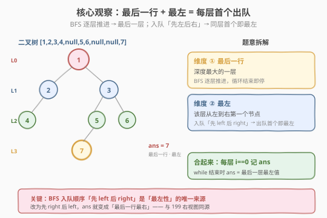
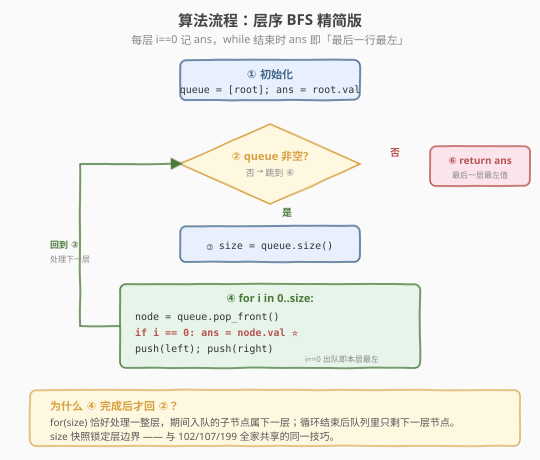
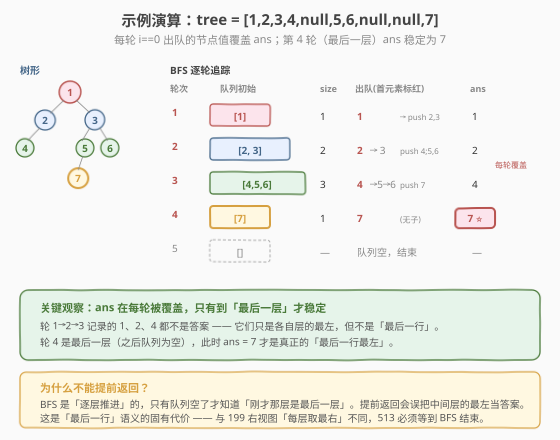

# LeetCode 找树左下角的值 题解

## 1. 题目概述

- **标题 / 题号**：找树左下角的值（#513，medium）
- **链接**：https://leetcode.cn/problems/find-bottom-left-tree-value/
- **难度**：中等
- **标签**：树、二叉树、广度优先搜索（BFS）、深度优先搜索（DFS）

**题意**：给定一个二叉树的根节点 `root`，找出该树**最后一行**（即最深层）中**最左边**节点的值。

> ⚠️ 注意「最左」不是几何坐标最靠左，而是「在该层从左向右数第一个出现的节点」。即使某节点几何位置偏右，只要它是所在层从左往右的第一个节点，就是该层的最左节点。

**示例 1**：

```text
输入：root = [2,1,3]
      2
     / \
    1   3
输出：1
解释：最深层只有 [1, 3] 一行（第 1 层），其中最左边的节点是 1。
```

**示例 2**：

```text
输入：root = [1,2,3,4,null,5,6,null,null,7]
          1
         / \
        2   3
       /   / \
      4   5   6
         /
        7
输出：7
解释：最深层是第 3 层 [7]（唯一节点），最左节点即 7。
```

**约束**：

- 二叉树节点数目在范围 `[1, 10^4]` 内
- `-1000 <= Node.val <= 1000`

> 💡 这道题是 [102. 二叉树的层序遍历](../0101-0200/102_二叉树的层序遍历.md) 的「最小增量」变体：BFS 骨架纹丝不动，只是把「收集每一层」改写成「只记每层第一个」。它考的不是新算法，而是你对**层序 BFS 的 `size` 快照**与**前序 DFS 的「先左后右」天然最左性**这两个性质的理解。

## 2. 解题思路

### 2.1 暴力思路：层序遍历收集全部，再取最后一层首元素

最直觉的做法：套用 102 的 BFS 模板，把每一层都存进 `result`，最后返回 `result.back().front()`（最后一层的第一个元素）。

```text
BFS 逐层收集 result（同 102）
return result[-1][0]
```

这能过，且时间 `O(n)`、空间 `O(n)`——但空间上存了**全部**节点值，而题目只要一个值。可以做到 `O(w)`（`w` 为树的最大宽度，即任意层最多节点数）。更优雅的做法是**边遍历边记录**，丢掉不必要的历史。

> ⚠️ 暴力法把「整层列表」都存下来，是典型的「过度收集」。面试官若追问「能否只用常数级额外变量（除队列外）」，就要进入 2.2 的精简版。

### 2.2 核心观察：层序 BFS — 每层首个即「最左」，最深层的首个即答案

把题意拆成两个独立维度：

| 维度 | 含义 | 由谁保证 |
|------|------|---------|
| **最后一行** | 深度最大的一层 | BFS 是逐层推进的，**最后一层处理完即停** |
| **最左** | 该层从左到右第一个节点 | BFS 入队顺序「先 `left` 后 `right`」→ 同层出队顺序天然左→右，**第一个出队的就是最左** |

合起来：**每轮 `for(size)` 循环里，第一个出队的节点值就是该层最左值；BFS 跑完时，最后一次记录的值就是最后一行的最左值。**



> 💡 **为什么 BFS 入队顺序保证「最左」？** 因为子节点入队时我们先 `push(left)` 再 `push(right)`，队列里同层节点严格按从左到右排列。`for(size)` 循环里 `i = 0` 那次出队的就是最左节点。这一性质在 [199 二叉树右视图](../0101-0200/199_二叉树的右视图.md) 里被对称地用来取「每层最右」。

### 2.3 算法流程图



**完整步骤**（精简版，仅保留一个 `ans` 变量）：

1. **初始化**：队列 `queue = [root]`，答案 `ans = root.val`（至少一个节点，根可作初值）
2. **while 队列非空**：
   - `size = queue.size()`（当前层节点数快照）
   - `for i in 0..size`：
     - `node = queue.pop_front()`
     - `if i == 0`：`ans = node.val` ⭐ 记录本层最左
     - 子节点入队：`if node.left: queue.push_back(node.left)`；`if node.right: queue.push_back(node.right)`
3. 返回 `ans`（循环结束时 `ans` 已是最后一层最左值）

### 2.4 示例演算

以示例 2 的树 `[1,2,3,4,null,5,6,null,null,7]` 为例：



| 轮次 | 队列初始 | size | 出队顺序 | 入队子节点 | i=0 记录 ans | ans 更新后 |
|------|---------|------|---------|-----------|-------------|-----------|
| 1 | [1] | 1 | 1 | 2, 3 | 1 | 1 |
| 2 | [2, 3] | 2 | 2 → 3 | 4 → 5, 6 | 2 | 2 |
| 3 | [4, 5, 6] | 3 | 4 → 5 → 6 | ∅ → 7 → ∅ | 4 | 4 |
| 4 | [7] | 1 | 7 | ∅ | 7 | **7** ⭐ |
| 5 | [] | — | 队列空，结束 | — | — | — |

最终 `ans = 7`。

> 💡 注意第 3 轮的 `i=0` 出队的是 4，但 4 不是答案——因为它不是最后一层。`ans` 在每一轮都会被覆盖，只有到第 4 轮（最后一层）才稳定下来为 7。这就是「while 跑完才返回」的原因。

## 3. 参考代码

### C++（BFS 精简版）

```cpp
// 找树左下角的值.cpp —— 层序 BFS，每层首元素即最左
// 编译: g++ -O2 -std=c++17 找树左下角的值.cpp -o bottomleft
#include <queue>
using namespace std;

struct TreeNode {
    int val;
    TreeNode* left;
    TreeNode* right;
    TreeNode() : val(0), left(nullptr), right(nullptr) {
    }
    TreeNode(int x) : val(x), left(nullptr), right(nullptr) {
    }
    TreeNode(int x, TreeNode* l, TreeNode* r) : val(x), left(l), right(r) {
    }
};

class Solution {
  public:
    int findBottomLeftValue(TreeNode* root) {
        queue<TreeNode*> q;
        q.push(root);
        int ans = root->val;          // 至少一个节点，根作初值

        while (!q.empty()) {
            int size = q.size();       // ① 当前层节点数快照
            for (int i = 0; i < size; ++i) {
                TreeNode* node = q.front();
                q.pop();
                if (i == 0)
                    ans = node->val;   // ② 本层最左（出队首个）
                if (node->left)  q.push(node->left);
                if (node->right) q.push(node->right);
            }
        }
        return ans;                    // ③ 最后一层最左值
    }
};
```

### Python（BFS 精简版）

```python
from collections import deque

class Solution:
    def findBottomLeftValue(self, root: TreeNode | None) -> int:
        queue = deque([root])
        ans = root.val                 # 至少一个节点，根作初值

        while queue:
            size = len(queue)          # 当前层节点数快照
            for i in range(size):
                node = queue.popleft()
                if i == 0:
                    ans = node.val     # 本层最左（出队首个）
                if node.left:
                    queue.append(node.left)
                if node.right:
                    queue.append(node.right)
        return ans                     # 最后一层最左值
```

### Python（DFS 前序版，O(h) 空间）

```python
class Solution:
    def findBottomLeftValue(self, root: TreeNode | None) -> int:
        max_depth = -1
        ans = root.val

        def dfs(node: TreeNode | None, depth: int) -> None:
            nonlocal max_depth, ans
            if not node:
                return
            # 前序：先处理当前节点。先访问左子树 → 同层最先访问到的必是最左
            if depth > max_depth:
                max_depth = depth
                ans = node.val         # 首次到达更深层时记录
            dfs(node.left, depth + 1)
            dfs(node.right, depth + 1)

        dfs(root, 0)
        return ans
```

> 💡 **DFS 前序为何也正确？** 前序访问顺序「根 → 左 → 右」，对同一深度总是先访问最左侧的节点。`if depth > max_depth` 用**严格大于**保证「每个深度只记录第一次到达的节点」——而第一次到达的必是该层最左。这一思路与 [104. 二叉树的最大深度](../0101-0200/104_二叉树的最大深度.md) 的 DFS 完全兼容，只是多带一个 `ans`。

## 4. 复杂度分析

| 维度 | BFS 解法 | DFS 前序解法 | 说明 |
|------|---------|-------------|------|
| **时间复杂度** | `O(n)` | `O(n)` | 每个节点访问一次 |
| **空间复杂度** | `O(w)`（队列） | `O(h)`（递归栈） | `w` = 树最大宽度，`h` = 树高；平衡时 `h = O(log n)`，链化时 `h = O(n)` |

> ⚠️ **BFS 空间 `O(w)` 而非 `O(n)`**：BFS 精简版只保留 `ans` 一个标量，丢弃了整层列表，故空间取决于队列最满状态——满二叉树末层 `w = n/2` → `O(n)`；链化时 `w = 1` → `O(1)`。相比 2.1 暴力法的 `O(n)` 结果列表，省去了不可压缩的历史存储。

> 💡 **BFS vs DFS 的空间权衡**：扁平宽树（`w` 大、`h` 小）DFS 更省；瘦高链化树（`w` 小、`h` 大）BFS 更省。本题两者皆可，面试时按树的形态或个人偏好选择即可。

## 5. 扩展：DFS 前序的「最左性」与 BFS 的对称变体

### 5.1 DFS 前序的「最左性」

前序遍历有一个被广泛复用的性质：**对任意深度 `d`，第一次访问到深度 `d` 的节点必是该层最左节点**。这是因为前序严格按「左子树优先」展开，同深度节点中左侧的总先被触及。

| 利用此性质的题目 | 改动点 |
|----------------|--------|
| **513 找树左下角的值** | `depth > max_depth` 时记 `ans` |
| 199 二叉树右视图 | 改为「右子树优先」前序，每层首访即最右 |
| 662 二叉树最大宽度 | 给节点编号，前序传递编号 |

> 💡 把 513 的 DFS 改成「先 `right` 后 `left`」，`ans` 就变成**最后一行最右**节点——这是前序「最左性」的对称变体，与 [199](../0101-0200/199_二叉树的右视图.md) 思路同源。

### 5.2 BFS 的「右先入队，最后一个出队」技巧

若把 BFS 入队顺序改成「先 `right` 后 `left`」，则同层出队顺序变为右→左，**最后一个出队的节点就是最后一层最左**。这样连 `i == 0` 的判断都省了——循环结束时 `node` 直接是答案：

```python
# 右先入队版：最后出队者即「最后一行最左」
from collections import deque
class Solution:
    def findBottomLeftValue(self, root):
        q = deque([root])
        node = root
        while q:
            node = q.popleft()
            if node.right: q.append(node.right)   # 右先
            if node.left:  q.append(node.left)    # 左后
        return node.val
```

> ⚠️ 这个技巧**省去了 `size` 快照**，但牺牲了「逐层」语义——它本质是「把整棵树按一种特殊顺序拍扁」。简洁但不易解释，面试时建议优先用 2.3 的标准层序版（语义清晰、可迁移），把它作为「进阶优化」提及。

## 6. 面试要点

1. **「最左」是几何最左还是遍历首个？**

   - 是**遍历首个**。题面说的「最左」指「该层从左向右数第一个出现的节点」，由 BFS 入队顺序「先 `left` 后 `right`」保证，不是几何坐标。

2. **为什么 `i == 0` 出队的就是最左？**

   - 同层节点按入队顺序出队。BFS 入队时先 `push(left)` 再 `push(right)`，故队列里同层节点严格左→右排列，`for(size)` 第 0 次出队的就是最左节点。

3. **为什么要等 while 跑完才返回 `ans`？**

   - 每一层都会覆盖 `ans`。只有 BFS 结束（队列空）时，`ans` 才稳定为「最后一层」的最左值。提前返回会拿到中间层的最左，错误。

4. **DFS 前序为什么 `depth > max_depth` 用严格大于？**

   - 严格 `>` 保证「每个深度只记录第一次到达」。前序「左优先」使首次到达必是该层最左。若改成 `>=`，则每访问一个同层节点都覆盖，最后会变成该层最右——破坏正确性。

5. **BFS 空间是 `O(n)` 还是 `O(w)`？**

   - 精简版（只存 `ans`）是 `O(w)`，`w` 为树的最大宽度。满二叉树 `w = n/2` → `O(n)`；链化树 `w = 1` → `O(1)`。2.1 暴力法额外存结果列表才是确定的 `O(n)`。

> 💡 **一句话总结**：513 是 102 层序 BFS 的「最小增量」变体——`size` 快照锁层边界、`i == 0` 取每层最左、循环结束时 `ans` 即答案。它也可用前序 DFS 的「最左性」(`depth > max_depth` 严格大于) 求解，两条路径分别体现 BFS 的「逐层」与 DFS 的「左优先」两个性质。

## 同类练习题

| # | 题目 | 与本题的关联 |
|---|------|-------------|
| 102 | [二叉树的层序遍历](https://leetcode.cn/problems/binary-tree-level-order-traversal/)（[题解](../0101-0200/102_二叉树的层序遍历.md)） | 513 的母题，`size` 快照模板的出处 |
| 199 | [二叉树的右视图](https://leetcode.cn/problems/binary-tree-right-side-view/)（[题解](../0101-0200/199_二叉树的右视图.md)） | 513 的对称题，每层取最右；DFS 版改为「右优先前序」 |
| 107 | [二叉树的层序遍历 II](https://leetcode.cn/problems/binary-tree-level-order-traversal-ii/)（[题解](../0101-0200/107_二叉树的层序遍历II.md)） | 同套 BFS 骨架，输出阶段整体翻转 |
| 637 | [二叉树的层平均值](https://leetcode.cn/problems/average-of-levels-in-binary-tree/) | 同套 `size` 快照，每层求均值而非取首元素 |
| 662 | [二叉树最大宽度](https://leetcode.cn/problems/maximum-width-of-binary-tree/) | BFS 给节点编号 + 每层首尾编号差，前序「最左性」的进阶应用 |
