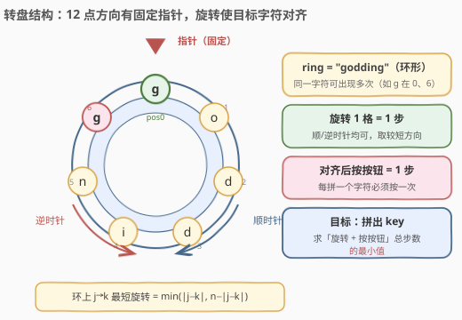
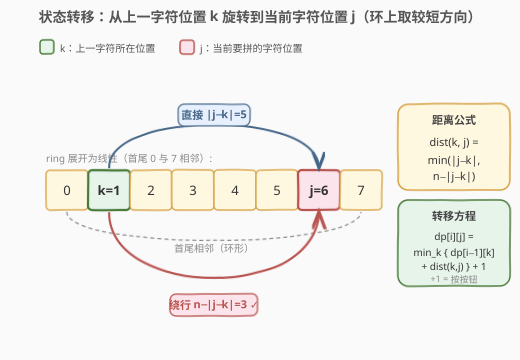
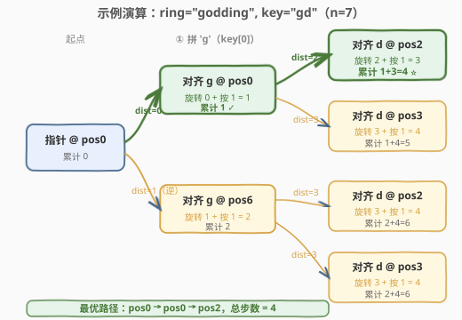

# LeetCode 自由之路 题解

## 1. 题目概述

- **标题 / 题号**：自由之路（#514，hard）
- **链接**：https://leetcode.cn/problems/freedom-trail/
- **难度**：困难
- **标签**：动态规划、深度优先搜索、记忆化、环形结构

**题意**：电子游戏「自由之路」中，有一个**环形转盘** `ring`（首尾相连的字符串），12 点方向有一个**固定指针**，初始指向 `ring[0]`。你需要按顺序拼出给定的密钥 `key`，每拼一个字符要：

1. **旋转**转盘（顺时针或逆时针均可），使目标字符对齐到 12 点指针处——每转过一格算 **1 步**；
2. **按按钮**确认——按下算 **1 步**。

返回拼出整个 `key` 的**最少总步数**。保证 `key` 一定能从 `ring` 中拼出。

**示例 1**：

```text
输入：ring = "godding", key = "gd"
输出：4
解释：
  ring = "godding"，下标: 0='g',1='o',2='d',3='d',4='i',5='n',6='g'
  拼第 1 个字符 'g'：指针已在 pos0（'g'），按按钮 → 1 步
  拼第 2 个字符 'd'：从 pos0 顺时针转 2 格到 pos2（'d'），按按钮 → 2+1=3 步
  总计 1 + 3 = 4 步
```

**示例 2**：

```text
输入：ring = "godding", key = "godding"
输出：13
```

**约束**：

- `1 <= ring.length, key.length <= 100`
- `ring` 和 `key` 只含小写英文字母
- 保证 `key` 能由 `ring` 拼出

> ⚠️ **关键信号**：① 「同一字符在 `ring` 中可出现多次」（如 `godding` 里 `g` 在 0、6），拼一个字符有**多个候选位置**；② 要求**最少总步数**且**按顺序拼**——这是典型的「阶段 + 状态」结构，每拼一个字符是一个阶段，当前停在哪个位置是状态。两个信号合起来直指**动态规划 / 记忆化搜索**。

## 2. 解题思路

### 2.1 暴力思路

从起点 `pos0` 出发，对 `key` 的每个字符，枚举 `ring` 中**所有**该字符的位置作为对齐点，算出旋转步数后递归拼下一个字符。不记任何状态时复杂度约为 $O(\prod f_i)$（$f_i$ 为 `key[i]` 在 `ring` 中的出现次数），最坏全相同字符时退化为 $O(n^m)$，$n=m=100$ 显然爆炸。但其中**同一阶段、同一停留位置**会被反复到达——这正是记忆化能消除的重复子问题。

### 2.2 核心观察：环上 DP + 记忆化



**定义**：`dfs(i, j)` = 已拼完 `key[0..i-1]`、指针当前停在 `ring` 的第 `j` 个位置（12 点对齐 `ring[j]`）时，**拼完剩余 `key[i..]` 所需的最少步数**。

- **起始**：`dfs(0, 0)`（还没拼任何字符，指针在初始位置 `pos0`）。
- **终止**：`dfs(m, j) = 0`（`key` 全部拼完，无需再动，`m = len(key)`）。
- **转移**：要拼 `key[i]`，枚举 `ring` 中所有满足 `ring[k] == key[i]` 的位置 `k`，从当前位置 `j` 旋转到 `k`、按下按钮，再继续拼 `key[i+1..]`：

$$\texttt{dfs}(i, j) = \min_{k:\,\text{ring}[k]=\text{key}[i]} \bigl\\{\, \text{dist}(j, k) + 1 + \text{dfs}(i+1, k)\,\bigr\\}$$

其中 `+1` 是按按钮的步数，`dist(j, k)` 是环上从 `j` 到 `k` 的**最短旋转步数**。

> 💡 **为什么状态只记 `(i, j)` 就够？** 题目要求**按 `key` 的顺序拼**，所以「下一个要拼谁」由 `i` 唯一确定；而「旋转开销」只取决于「当前停在哪」与「目标位置」，与之前怎么走来的无关。因此 `(已拼到第 i 个字符, 当前停在 j)` 是无后效性的完整状态描述。

### 2.3 环上距离公式与转移图

环是首尾相连的：从 `j` 到 `k` 既可顺时针直接走 `|j - k|` 格，也可反向绕行 `n - |j - k|` 格，**取较短者**：

$$\text{dist}(j, k) = \min\bigl(|j - k|,\; n - |j - k|\bigr)$$



图中把 `ring` 展开为线性条带（注意首尾 `0` 与 `n-1` 相邻），上一字符停在 `k`、当前要对齐到 `j`：上方弧线是直接走 `|j-k|` 格，下方弧线是绕行 `n-|j-k|` 格，两者取 `min` 即得最短旋转。**这正是环形区别于线性的关键**——线段上两点距离就是 `|j-k|`，环上还要比较反向绕行。

> ⚠️ **常见坑**：只算 `|j-k|` 忘了 `n - |j-k|`，在 `ring[0]` 与 `ring[n-1]` 这种「实际只隔 1 格」的情况会算成 `n-1` 步，导致答案偏大。例：`n=7`、`j=0`、`k=6`，正确 `dist = min(6, 1) = 1`，而非 6。

### 2.4 示例演算（ring = "godding", key = "gd"）

`n = 7`，`pos['g'] = [0, 6]`，`pos['d'] = [2, 3]`。



**阶段 ① 拼 'g'（从 pos0 出发）**：

| 对齐到 | 旋转 dist(0, k) | + 按按钮 | 本阶段花费 | 累计 |
|--------|-----------------|----------|-----------|------|
| pos0（'g'） | min(0, 7) = 0 | +1 | 1 | **1 ✓** |
| pos6（'g'） | min(6, 1) = 1 | +1 | 2 | 2 |

**阶段 ② 拼 'd'**：

| 起点 | 对齐到 | dist | +1 | 本阶段 | 累计 |
|------|--------|------|-----|--------|------|
| pos0 | pos2（'d'） | min(2, 5) = 2 | +1 | 3 | **1+3=4 ✓** |
| pos0 | pos3（'d'） | min(3, 4) = 3 | +1 | 4 | 1+4=5 |
| pos6 | pos2（'d'） | min(4, 3) = 3 | +1 | 4 | 2+4=6 |
| pos6 | pos3（'d'） | min(3, 4) = 3 | +1 | 4 | 2+4=6 |

每个阶段对每个候选位置取 `min`：阶段 ② 中 `pos2` 列 `min(4, 6) = 4`，`pos3` 列 `min(5, 6) = 5`，最终答案 `min(4, 5) = 4`。**最优路径 `pos0 → pos0 → pos2`**：直接按 'g'，再顺时针转 2 格按 'd'，共 4 步。

> 💡 注意 pos6 的 'g' 虽然离起点只 1 格（逆时针），但它离 'd' 都较远，整体不如「贪近」看起来亏、实际却赢的 pos0 路径——这正是下一节「贪心为何不行」的伏笔。

## 3. 参考代码

### 方法一：记忆化搜索（自顶向下，最直观）

先预处理 `pos[c]` = `c` 在 `ring` 中的所有下标列表，转移时只枚举合法位置，避免遍历整个 `ring`。

### Python

```python
class Solution:
    def findRotateSteps(self, ring: str, key: str) -> int:
        n = len(ring)
        m = len(key)
        from collections import defaultdict
        pos = defaultdict(list)
        for i, c in enumerate(ring):
            pos[c].append(i)

        from functools import lru_cache

        @lru_cache(None)
        def dfs(i: int, j: int) -> int:
            if i == m:                       # key 已拼完
                return 0
            best = float('inf')
            for k in pos[key[i]]:            # 枚举 key[i] 的所有出现位置
                d = abs(k - j)
                dist = min(d, n - d)         # 环上最短旋转
                best = min(best, dist + 1 + dfs(i + 1, k))
            return best

        return dfs(0, 0)
```

### C++

```cpp
class Solution {
public:
    int findRotateSteps(string ring, string key) {
        int n = ring.size(), m = key.size();
        vector<vector<int>> pos(26);
        for (int i = 0; i < n; ++i) pos[ring[i] - 'a'].push_back(i);

        vector<vector<int>> memo(m + 1, vector<int>(n, -1));
        function<int(int, int)> dfs = [&](int i, int j) -> int {
            if (i == m) return 0;
            int& res = memo[i][j];
            if (res != -1) return res;
            res = INT_MAX;
            for (int k : pos[key[i] - 'a']) {
                int d = abs(k - j);
                int dist = min(d, n - d);
                res = min(res, dist + 1 + dfs(i + 1, k));
            }
            return res;
        };
        return dfs(0, 0);
    }
};
```

> 💡 **`pos` 预处理的意义**：直接 `for k in range(n): if ring[k]==key[i]` 也对，但每次转移多一个 `O(n)` 内层扫描。预处理成「字符 → 下标列表」后，转移只枚举真正合法的 `k`，常数显著变小（尤其 `ring` 字符种类多时）。

### 方法二：递推 DP（自底向上）

把记忆化翻成迭代：`dp[j]` 表示「拼完当前字符后指针停在 `j`」的最少累计步数，逐字符滚动更新。

### Python

```python
class Solution:
    def findRotateSteps(self, ring: str, key: str) -> int:
        n = len(ring)
        m = len(key)
        from collections import defaultdict
        pos = defaultdict(list)
        for i, c in enumerate(ring):
            pos[c].append(i)

        INF = float('inf')
        dp = [INF] * n                       # dp[j] = 拼到当前字符、停在 j 的最少步数
        # 第一个字符：从起点 pos0 出发
        for k in pos[key[0]]:
            dp[k] = min(k, n - k) + 1        # dist(0, k) + 按按钮

        for i in range(1, m):
            ndp = [INF] * n
            for j in pos[key[i]]:            # 当前要对齐到 j
                for k in pos[key[i - 1]]:    # 上一阶段停在 k
                    if dp[k] == INF:
                        continue
                    d = abs(j - k)
                    dist = min(d, n - d)
                    ndp[j] = min(ndp[j], dp[k] + dist + 1)
            dp = ndp

        return min(dp[k] for k in pos[key[m - 1]])
```

### C++

```cpp
class Solution {
public:
    int findRotateSteps(string ring, string key) {
        int n = ring.size(), m = key.size();
        vector<vector<int>> pos(26);
        for (int i = 0; i < n; ++i) pos[ring[i] - 'a'].push_back(i);

        const int INF = 1e9;
        vector<int> dp(n, INF);
        for (int k : pos[key[0] - 'a']) {
            dp[k] = min(k, n - k) + 1;       // dist(0, k) + 按按钮
        }
        for (int i = 1; i < m; ++i) {
            vector<int> ndp(n, INF);
            for (int j : pos[key[i] - 'a']) {
                for (int k : pos[key[i - 1] - 'a']) {
                    if (dp[k] == INF) continue;
                    int d = abs(j - k);
                    int dist = min(d, n - d);
                    ndp[j] = min(ndp[j], dp[k] + dist + 1);
                }
            }
            dp = move(ndp);
        }
        int ans = INF;
        for (int k : pos[key[m - 1] - 'a']) ans = min(ans, dp[k]);
        return ans;
    }
};
```

> 💡 **递推 vs 记忆化**：递推把「拉」式转移写成显式两层循环，无递归栈、常数更小；记忆化顺着题意写最不易出错。两者状态数与复杂度相同，面试先写出任意一种正确的，再口述另一种即可。

## 4. 复杂度分析

| 维度 | 复杂度 | 说明 |
|------|--------|------|
| 时间复杂度 | $O(m \cdot n^2)$（最坏）/ $O(m \cdot \bar{f}^2)$（平均） | 共 $m \cdot n$ 个状态 $(i, j)$；每次转移枚举 `key[i]` 的出现位置 $f_i \le n$。最坏 `ring` 全同一字符时 $f_i = n$，得 $O(m \cdot n^2)$；平均 $\bar f = n/26$ 时约 $O(m \cdot n^2 / 676)$ |
| 空间复杂度 | $O(m \cdot n)$ | 记忆化表 `memo[m+1][n]`；递推法用滚动数组可压到 $O(n)$ |

> ⚠️ $n, m \le 100$：最坏 $100 \times 100^2 = 10^6$ 次操作，毫秒级完成。`pos` 预处理让实际常数远小于理论上界——`ring` 字符种类越多，每个 `f_i` 越小。

## 5. 扩展：贪心为何不行

一个诱人的简化是「每步都旋转到**离当前最近的**目标字符位置」。但这只看一步，会牺牲后续阶段的便利，**不是最优子结构**。

**反例**：`ring = "pqrabcdeaf"`（`n = 10`），`key = "ab"`。

- `pos['a'] = [3, 8]`，`pos['b'] = [4]`，起点 `pos0`。
- 贪心拼 `key[0]='a'`：`dist(0, 3) = 3`，`dist(0, 8) = min(8, 2) = 2` → 选较近的 `pos8`，花费 `2 + 1 = 3`。
- 再拼 `key[1]='b'`：从 `pos8` 到 `pos4`，`dist(8, 4) = min(4, 6) = 4`，花费 `4 + 1 = 5`。
- **贪心总步数 = 3 + 5 = 8**。

而最优策略选看起来较远的 `pos3`：

- 拼 `'a'` 到 `pos3`：`dist(0, 3) = 3`，花费 `3 + 1 = 4`。
- 拼 `'b'` 到 `pos4`：`dist(3, 4) = 1`，花费 `1 + 1 = 2`。
- **最优总步数 = 4 + 2 = 6 < 8**。

原因：`pos8` 虽然离起点近（绕行 2 格），但它把指针带到一个**远离 `'b'`** 的位置；`pos3` 虽然离起点远，却**紧挨着 `'b'`**。贪心只 optimize 当前阶段，看不到下一阶段的代价。DP 通过 `min` 同时权衡「当前旋转」与「后续总步数」`dfs(i+1, k)`，自然避开这个陷阱——这正体现了**最优子结构 + 重叠子问题**这对 DP 的核心判据。

> 💡 **判据小结**：若每步的局部最优能保证全局最优（如 [45. 跳跃游戏 II](../0001-0100/45_跳跃游戏II.md) 的贪心），用贪心；若局部最优会牺牲未来（如本题、[64/120 的网格 DP](../0101-0200/64_最小路径和.md)），用 DP。识别的关键是「**当前选择是否影响后续状态代价**」——本题「选哪个 `'a'`」直接改变指针位置，进而改变下一字符的旋转开销，所以必须 DP。

## 6. 面试要点

1. **状态为什么是 `(i, j)`？`j` 的取值范围多大？**

   > `i` = 已拼到 `key` 的第几个字符，`j` = 指针当前停在 `ring` 的第几位。`j ∈ [0, n)`，共 $m \cdot n$ 个状态。`key` 顺序固定，下一字符由 `i` 唯一确定，故无需把「已拼字符」记入状态——无后效性。

2. **环上距离 `dist(j, k)` 怎么算？为什么取 `min`？**

   > $\min(|j-k|, n-|j-k|)$。环首尾相连，从 `j` 到 `k` 可顺时针走 `|j-k|` 格，也可逆时针绕行 `n-|j-k|` 格，转盘顺逆都能转，取较短方向。漏掉反向绕行会在「跨过 0/n-1 边界」时算大。

3. **`+1` 出现在哪里？重复加了吗？**

   > 每次「对齐一个字符后按按钮」加 1。转移式 `dist + 1 + dfs(i+1, k)` 里的 `+1` 就是这次按按钮；`dfs(i+1, ...)` 内部的 `+1` 对应后续字符，不会重复。边界 `dfs(m, j) = 0` 不再加按钮。

4. **记忆化与递推的状态定义口径一致吗？**

   > 一致。记忆化 `dfs(i, j)` 是「剩余 `key[i..]` 的最少步数」（自顶向下），递推 `dp[j]` 是「已拼到当前字符、停在 `j` 的累计最少步数」（自底向上）。两者互为「拉/推」镜像，答案分别取 `dfs(0, 0)` 与 `min(dp[k] for k in pos[key[-1]])`。

5. **如何还原具体的旋转路径？**

   > 记忆化版：从 `dfs(0, 0)` 起，每步挑使 `dist + 1 + dfs(i+1, k)` 取最小的 `k`，记录 `(j → k)` 即得路径。递推版：保存每次 `argmin` 的前驱 `k`，最后从末阶段 `argmin` 反向回溯。只需多存一个 `prev[i][j]`。

## 同类练习题

| # | 题目 | 与本题的关联 |
|---|------|-------------|
| 64 | [最小路径和](https://leetcode.cn/problems/minimum-path-sum/)（[站内题解](../0101-0200/64_最小路径和.md)） | 网格 DP 母题，对比理解「阶段 + 位置状态」的最优子结构，本题是其环形版变体 |
| 45 | [跳跃游戏 II](https://leetcode.cn/problems/jump-game-ii/)（[站内题解](../0001-0100/45_跳跃游戏II.md)） | 贪心可解的对照题，体会「局部最优即全局最优」与本题「贪心失效」的分界 |
| 1143 | [最长公共子序列](https://leetcode.cn/problems/longest-common-subsequence/)（[站内题解](../1101-1200/1143_最长公共子序列.md)） | 二维 DP 模板，`(i, j)` 双指针状态设计思路与本题同源 |
| 312 | [戳气球](https://leetcode.cn/problems/burst-balloons/) | 区间/记忆化 DP 进阶，体会「当前选择改变后续状态」导致必须用 DP 而非贪心 |
| 221 | [最大正方形](https://leetcode.cn/problems/maximal-square/) | 二维 DP 状态定义与转移的练习，巩固「无后效性状态」的识别 |
