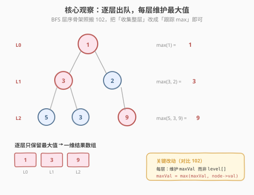
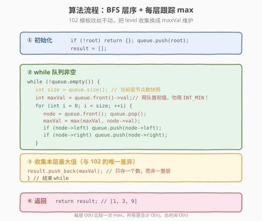
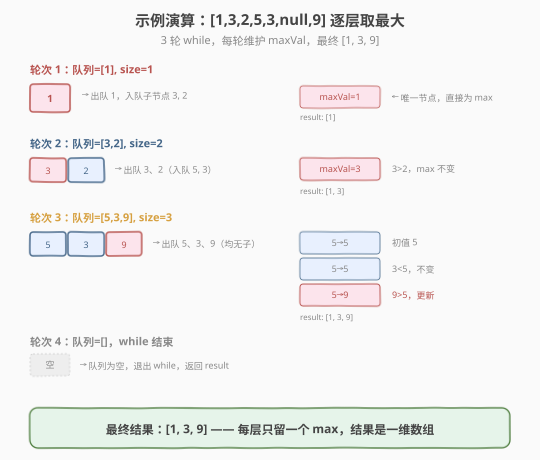

# 在每个树行中找最大值

- **题目名称**：在每个树行中找最大值
- **链接**：[515. 在每个树行中找最大值](https://leetcode.cn/problems/find-largest-value-in-each-tree-row/)
- **难度**：中等
- **标签**：树、二叉树、广度优先搜索（BFS）、深度优先搜索（DFS）

## 1. 题目概述

给定一棵二叉树的根节点 `root`，返回**每一层**节点值中的**最大值**组成的数组（层从 0 开始编号）。

**示例 1**：

```text
输入：root = [1,3,2,5,3,null,9]
          1
         / \
        3   2
       / \   \
      5   3   9
输出：[1,3,9]
解释：
  第 0 层只有 1          → max = 1
  第 1 层有 3, 2         → max = 3
  第 2 层有 5, 3, 9      → max = 9
```

**示例 2**：

```text
输入：root = [1,2,3]
        1
       / \
      2   3
输出：[1,3]
```

**约束条件**：

- 树中节点数目在范围 `[0, 10^4]` 内
- $-2^{31} \le \text{Node.val} \le 2^{31} - 1$，即节点值可能取到 `INT_MIN` 和 `INT_MAX`

> 💡 这是 [102. 二叉树的层序遍历](../0101-0200/102_二叉树的层序遍历.md) 的「最小增量」变体——BFS 层序骨架完全照搬，只把「收集整层到 `level[]`」换成「跟踪一个 `maxVal`」。和 [103. 锯齿形层序遍历](../0101-0200/103_二叉树的锯齿形层序遍历.md) 一样，它考察的是你能否在不动 BFS 模板的前提下做最小改动。**一个隐藏的坑**：节点值范围是完整的 32 位整数，`INT_MIN` 是合法值，所以初始化 `maxVal` 时**不能用 `INT_MIN` 当哨兵**。

---

## 2. 解题思路

### 2.1 暴力思路：DFS 记录每层全部值后再求 max

用 DFS 递归，传入层数 `depth`，把节点值存入 `result[depth]`，遍历完后对每个子列表调用 `max()`。

```text
dfs(node, depth):
    if node == null: return
    result[depth].append(node.val)   // 按层存全部值
    dfs(node.left, depth+1)
    dfs(node.right, depth+1)

// 收集完后：
for each level in result:
    output.append(max(level))
```

DFS 能得到正确结果，但有两个问题：① 需要额外存下**每层的全部节点值**，空间开销比「只存一个 max」大；② DFS 天然「深度优先」，不符合「逐层处理」的直觉，也不利于迁移到「按层/按距离」类问题。更自然的方式是沿用 **BFS 队列 + 层分隔** 模板，在每层**当场维护最大值**。

> ⚠️ DFS 方案能过本题，但面试官通常期望你用 BFS——因为这是「层序遍历家族」的标准解法，能无缝复用 102 的模板，改动最小、最不易错。

### 2.2 核心观察：BFS 队列 + 每层跟踪 max

**关键洞察**：BFS 的 `while + for(size)` 模板天然把节点按层切分——每一轮 while 处理的恰好是同一层的所有节点。既然如此，**不需要把整层值都存下来**，只要在这一轮 for 循环里维护一个 `maxVal`，逐个比较更新即可。循环结束时 `maxVal` 就是本层最大值，直接 push 进结果。



**与 102 的唯一差异**：

| | 102 层序遍历 | 515 每层最大值 |
|---|---|---|
| 每层维护 | `level[]` 收集全部值 | `maxVal` 单个变量 |
| 循环体内 | `level.push_back(node->val)` | `maxVal = max(maxVal, node->val)` |
| 每层结束 | `result.push_back(level)`（子列表） | `result.push_back(maxVal)`（单值） |
| 结果形状 | 二维 `vector<vector<int>>` | 一维 `vector<int>` |

> ⚠️ **哨兵陷阱**：节点值范围是 $[-2^{31}, 2^{31}-1]$，即 `[INT_MIN, INT_MAX]`。**`INT_MIN` 本身就是合法节点值**！若用 `int maxVal = INT_MIN;` 当初始哨兵，当某层第一个节点值恰好是 `INT_MIN` 时虽然不影响结果，但更稳妥、更可读的写法是**用队首节点的值初始化** `maxVal`（此时队首一定存在，因为 `size > 0` 才进入循环）。这样既避免了哨兵歧义，也省去对 `INT_MIN` 的特殊顾虑。C++ 中也可用 `long long maxVal = LLONG_MIN` 规避，但「队首初值」最自然。

### 2.3 算法流程图



**完整步骤**：

1. **特判**：`root == null` 返回空列表
2. **初始化**：队列 `queue = [root]`，结果 `result = []`
3. **while 队列非空**：
   - `size = queue.size()`（当前层节点数快照）
   - `maxVal = queue.front()->val`（用队首初值，**不用 `INT_MIN`**）
   - `for i in 0..size`：
     - `node = queue.pop_front()`
     - `maxVal = max(maxVal, node->val)`
     - 子节点入队：`if node.left: queue.push_back(node.left)`；`if node.right: queue.push_back(node.right)`
   - `result.push_back(maxVal)`
4. 返回 `result`

### 2.4 示例演算

以示例 1 的树 `[1,3,2,5,3,null,9]` 为例：



| 轮次 | 队列初始 | size | maxVal 演变 | 入队子节点 | result |
|------|---------|------|------------|-----------|--------|
| 1 | [1] | 1 | 1 | 3, 2 | [1] |
| 2 | [3, 2] | 2 | 3 → 3（3 > 2 不变） | 5, 3 | [1, 3] |
| 3 | [5, 3, 9] | 3 | 5 → 5 → 9（9 > 5 更新） | （均无子） | [1, 3, 9] |
| 4 | [] | — | 队列空，结束 | — | — |

最终 `result = [1, 3, 9]`。

> 💡 注意第 3 轮：`maxVal` 用队首 5 初始化，先比 5（不变），再比 3（不变），最后比 9（更新为 9）。如果误用 `INT_MIN` 当哨兵，逻辑上也能得到 9，但当节点值取到 `INT_MIN` 时心智负担更大——「队首初值」一劳永逸。

---

## 3. 参考代码

### C++

```cpp
// 在每个树行中找最大值.cpp —— BFS 队列 + 每层跟踪 max
// 编译: g++ -O2 -std=c++17 在每个树行中找最大值.cpp -o largestvals
#include <vector>
#include <queue>
#include <algorithm>
using namespace std;

struct TreeNode {
    int val;
    TreeNode* left;
    TreeNode* right;
    TreeNode() : val(0), left(nullptr), right(nullptr) {
    }
    TreeNode(int x) : val(x), left(nullptr), right(nullptr) {
    }
    TreeNode(int x, TreeNode* l, TreeNode* r) : val(x), left(l), right(r) {
    }
};

class Solution {
  public:
    vector<int> largestValues(TreeNode* root) {
        vector<int> result;
        if (root == nullptr)
            return result; // 特判空树

        queue<TreeNode*> q;
        q.push(root);

        while (!q.empty()) {
            int size = q.size();                       // ① 当前层节点数快照
            int maxVal = q.front()->val;               // ② 队首初值，勿用 INT_MIN
            for (int i = 0; i < size; ++i) {           // ③ 恰好处理一整层
                TreeNode* node = q.front();
                q.pop();
                maxVal = max(maxVal, node->val);       // ④ 跟踪本层最大值
                if (node->left)
                    q.push(node->left);                // ⑤ 子节点入队（下一层）
                if (node->right)
                    q.push(node->right);
            }
            result.push_back(maxVal);                  // ⑥ 只存一个数
        }
        return result;
    }
};
```

### Python

```python
from collections import deque

class Solution:
    def largestValues(self, root: TreeNode | None) -> list[int]:
        result = []
        if not root:
            return result

        queue = deque([root])

        while queue:
            size = len(queue)               # 当前层节点数
            max_val = queue[0].val          # 队首初值，规避 INT_MIN 哨兵歧义
            for _ in range(size):           # 恰好处理一整层
                node = queue.popleft()
                if node.val > max_val:
                    max_val = node.val
                if node.left:
                    queue.append(node.left)
                if node.right:
                    queue.append(node.right)
            result.append(max_val)
        return result
```

> 💡 Python 中 `queue[0]` 直接读取队首元素（`deque` 支持 `O(1)` 索引访问两端），无需 `popleft` 再 `appendleft` 回去。也可写 `max_val = float('-inf')`，但用队首值更贴近「本层一定非空」的语义。

---

## 4. 复杂度分析

| 维度 | 复杂度 | 说明 |
|------|--------|------|
| **时间复杂度** | `O(n)` | 每个节点恰好入队/出队 1 次，每层做 `k` 次 `max` 比较，所有层比较总次数 `= n` |
| **空间复杂度** | `O(w)` | `w` 为树的最大宽度（最宽层的节点数），满二叉树最后一层 `n/2` 个 → 退化到 `O(n)`；结果数组 `O(h)`，`h` 为树高 |

> ⚠️ 空间复杂度比 102 略优：102 的结果数组存全部 `n` 个值，本题结果数组只存 `h` 个值（每层一个），但队列开销 `O(w)` 与 102 相同，故总空间仍记 `O(n)`（满二叉树 `w = n/2` 主导）。DFS 写法的队列换成递归栈 `O(h)`，但结果数组仍 `O(h)`，平衡树总空间 `O(log n)`——这是 DFS 在空间上的唯一优势。

---

## 5. 扩展：DFS 写法（递归 + 层数）

BFS 是层序问题的标准解法，但 DFS 也能做：递归传入 `depth`，维护一个按层索引的 `maxVal` 数组，遇到更深的层就 `push_back`，同层比较取大。

```python
class Solution:
    def largestValues(self, root: TreeNode | None) -> list[int]:
        result = []
        def dfs(node: TreeNode | None, depth: int):
            if not node:
                return
            if depth == len(result):        # 首次到达该层，直接追加
                result.append(node.val)
            else:                            # 同层已有值，取大
                if node.val > result[depth]:
                    result[depth] = node.val
            dfs(node.left, depth + 1)
            dfs(node.right, depth + 1)
        dfs(root, 0)
        return result
```

> 💡 **DFS vs BFS 取舍**：
> - **BFS** 天然按层处理，是「层序家族」统一模板，可迁移到最短路径、按距离扩散等问题，**面试首选**。
> - **DFS** 空间为递归栈 `O(h)`（平衡树 `O(log n)`），比 BFS 的队列 `O(w)` 更省；但当树退化为链表时栈深 `O(n)`，且 DFS 不利于迁移到「最短步数」类问题。
> - 经验：能用 BFS 就用 BFS，除非数据规模明确让队列爆内存（极宽树），或问题本身就是深度依赖（如路径和、祖先链）。

---

## 6. 面试要点

1. **本题和 102 层序遍历的区别是什么？**

   - 唯一区别：**每层只保留一个 max 而非整层值列表**。代码层面：把 `level[]` 换成 `maxVal`，循环体内 `push_back` 换成 `max`，每层结束 push 一个数而非一个子列表，结果从二维降为一维。BFS 骨架、`size` 快照、入队顺序全部不变。

2. **为什么 maxVal 不能用 `INT_MIN` 初始化？**

   - 题目约束 $-2^{31} \le \text{Node.val} \le 2^{31}-1$，即 `INT_MIN` 本身是**合法节点值**。虽然用 `INT_MIN` 当哨兵在逻辑上仍能得到正确结果（因为 `max(INT_MIN, INT_MIN) == INT_MIN`），但它会让人误以为「`INT_MIN` 是不可能的特殊值」，埋下心智负担。
   - 稳妥写法：`maxVal = queue.front()->val`——进入 while 循环时队列一定非空（`size > 0`），队首值就是本层某个真实节点的值，语义清晰、无哨兵歧义。

3. `size = queue.size()` **这行为什么不能省？**

   - for 循环体里会 `push` 子节点，队列长度动态变化。若不固定 `size`，for 循环会「跨层」处理，把下一层节点也并入当前层的 `maxVal` 计算，结果就错了。`size` 快照锁定本层边界——这是 102 模板的核心，515 完全继承。

4. **BFS 和 DFS 在本题的空间复杂度差异？**

   - BFS 队列存一层节点，最大宽度 `w`，满二叉树 `w = n/2` → `O(n)`；结果数组 `O(h)`。
   - DFS 递归栈深 `O(h)`，结果数组 `O(h)`，平衡树总 `O(log n)`，退化链表 `O(n)`。
   - 当树很宽很浅时（宽树），DFS 的 `O(h)` 优于 BFS 的 `O(w)`；当树很深很窄时（链状树），两者都退化到 `O(n)`。面试时按数据特征选择，无特殊要求默认 BFS。

5. **如果要求每层最小值（或每层和/平均）怎么做？**

   - 把 `maxVal = max(maxVal, node->val)` 换成 `minVal = min(minVal, node->val)`（注意哨兵要改成 `INT_MAX` 或队首初值）、或 `sum += node->val`、或 `sum / size` 即可。`while + for(size)` 模板可承载任何「逐层聚合」操作——这是层序模板的通用性所在。

> 💡 **一句话总结**：515 是 102 层序遍历的「聚合版」变体——BFS 队列骨架纹丝不动，只把 `level[]` 收集换成 `maxVal` 跟踪。核心心法是 **`while + for(size)` 模板可承载任何逐层聚合**（max/min/sum/avg），改动量永远只有循环体里那一行。唯一要注意的坑是节点值取满 32 位范围时**用队首初值而非 `INT_MIN` 哨兵**初始化聚合变量。

---

## 7. 同类练习题

- [102. 二叉树的层序遍历](https://leetcode.cn/problems/binary-tree-level-order-traversal/)（[题解](../0101-0200/102_二叉树的层序遍历.md)）：本题的母模板，`while + for(size)` 骨架的来源
- [103. 二叉树的锯齿形层序遍历](https://leetcode.cn/problems/binary-tree-zigzag-level-order-traversal/)（[题解](../0101-0200/103_二叉树的锯齿形层序遍历.md)）：同属层序家族的最小增量变体，加一行 `reverse`
- [199. 二叉树的右视图](https://leetcode.cn/problems/binary-tree-right-side-view/)：每层只取最右节点，复用同一 BFS 骨架做「逐层取一个」
- [107. 二叉树的层序遍历 II](https://leetcode.cn/problems/binary-tree-level-order-traversal-ii/)：自底向上层序，最后整体 `reverse(result)` 即可
- [116. 填充每个节点的下一个右侧节点指针](https://leetcode.cn/problems/populating-next-right-pointers-in-each-node/)：层序遍历的「层内链接」应用，同层节点通过 `next` 串联
