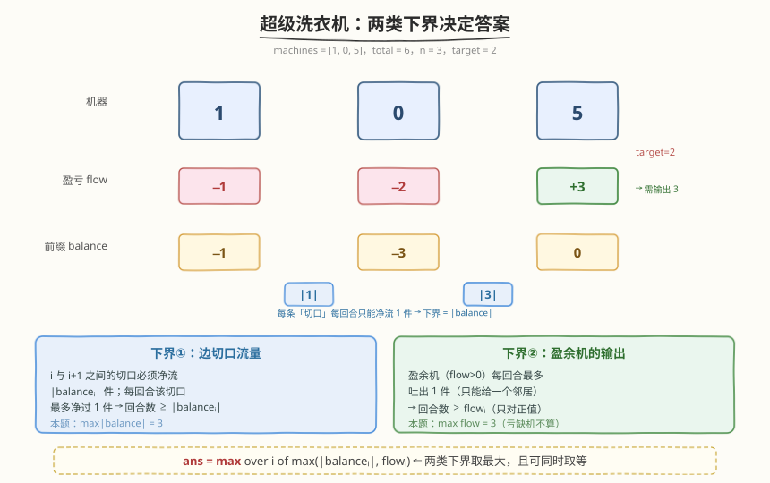
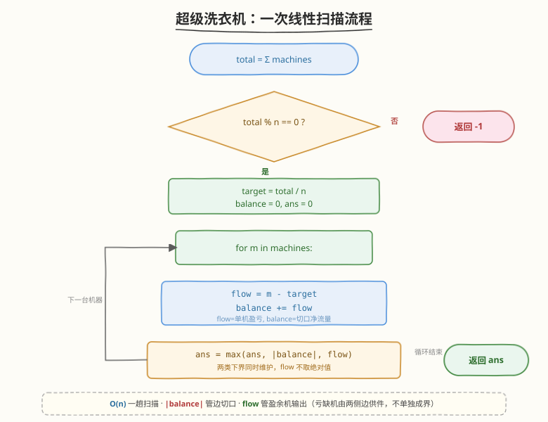

# LeetCode 超级洗衣机 题解

## 1. 题目概述

- **标题 / 题号**：超级洗衣机（#517，hard）
- **链接**：https://leetcode.cn/problems/super-washing-machines/
- **难度**：困难
- **标签**：贪心、前缀和、数组

**题意**：有 `n` 台超级洗衣机排成一行。初始时第 `i` 台洗衣机里有 `machines[i]` 件衣服。每一回合（move），你可以**任选 m 台（1 ≤ m ≤ n）洗衣机**，让选中的每台同时把 **1 件衣服**传给它的**某一台相邻**洗衣机。

返回使**所有洗衣机衣服数量相同**所需的最少回合数。若不可能，返回 `-1`。

**示例 1**：

```text
输入：machines = [1,0,5]
输出：3
解释：
第 1 回合: [1,0,5] → [1,1,4]   （第 3 台传 1 件给第 2 台）
第 2 回合: [1,1,4] → [1,2,3]   （第 3 台传 1 件给第 2 台）
第 3 回合: [1,2,3] → [2,2,2]   （第 3 台传 1 件给第 2 台）
```

**示例 2**：

```text
输入：machines = [0,3,0]
输出：2
解释：
第 1 回合: [0,3,0] → [1,2,0]   （第 2 台传 1 件给第 1 台）
第 2 回合: [1,2,0] → [1,1,1]   （第 2 台传 1 件给第 3 台）
```

**示例 3**：

```text
输入：machines = [0,2,0]
输出：-1
解释：总共 2 件衣服、3 台机器，无法均分。
```

**约束**：

- `n == machines.length`
- $1 \leq n \leq 10^4$
- $0 \leq \text{machines[i]} \leq 10^5$

> 💡 本题的难点不在「怎么做」，而在「**为什么这样做是对的**」。表面看像 BFS/模拟，真正答案是**两类下界取最大**——「切口净流量」与「盈余机输出量」。这种「先证下界、再证可达」的贪心思路，和 [134. 加油站](../0101-0200/134_加油站.md) 的前缀和分析、[453. 最小操作次数使数组元素相等](../0401-0500/453_最小操作次数使数组元素相等.md) 的「逆向 +1」化归是同一脉的思维。

## 2. 解题思路

### 2.1 暴力思路：BFS 模拟状态

最朴素的思路是把整个数组当作状态，做 BFS：每个回合枚举「选哪些机器、各传给左还是右」，直到所有位置都等于 `target`，记录层数。问题在于：

- 状态空间天文级——每个位置取值在 $[0, \max]$，总状态数可达 $\max^n$。
- 每回合的分支数极大（$n$ 台机器各有「不动 / 向左 / 向右」三选），$3^n$ 条转移。

$n = 10^4$ 时根本无从搜索。而且「贪心模拟」（每回合尽量把多余的衣服推向缺口）也**不能保证最少回合**——因为可能把本该同时双向往外推的机器逼成单向。必须跳出模拟，从「**流量下界**」角度分析。

### 2.2 核心观察：两类下界决定答案



先判可行性：若 $\text{total} = \sum \text{machines[i]}$ 不能被 $n$ 整除，直接返回 `-1`。否则目标件数 $\text{target} = \text{total} / n$。

定义每台机器的**盈亏**：

$$
\text{flow}_i = \text{machines}[i] - \text{target}
$$

- $\text{flow}_i > 0$：盈余，需向外送出 $\text{flow}_i$ 件；
- $\text{flow}_i < 0$：亏缺，需接收 $|\text{flow}_i|$ 件；
- $\text{flow}_i = 0$：已平衡。

再定义**前缀净流量**（即「切口流量」）：

$$
\text{balance}_i = \sum_{j=0}^{i} \text{flow}_j
$$

> 💡 $\text{balance}_i$ 的物理意义：为了让全局平衡，**必须穿过「机器 $i$ 与 $i+1$ 之间的切口」的净衣服数**。若 $\text{balance}_i > 0$，说明左半侧总体盈余 $\text{balance}_i$ 件，要净流向右；若 $<0$，则净流向左。注意是「净」——单向流 $\text{balance}_i + 2k$ 件再回流 $2k$ 件是没有意义的浪费，最优解里不会出现。

**下界①：边切口流量。** 每一回合，任一切口 $i|i+1$ 上**最多净流 1 件**（因为选中机器各传 1 件给相邻，跨过同一切口的「向左」和「向右」会相互抵消净效果，净变化最多为 $\pm 1$）。而该切口总共需要净流 $|\text{balance}_i|$ 件，故：

$$
\text{回合数} \;\geq\; |\text{balance}_i| \qquad \forall\, i
$$

**下界②：盈余机的输出。** 一台盈余机（$\text{flow}_i > 0$）每回合**只能向一个邻居送出 1 件**（题目限定「传给**一台**相邻」）。要送完 $\text{flow}_i$ 件，至少需要 $\text{flow}_i$ 回合：

$$
\text{回合数} \;\geq\; \text{flow}_i \qquad \forall\, i \text{ with } \text{flow}_i > 0
$$

> ⚠️ **为什么亏缺机不算下界？** 亏缺机（$\text{flow}_i < 0$）需要**接收** $|\text{flow}_i|$ 件，但接收可以**同时来自左右两个邻居**——每回合最多收 2 件。而且它的入流量已经被「两条相邻切口的流量下界」分别管住了，不会成为新的瓶颈。所以下界②只看**正值**的 $\text{flow}_i$，这也是代码里写 `flow` 而非 `abs(flow)` 的关键原因。

**结论**：两个下界都成立，且可以证明它们**能同时取到**（见 2.4 与第 5 节），所以：

$$
\boxed{\;\text{ans} = \max_{i}\; \max\bigl(\,|\text{balance}_i|,\; \text{flow}_i\,\bigr)\;}
$$

### 2.3 算法流程图



**完整步骤**：

1. **求总和**：`total = sum(machines)`。
2. **判可行性**：若 `total % n != 0`，返回 `-1`；否则 `target = total // n`。
3. **一趟扫描**：维护 `balance`（前缀净流量，初值 0）与 `ans`（初值 0）。对每台 `m`：
   - `flow = m - target`
   - `balance += flow`
   - `ans = max(ans, abs(balance), flow)`  ← 注意 `flow` **不取绝对值**
4. **返回** `ans`。

> 💡 **为什么 `flow` 不取绝对值？** 见 2.2 的分析——亏缺机的接收不是瓶颈（可双侧同时入件）。若误写成 `abs(flow)`，遇到「左盈余 + 右亏缺」的局面会把亏缺机误判成下界，答案偏大。例如 `machines = [15, 0, 15, 10]`，`target = 10`：正确答案 5（中位亏缺机 10 件可左右各收 5），用 `abs(flow)` 会得到 10（错误）。

### 2.4 示例演算

以 `machines = [1, 0, 5]`（期望答案 3）为例：

![示例演算：[1,0,5] 的实际搬运与一趟扫描计算](../images/super_washing_machines_walkthrough.svg)

**一趟扫描计算表**（`target = 2`）：

| `i` | `m` | `flow = m−target` | `balance += flow` | `max(|balance|, flow)` | `ans` |
|-----|-----|-------------------|-------------------|------------------------|-------|
| 0   | 1   | −1                | −1                | max(1, −1) = 1         | 1     |
| 1   | 0   | −2                | −3                | max(3, −2) = 3         | 3     |
| 2   | 5   | +3                | 0                 | max(0, +3) = 3         | **3** |

**下界对照**：

- **边切口**：切口 `0|1` 需净流 $|\text{balance}_0|=1$；切口 `1|2` 需净流 $|\text{balance}_1|=3$ ← 最紧。
- **盈余机**：`m₀`、`m₁` 都是亏缺（不计）；`m₂` 盈余 `+3` ← 最紧。

两个下界都在 **3** 处取到，且互不冲突：切口 `1|2` 三回合向左净流 3 件，正好就是 `m₂` 每回合向左吐 1 件、连吐三回合。所以 `ans = 3` 可达。

> 💡 **关键直觉**：两类下界是「**并行**」而非「**串行**」的——同一回合里，切口在传衣服的同时，盈余机也在吐衣服，是**同一件事的两个视角**。所以答案是取 `max`，而不是相加。若误以为「先把衣服搬到切口、再从切口搬给亏缺机」分两阶段串行，就会错误地相加得到偏大答案。

## 3. 参考代码

### C++

```cpp
class Solution {
  public:
    int findMinMoves(vector<int>& machines) {
        int total = accumulate(machines.begin(), machines.end(), 0);
        int n = machines.size();
        if (total % n != 0) return -1;          // 无法均分
        int target = total / n;

        int ans = 0, balance = 0;
        for (int m : machines) {
            int flow = m - target;              // 单机盈亏
            balance += flow;                    // 切口净流量
            ans = max({ans, abs(balance), flow});// flow 不取绝对值
        }
        return ans;
    }
};
```

### Python

```python
class Solution:
    def findMinMoves(self, machines: List[int]) -> int:
        total = sum(machines)
        n = len(machines)
        if total % n != 0:
            return -1                          # 无法均分
        target = total // n

        ans = 0
        balance = 0
        for m in machines:
            flow = m - target                  # 单机盈亏
            balance += flow                    # 切口净流量
            ans = max(ans, abs(balance), flow) # flow 不取绝对值
        return ans
```

> ⚠️ **三个高频踩坑点**：
> （1）**忘判整除**：`total % n != 0` 直接返回 `-1`，否则后续 `target` 不是整数，逻辑全错。
> （2）**把 `flow` 写成 `abs(flow)`**：这是最隐蔽的 bug。亏缺机的接收可双侧并行，不是瓶颈；写成 `abs(flow)` 会在「左盈右亏」型数据上给出偏大答案。
> （3）**误把两下界相加**：切口流量与盈余输出是并行视角，取 `max` 即可。相加会把「同一件衣服被数两次」。

## 4. 复杂度分析

| 维度 | 复杂度 | 说明 |
|------|--------|------|
| **时间复杂度** | $O(n)$ | 一趟遍历，每台机器 $O(1)$ 更新 `balance` 与 `ans` |
| **空间复杂度** | $O(1)$ | 只用 `total`、`target`、`balance`、`ans` 几个标量，无额外数组 |

> 💡 本题 $n \leq 10^4$、$\text{machines[i]} \leq 10^5$，`total` 最大 $10^9$，用 32 位 `int` 足够（`accumulate` 返回 `int`，最大约 $10^9$ 不溢出）。若题目把上限抬到 $10^9$ 级，改用 `long long` 即可。$O(n)$ 时间、$O(1)$ 空间是该题的理论最优——至少要把每台机器读一遍，下界 $O(n)$ 不可破。

## 5. 扩展：为什么「取 max」就够了？——下界可达性证明

我们已经得到两个下界：$\text{回合数} \geq \max_i |\text{balance}_i|$ 和 $\text{回合数} \geq \max_i \text{flow}_i$（仅正值）。合并得 $L = \max_i \max(|\text{balance}_i|, \text{flow}_i)$。还需证明 $L$ 回合**确实够用**，才能断言 `ans = L`。

**构造性证明思路**（不失一般性，设所有 `flow` 已知）：

1. **每个切口的吞吐量恰好 $|\text{balance}_i|$**：把每台机器的 `flow` 视为「需要发往/收自」两侧的件数。对机器 $i$，设它需要向左送 $L_i$、向右送 $R_i$，满足 $L_i + R_i = \max(\text{flow}_i, 0)$（只对盈余机有外送；亏缺机 $L_i = R_i = 0$，只接收）。由 `balance` 的定义可递推得到一组合法的 $\{L_i, R_i\}$，且每个切口 $i|i+1$ 上的「右向流量」$R_i$ 与「左向流量」$L_{i+1}$ 满足 $R_i - L_{i+1} = \text{balance}_i$（净流就是切口流量）。

2. **每回合，切口 $i|i+1$ 的净流恰好 $\pm 1$ 或 $0$**：在 $L$ 回合里把 $R_i$（或 $L_{i+1}$）均匀排开，每个切口每回合只过 1 件。因为 $R_i, L_{i+1} \leq |\text{balance}_i| \leq L$，时间够用。

3. **盈余机每回合只送 1 件**：机器 $i$ 的外送量 $L_i + R_i = \text{flow}_i \leq L$，分摊到 $L$ 回合每回合送 1 件即可（向左或向右二选一，不会同时）。

4. **两约束不冲突**：步骤 2 约束「切口」、步骤 3 约束「单机」，构造时只要让「该回合机器 $i$ 送出方向」与「该切口该回合允许方向」一致即可——由于净流方向与盈余机外送方向天然同号，总能排出一个合法调度。

> 💡 严格证明可参考「负载均衡 / 最小 makespan」相关论文里的 max-flow 构造。面试中讲清「两个下界 + 可并行」已足够。**核心是「并行」二字**：切口在流、机器在吐，是同一回合里同时发生的两件事，所以取 `max` 而非相加。

### 一个对照实验：`abs(flow)` 为什么错

取 `machines = [15, 0, 15, 10]`，`target = 10`：

- `flow = [+5, −10, +5, 0]`，`balance = [+5, −5, 0, 0]`。
- 正确式 `max(|balance|, flow)`：`max(5,5)=5`、`max(5,−10)=5`、`max(0,5)=5`、`max(0,0)=0` → **ans = 5**。
- 错误式 `max(|balance|, abs(flow))`：第二个位置 `max(5, 10)=10` → **ans = 10**（错）。

实际 5 回合即可：每回合 `m₀→m₁` 且 `m₂→m₁` 同时进行，5 回合后 `m₁` 收到 $5+5=10$ 件。亏缺机 `m₁` 双侧并行接收，10 件只需 5 回合——这正是「亏缺机不成下界」的活例子。

## 6. 面试要点

1. **`balance`（前缀净流量）的物理意义是什么？**

   > `balance_i` = $\sum_{j \leq i} \text{flow}_j$，表示「要让全局平衡，必须穿过切口 $i|i+1$ 的净衣服数」。正号表示左半侧盈余需净流向右，负号表示净流向左。它**天然**是相邻两段供需的差值，所以最后一位 `balance_{n-1} = 0`（整体已平衡）。

2. **为什么 `flow` 不取绝对值，而 `balance` 要取？**

   > `balance` 是**切口的净流量**，无论方向，其大小 $|\text{balance}|$ 都是该切口每回合最多过 1 件的瓶颈，故取绝对值。`flow` 是**单台盈余机的外送量**，每回合该机只能送 1 件，故对盈余机（`flow > 0`）是瓶颈；亏缺机（`flow < 0`）接收可双侧并行（每回合最多收 2 件），不构成单机瓶颈，其入量已被两侧切口的 $|\text{balance}|$ 分别约束。所以 `flow` 只在正值时计入，写 `flow` 而非 `abs(flow)`。

3. **两个下界为什么取 `max` 而不是相加？**

   > 它们是**并行**的约束，不是串行阶段。同一回合里，「衣服穿过切口」和「盈余机吐出 1 件」是**同一件衣服的两种视角**——机器 $i$ 把 1 件衣服递给 $i+1$，既算机器 $i$ 的 1 次输出，又算切口 $i|i+1$ 的 1 次净流。所以两者同时发生，回合数取 `max`。若误为串行相加，等于把同一件衣服数两遍。

4. **如何证明 `max(下界)` 回合真的够用？**

   > 构造性论证：把每台盈余机的外送量拆成「向左 $L_i$ + 向右 $R_i$」，满足 $L_i + R_i = \text{flow}_i$ 且切口净流 $R_i - L_{i+1} = \text{balance}_i$。由于 $L_i, R_i \leq \text{flow}_i \leq L$ 且 $\leq |\text{balance}| \leq L$，在 $L$ 回合里把这些单件传输均匀排开，每回合每切口净流 $\pm 1$、每盈余机送 1 件，两约束同号不冲突，总能排出合法调度。

5. **本题与 [134. 加油站](../0101-0200/134_加油站.md) 的前缀和分析有何异同？**

   > 都用「前缀和」刻画「跨过某位置的净流量」。[134] 中 `balance` 是油量盈亏，只要全程 `balance` 不跌破 0 就能从该点出发跑完一圈（环形，所以还用「总和 ≥ 0」判可行性）。[517] 中 `balance` 是衣服净流量，**每个切口**都要在 $|\text{balance}|$ 回合内过完，取所有切口的**最大值**（而非「最小值 ≥ 0 的起点」）。一个是「最小值判可行」，一个是「最大值定答案」，方向相反但同源。

> 💡 **一句话总结**：517 的灵魂是「**两类下界取 max**」——切口净流量 $|\text{balance}_i|$ 管边、盈余机 $\text{flow}_i$ 管点，亏缺机由双侧供件不算界。$O(n)$ 一趟扫描，空间 $O(1)$。关键是想清「并行而非串行」，以及「`flow` 不取绝对值」。

## 同类练习题

| # | 题目 | 与本题的关联 |
|---|------|-------------|
| 134 | [加油站](https://leetcode.cn/problems/gas-station/)（[题解](../0101-0200/134_加油站.md)） | 前缀和判环形可行性的经典，对比「最小值判起点」与本题「最大值定答案」 |
| 453 | [最小操作次数使数组元素相等](https://leetcode.cn/problems/minimum-moves-to-equal-array-elements/)（[题解](../0401-0500/453_最小操作次数使数组元素相等.md)） | 同样是「均分数组」，操作「n−1 个元素 +1」等价于「1 个元素 −1」，转化为对最小值的累加差 |
| 462 | [最小操作次数使数组元素相等 II](https://leetcode.cn/problems/minimum-moves-to-equal-array-elements-ii/)（[题解](../0401-0500/462_最小操作次数使数组元素相等II.md)） | 均分到**中位数**，操作可任改任一元素，对比「任意距离」与本题「相邻逐件传递」的模型差异 |
| 135 | [分发糖果](https://leetcode.cn/problems/candy/)（[题解](../0101-0200/135_分发糖果.md)） | 两次前缀扫描维护「左右约束取 max」，与本题「两类下界取 max」思想同构 |
| 1526 | [形成目标数组的最少操作次数](https://leetcode.cn/problems/minimum-number-of-increments-on-subarrays-to-form-a-target-array/) | 差分数组求最少区间加操作，本质也是「相邻差值取 max」的下界思维 |
