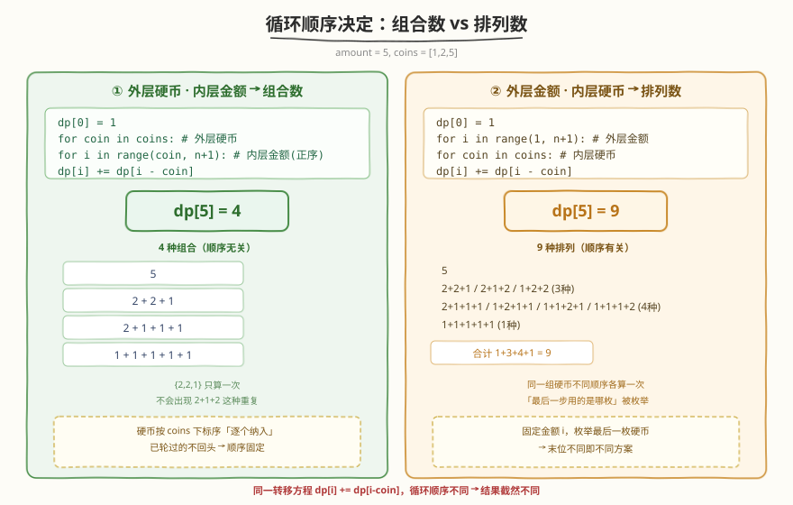
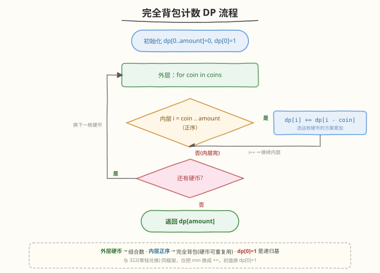

# 零钱兑换II

- **题目名称**：零钱兑换II
- **链接**：[518. 零钱兑换 II](https://leetcode.cn/problems/coin-change-ii/)
- **难度**：中等
- **标签**：动态规划、完全背包、计数

## 1. 题目概述

给定整数数组 `coins` 表示不同面额的硬币，以及一个整数 `amount` 表示总金额。返回可以**凑成总金额的硬币组合数**。每种硬币可以使用**无限次**。若无法凑出该金额，返回 `0`。假设答案保证符合 32 位带符号整数范围。

**示例 1**：

```text
输入：amount = 5, coins = [1,2,5]
输出：4
解释：4 种组合方式：
5 = 5
5 = 2+2+1
5 = 2+1+1+1
5 = 1+1+1+1+1
```

**示例 2**：

```text
输入：amount = 3, coins = [2]
输出：0
解释：只有面额 2 的硬币，无法凑出 3。
```

**示例 3**：

```text
输入：amount = 10, coins = [10]
输出：1
解释：用一枚 10 元硬币即可。
```

**约束条件**：

- $1 \leq \text{coins.length} \leq 300$
- $1 \leq \text{coins[i]} \leq 5000$
- $\text{coins[i]}$ 的值互不相同
- $0 \leq \text{amount} \leq 5000$

> 💡 本题是 [322. 零钱兑换](../0301-0400/322_零钱兑换.md) 的「**计数版**」——同样是每种硬币无限用的完全背包，但 322 求「**最少**几枚」，本题求「**多少种**凑法」。把 322 的 `min` 换成 `+=`、初值换一下，框架完全一致。本题真正值得记的是「**循环顺序决定组合还是排列**」这一条，它能让你顺手拿下 377. 组合总和 IV。

---

## 2. 解题思路

### 2.1 暴力思路：回溯枚举

对每个金额从所有硬币里挑一枚继续递归，数出凑到 `amount` 的方案总数。指数级 $O(\text{amount}^{\text{coins.length}})$，严重超时。加记忆化（状态 `(当前金额, 当前硬币下标)`）可降到 $O(\text{amount} \cdot n)$，但不如下面的背包 DP 直观。

### 2.2 核心观察：完全背包计数——循环顺序决定组合/排列



定义 `dp[i]` = 凑出金额 `i` 的**方案数**。转移方程：

$$
\text{dp}[i] \;{+}{=}\; \text{dp}[i - \text{coin}] \qquad \text{for coin in coins if } i \geq \text{coin}
$$

初始 `dp[0] = 1`（金额为 0 有一种「什么都不选」的方案），其余 `dp[i] = 0`。

> 💡 **本题的灵魂是循环顺序**：完全背包计数有两种写法，看似只换了内外层，结果却天差地别。
>
> - **外层硬币、内层金额（正序）→ 组合数**（本题）。固定一种硬币，把它能贡献的所有金额一次性填完，再换下一种硬币。这样同一组硬币**只按「哪些硬币被用了」**统计一次，`{1,2,2}` 和 `{2,2,1}` 不会重复算。
> - **外层金额、内层硬币 → 排列数**（[377. 组合总和 IV](https://leetcode.cn/problems/combination-sum-iv/)）。固定金额 `i`，逐个硬币尝试「最后一步用的是哪枚」，于是**顺序不同算不同方案**，`1+2+2`、`2+1+2`、`2+2+1` 会被算成 3 种。

> ⚠️ **为什么内层必须正序？** 每种硬币可无限使用，是**完全背包**。一维完全背包要求内层 `i` 从小到大正序遍历，这样计算 `dp[i]` 时引用的 `dp[i-coin]` 已经包含了「当前这枚硬币」的贡献，等价于「这枚硬币可被重复选」。若倒序，则退化成 0-1 背包（每枚硬币只用一次），与题意「无限使用」相悖——这与 [494. 目标和](../0401-0500/494_目标和.md) 的 0-1 背包**倒序**恰好相反，对比着记最牢。

### 2.3 算法流程图



**三步法**（在 322 的骨架上把 `min` 换成 `+=`）：

1. **初始化**：`dp[0..amount] = 0`，`dp[0] = 1`。
2. **外层遍历硬币** `coin`，**内层金额** `i` 从 `coin` 到 `amount` **正序**：
   - $\text{dp}[i] \;{+}{=}\; \text{dp}[i - \text{coin}]$（选这枚硬币的方案数累加进来）。
3. **返回** `dp[amount]`。

> 💡 **与 322 的对照**：322 求「最少硬币数」用 $\text{dp}[i] = \min(\text{dp}[i], \text{dp}[i-\text{coin}]+1)$、初值 `INF`；本题求「方案数」用 $\text{dp}[i] \mathrel{+}= \text{dp}[i-\text{coin}]$、初值 `dp[0]=1`。**背包框架不变，只换转移算子和初值**——这就是「一道题学一个模板」的迁移力。

### 2.4 示例演算

以 `amount = 5, coins = [1,2,5]` 为例（期望答案 4）：

![示例演算：coins=[1,2,5], amount=5 三轮填充得到 dp[5]=4](../images/coin_change_ii_walkthrough.svg)

| 处理硬币 | dp[0] | dp[1] | dp[2] | dp[3] | dp[4] | dp[5] | 说明 |
|----------|-------|-------|-------|-------|-------|-------|------|
| 初始     | 1     | 0     | 0     | 0     | 0     | 0     | 空集凑出 0 |
| coin=1   | 1     | 1     | 1     | 1     | 1     | 1     | 全用 1：每种金额唯一 1 种 |
| coin=2   | 1     | 1     | 2     | 2     | 3     | 3     | 叠加「至少含一枚 2」的方案 |
| coin=5   | 1     | 1     | 2     | 2     | 3     | **4** ⭐ | 再叠加「含一枚 5」的方案 |

最终 `dp[5] = 4`，对应四种组合：`{5}`、`{2,2,1}`、`{2,1,1,1}`、`{1,1,1,1,1}`。

> 💡 **看 coin=2 这一轮**：`dp[2]` 从 1 变 2，因为新增了「一枚 2」；`dp[4]` 从 1 变 3，新增了「两枚 2」「一枚 2 + 两枚 1」两种（`dp[4-2]=dp[2]` 已含「一枚 2 + ...」，正序让 2 被重复选用，这正是完全背包想要的）。**正序保证「2 可叠加多次」**，若倒序 `dp[4]` 只会引用上一轮的 `dp[2]=1`，得到 0-1 背包的错误结果。

---

## 3. 参考代码

### C++

```cpp
class Solution {
  public:
    int change(int amount, vector<int>& coins) {
        vector<int> dp(amount + 1, 0);
        dp[0] = 1;                          // 凑出 0 的方案：什么都不选
        for (int coin : coins)              // 外层硬币 → 组合数
            for (int i = coin; i <= amount; ++i)   // 内层金额正序 → 完全背包
                dp[i] += dp[i - coin];
        return dp[amount];
    }
};
```

### Python

```python
class Solution:
    def change(self, amount: int, coins: List[int]) -> int:
        dp = [0] * (amount + 1)
        dp[0] = 1                        # 凑出 0 的方案：什么都不选
        for coin in coins:               # 外层硬币 → 组合数
            for i in range(coin, amount + 1):  # 内层金额正序 → 完全背包
                dp[i] += dp[i - coin]
        return dp[amount]
```

> ⚠️ **两个高频踩坑点**：
> （1）**内外层不能互换**。写成 `for i in range(1, amount+1): for coin in coins:` 会变成求**排列数**（377 题），`amount=5, coins=[1,2,5]` 会得到 9（`1+2+2`、`2+1+2`、`2+2+1` 被分开算）。本题要组合数，必须外层硬币。
> （2）**内层不能倒序**。倒序会让每枚硬币只被选一次，退化成 0-1 背包。例如 `coins=[2]`、`amount=4` 倒序时 `dp[4]` 只引用上一轮的 `dp[2]=0`，得到 0；而正序时 `dp[2]` 先被填成 1，`dp[4]` 才能凑出「两枚 2」得到 1。

---

## 4. 复杂度分析

| 维度 | 复杂度 | 说明 |
|------|--------|------|
| **时间复杂度** | $O(n \cdot \text{amount})$ | $n$ = coins.length，外层 $n$ 种硬币，内层最多 amount 次转移 |
| **空间复杂度** | $O(\text{amount})$ | 一维 dp 数组，长度 amount+1 |

> 💡 本题 $n \leq 300$、$\text{amount} \leq 5000$，故 $n \cdot \text{amount} \leq 1.5 \times 10^6$，一维 DP 空间仅约 20KB，轻松通过。若题目改成 $n$ 很小但 amount 极大，可考虑数学方法（生成函数 / 多项式乘法），但面试范围内一维背包足够。

---

## 5. 扩展：组合数 vs 排列数——循环顺序的本质

518 和 377 是背包 DP 里最经典的一对「镜像题」，差异只在循环顺序。理解本质后可一行迁移：

| 维度 | 518. 零钱兑换 II | 377. 组合总和 IV |
|------|------------------|------------------|
| **所求** | **组合数**（顺序无关） | **排列数**（顺序有关） |
| **外层** | 硬币 `coin` | 金额 `i` |
| **内层** | 金额 `i`（正序） | 硬币 `coin` |
| **转移** | $\text{dp}[i] \mathrel{+}= \text{dp}[i-\text{coin}]$ | $\text{dp}[i] \mathrel{+}= \text{dp}[i-\text{coin}]$ |
| **`amount=5, coins=[1,2,5]`** | **4** | **9** |

**本质解释**：

- **外层硬币**相当于给硬币**排序后**逐个纳入——每种硬币一旦「轮到」，就被允许出现在所有后续方案里，但已经轮过的硬币不会再回头。于是方案里硬币的**相对顺序固定**（按 `coins` 的下标序），`{1,2,2}` 只会被统计一次，不会出现 `{2,1,2}` 这种「2 排在 1 前面」的重复，故为**组合数**。
- **外层金额**则相当于固定「**最后一步用的是哪枚硬币**」——对金额 `i`，枚举最后一枚是 `coin`，则方案数 = 凑出 `i-coin` 的方案数之和。这样「最后一步是 1」和「最后一步是 2」是不同分支，自然区分顺序，故为**排列数**。

> 💡 **一句话记忆**：**外层硬币管「选什么」，外层金额管「最后放什么」**。前者顺序无关得组合，后者顺序有关得排列。两个转移方程一模一样，全靠循环顺序区分。

---

## 6. 面试要点

1. **为什么外层遍历硬币、内层遍历金额就是组合数？**

   - 外层固定一种硬币后，一次性更新所有金额，意味着「这枚硬币被允许出现在方案中」。已处理过的硬币不会再回头重新选择，所以每个方案里硬币的**相对顺序由 coins 的遍历序固定**，`{1,2,2}` 不会以 `{2,1,2}` 的形式被再次统计。固定顺序即「不区分顺序」，得组合数。

2. **为什么内层必须正序？倒序会怎样？**

   - 每种硬币可无限使用，是**完全背包**。一维完全背包内层正序，计算 `dp[i]` 时引用的 `dp[i-coin]` 已包含「当前硬币」的贡献，等价于「这枚硬币可被多次选」。倒序则让 `dp[i-coin]` 还是上一轮（未选当前硬币）的值，每枚硬币只用一次，退化成 0-1 背包，与题意相悖。

3. **这题和 322 零钱兑换、494 目标和、377 组合总和 IV 分别是什么关系？**

   - 与 [322](../0301-0400/322_零钱兑换.md)：同为完全背包，322 求**最少**几枚（`min` + 初值 `INF`），本题求**方案数**（`+=` + 初值 `dp[0]=1`），框架相同只换算子。
   - 与 [494](../0401-0500/494_目标和.md)：同为计数背包，但 494 是 **0-1 背包**（每元素用一次，内层**倒序**），本题是完全背包（内层**正序**）。
   - 与 377：同为完全背包计数，但 377 求**排列数**（外层金额、内层硬币），本题求**组合数**（外层硬币、内层金额）。**记牢这组对比就掌握了背包计数的全部变体**。

4. **`dp[0] = 1` 的 1 从哪里来？为什么不是 0？**

   - `dp[0]` 表示「凑出金额 0 的方案数」。金额为 0 时「什么都不选」是一种合法方案，故为 1。它也是所有转移的**递归基**：`dp[coin] += dp[0]` 即「单用一枚 coin 凑出 coin」这一种方案。若 `dp[0]=0`，所有 `dp[coin]` 永远累加 0，整表全为 0，无法递推。

5. **如果硬币面额很大、amount 很小会怎样？需要特判吗？**

   - 不需要特判。内层 `i` 从 `coin` 开始，当 `coin > amount` 时内层循环根本不执行，这种硬币自动跳过。时空复杂度仍为 $O(n \cdot \text{amount})$ / $O(\text{amount})$，与硬币面额无关，只取决于硬币**种类数**和金额。这是背包 DP「伪多项式」特性的体现。

---

## 7. 同类练习题

- [322. 零钱兑换](https://leetcode.cn/problems/coin-change/)（[题解](../0301-0400/322_零钱兑换.md)）：完全背包求**最少**硬币数，对比 `min` 与 `+=` 的转移算子差异
- [377. 组合总和 IV](https://leetcode.cn/problems/combination-sum-iv/)（[题解](../0301-0400/377_组合总和IV.md)）：完全背包求**排列数**，外层金额内层硬币，与本题镜像对比循环顺序
- [494. 目标和](https://leetcode.cn/problems/target-sum/)（[题解](../0401-0500/494_目标和.md)）：0-1 背包**计数**，内层倒序，对比「每物品用一次」与本题「无限用」
- [279. 完全平方数](https://leetcode.cn/problems/perfect-squares/)：完全背包求**最少**个数，进一步熟悉完全背包的正序遍历
- [518. 零钱兑换 II](https://leetcode.cn/problems/coin-change-ii/)：本题自身，完全背包计数的标准模板
