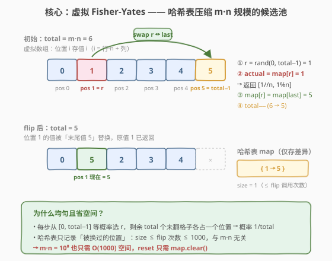
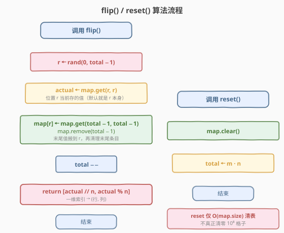
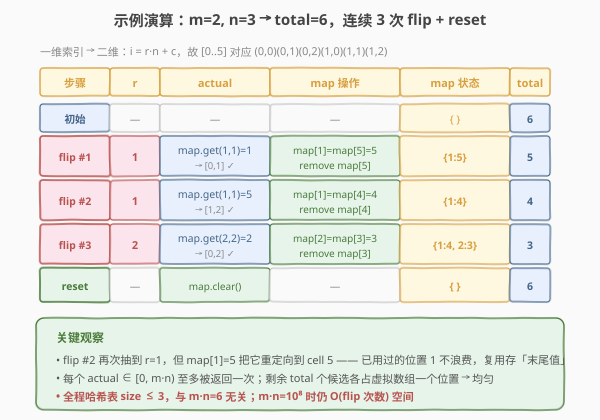

# LeetCode 随机翻转矩阵 题解

## 1. 题目概述

- **标题 / 题号**：随机翻转矩阵（#519，medium）
- **链接**：https://leetcode.cn/problems/random-flip-matrix/
- **难度**：中等
- **标签**：概率与随机、哈希表、Fisher-Yates 洗牌

**题意**：给你一个 `m x n` 的二元矩阵 `matrix`，且所有值被初始化为 `0`。请设计一个算法，**随机选取**一个满足 `matrix[i][j] == 0` 的下标 `(i, j)`，并将它的值变为 `1`。所有满足 `matrix[i][j] == 0` 的下标 `(i, j)` 被选取的概率应当**均等**。

尽量最少调用内置的随机函数，并优化时间和空间复杂度。

实现 `Solution` 类：

- `Solution(int m, int n)`：用二元矩阵的大小 `m` 和 `n` 初始化该对象；
- `int[] flip()`：返回一个满足 `matrix[i][j] == 0` 的随机下标 `[i, j]`，并将其对应格子中的值变为 `1`；
- `void reset()`：将矩阵中所有的值重置为 `0`。

**示例**：

```text
输入：
["Solution", "flip", "flip", "flip", "reset", "flip"]
[[3, 1], [], [], [], [], []]
输出：
[null, [1, 0], [2, 0], [0, 0], null, [2, 0]]
解释：
Solution solution = new Solution(3, 1);
solution.flip();  // 返回 [1, 0]，此时返回 [0,0]、[1,0] 和 [2,0] 的概率应当相同
solution.flip();  // 返回 [2, 0]，因为 [1,0] 已经返回过了，此时返回 [2,0] 和 [0,0] 的概率应当相同
solution.flip();  // 返回 [0, 0]，根据前面已经返回过的下标，此时只能返回 [0,0]
solution.reset(); // 所有值都重置为 0，并可以再次选择下标返回
solution.flip();  // 返回 [2, 0]，此时返回 [0,0]、[1,0] 和 [2,0] 的概率应当相同
```

**约束**：

- $1 \leq m, n \leq 10^4$
- 每次调用 `flip` 时，矩阵中至少存在一个值为 `0` 的格子
- 最多调用 `1000` 次 `flip` 和 `reset` 方法

> 💡 **题目本质**：在 $m \cdot n$ 个格子中「无放回地」等概率采样，每次取出一个未翻过的格子并标记。难点不在采样逻辑，而在**空间**——$m \cdot n$ 可达 $10^8$，无法真正开一个矩阵或候选池数组。关键观察是：`flip` 最多调用 `1000` 次，意味着真正被「动过」的位置极少，用一个哈希表记录这些少量差异即可。

## 2. 解题思路

### 2.1 暴力思路：开矩阵 / 候选池

最直觉的做法有两种：

- **真矩阵法**：开一个 `m x n` 的二维数组，`flip` 时反复 `rand` 直到命中一个 `0` 格子。问题：当剩余 `0` 很少时（如 $m \cdot n = 10^8$、已翻 $999$ 个），命中概率约 $10^{-5}$，期望拒绝上万次，且空间 $O(m \cdot n) = 10^8$ 直接爆内存。
- **候选池法**：把所有 $m \cdot n$ 个一维索引 `0, 1, ..., m·n−1` 塞进一个数组 `pool`，`flip` 时 `r = rand() % pool.size()`，取出 `pool[r]` 并与末尾交换后弹出。这是标准 Fisher-Yates 无放回采样，概率严格均匀。

> ⚠️ **候选池法的症结**：`pool` 大小 $= m \cdot n$ 可达 $10^8$，初始化和存储都爆。但它给了我们最关键的启发——**Fisher-Yates 的「与末尾交换」机制**。我们要做的不是消除这个机制，而是把它「虚拟化」：不真正存 `pool`，只在需要时用哈希表记录与初始状态的差异。

### 2.2 核心观察：虚拟 Fisher-Yates + 哈希表



想象一个**虚拟数组** `V[0..total-1]`，其中 `total = m·n`，初始时 `V[i] = i`（位置 `i` 存的就是值 `i`，对应二维格子 `(i // n, i % n)`）。我们在它上面跑标准 Fisher-Yates 无放回采样：

1. `r = rand(0, total − 1)`；
2. 取 `actual = V[r]`，这就是本次要翻的格子；
3. `V[r] = V[total − 1]`：把末尾的值搬到位置 `r`（填补 `r` 的空缺）；
4. `total − −`：末尾位置出界，候选池缩 1。

> 💡 **关键观察**：初始时 `V[i] = i` 对所有 `i` 成立。我们**只有**在某个位置 `r` 被换过（`V[r] ≠ r`）时才需要记录它的真实值。换过的位置至多有 `flip` 调用次数个（$\leq 1000$），于是用一张哈希表 `map` 记录「位置 → 真实值」的**差异**即可：
>
> - `map.get(r, r)` 等价于读 `V[r]`（未记录则仍是初始值 `r`）；
> - `map[r] = map.get(total − 1, total − 1)` 等价于 `V[r] = V[total − 1]`；
> - 随后 `map.remove(total − 1)`：末尾位置出界，若它曾记录过差异需清掉，若没记录过本就查不到，两种情况都安全。

这样空间复杂度从 $O(m \cdot n)$ 降到 $O(\text{flip 次数})$，与矩阵规模彻底解耦。

> ⚠️ **为什么不直接用 `set` 存已翻过的格子，`flip` 时反复拒绝采样？** 当剩余 `0` 很少时（如 $10^8$ 格中已翻 $999$ 个，剩余几乎全是 `0`），拒绝采样效率尚可；但若 `flip` 调用接近 $m \cdot n$（虽然本题 $1000$ 次限制下不会），拒绝次数会爆炸。Fisher-Yates 的优势是**每次恰好 $O(1)$、无拒绝**，且天然支持 `reset = clear`。本题的 $1000$ 次限制恰好让哈希表 size 永远很小，是「虚拟化」能成立的甜区。

### 2.3 算法流程图



**`flip()` 四步**：

1. `r = rand(0, total − 1)`：在剩余候选池里均匀取一个位置；
2. `actual = map.get(r, r)`：读位置 `r` 当前存的值（默认就是 `r`）；
3. `map[r] = map.get(total − 1, total − 1)`，再 `map.remove(total − 1)`：末尾值搬到 `r`，清理末尾条目；
4. `total − −`，返回 `[actual // n, actual % n]`。

**`reset()` 两步**：`map.clear()` + `total = m · n`。注意**不需要**真正把矩阵清零——我们从没分配过矩阵，只要把虚拟数组「还原成初始 `V[i] = i`」即可，而初始状态在 `map` 为空时自然成立。

### 2.4 示例演算

以 `m = 2, n = 3` 为例（`total = 6`，一维索引 `0..5` 对应 `(0,0)(0,1)(0,2)(1,0)(1,1)(1,2)`），连续 3 次 `flip` 再 `reset`：



| 步骤 | `r` | `actual = map.get(r,r)` | map 操作 | map 状态 | total | 返回 |
|------|-----|--------------------------|----------|----------|-------|------|
| 初始 | — | — | — | `{ }` | 6 | — |
| flip #1 | 1 | `map.get(1,1)=1` | `map[1]=map[5]=5`; remove `map[5]` | `{1:5}` | 5 | `[0,1]` |
| flip #2 | 1 | `map.get(1,1)=5` | `map[1]=map[4]=4`; remove `map[4]` | `{1:4}` | 4 | `[1,2]` |
| flip #3 | 2 | `map.get(2,2)=2` | `map[2]=map[3]=3`; remove `map[3]` | `{1:4, 2:3}` | 3 | `[0,2]` |
| reset | — | — | `map.clear()` | `{ }` | 6 | — |

> 💡 **看 flip #2**：再次抽到 `r=1`，但 `map[1]=5` 把它**重定向**到 cell `5`——已用过的位置 `1` 不浪费，复用来存「末尾值」。这正是 Fisher-Yates「与末尾交换」的精髓：被取走值的位置立刻被末尾填补，候选池始终是 `[0, total)` 一段连续区间，无空洞、无拒绝。三次返回 `[0,1]`、`[1,2]`、`[0,2]` 各不相同，且每步在剩余候选里概率严格 $\frac{1}{\text{total}}$。

> ⚠️ **`remove(total − 1)` 不能省**。若不清理，下一轮 `map.get(total − 1, total − 1)` 可能取到上轮残留的旧值。例如 flip #1 后若不 remove `map[5]`，flip #2 中 `map[1] = map.get(4, 4)` 没问题，但设想某轮 `r = total − 1` 时会读到脏数据。`remove` 对「没记录过」的位置是 no-op，对「记录过」的位置是必要清理，两种情况都安全。

## 3. 参考代码

### C++

```cpp
class Solution {
  public:
    Solution(int m, int n) : rows(m), cols(n), total(m * n) {
        srand((unsigned)time(nullptr));
    }

    vector<int> flip() {
        int r = rand() % total;                       // [0, total-1]
        int actual = r;
        auto it = swapped.find(r);
        if (it != swapped.end()) actual = it->second; // 位置 r 当前存的值

        int last = total - 1;
        int lastVal = last;
        auto it2 = swapped.find(last);
        if (it2 != swapped.end()) lastVal = it2->second;

        swapped[r] = lastVal;                         // 末尾值搬到 r
        swapped.erase(last);                          // 末尾出界，清理
        --total;
        return {actual / cols, actual % cols};
    }

    void reset() {
        swapped.clear();
        total = rows * cols;
    }

  private:
    int rows, cols, total;
    unordered_map<int, int> swapped;                  // 仅记录被换过的位置
};
```

### Python

```python
class Solution:
    def __init__(self, m: int, n: int):
        self.rows, self.cols = m, n
        self.total = m * n
        self.swapped = {}                              # 仅记录被换过的位置

    def flip(self) -> List[int]:
        r = random.randrange(self.total)               # [0, total-1]
        actual = self.swapped.get(r, r)                # 位置 r 当前存的值
        last = self.total - 1
        self.swapped[r] = self.swapped.get(last, last) # 末尾值搬到 r
        self.swapped.pop(last, None)                   # 末尾出界，清理
        self.total -= 1
        return [actual // self.cols, actual % self.cols]

    def reset(self) -> None:
        self.swapped.clear()
        self.total = self.rows * self.cols
```

> ⚠️ **两个高频踩坑点**：
> （1）**忘了 `erase` / `pop(last)`**。不清理末尾条目，后续某轮 `r` 恰好等于曾经的 `last` 时会读到脏值，返回已翻过的格子，破坏「无放回」语义。
> （2）**`reset` 真的去清零矩阵**。本题从未分配矩阵，`reset` 只需 `map.clear()` + `total = m·n` 即可让虚拟数组回到初始 `V[i] = i` 状态。若误开 $10^8$ 矩阵去逐格清零，既爆内存又超时。

## 4. 复杂度分析

| 维度 | 复杂度 | 说明 |
|------|--------|------|
| 初始化时间 | $O(1)$ | 只记录 `m, n, total`，不开矩阵 |
| `flip` 时间 | $O(1)$ 摊还 | 一次 `rand` + 哈希表两次读写 + 一次删除 |
| `reset` 时间 | $O(k)$ | $k$ = 当前 `map` 大小 $\leq$ 累计 `flip` 次数 |
| 空间复杂度 | $O(k)$ | $k$ = `map` 大小 $\leq 1000$，与 $m \cdot n$ 无关 |

> 💡 本题 $m, n \leq 10^4$，故 $m \cdot n \leq 10^8$。若用真矩阵需 $10^8$ 个 int $\approx 400\text{MB}$，远超内存限制；而哈希表法在 `flip` 调用 $\leq 1000$ 次时仅占数千字节，**空间效率提升 5 个数量级**。这是「稀疏差异 + 虚拟化」思想的典型胜利：**只记录与初始状态的偏离，不复制全量**。

## 5. 扩展：与蓄水池抽样、拒绝采样的对比

519 属于「无放回均匀采样」家族，与几个相关算法形成对照：

| 算法 | 适用场景 | 单次代价 | 空间 | 代表题 |
|------|----------|----------|------|--------|
| **虚拟 Fisher-Yates**（本题） | 已知总量 $N$、采样次数 $\ll N$ | $O(1)$ | $O(k)$ | 519 |
| **真 Fisher-Yates 候选池** | 已知总量 $N$、采样次数接近 $N$ | $O(1)$ | $O(N)$ | — |
| **蓄水池抽样 R 算法** | 总量未知（流式数据）、采样 $k$ 个 | $O(1)$ | $O(k)$ | [398](../0301-0400/398_随机数索引.md) |
| **拒绝采样** | 候选空间稀疏但可快速判合法 | 均摊 $O(N/\text{合法数})$ | $O(\text{已用集})$ | [470](../0401-0500/470_用Rand7实现Rand10.md) |
| **前缀和 + 二分** | 加权采样（非均匀） | $O(\log n)$ | $O(n)$ | [528](../0501-0600/528_按权重随机选择.md) |

> 💡 **何时用哪个？** 总量已知且小 → 真 Fisher-Yates；总量已知但巨大、采样少 → 本题虚拟 Fisher-Yates；总量未知（数据流）→ 蓄水池抽样；候选稀疏但判合法 $O(1)$ 且稀疏度不高 → 拒绝采样；非均匀 → 前缀和 + 二分。**核心区别在「总量是否已知」与「采样次数 vs 总量」**：本题的甜区是「总量巨大但采样极少」，正好让哈希表 size 永远小。

> ⚠️ **本题为何不用蓄水池抽样？** 蓄水池抽样（[398](../0301-0400/398_随机数索引.md)）解决的是「数据流中未知总量时等概率留 $k$ 个」，它**有放回地**对流中每个元素以 $\frac{k}{i}$ 概率替换。本题总量 $m \cdot n$ 已知、且要求**无放回**（每个格子至多翻一次），是不同的随机模型。若强行套蓄水池，需要先把 $m \cdot n$ 个格子当成流扫一遍，反而退化成 $O(m \cdot n)$ 时间——虚拟 Fisher-Yates 的 $O(1)$ 才是正解。

## 6. 面试要点

1. **为什么每次 `flip` 是严格均匀的？**

   - Fisher-Yates 的不变量：任意时刻虚拟数组 `V[0..total-1]` 恰好装着**全部剩余未翻格子**的一个排列（每个未翻格子出现且仅出现一次）。`r = rand(0, total−1)` 在 `total` 个位置上等概率，故每个剩余格子被选中的概率恰为 $\frac{1}{\text{total}}$。与末尾交换只是维护这个不变量的手段，不改变均匀性。

2. **哈希表 `map` 记录的到底是什么？为什么 `map.get(r, r)` 就能还原 `V[r]`？**

   - `map` 记录的是「虚拟数组与初始状态 `V[i]=i` 的差异」。位置 `r` 若从未被换过，`V[r]` 仍是初始值 `r`，`map` 里没有它，`get(r, r)` 默认返回 `r` 即正确；若被换过，`map[r]` 存的就是当前 `V[r]` 的真实值。这是「**只存偏离量**」的稀疏表示：未偏离的占绝大多数（$m \cdot n - k$ 个），不必显式存储。

3. **`map.erase(last)` / `map.pop(last)` 为什么必须做？**

   - 末尾位置 `total−1` 在 `total−−` 后就出界了，但它可能在历史某轮被 `map` 记录过（比如 `r` 曾等于它）。若不清除，下一轮 `map.get(total−1, total−1)` 可能读到这条陈旧记录而非默认值 `total−1`，导致把脏值搬到新位置。`erase` 对没记录过的位置是 no-op，对记录过的是必要清理，两种情况都安全。

4. **`reset` 为什么 $O(k)$ 而不是 $O(m \cdot n)$？**

   - 我们从未分配真实的 $m \cdot n$ 矩阵，所谓「全置 0」在虚拟数组语义下就是「让 `V[i] = i` 对所有 `i` 重新成立」。而初始状态对应 `map` 为空，因此 `map.clear()` 即等价于重置全部格子为 0，再 `total = m·n` 恢复候选池大小。代价是 `clear` 本身的 $O(k)$（$k$ = map 当前大小），与 $m \cdot n$ 无关。

5. **如果 `flip` 调用次数可能接近 $m \cdot n$（比如 $m=n=100$，调用 $10^4$ 次），本法还成立吗？**

   - 仍成立但空间优势消失：`map` size 会接近 $m \cdot n$，退化为真 Fisher-Yates 的 $O(m \cdot n)$ 空间，不过此时 $m \cdot n = 10^4$ 本就不大，可接受。本题的「甜区」是题面保证 `flip` 至多 $1000$ 次而 $m \cdot n$ 可达 $10^8$——正是「稀疏差异」发挥 5 个数量级空间优势的场景。若题面改为无调用次数上限，则需权衡：$m \cdot n$ 小时直接开矩阵，$m \cdot n$ 大且调用少用本法。

## 同类练习题

| # | 题目 | 与本题的关联 |
|---|------|-------------|
| 398 | [随机数索引](https://leetcode.cn/problems/random-pick-index/)（[题解](../0301-0400/398_随机数索引.md)） | 蓄水池抽样 R 算法，**总量未知**的流式等概率采样，与本题「总量已知、无放回」对照 |
| 528 | [按权重随机选择](https://leetcode.cn/problems/random-pick-with-weight/)（[题解](../0501-0600/528_按权重随机选择.md)） | 前缀和 + 二分做**加权**采样，与本题**均匀**采样形成随机家族对比 |
| 470 | [用 Rand7 实现 Rand10()](https://leetcode.cn/problems/implement-rand10-using-rand7/)（[题解](../0401-0500/470_用Rand7实现Rand10.md)） | 拒绝采样构造均匀分布，另一种 $O(1)$ 随机套路 |
| 710 | [黑名单中的随机数](https://leetcode.cn/problems/random-pick-with-blacklist/) | 哈希表做「虚拟到实际」的重映射，与本题 `map.get(r, r)` 思路高度同源，是 519 的进阶变体 |
| 384 | [打乱数组](https://leetcode.cn/problems/shuffle-an-array/) | 标准 Fisher-Yates 洗牌的完整实现，理解本题「与末尾交换」机制的最佳基础题 |
