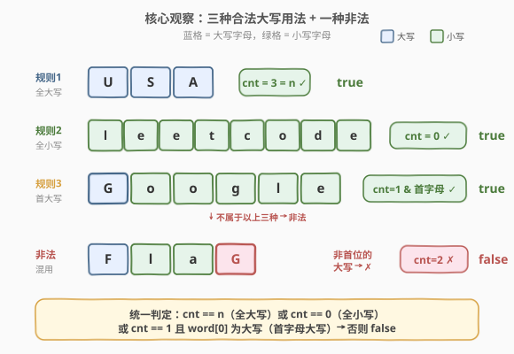
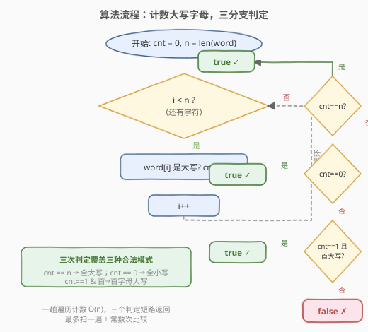
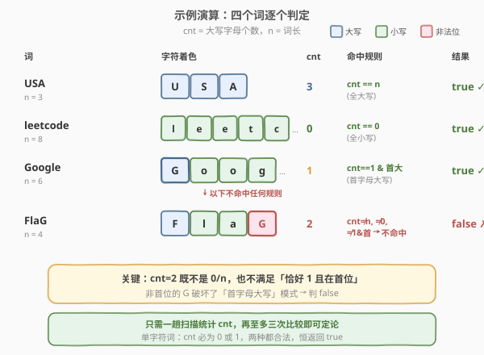

# 检测大写字母

- **题目名称**：检测大写字母
- **链接**：[520. 检测大写字母](https://leetcode.cn/problems/detect-capital/)
- **难度**：简单
- **标签**：字符串

## 1. 题目概述

给定一个单词 `word`，判断其中大写字母的用法是否**正确**。当且仅当下列三种情况之一成立时，用法是正确的：

1. **全大写**：所有字母都是大写，如 `"USA"`；
2. **全小写**：所有字母都是小写，如 `"leetcode"`；
3. **首字母大写**：只有第一个字母大写，其余全小写，如 `"Google"`。

**示例 1**：

```text
输入：word = "USA"
输出：true
解释：所有字母均大写，符合规则 1。
```

**示例 2**：

```text
输入：word = "FlaG"
输出：false
解释：首字母 F 大写，但末尾 G 也大写，不符合任何规则。
```

**约束条件**：

- `1 <= word.length <= 100`
- `word` 仅由大写和小写英文字母组成

---

## 2. 解题思路

### 2.1 暴力思路：逐条规则对照

最直观的做法是**显式写出三个判定**：

- 检查 `word` 是否全大写（遍历每个字符 `isupper`）；
- 检查 `word` 是否全小写；
- 检查 `word[0]` 大写且 `word[1:]` 全小写。

任一成立即返回 `true`。这种写法逻辑清晰但需**多趟遍历**（最坏扫 3 遍），且分支稍显冗长。能否用**一趟遍历**统一处理？

### 2.2 核心观察：统计大写字母个数



关键直觉：三种合法模式对应着**大写字母个数 `cnt` 的三个明确取值**：

| 合法模式 | 大写字母个数 `cnt` | 附加条件 |
|----------|--------------------|----------|
| 全大写 | `cnt == n`（`n` 为词长） | — |
| 全小写 | `cnt == 0` | — |
| 首字母大写 | `cnt == 1` | 且 `word[0]` 为大写 |

于是只需**一趟遍历**统计 `cnt`，再至多三次比较即可定论：

- `cnt == n` → 全大写，`true`；
- `cnt == 0` → 全小写，`true`；
- `cnt == 1` 且 `word[0]` 为大写 → 首字母大写，`true`；
- 否则 → `false`。

> 💡 **关键直觉**：合法模式本质是「大写字母要么全有、要么全无、要么只在首位」——这三种情况把 `cnt` 的可能取值严格限制为 $\{0,\ 1,\ n\}$（且 `cnt==1` 时唯一的大写必须是首位）。任何其他 `cnt` 值或「非首位的大写」都意味着混用，必非法。

**时间复杂度**：$O(n)$，一趟遍历；**空间复杂度**：$O(1)$，仅一个计数变量。

### 2.3 算法流程图



外层循环逐字符累计 `cnt`；循环结束后按 `cnt == n` / `cnt == 0` / `cnt == 1 且首大写` 三道判定短路返回，三者皆不命中则返回 `false`。

### 2.4 示例演算



逐一对照 `USA`、`leetcode`、`Google`、`FlaG`：

- `USA`：`n=3`，`cnt=3`，命中 `cnt == n` → `true` ⭐
- `leetcode`：`n=8`，`cnt=0`，命中 `cnt == 0` → `true` ⭐
- `Google`：`n=6`，`cnt=1`，且 `word[0]='G'` 大写，命中首字母大写 → `true` ⭐
- `FlaG`：`n=4`，`cnt=2`，不等于 `0/1/n`，三条规则均不命中 → `false`

> ⚠️ **易错点**：`cnt == 1` 不等价于「首字母大写」。如 `"gOogle"`（首字母小写、第二字母大写）`cnt=1` 但首字母非大写，属非法混用。故第三条判定必须**同时**要求 `word[0]` 大写。

---

## 3. 参考代码

### C++（计数法）

```cpp
class Solution {
  public:
    bool detectCapitalUse(string word) {
        int cnt = 0, n = word.size();
        for (char c : word) {
            if (isupper(c)) cnt++;
        }
        if (cnt == n || cnt == 0) return true;           // 全大写 / 全小写
        if (cnt == 1 && isupper(word[0])) return true;   // 首字母大写
        return false;
    }
};
```

### Python（字符串方法，三规则对照）

```python
class Solution:
    def detectCapitalUse(self, word: str) -> bool:
        return word == word.upper() or word == word.lower() or word == word.capitalize()
```

> 💡 **两种写法对比**：C++ 版用一次遍历计数 + 三次比较，体现「`cnt` 取值」的核心观察，适合面试口述；Python 版直接对照三条规则，借助 `str.upper()/lower()/capitalize()` 三行搞定，写法极简但底层对长串会各扫一遍（常数倍开销，本题 `n ≤ 100` 无差异）。`capitalize()` 会把首字母转大写、其余转小写，恰对应规则 3。

---

## 4. 复杂度分析

| 维度 | 复杂度 | 说明 |
|------|--------|------|
| 时间复杂度 | $O(n)$ | 一趟遍历统计 `cnt`，随后常数次比较；$n$ 为词长（≤ 100） |
| 空间复杂度 | $O(1)$ | 仅用计数变量 `cnt` 与词长 `n` |

---

## 5. 扩展：更优雅的「尾部一致性」观察

除计数法外，还有一种更凝练的等价刻画：

> **除首字母外，剩余字符 `word[1:]` 必须大小写一致（全大或全小）；否则只有整词全大写才合法。**

证明三种合法模式都满足「`word[1:]` 全小写，或整词全大写」：

- 全大写 `"USA"`：整词全大写 ✓；
- 全小写 `"leetcode"`：`word[1:]` 全小写 ✓；
- 首字母大写 `"Google"`：`word[1:]="oogle"` 全小写 ✓；
- 非法 `"FlaG"`：`word[1:]="laG"` 大小混用，且整词非全大写 ✗。

对应代码极简：

```cpp
class Solution {
  public:
    bool detectCapitalUse(string word) {
        return all_of(word.begin() + 1, word.end(), ::islower)
            || all_of(word.begin(), word.end(), ::isupper);
    }
};
```

| 解法 | 思路 | 遍历次数 | 适用场景 |
|------|------|----------|----------|
| 计数法（主） | 统计 `cnt`，对照 $\{0,1,n\}$ | 1 次 | 直观对应三条规则，面试首选 |
| 尾部一致性 | `word[1:]` 全小写 或 整词全大写 | 1~2 次 | 视角更凝练，适合作为延伸 |
| 三规则对照 | `upper()/lower()/capitalize()` | 3 次 | Python 一行解，工程简洁 |

> 💡 三种解法复杂度同级（$O(n)$ / $O(1)$），差异仅在常数与可读性。面试中先讲计数法点出「`cnt` 取值」的观察，再引出尾部一致性作为优化视角，能体现对问题结构的深入理解。

---

## 6. 面试要点

1. **为什么 `cnt == 1` 还要额外判断 `word[0]` 大写？**

   - `cnt == 1` 只说明恰有一个大写字母，不保证它在首位。如 `"gOogle"`（`cnt=1` 但大写在第二位）属非法混用。第三条规则要求「首字母大写」，故必须**同时**校验 `word[0]` 为大写。

2. **`word` 长度为 1 时结果如何？**

   - 恒为 `true`。单字符 `cnt` 必为 `0` 或 `1`：`cnt==0` 命中全小写、`cnt==1` 且 `word[0]` 大写（唯一的字符即首字符）命中首字母大写。两种都合法，无需特判。

3. **三种解法在长字符串上的差异？**

   - 计数法一趟 $O(n)$；尾部一致性最坏两趟（先查 `word[1:]` 全小写，失败再查整词全大写）；Python 三规则对照三趟 $O(3n)$。本题 $n \le 100$ 差异可忽略；若 $n$ 极大，计数法与尾部一致性更优。

4. **能否用正则表达式？**

   - 可以，模式 `^[A-Z]*$|^[a-z]*$|^[A-Z][a-z]*$` 分别对应全大写、全小写、首大写余小写。但正则引入编译与匹配开销，且对面试考察「字符遍历 + 计数」的本意无益，仅作了解。

5. **题目为何限定只含英文字母？**

   - 大小写判定依赖字母的 ASCII 范围（`isupper`/`islower` 对非字母返回 0）。限定纯英文字母避免了数字、符号的边界讨论，使三条规则能完整覆盖所有合法形态。

> 💡 **一句话总结**：一趟扫描统计大写字母个数 `cnt`，对照 $\{0,\ n\}$（全小/全大）或 $\{1\}$ 且首位（首字母大写）即可定论——三种合法模式严格对应 `cnt` 的三个取值。

---

## 7. 同类练习题

- [485. 最大连续 1 的个数](https://leetcode.cn/problems/max-consecutive-ones/)（[站内题解](../0401-0500/485_最大连续1的个数.md)）：同样一趟遍历计数，统计连续段
- [541. 反转字符串 II](https://leetcode.cn/problems/reverse-string-ii/)：字符串按规则分段处理，考察区间判定与边界
- [125. 验证回文串](https://leetcode.cn/problems/valid-palindrome/)（[题解](../0101-0200/125_验证回文串.md)）：一趟扫描 + 字符大小写归一化，与本题同属「字符串遍历 + 字符判定」基础题
- [242. 有效的字母异位词](https://leetcode.cn/problems/valid-anagram/)（[题解](../0201-0300/242_有效的字母异位词.md)）：一趟扫描统计字符频次表，计数思想的进阶应用
- [14. 最长公共前缀](https://leetcode.cn/problems/longest-common-prefix/)（[题解](14_最长公共前缀.md)）：字符串逐列扫描 + 早停，同为字符串遍历基础题
