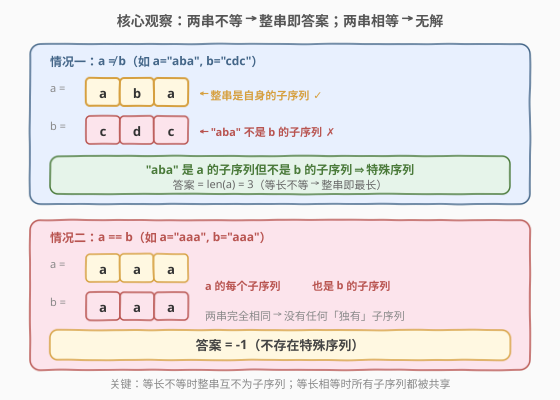
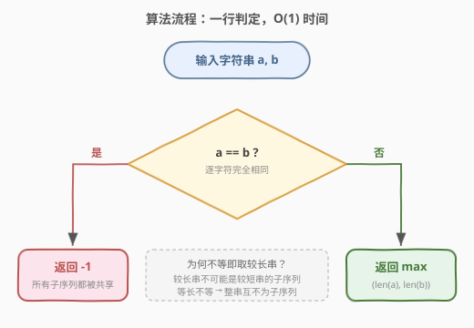
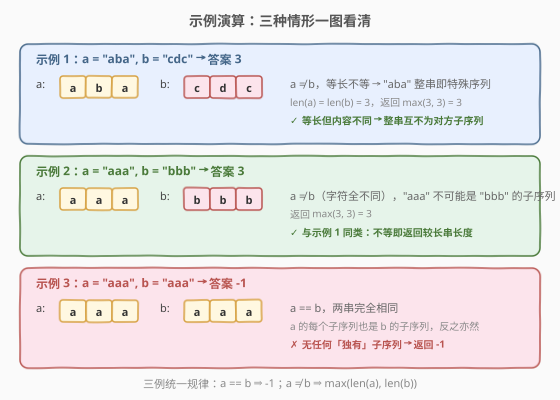

# 最长特殊序列I

- **题目名称**：最长特殊序列I
- **链接**：[521. 最长特殊序列 I](https://leetcode.cn/problems/longest-uncommon-subsequence-i/)
- **难度**：简单
- **标签**：字符串、脑筋急转弯

## 1. 题目概述

给定两个字符串 `a` 和 `b`，返回**最长特殊序列**的长度。若不存在则返回 `-1`。

**特殊序列**定义：该序列是**某字符串独有的最长子序列**——即它是 `a` 或 `b` 的子序列，但**不能同时是另一方的子序列**。字符串的子序列指从原串中删除任意数量字符（含不删）后得到的串。

**示例 1**：

```text
输入：a = "aba", b = "cdc"
输出：3
解释：最长特殊序列可为 "aba"（或 "cdc"），它是自身的子序列，但不是对方的子序列。
```

**示例 2**：

```text
输入：a = "aaa", b = "bbb"
输出：3
解释：最长特殊序列是 "aaa" 或 "bbb"。
```

**示例 3**：

```text
输入：a = "aaa", b = "aaa"
输出：-1
解释：两串相同，a 的每个子序列也是 b 的子序列，反之亦然，不存在特殊序列。
```

**约束条件**：

- $1 \le \text{a.length}, \text{b.length} \le 100$
- `a` 和 `b` 由小写英文字母组成

> 💡 这是一道**脑筋急转弯**题。题目用「子序列」「最长」「特殊」等术语包装得像一道 LCS 难题，但两个字符串的特殊场景下答案只取决于「两串是否相等」——相等返回 $-1$，不等返回较长串的长度。关键在于想清楚「**为何不等时整串就是答案**」。

---

## 2. 解题思路

### 2.1 暴力思路：枚举所有子序列

最直观的做法：枚举 `a` 的所有子序列（共 $2^{|\text{a}|}$ 个），对每个检查它是否**不是** `b` 的子序列，取其中最长者的长度；再对 `b` 对称做一遍，取两者最大。若两串的所有子序列都互相包含，则返回 $-1$。

```text
ans = -1
for sub in 所有 a 的子序列:
    if sub 不是 b 的子序列:
        ans = max(ans, len(sub))
对 b 对称重复一遍
返回 ans
```

时间复杂度 $O(2^{n} \cdot m)$（$n, m$ 分别为两串长度），$n=100$ 时子序列数 $2^{100}$ 天文数字，**完全不可行**。问题在于：盲目枚举所有子序列，却没利用「**整串本身就是最长子序列**」这一事实。

> ⚠️ 暴力法暴露了对「子序列」的误解——任何字符串的**最长子序列就是它自身**（不删任何字符）。与其枚举子序列，不如直接看「整串能不能作为特殊序列」。

### 2.2 核心观察：不等时整串即答案



把目光从「枚举子序列」收回到「整串」本身，分两种情况讨论：

**情况一：`a != b`** —— 返回 $\max(|\text{a}|, |\text{b}|)$。

只需证明：较长串（或等长不等时任一串）本身就是一个特殊序列——是自身的子序列，但不是另一方的子序列。

- **若 $|\text{a}| > |\text{b}|$**：`a` 是自身的子序列。而 `a` 的长度超过 `b`，**子序列长度不可能超过原串**，故 `a` 不可能是 `b` 的子序列。于是 `a` 是长度为 $|\text{a}|$ 的特殊序列，答案至少为 $|\text{a}| = \max(|\text{a}|, |\text{b}|)$。又因为特殊序列长度不可能超过两串长度的较大者（任何子序列长度 $\le$ 所属串长度），故答案恰为 $\max(|\text{a}|, |\text{b}|)$。
- **若 $|\text{a}| = |\text{b}|$ 但 `a != b`**：`a` 是自身的子序列。若 `a` 也是 `b` 的子序列，由于两串**等长**，要得到长度同为 $|\text{a}|$ 的子序列只能「不删任何字符」，即 `a == b`，与条件矛盾。故 `a` 不是 `b` 的子序列，`a` 是长度为 $|\text{a}|$ 的特殊序列，答案为 $|\text{a}| = \max(|\text{a}|, |\text{b}|)$。

> 💡 等长不等的论证是本题最精妙之处：**等长串之间的子序列关系退化为相等关系**——`a` 是 `b` 的子序列且 $|\text{a}|=|\text{b}|$ $\Leftrightarrow$ `a == b`。因为要保留全部字符才能保持长度不变。

**情况二：`a == b`** —— 返回 $-1$。

两串完全相同，`a` 的每个子序列必然也是 `b` 的子序列（同一串的子序列），反之亦然。没有任何「独有」的子序列，故无解。

### 2.3 算法流程图



整个算法只有一次字符串相等判定 + 一次长度取 max：

1. **比较** `a` 与 `b` 是否完全相等；
2. 若相等 → 返回 $-1$；
3. 若不等 → 返回 $\max(|\text{a}|, |\text{b}|)$。

### 2.4 示例演算



| 示例 | `a` | `b` | `a == b`? | 推理 | 答案 |
|------|-----|-----|-----------|------|------|
| 1 | `"aba"` | `"cdc"` | 否 | 等长不等，`"aba"` 整串不是 `"cdc"` 的子序列 | $\max(3,3)=3$ |
| 2 | `"aaa"` | `"bbb"` | 否 | 字符全不同，`"aaa"` 不可能是 `"bbb"` 的子序列 | $\max(3,3)=3$ |
| 3 | `"aaa"` | `"aaa"` | 是 | 两串相同，所有子序列互相包含 | $-1$ |

三例统一规律：**`a == b` 返回 $-1$；`a != b` 返回 $\max(|\text{a}|, |\text{b}|)$**。

> 💡 示例 1 与示例 2 看似不同（前者字符有交集、后者完全不同），但只要 `a != b`，答案都是较长串长度——无论差异大小。这正是「脑筋急转弯」的妙处：题目定义复杂，但两串场景下答案只依赖相等性。

---

## 3. 参考代码

### C++

```cpp
class Solution {
  public:
    int findLUSlength(string a, string b) {
        if (a == b) return -1;
        return max(a.size(), b.size());
    }
};
```

### Python

```python
class Solution:
    def findLUSlength(self, a: str, b: str) -> int:
        if a == b:
            return -1
        return max(len(a), len(b))
```

> 💡 代码极简，但面试时务必能讲清「为何不等即取较长串」的证明（见 2.2）。一句话：较长串不可能是较短串的子序列（长度不够）；等长不等时整串互不为子序列（等长子序列必相等）。

---

## 4. 复杂度分析

| 维度 | 复杂度 | 说明 |
|------|--------|------|
| 时间复杂度 | $O(\min(n, m))$ | 字符串相等比较在最坏情况下需逐字符比对，提前结束于首个不同字符；$n, m$ 为两串长度 |
| 空间复杂度 | $O(1)$ | 仅用常数额外变量 |

> ⚠️ 本题数据规模 $n, m \le 100$，任何合理实现都远低于时限。复杂度分析的价值在于对比暴力 $O(2^n \cdot m)$ 的天文数字，凸显「转化思路」的威力。

---

## 5. 扩展：从两串到多串——522 最长特殊序列 II

### 5.1 为何两串是脑筋急转弯，多串不是？

本题（521）之所以能 $O(1)$ 判定，关键在于**只有两个字符串**——「较长串不可能是较短串的子序列」这一论证在两串间直接给出上界。而当输入是**字符串数组**时（[522. 最长特殊序列 II](https://leetcode.cn/problems/longest-uncommon-subsequence-ii/)），一个串是否「特殊」取决于它**是否是数组中任意另一个串的子序列**，不能再简单取最长。

522 的正确解法是：对每个串检查它是否不是其它任何串的子序列，取满足条件的最长者。复杂度 $O(k^2 \cdot n)$（$k$ 为串数，$n$ 为最长串长度），需要真正的子序列判定（双指针贪心匹配）。

### 5.2 子序列判定模板（522 核心）

判断 `s` 是否是 `t` 的子序列（双指针贪心）：

```python
def is_subseq(s: str, t: str) -> bool:
    it = iter(t)
    return all(c in it for c in s)   # 每个字符在 t 中按顺序匹配
```

> 💡 521 是 522 的「退化特例」：当 $k=2$ 时，「某串不是另一串的子序列」直接等价于「两串不等或较长」，于是 $O(1)$ 即可。理解了 522 的通用逻辑，再回看 521 的 $O(1)$ 就顺理成章。

---

## 6. 面试要点

1. **为什么 `a != b` 时直接返回较长串长度？**

   - 较长串是自身的子序列，且其长度超过另一串，**子序列长度不可能超过原串**，故它不可能是较短串的子序列——它就是长度为 $\max(|\text{a}|, |\text{b}|)$ 的特殊序列。
   - 又因任何子序列长度 $\le$ 所属串长度，特殊序列长度不可能超过两串长度的较大者，故 $\max$ 即为上界，答案恰为此值。

2. **等长但不等的两串，为什么整串互不为子序列？**

   - 若 `a` 是 `b` 的子序列且 $|\text{a}| = |\text{b}|$，则得到该子序列时**一个字符都不能删**（删了就变短），故 `a == b`。与 `a != b` 矛盾。
   - 一句话：**等长串之间的子序列关系退化为相等关系**。这是本题最关键的逻辑跳板。

3. **`a == b` 时为什么返回 $-1$？**

   - 两串相同，`a` 的任意子序列必然也是 `b` 的子序列（本质是同一串的子序列），反之亦然。没有任何子序列是「独有」的，特殊序列不存在。

4. **这题和 522 最长特殊序列 II 有什么区别？**

   - 521 只有两个字符串，「较长串不可能是较短串子序列」直接给出 $O(1)$ 答案，是脑筋急转弯。
   - 522 是字符串数组，某串是否特殊取决于它是否是**任意另一个**串的子序列，需逐一判定，$O(k^2 n)$。521 是 522 在 $k=2$ 时的退化特例。

5. **面试官追问「能不能不用子序列枚举？」时怎么答？**

   - 指出「字符串的最长子序列是它自身」，于是候选只需考虑整串而非所有子序列。两串不等时较长串本身就是合法的特殊序列且达到长度上界，无需枚举。这正是从 $O(2^n)$ 跳到 $O(1)$ 的思维跨越。

> 💡 **一句话总结**：521 是一道披着 LCS 外衣的脑筋急转弯——两个字符串时，不等则较长串本身就是最长特殊序列（较长串不可能是较短串的子序列；等长不等时整串互不为子序列），相等则所有子序列共享返回 $-1$。代码一行，难在讲清「等长不等→整串互不为子序列」的证明。

---

## 7. 同类练习题

- [522. 最长特殊序列 II](https://leetcode.cn/problems/longest-uncommon-subsequence-ii/)（[题解](522_最长特殊序列II.md)）：本题的多串版，需真正判定子序列关系，$O(k^2 n)$，对照理解 521 为何能 $O(1)$ 退化
- [392. 判断子序列](https://leetcode.cn/problems/is-subsequence/)（[站内题解](../0301-0400/392_判断子序列.md)）：子序列判定的双指针贪心模板，522 的核心子过程
- [1143. 最长公共子序列](https://leetcode.cn/problems/longest-common-subsequence/)（[站内题解](../1101-1200/1143_最长公共子序列.md)）：真正的 LCS 二维 DP，与本题「特殊序列」的术语对照，避免概念混淆
- [28. 找出字符串中第一个匹配项的下标](https://leetcode.cn/problems/find-the-index-of-the-first-occurrence-in-a-string/)：字符串匹配基础，子序列判定的近邻问题（子串 vs 子序列的区别）
