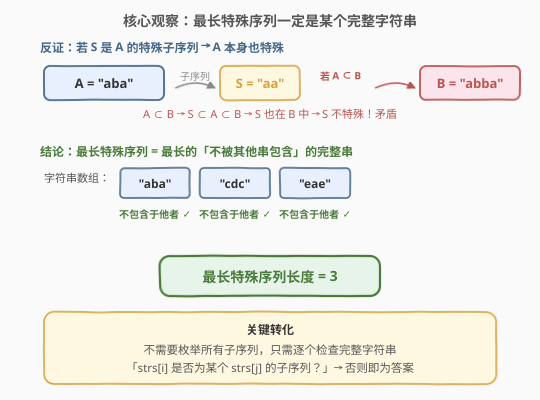
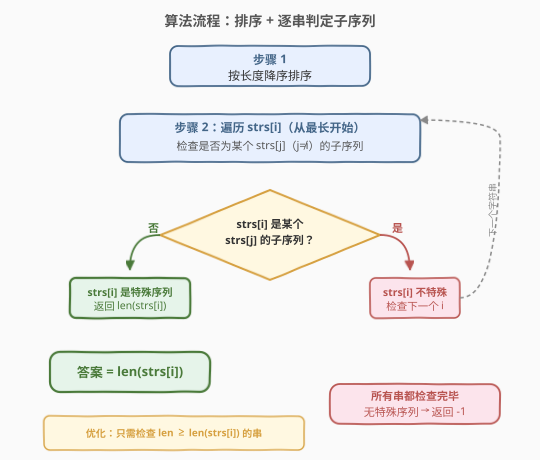
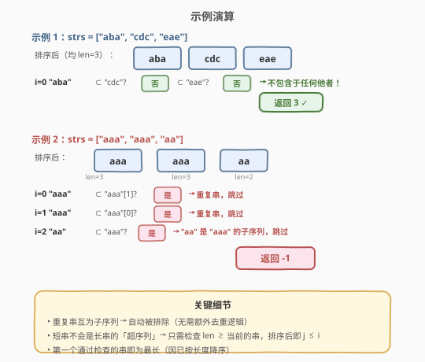

# LeetCode 最长特殊序列II 题解

## 1. 题目概述

- **标题 / 题号**：最长特殊序列II（#522，medium）
- **链接**：https://leetcode.cn/problems/longest-uncommon-subsequence-ii/
- **难度**：中等
- **标签**：数组、字符串、排序、子序列判定

**题意**：给定一个字符串数组 `strs`，返回其中**最长特殊序列**的长度。**特殊序列**定义为：该序列是数组中**恰好一个**字符串的子序列（即只属于一个字符串，不是其他任何字符串的子序列）。

**子序列**：从一个字符串中删除某些（也可不删）字符而不改变剩余字符相对顺序得到的新字符串。例如 `"aaa"` 是 `"aaa"` 的子序列，`"aa"` 也是 `"aaa"` 的子序列，但 `"aba"` 不是 `"cdc"` 的子序列。

**示例 1**：

```text
输入：strs = ["aba","cdc","eae"]
输出：3
解释：每个字符串都不是其他字符串的子序列，最长长度为 3。
```

**示例 2**：

```text
输入：strs = ["aaa","aaa","aa"]
输出：-1
解释：没有特殊序列——两个 "aaa" 互为子序列，"aa" 是 "aaa" 的子序列。
```

**约束**：

- `1 <= strs.length <= 50`
- `1 <= strs[i].length <= 10`
- `strs[i]` 仅由小写英文字母组成

> 💡 本题是 [521. 最长特殊序列 I](https://leetcode.cn/problems/longest-uncommon-subsequence-i/) 的推广：521 只有两个字符串，若两串不同则长串本身就是特殊序列；本题扩展到多个字符串，需要逐一判定「某个串是否为其他串的子序列」。

## 2. 解题思路

### 2.1 暴力思路：枚举所有子序列

对每个字符串 `strs[i]`，枚举其所有子序列（至多 $2^{L}$ 个，$L \leq 10$），对每个子序列检查它是否**只属于** `strs[i]` 而非其他任何字符串的子序列。取满足条件的子序列的最大长度。

时间 $O(n \cdot 2^L \cdot n \cdot L) = O(n^2 \cdot L \cdot 2^L)$，约 $50^2 \times 10 \times 1024 \approx 2.5 \times 10^7$，勉强可行但过于复杂，且完全没有利用问题的结构。

> ⚠️ 暴力法的症结：它把搜索空间定在「所有子序列」上，但子序列数量随长度指数增长。我们需要一个观察来把搜索空间缩减到 $O(n)$。

### 2.2 核心观察：最长特殊序列一定是某个完整字符串



**关键定理**：若存在特殊序列，则最长的特殊序列一定是数组中某个**完整字符串**本身。

**证明（反证法）**：假设最长特殊序列 $S$ 是字符串 $A$ 的真子序列（$S \neq A$，$\text{len}(S) < \text{len}(A)$）。若 $A$ 是某个其他串 $B$ 的子序列，则 $S$（作为 $A$ 的子序列）也是 $B$ 的子序列，与 $S$ 只属于 $A$ 矛盾。因此 $A$ 本身也不被任何其他串包含，即 $A$ 也是特殊序列，且 $\text{len}(A) > \text{len}(S)$，与 $S$ 最长矛盾。$\square$

> 💡 **转化后的任务**：不再枚举子序列，只需对每个完整字符串 `strs[i]` 判定——它是否为某个其他字符串 `strs[j]`（$j \neq i$）的子序列。第一个（按长度降序）不是任何他串子序列的串，其长度即为答案。

### 2.3 算法流程图



**完整步骤**：

1. **排序**：将 `strs` 按字符串长度**降序**排列，使最长的串排在前面
2. **逐串检查**：对每个 `strs[i]`，检查它是否为某个 `strs[j]`（$j \neq i$）的子序列
   - 只需检查 $\text{len}(\text{strs}[j]) \geq \text{len}(\text{strs}[i])$ 的串（短串不可能包含长串作为子序列）
   - 由于已降序排序，满足条件的 $j$ 在 $[0, i]$ 范围内（但需跳过 $j = i$ 自身；同长度的重复串会自动被判定为互相的子序列）
3. **返回**：第一个通过检查（不是任何他串子序列）的 `strs[i]` 的长度即为答案；若所有串都未通过，返回 $-1$

> ⚠️ **为什么排序后只需检查 $j \leq i$？** 降序排序后，下标 $0..i$ 的串长度 $\geq \text{strs}[i]$，下标 $i+1..n{-}1$ 的串长度 $< \text{strs}[i]$，后者不可能包含 `strs[i]` 作为子序列（子序列长度 $\leq$ 原串长度），直接跳过。但同长度的串排在相邻位置，若有两个相同串，互相都是子序列，会自动被排除——无需额外去重。

### 2.4 示例演算



**示例 1**：`strs = ["aba", "cdc", "eae"]`（均 len=3）

| `i` | `strs[i]` | 检查是否为他串子序列 | 结果 |
|-----|-----------|---------------------|------|
| 0 | `"aba"` | ⊂ `"cdc"`? 否；⊂ `"eae"`? 否 | ✓ 不包含于任何他串 → 返回 3 |

三个串互不包含，第一个就命中，答案 = 3。

**示例 2**：`strs = ["aaa", "aaa", "aa"]`，排序后 `["aaa", "aaa", "aa"]`

| `i` | `strs[i]` | 检查是否为他串子序列 | 结果 |
|-----|-----------|---------------------|------|
| 0 | `"aaa"` | ⊂ `"aaa"[1]`? 是（完全相同） | ✗ 跳过 |
| 1 | `"aaa"` | ⊂ `"aaa"[0]`? 是（完全相同） | ✗ 跳过 |
| 2 | `"aa"` | ⊂ `"aaa"`? 是 | ✗ 跳过 |

所有串都未通过，返回 $-1$。

> 💡 **重复串自动排除**：两个相同的 `"aaa"` 互为子序列（$A \subseteq A$ 对相同串成立），所以无需专门写去重逻辑——通用的子序列判定已经覆盖了这种情况。

## 3. 参考代码

### C++

```cpp
// 最长特殊序列II.cpp —— 排序 + 逐串子序列判定
// 编译: g++ -O2 -std=c++17 最长特殊序列II.cpp -o lus2
class Solution {
public:
    // 判断 a 是否为 b 的子序列
    bool isSubseq(const string& a, const string& b) {
        if (a.size() > b.size()) return false;
        int i = 0;
        for (char c : b) {
            if (i < a.size() && a[i] == c) i++;
        }
        return i == a.size();
    }

    int findLUSlength(vector<string>& strs) {
        // 按长度降序排序
        sort(strs.begin(), strs.end(), [](const string& a, const string& b) {
            return a.size() > b.size();
        });

        int n = strs.size();
        for (int i = 0; i < n; i++) {
            bool uncommon = true;
            for (int j = 0; j < n; j++) {
                if (i == j) continue;
                if (isSubseq(strs[i], strs[j])) {   // strs[i] 是 strs[j] 的子序列
                    uncommon = false;
                    break;
                }
            }
            if (uncommon) return strs[i].size();    // 第一个通过的即最长
        }
        return -1;
    }
};
```

### Python

```python
class Solution:
    def findLUSlength(self, strs: list[str]) -> int:
        # 判断 a 是否为 b 的子序列
        def is_subseq(a: str, b: str) -> bool:
            if len(a) > len(b):
                return False
            it = iter(b)
            return all(c in it for c in a)

        # 按长度降序排序
        strs.sort(key=len, reverse=True)

        n = len(strs)
        for i in range(n):
            if all(not is_subseq(strs[i], strs[j])
                   for j in range(n) if j != i):
                return len(strs[i])              # 第一个通过的即最长
        return -1
```

> 💡 **Python 子序列判定技巧**：`all(c in it for c in a)` 利用迭代器——`c in it` 会从当前位置向后搜索 `c` 并推进迭代器，每个字符只扫描一次，$O(|b|)$ 完成。比手写双指针更简洁，但逻辑等价。

> ⚠️ **内层循环的范围**：上述代码检查所有 $j \neq i$，而非仅 $j < i$。虽然排序后 $j > i$ 的串更短、`isSubseq` 会因 `len(a) > len(b)` 直接返回 `false`，但写法更安全且不影响复杂度（$n \leq 50$）。若追求极致常数优化，可改为 `for j in range(i + 1)` 并跳过 `j == i`。

## 4. 复杂度分析

| 维度 | 复杂度 | 说明 |
|------|--------|------|
| 时间复杂度 | $O(n^2 \cdot L)$ | $n$ 个串两两判定子序列，每次判定 $O(L)$；$n \leq 50$，$L \leq 10$，约 $2.5 \times 10^4$ 次操作 |
| 空间复杂度 | $O(1)$ | 排序为原地（C++ `sort` / Python `list.sort`），仅用常数额外变量 |

> 💡 数据规模极小（$n \leq 50$，$L \leq 10$），$O(n^2 L)$ 完全在时限内。若 $n$ 或 $L$ 显著增大，可考虑：① 用哈希去重减少候选；② 对相同长度的串批量处理。

## 5. 扩展：与 521 的对比及优化思路

### 521 vs 522

| 维度 | 521（两串） | 522（多串） |
|------|------------|------------|
| 输入 | 两个字符串 `a`, `b` | 字符串数组 `strs`（$\leq 50$ 个） |
| 核心逻辑 | 若 `a != b`，长串本身就是特殊序列，返回 $\max(\text{len})$；否则返回 $-1$ | 需逐一判定每个串是否为其他串的子序列 |
| 时间 | $O(L)$ | $O(n^2 L)$ |
| 关键洞察 | 两串不同 → 长串不被短串包含 | 特殊序列一定是完整串（反证法） |

> 💡 521 是 522 的退化特例：只有两个串时，若它们不同，长串不可能是短串的子序列（长度不够），直接返回长串长度即可；若相同则互为子序列，返回 $-1$。522 的通用判定逻辑在两串时自动给出同样的结果。

### 优化：跳过重复串

若数组中存在大量重复串，可先统计频次：出现 $\geq 2$ 次的串必然互为子序列，可直接标记为「不特殊」跳过判定。但 $n \leq 50$ 时优化收益有限，代码简洁性更重要。

## 6. 面试要点

1. **为什么最长特殊序列一定是某个完整字符串？**

   > 反证法：若最长特殊序列 $S$ 是 $A$ 的真子序列且 $S$ 只属于 $A$，则 $A$ 不能是任何他串的子序列（否则 $S$ 作为 $A$ 的子序列也会属于那个串），故 $A$ 也是特殊序列且比 $S$ 更长，矛盾。因此最长特殊序列必是完整串。

2. **为什么不需要枚举子序列？**

   > 枚举子序列是 $O(2^L)$，但核心定理把搜索空间从「所有子序列」缩减到「所有完整字符串」（$O(n)$ 个）。只需对每个完整串做一次子序列判定即可。

3. **重复串如何处理？需要专门去重吗？**

   > 不需要。两个相同的串互为子序列（`isSubseq(a, a) == true`），通用判定逻辑会自动将它们标记为「是他串的子序列」从而排除。无需额外的哈希去重步骤。

4. **为什么按长度降序排序？**

   > 降序排序保证遍历时第一个通过检查的串就是最长的。同时，短串不可能包含长串作为子序列（子序列长度 $\leq$ 原串长度），排序后只需检查长度 $\geq$ 当前的串（即下标 $\leq i$ 的位置），可剪枝。

5. **子序列判定的 `all(c in it for c in a)` 是什么原理？**

   > Python 中 `iter(b)` 创建迭代器，`c in it` 从当前位置向后搜索字符 `c` 并推进迭代器到匹配位置之后。每个字符匹配后迭代器不可回退，保证字符顺序与 `a` 一致。等价于双指针贪心匹配，$O(|b|)$ 一次扫描。

> 💡 **一句话总结**：522 的核心是「最长特殊序列必是完整串」这一定理，把指数级子序列枚举降为 $O(n)$ 个候选；再对每个候选做 $O(L)$ 子序列判定，总复杂度 $O(n^2 L)$。排序降序保证第一个命中即最优。

## 同类练习题

| # | 题目 | 与本题的关联 |
|---|------|-------------|
| 521 | [最长特殊序列 I](https://leetcode.cn/problems/longest-uncommon-subsequence-i/) | 两串版本，若不同则返回长串长度，$O(L)$ 退化特例 |
| 392 | [判断子序列](https://leetcode.cn/problems/is-sequence/)（[题解](../0301-0400/392_判断子序列.md)） | 单串子序列判定的母题，双指针 $O(L)$ 模板，本题的 `isSubseq` 直接复用 |
| 1143 | [最长公共子序列](https://leetcode.cn/problems/longest-common-subsequence/)（[题解](../1101-1200/1143_最长公共子序列.md)） | 子序列 DP 经典题，对比「判定是否为子序列」与「求最长公共子序列」的差异 |
| 792 | [匹配子序列的单词数](https://leetcode.cn/problems/number-of-matching-subsequences/) | 批量子序列判定，用桶分组优化到 $O(\|s\| + \sum \|word\|)$，进阶思路 |
| 1055 | [形成字符串的最短路径](https://leetcode.cn/problems/shortest-way-to-form-string/) | 子序列覆盖问题，判断需要多少次子序列拼接才能组成目标串 |
