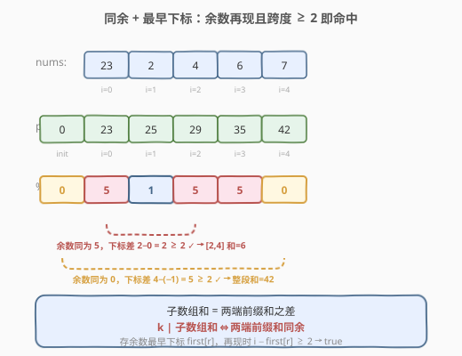
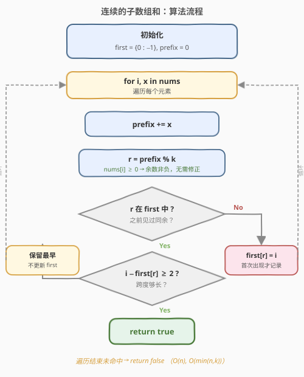
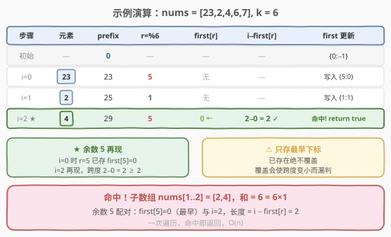

# LeetCode 连续的子数组和 题解

## 1. 题目概述

- **标题 / 题号**：连续的子数组和（#523，medium）
- **链接**：https://leetcode.cn/problems/continuous-subarray-sum/
- **难度**：中等
- **标签**：数组、哈希表、前缀和、数学

**题意**：给定一个**非负整数**数组 `nums` 和一个整数 `k`，判断是否存在一个**长度至少为 2** 的连续非空子数组，其元素之和是 `k` 的倍数（`0` 也算 `k` 的倍数）。

**示例 1**：

```text
输入：nums = [23,2,4,6,7], k = 6
输出：true
解释：[2,4] 是一个大小为 2 的子数组，并且和为 6。
```

**示例 2**：

```text
输入：nums = [23,2,6,4,7], k = 6
输出：true
解释：[23,2,6,4,7] 是大小为 5 的子数组，和为 42 = 7×6。
```

**示例 3**：

```text
输入：nums = [23,2,6,4,7], k = 13
输出：false
```

**约束**：

- `1 <= nums.length <= 10^5`
- `0 <= nums[i] <= 10^9`
- `0 <= sum(nums[i]) <= 2^31 - 1`
- `1 <= k <= 2^31 - 1`

> ⚠️ 注意两点：① 子数组**长度必须 ≥ 2**，单元素子数组即使和为 `k` 的倍数也不算；② `0` 始终视为 `k` 的倍数——这意味着一段全为 `0` 的子数组（和为 `0`）也是合法答案。数组元素均非负，但数据规模到 `10^5`，暴力 `O(n^2)` 必然超时。

## 2. 解题思路

### 2.1 暴力思路

枚举所有长度 ≥ 2 的子数组 `[i, j]`，逐个求和判断是否能被 `k` 整除。两重循环 + 求和共 `O(n^3)`；用前缀和优化到 `O(n^2)`，在 `n = 10^5` 时约 `10^10` 次操作，严重超时。需要找到「一次扫描就能判定」的增量方法。

### 2.2 核心观察：同余定理 + 最早下标



定义前缀和 `P[i]` 为 `nums[0..i-1]` 的和（`P[0] = 0`），则子数组 `nums[l..r]` 的和为 `P[r+1] - P[l]`，长度为 `r - l + 1`。要让该和是 `k` 的倍数，即：

$$
P[r+1] \equiv P[l] \pmod{k}
$$

> 💡 **关键转化（同余定理）**：两个前缀和对 `k` **取模同余**，当且仅当它们的差（即子数组和）能被 `k` 整除。这与 [974. 和可被 K 整除的子数组](../0901-1000/974_和可被K整除的子数组.md) 完全同源——974 查的是「差是 k 的倍数」的**计数**，本题查的是「差是 k 的倍数」的**存在性**，并额外要求**长度 ≥ 2**。

但长度约束带来了一个新要求：不能像 974 那样只统计同余前缀和的**频次**，而要保证配对的两个前缀和**下标差足够大**。这恰好是 [525. 连续数组](../0501-0600/525_连续数组.md) 的套路——**哈希表存每个余数的「最早下标」**：

- 用 `first[r]` 记录余数 `r` **第一次**出现时的下标；
- 当余数 `r` 再次出现于下标 `i` 时，区间长度就是 `i - first[r]`；
- 只要 `i - first[r] >= 2`，就找到合法子数组，立即返回 `true`。

> ⚠️ **为什么只存「最早」下标、不覆盖？** 因为我们要让跨度 `i - first[r]` **尽可能大**，越早的下标配出的区间越长，越容易满足 ≥ 2。若用新下标覆盖，后续配对算出的长度只会变短，可能把本该命中的情况漏掉。这与 525「求最长存最早」完全一致，而与 974/560「求个数存频次」截然不同。

### 2.3 算法流程图



一次遍历即可：

1. 维护哈希表 `first`，记录每个余数**首次出现**的下标；初始 `first = {0 : -1}`（余数 `0` 在「空前缀」处即下标 `-1` 出现，对应从数组起点开始的子数组）。
2. 维护当前前缀和 `prefix`（初值 `0`）。
3. 对每个下标 `i`：`prefix += nums[i]`，计算余数 `r = prefix % k`。
   - 若 `r` 已在 `first` 中：检查 `i - first[r] >= 2`，成立则返回 `true`；**不成立也不更新** `first`，保留最早下标。
   - 若 `r` 不在 `first` 中：`first[r] = i`，首次出现才记录。
4. 遍历结束仍未命中，返回 `false`。

> 💡 **两个无需特殊处理的点**：① `nums[i] >= 0`，前缀和单调非负，`prefix % k` 必落在 `[0, k-1]`，**无需**像 974 那样修正负数取模；② `0` 是 `k` 的倍数——当某段和恰为 `0` 时余数为 `0`，会与 `first[0] = -1` 或历史余数 `0` 配对，算法天然覆盖，无需特判。

### 2.4 示例演算

以 `nums = [23,2,4,6,7], k = 6` 为例：



| 步骤 | 元素 | prefix | r = prefix%6 | 查询 first[r] | i − first[r] | first 更新 |
|------|------|--------|--------------|---------------|--------------|------------|
| 初始 | — | 0 | — | — | — | {0:−1} |
| i=0 | 23 | 23 | 5 | 不含 5 | — | 写入 {5:0} |
| i=1 | 2 | 25 | 1 | 不含 1 | — | 写入 {1:1} |
| i=2 | 4 | 29 | 5 | 含 5 @0 | 2−0 = 2 ≥ 2 ✓ | **命中，返回 true** |

命中于 `i=2`：余数 `5` 曾在 `i=0` 出现，跨度 `2 - 0 = 2 ≥ 2`，对应子数组 `nums[1..2] = [2,4]`，和为 `6 = 6×1`。

> 💡 **看 `i=2` 这一步**：此时余数 `5` 的最早下标是 `0`，跨度恰为 `2`。若我们之前在某个更晚的下标（假设 `i=1` 也是余数 `5`）覆盖了 `first[5]`，这里就只能算出 `2 - 1 = 1 < 2` 而漏判——这正是「只存最早、不覆盖」的根本原因。

## 3. 参考代码

### C++

```cpp
class Solution {
  public:
    bool checkSubarraySum(vector<int>& nums, int k) {
        unordered_map<int, int> first;   // 余数 -> 首次出现的下标
        first[0] = -1;                   // 空前缀余数 0，记在下标 -1
        int prefix = 0;
        for (int i = 0; i < (int)nums.size(); ++i) {
            prefix += nums[i];           // 总和 ≤ 2^31-1，int 不溢出
            int r = prefix % k;          // nums[i] ≥ 0，余数非负无需修正
            auto it = first.find(r);
            if (it != first.end()) {
                if (i - it->second >= 2) return true;   // 跨度 ≥ 2 即长度 ≥ 2
                // 否则保留最早下标，不覆盖
            } else {
                first[r] = i;            // 首次出现才记录
            }
        }
        return false;
    }
};
```

### Python

```python
class Solution:
    def checkSubarraySum(self, nums: List[int], k: int) -> bool:
        first = {0: -1}        # 余数 0 在下标 -1（空前缀）
        prefix = 0
        for i, x in enumerate(nums):
            prefix += x
            r = prefix % k
            if r in first:
                if i - first[r] >= 2:    # 跨度 ≥ 2 即长度 ≥ 2
                    return True
                # 否则保留最早下标，不覆盖
            else:
                first[r] = i            # 首次出现才记录
        return False
```

> 💡 **为什么用哈希表而非数组？** `k` 可达 `2^31 - 1`，无法开大小为 `k` 的数组（974 中 `k <= 10^5` 才用数组）。本题余数取值范围虽为 `[0, k-1]`，但实际出现的余数至多 `n + 1` 个，哈希表空间 `O(min(n, k))`，正合适。

## 4. 复杂度分析

| 维度 | 复杂度 | 说明 |
|------|--------|------|
| 时间复杂度 | O(n) | 只遍历数组一次，每次哈希表查询 / 写入均摊 O(1) |
| 空间复杂度 | O(min(n, k)) | 哈希表最多存 `n + 1` 个余数；又因余数取值范围 `[0, k-1]`，故上界为 `min(n, k)` |

## 5. 扩展：前缀和 + 同余家族的三种姿态

同属「前缀和 + 同余 + 哈希」家族，523、974、525 目标不同，导致哈希表存的内容截然不同：

| 题目 | 目标 | 哈希表存什么 | 已存在时是否覆盖 | 额外约束 |
|------|------|--------------|------------------|----------|
| 974. 和可被 K 整除的子数组 | **计数** | 余数的**频次** | 不覆盖，频次 +1 | 无 |
| 525. 连续数组 | **最长长度** | 前缀和的**最早下标** | **不覆盖**，保留最早 | 无 |
| **523. 连续的子数组和** | **存在性** | 余数的**最早下标** | **不覆盖**，保留最早 | **长度 ≥ 2** |

> 💡 口诀：**求个数存频次，求最长/存在性存最早**。523 与 525 几乎同构——都是「存最早下标、命中算跨度」，区别仅在于 525 取**最大**跨度、523 判跨度**是否 ≥ 2** 即返回。523 额外的「长度 ≥ 2」约束，本质上就是把判定条件从「同余即命中」收紧为「同余且跨度 ≥ 2」。

### 一个等价写法：延迟一步写入

还有一种规避「跨度 ≥ 2」显式判断的写法：把当前余数**延迟一步**再写入哈希表。即先用「上一位置」的余数查表、再用「当前位置」的余数写入。这样查表时两端下标天然相差至少 1，再配合前缀和的错位即可保证长度 ≥ 2。两种写法等价，本文采用更显式的 `i - first[r] >= 2` 判断，逻辑更直观。

## 6. 面试要点

1. **为什么哈希表要初始化 `{0: -1}`？**
   - 当某段从数组**开头**起的子数组和恰为 `k` 的倍数时，当前余数为 `0`，需要 `first[0]` 中已有的「空前缀」（下标 `-1`）来配对，长度算作 `i - (-1) = i + 1`。不初始化会漏掉所有「从头开始」的合法子数组。

2. **遇到已存在的余数时，为什么不更新哈希表？**
   - 本题求存在性且要求长度 ≥ 2，相同余数的**最早**下标能配出最大跨度，最易满足 ≥ 2。若用新下标覆盖，后续配对的跨度只会变短，可能把本该命中的情况漏判。

3. **`i - first[r] >= 2` 中的 2 对应什么？**
   - `first[r]` 存的是「该余数首次出现时的数组下标」`p`，当前下标 `i` 与之配对得到的子数组是 `nums[p+1 .. i]`，长度恰为 `i - p = i - first[r]`。故 `>= 2` 即「长度 ≥ 2」。

4. **与 974（和可被 K 整除的子数组）的联系与区别？**
   - 两者都基于同余定理。974 求**个数**，哈希表存余数**频次**，先查再写、频次自增；523 求**存在性 + 长度约束**，哈希表存余数**最早下标**，命中且跨度 ≥ 2 即返回。另外 974 的数组含负数需修正取模，523 的数组非负无需修正。

5. **为什么不能用滑动窗口？**
   - 虽然本题 `nums[i] >= 0`（窗口和有单调性），但目标是「和为 k 的倍数」而非「和等于某定值」——倍数关系没有单一阈值可供指针决策（窗口和可能是 `0, k, 2k, 3k, ...` 中任意一个），无法根据当前和决定收缩或扩张。前缀和 + 同余 + 哈希是通用解法。

## 同类练习题

| # | 题目 | 与本题的关联 |
|---|------|-------------|
| 974 | [和可被 K 整除的子数组](https://leetcode.cn/problems/subarray-sums-divisible-by-k/)（[题解](../0901-1000/974_和可被K整除的子数组.md)） | 同余定理母题，对比「计数存频次」vs「存在性存最早下标」 |
| 525 | [连续数组](https://leetcode.cn/problems/contiguous-array/)（[题解](../0501-0600/525_连续数组.md)） | 同为「存最早下标、命中算跨度」，区别在取最大跨度 vs 判跨度 ≥ 2 |
| 560 | [和为 K 的子数组](https://leetcode.cn/problems/subarray-sum-equals-k/)（[题解](../0501-0600/560_和为K的子数组.md)） | 前缀和 + 哈希的母题，把「同余」换成「差等于 k」 |
| 1248 | [统计「优美子数组」](https://leetcode.cn/problems/count-number-of-nice-subarrays/) | 奇偶个数前缀和 + 哈希，与同余系列思路同构 |
| 1524 | [和为奇数的子数组数目](https://leetcode.cn/problems/number-of-sub-arrays-with-odd-sum/) | 前缀和按奇偶分桶 + 计数，同余思想（模 2）的另一变体 |
