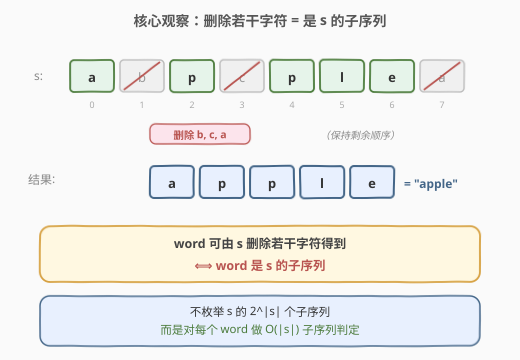
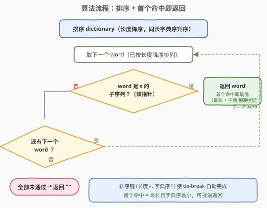
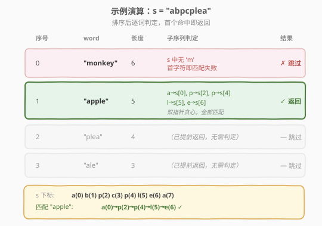

# 通过删除字母匹配到字典里最长单词

- **题目名称**：通过删除字母匹配到字典里最长单词
- **链接**：[524. 通过删除字母匹配到字典里最长单词](https://leetcode.cn/problems/longest-word-in-dictionary-through-deleting/)
- **难度**：中等
- **标签**：数组、字符串、双指针、排序、子序列判定

## 1. 题目概述

给定一个字符串 `s` 和一个字符串数组 `dictionary`，返回 `dictionary` 中**最长**的、可以通过从 `s` 中**删除若干字符**（也可不删）得到的字符串。若存在多个长度相同的结果，返回**字典序最小**的那个；若不存在，返回空字符串 `""`。

> 💡 「从 `s` 中删除若干字符得到」即「该字符串是 `s` 的**子序列**」——只保留 `s` 中某些位置的字符，相对顺序不变。本题本质是「批量子序列判定 + 选最优」。

**示例 1**：

```text
输入：s = "abpcplea", dictionary = ["ale","apple","monkey","plea"]
输出："apple"
解释："apple" 可由 s 删除 b、c、a 得到，长度 5；"plea" 长度 4；"ale" 长度 3；"monkey" 中含 'm' 而 s 不含，无法得到。
```

**示例 2**：

```text
输入：s = "abpcplea", dictionary = ["a","b","c"]
输出："a"
解释：三者都是 s 的子序列且长度均为 1，字典序最小为 "a"。
```

**约束条件**：

- `1 <= s.length <= 1000`
- `1 <= dictionary.length <= 1000`
- `1 <= dictionary[i].length <= 1000`
- `s` 和 `dictionary[i]` 仅由小写英文字母组成

> ⚠️ 数据规模到 $10^3 \times 10^3 = 10^6$，要求 $O(|s| \cdot |\text{dictionary}|)$ 级别解法；若枚举 `s` 的所有子序列（$2^{|s|}$）必然超时。

---

## 2. 解题思路

### 2.1 暴力思路：枚举 s 的所有子序列

对 `s` 枚举所有子序列（共 $2^{|s|}$ 个），存入哈希集合，再遍历 `dictionary` 查集合中是否存在。取存在且最长（同长取字典序最小）的词。

时间 $O(2^{|s|} \cdot |s|)$，当 $|s| = 1000$ 时是天文数字，完全不可行。

> ⚠️ 暴力法的症结：把搜索方向定在「从 `s` 生成子序列」上，子序列数量随 $|s|$ 指数增长。我们需要反转搜索方向——不去问「`s` 能生成哪些子序列」，而是问「`dictionary` 中的每个词是不是 `s` 的子序列」。

### 2.2 核心观察：反向思考，把生成改为判定



**关键转化**：「`word` 能否由 `s` 删除若干字符得到」等价于「`word` 是 `s` 的子序列」。因此不必枚举 `s` 的子序列，只需对 `dictionary` 中的每个 `word` 做一次**子序列判定**即可。

**子序列判定**（[392. 判断子序列](https://leetcode.cn/problems/is-subsequence/) 母题模板）：用双指针 $i$（指向 `word`）、$j$（指向 `s`）贪心匹配——`s[j] == word[i]` 时 $i$ 前进，$j$ 每步都前进；最终 `i == word.size()` 则 `word` 是 `s` 的子序列。单次判定 $O(|s|)$。

> 💡 **转化后的任务**：对 $N$ 个词各做一次 $O(|s|)$ 子序列判定，共 $O(N \cdot |s|) \leq 10^6$；在所有「是子序列」的词中选**最长**（同长选**字典序最小**）。

### 2.3 算法流程图



**为什么先排序？** 把 `dictionary` 按「长度降序、同长字典序升序」排序后，**第一个**通过子序列判定的词即为答案——长度最大自动优先，同长时字典序最小者排在前，命中即最优，无需遍历完整个数组。这一步把「选最优」的 tie-break 逻辑交给排序键，代码极简。

**完整步骤**：

1. **排序**：`dictionary` 按 `(长度降序, 字典序升序)` 排列
2. **逐词判定**：对每个 `word`，用双指针判断它是否为 `s` 的子序列
   - 若 `|word| > |s|`，直接跳过（长串不可能是短串的子序列）
3. **返回**：第一个通过判定的 `word` 即答案；全部未通过则返回 `""`

> ⚠️ **tie-break 方向**：题目要求同长时取**字典序最小**，故排序键第二维为 `word` 升序（C++ 直接 `a < b`，Python 用 `w` 本身）。若误写为降序，会返回同长中字典序最大的词。

### 2.4 示例演算

以示例 1 为例：`s = "abpcplea"`，`dictionary = ["ale","apple","monkey","plea"]`。



**排序后**（长度降序，同长字典序升序）：

| 序号 | `word` | 长度 | 子序列判定过程 | 结果 |
|------|--------|------|----------------|------|
| 0 | `"monkey"` | 6 | s 中无 `'m'`，首个字符即匹配失败 | ✗ 跳过 |
| 1 | `"apple"` | 5 | a→s[0], p→s[2], p→s[4], l→s[5], e→s[6]，全部匹配 | ✓ 命中，返回 `"apple"` |

`s = "abpcplea"` 中字符下标：`a(0) b(1) p(2) c(3) p(4) l(5) e(6) a(7)`。匹配 `"apple"` 时贪心选取 `a(0), p(2), p(4), l(5), e(6)`，$i$ 走到末尾，判定为真。

> 💡 **贪心匹配的正确性**：双指针每次在 `s` 中遇到 `word[i]` 就立即消费，保证 `word[i]` 用的是 `s` 中**尽量靠前**的位置，为后续字符留出尽可能多的搜索空间。这种「尽早匹配」策略使得一旦存在合法匹配，贪心解必能找到（交换论证：任何合法匹配都可调整为贪心匹配）。

---

## 3. 参考代码

### C++

```cpp
// 通过删除字母匹配到字典里最长单词.cpp —— 排序 + 子序列判定
// 编译: g++ -O2 -std=c++17 通过删除字母匹配到字典里最长单词.cpp -o lwdd
class Solution {
  public:
    // 判断 word 是否为 s 的子序列（392 模板）
    bool isSubseq(const string& word, const string& s) {
        if (word.size() > s.size()) return false;
        int i = 0;
        for (char c : s) {
            if (i < word.size() && word[i] == c) i++;
        }
        return i == word.size();
    }

    string findLongestWord(string s, vector<string>& dictionary) {
        // 按长度降序、同长字典序升序排列
        sort(dictionary.begin(), dictionary.end(), [](const string& a, const string& b) {
            if (a.size() != b.size()) return a.size() > b.size();
            return a < b;
        });
        for (const string& w : dictionary) {
            if (isSubseq(w, s)) return w;    // 第一个命中即最优
        }
        return "";
    }
};
```

### Python

```python
class Solution:
    def findLongestWord(self, s: str, dictionary: List[str]) -> str:
        # 判断 word 是否为 s 的子序列（392 模板）
        def is_subseq(word: str, s: str) -> bool:
            if len(word) > len(s):
                return False
            it = iter(s)
            return all(c in it for c in word)

        # 按长度降序、同长字典序升序排列
        dictionary.sort(key=lambda w: (-len(w), w))
        for w in dictionary:
            if is_subseq(w, s):
                return w                    # 第一个命中即最优
        return ""
```

> 💡 **Python 子序列判定技巧**：`all(c in it for c in word)` 用迭代器——`c in it` 从当前位置向后搜索 `c` 并推进迭代器，每个字符只扫描一次，$O(|s|)$ 完成。与 [522](../0501-0600/522_最长特殊序列II.md) 的 `is_subseq` 完全同模板。

> ⚠️ **排序键的两种写法等价**：C++ 自定义比较器先比 `size()` 再比字符串；Python 用 `(-len(w), w)` 元组键——`-len` 实现长度降序，`w` 实现字典序升序，元组逐元素比较天然得到所需顺序。

---

## 4. 复杂度分析

| 维度 | 复杂度 | 说明 |
|------|--------|------|
| 时间复杂度 | $O(N \log N \cdot L + N \cdot |s|)$ | 排序 $N$ 个词每次比较 $O(L)$；随后 $N$ 次子序列判定每次 $O(\|s\|)$。$N, L, \|s\| \leq 10^3$，约 $10^7$ 级，时限内 |
| 空间复杂度 | $O(1)$ | 排序为原地（C++ `sort` / Python `list.sort`），仅常数额外变量 |

> 💡 若不排序、改为一次遍历维护「当前最优」（更长则替换，等长且字典序更小则替换），时间 $O(N \cdot |s| + N \cdot L)$，省去 $N \log N$ 排序开销，但代码需手写比较逻辑。两种写法在本题数据规模下均可 AC，排序版因 tie-break 自动化而更不易出错。

---

## 5. 扩展：不排序的扫描法与批量查询优化

### 5.1 不排序：一次扫描维护最优

遍历 `dictionary`，对每个是 `s` 子序列的 `word`，按 `(长度更大, 同长字典序更小)` 更新答案。无需排序，时间 $O(N \cdot |s|)$：

```python
class Solution:
    def findLongestWord(self, s: str, dictionary: List[str]) -> str:
        def is_subseq(word: str, s: str) -> bool:
            if len(word) > len(s):
                return False
            it = iter(s)
            return all(c in it for c in word)

        ans = ""
        for w in dictionary:
            if is_subseq(w, s):
                if len(w) > len(ans) or (len(w) == len(ans) and w < ans):
                    ans = w
        return ans
```

> 💡 当 `dictionary` 极大（$N \gg |s|$）时，省去 $O(N \log N)$ 排序收益显著；本题 $N \leq 10^3$ 两种写法差异不大，按可读性择一即可。

### 5.2 进阶：批量查询的桶分组优化

若 `s` 固定、`dictionary` 有海量查询（如 [792. 匹配子序列的单词数](https://leetcode.cn/problems/number-of-matching-subsequences/)），可为 `s` 预处理「每个字符的出现位置列表」，判定时对 `word` 的每个字符用**二分**找下一个匹配位置，把单次判定从 $O(|s|)$ 降到 $O(|word| \log |s|)$。

| 方法 | 单次判定 | 预处理 | 适用场景 |
|------|----------|--------|----------|
| 双指针（本题） | $O(\|s\|)$ | 无 | $N$ 较小，$N \cdot \|s\|$ 可接受 |
| 桶 + 二分（792） | $O(\|word\| \log \|s\|)$ | $O(\|s\|)$ | $N$ 极大，`s` 固定反复查询 |

> 💡 本题 $N \cdot |s| \leq 10^6$，双指针已足够；桶分组是「同思路换数据结构降常数」的典型进阶，留作扩展。

---

## 6. 面试要点

1. **为什么「删除若干字符」等价于「子序列」？**

   > 删除 `s` 中若干字符后保留的字符相对顺序不变，这正是子序列的定义。因此 `word` 能由 `s` 删除得到 ⟺ `word` 是 `s` 的子序列，问题转化为批量子序列判定。

2. **为什么不枚举 `s` 的子序列而要反向判定？**

   > 枚举 `s` 的子序列是 $O(2^{|s|})$，$|s| = 1000$ 时不可行；反向对每个 `dictionary` 中的词做 $O(|s|)$ 判定，总计 $O(N \cdot |s|) \leq 10^6$。把「生成」改为「判定」是本题最关键的思维反转。

3. **排序键为什么是 `(长度降序, 字典序升序)`？**

   > 题目要求「最长」优先，故长度降序；同长时取「字典序最小」，故字典序升序。排序后第一个通过子序列判定的词自动满足两个条件，无需额外比较逻辑，且可提前返回。

4. **双指针子序列判定的正确性如何保证？**

   > 贪心策略——在 `s` 中遇到 `word[i]` 就立即消费——保证每个 `word[i]` 用尽量靠前的位置，为后续字符留出最大搜索空间。若存在合法匹配，贪心必能找到（任何合法匹配可通过把每个匹配位置前移到贪心位置转化为贪心匹配）。

5. **若 `dictionary` 有海量词、`s` 固定，如何优化？**

   > 预处理 `s`：为每个字符建「出现下标列表」，判定 `word` 时对每个字符用二分（`upper_bound`）找当前指针之后的下一个位置，单次判定 $O(|word| \log |s|)$。这是 [792](https://leetcode.cn/problems/number-of-matching-subsequences/) 的经典做法。

> 💡 **一句话总结**：524 的核心是「把生成子序列反转为子序列判定」，套用 392 的双指针模板 $O(|s|)$ 判定每个词；排序键 `(长度降序, 字典序升序)` 让首个命中即最优，tie-break 自动完成。

---

## 7. 同类练习题

- [392. 判断子序列](https://leetcode.cn/problems/is-subsequence/)（[题解](../0301-0400/392_判断子序列.md)）：单串子序列判定母题，双指针 $O(|s|)$ 模板，本题的 `isSubseq` 直接复用
- [792. 匹配子序列的单词数](https://leetcode.cn/problems/number-of-matching-subsequences/)：批量子序列判定，用桶 + 二分优化到 $O(|s| + \sum |word| \log |s|)$，本题的进阶版
- [522. 最长特殊序列 II](https://leetcode.cn/problems/longest-uncommon-subsequence-ii/)（[题解](../0501-0600/522_最长特殊序列II.md)）：同样用子序列判定，但判定「某串是否为他串子序列」，对比「判定 word 是否为 s 子序列」的方向差异
- [1055. 形成字符串的最短路径](https://leetcode.cn/problems/shortest-way-to-form-string/)：子序列覆盖问题，判断需要多少次子序列拼接才能组成目标串
- [2825. 循环增长使字符串子序列](https://leetcode.cn/problems/make-string-a-subsequence-using-cyclic-increments/)：子序列判定的变体，允许对字符做循环 +1 修改后再匹配
